# Matplotlib

Matplotlib is a Python library used for **data visualization**.

It helps us represent numerical data using different types of plots and charts.

Some commonly used plots in Matplotlib are:

- Line Plot
- Scatter Plot
- Histogram
- Bar Chart
- Horizontal Bar Chart
- Stacked Bar Chart
- Error Bar Chart
- Pie Chart
- Box Plot
- Area Chart
- Contour Plot

Matplotlib also provides many options to customise plots using:

- Colours
- Line styles
- Markers
- Titles
- Labels
- Legends
- Grids
- Axes
- Ticks
- Figure size

---


# 1. Introduction to Data Visualization

## What is Data Visualization?

**Data Visualization** means representing data using plots, charts, graphs, and other visual elements.

Instead of reading a large amount of numerical data, we can use a graph to understand the information more easily.

For example, instead of looking at:

```text
10, 20, 30, 40, 50
````

we can represent the values using a line plot.

## Why is Data Visualization useful?

Data visualization helps us to:

* Understand data easily
* Compare values
* Find patterns
* Identify trends
* Understand relationships
* Identify unusual values
* Communicate information clearly
* Make better decisions

---

# 2. Python Data Visualization Tools

Python provides several libraries and tools for data visualization.

Some commonly used tools are:

* Matplotlib
* Seaborn
* Pandas
* Bokeh
* Plotly

---

# 3. Introduction to Matplotlib

## What is Matplotlib?

**Matplotlib** is a Python library used for creating plots and visualizations.

It can create many types of charts, including:

* Line Plot
* Scatter Plot
* Histogram
* Bar Chart
* Error Bar Chart
* Pie Chart
* Box Plot
* Area Chart
* Contour Plot

Matplotlib can also be used for image visualization and supports different output formats.

Matplotlib is also used as a foundation by other Python visualization libraries.

---

# 4. Installing and Importing Matplotlib

## Installing Matplotlib

Matplotlib can be installed using:

```python
pip install matplotlib
```

## Importing Matplotlib

We can import Matplotlib using:

```python
import matplotlib
```

Most of the time, we work with the `pyplot` module.

```python
import matplotlib.pyplot
```

The commonly used shorthand is:

```python
import matplotlib.pyplot as plt
```

We can also import NumPy when working with numerical data:

```python
import numpy as np
```

### Example

```python
import numpy as np
import matplotlib.pyplot as plt
```

---

# 5. Displaying Plots

Matplotlib can be used in different environments:

* Python Script
* IPython
* Jupyter Notebook

---

## Plotting from a Python Script

When using Matplotlib in a Python script, we normally use:

```python
plt.show()
```

Example:

```python
import matplotlib.pyplot as plt

plt.plot([10, 20, 30, 40])

plt.show()
```

`plt.show()` displays the active figure.

---

## Plotting from IPython

Matplotlib can also be used interactively in an IPython shell.

The `%matplotlib` magic command can be used to enable Matplotlib support.

---

## Plotting from Jupyter Notebook

In Jupyter Notebook, we can use:

```python
%matplotlib inline
```

This displays static plots directly inside the notebook.

We can also use:

```python
%matplotlib notebook
```

This provides interactive plots inside the notebook.

---

# 6. Matplotlib Object Hierarchy

Matplotlib follows an object hierarchy.

A plot is made up of different objects arranged in a hierarchy.

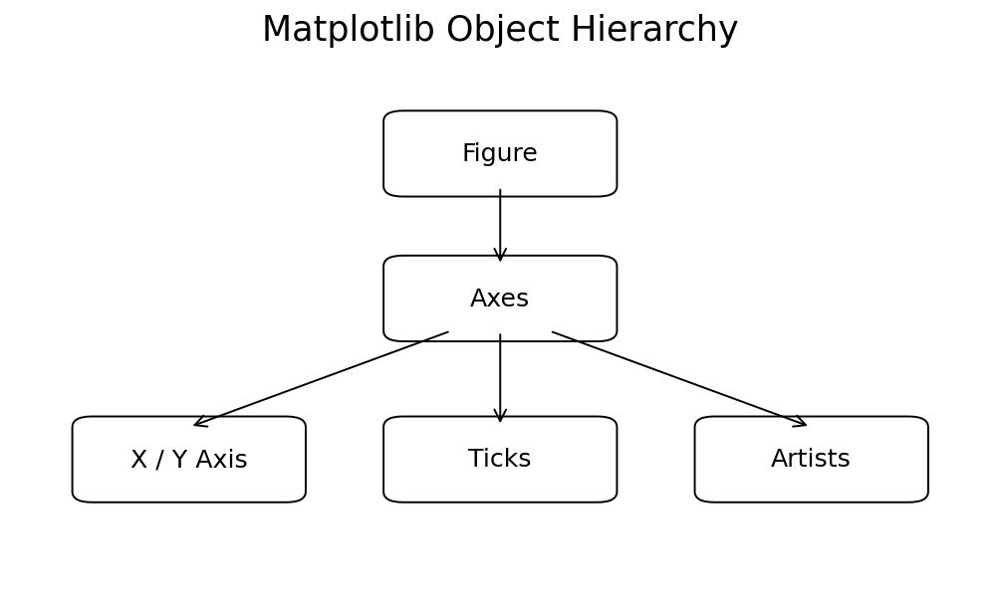

## Figure

A **Figure** is the complete container or canvas.

A Figure can contain one or more Axes.

## Axes

An **Axes** is the area where the actual data is plotted.

It normally contains:

* X-axis
* Y-axis
* Data
* Labels
* Title
* Legend
* Grid

## Axis

An **Axis** represents an X-axis or Y-axis.

It controls things such as:

* Limits
* Ticks
* Tick labels

## Artists

Artists are the visual elements of a Matplotlib figure.

Examples include:

* Lines
* Text
* Markers
* Labels
* Shapes

---

# 7. Matplotlib APIs

Matplotlib provides two main interfaces:

1. Pyplot API
2. Object-Oriented API

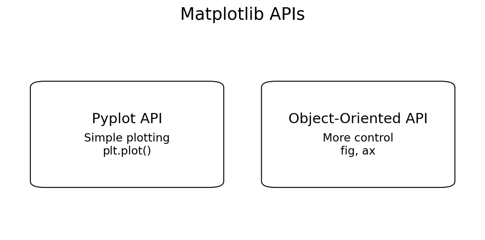

## Pyplot API

The Pyplot API provides a simple, state-based interface.

Example:

```python
import matplotlib.pyplot as plt

plt.plot([1, 2, 3, 4])

plt.show()
```

## Object-Oriented API

The Object-Oriented API works directly with Figure and Axes objects.

Example:

```python
import matplotlib.pyplot as plt

fig, ax = plt.subplots()

ax.plot([1, 2, 3, 4])

plt.show()
```

---

# 8. Pyplot API

`matplotlib.pyplot` provides functions for creating and controlling plots.

```python
import matplotlib.pyplot as plt
```

Some commonly used functions are:

```python
plt.plot()
plt.figure()
plt.subplot()
plt.subplots()
plt.show()
plt.gcf()
plt.gca()
```

---

## `plt.figure()`

`plt.figure()` creates a new Figure.

```python
plt.figure()
```

Example:

```python
import matplotlib.pyplot as plt

plt.figure()

plt.plot([10, 20, 30, 40])

plt.show()
```

---

## `plt.gcf()`

`gcf` means **Get Current Figure**.

```python
plt.gcf()
```

It returns the current Figure object.

---

## `plt.gca()`

`gca` means **Get Current Axes**.

```python
plt.gca()
```

It returns the current Axes object.

---

# 9. Object-Oriented API

The Object-Oriented API works with Figure and Axes objects.

The common syntax is:

```python
fig, ax = plt.subplots()
```

Here:

* `fig` represents the Figure
* `ax` represents the Axes

Example:

```python
import matplotlib.pyplot as plt

fig, ax = plt.subplots()

ax.plot([1, 2, 3, 4])

plt.show()
```

Instead of:

```python
plt.plot()
```

we can use:

```python
ax.plot()
```

The Object-Oriented approach gives more direct control over individual Axes.

---

# 10. Figure and Subplots

A Figure can contain one or more subplots.

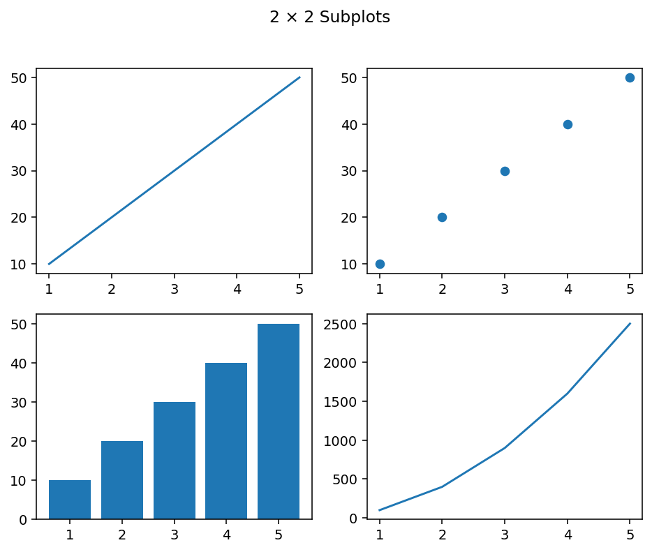

## Creating a Single Subplot

```python
fig, ax = plt.subplots()
```

## Creating Multiple Subplots

```python
fig, ax = plt.subplots(2, 2)
```

This creates:

```text
2 rows × 2 columns
```

Visual structure:

```text
+-----------+-----------+
|  Plot 1   |  Plot 2   |
+-----------+-----------+
|  Plot 3   |  Plot 4   |
+-----------+-----------+
```


---

## `plt.subplot()`

`plt.subplot()` can be used to create a specific subplot.

Syntax:

```python
plt.subplot(rows, columns, position)
```

Example:

```python
import matplotlib.pyplot as plt

plt.subplot(2, 2, 1)
plt.plot([1, 2, 3])

plt.subplot(2, 2, 2)
plt.plot([3, 2, 1])

plt.show()
```

---

# 11. First Plot with Matplotlib

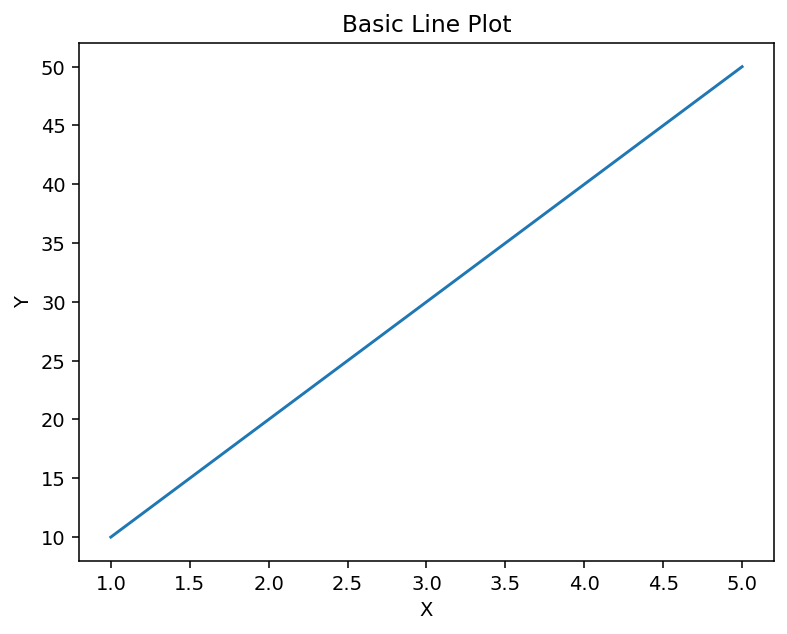

The most basic plotting function is:

```python
plt.plot()
```

## Plotting a Single List

```python
import matplotlib.pyplot as plt

plt.plot([10, 20, 30, 40, 50])

plt.show()
```

When only Y values are provided, Matplotlib automatically generates X values.

For example:

```text
Y values:
10  20  30  40  50

X values:
0   1   2   3   4
```

---

## Plotting X and Y Values

We can provide both X and Y values.

```python
import matplotlib.pyplot as plt

x = [1, 2, 3, 4, 5]
y = [10, 20, 30, 40, 50]

plt.plot(x, y)

plt.show()
```

Here:

* `x` contains X-axis values
* `y` contains Y-axis values

---

# 12. Multiline Plots

We can draw multiple lines on the same plot.

```python
import matplotlib.pyplot as plt

x = [1, 2, 3, 4, 5]

y1 = [10, 20, 30, 40, 50]
y2 = [5, 15, 25, 35, 45]

plt.plot(x, y1)
plt.plot(x, y2)

plt.show()
```

Multiple lines are useful when comparing datasets.

---

# 13. Parts of a Plot

A plot can contain different components.

```text
                Title
                  |
       +-----------------------+
       |                       |
 Y     |       Plot Area       |  Legend
 Axis  |                       |
       |                       |
       +-----------------------+
            X Axis
```

Important parts include:

* Figure
* Axes
* X-axis
* Y-axis
* Title
* Labels
* Ticks
* Legend
* Grid
* Data lines
* Markers

---

# 14. Figure Size

We can control the size of a figure using `figsize`.

```python
plt.figure(figsize=(8, 5))
```

Here:

```text
8 = width
5 = height
```

Example:

```python
import matplotlib.pyplot as plt

plt.figure(figsize=(8, 5))

plt.plot([10, 20, 30, 40])

plt.show()
```

We can also set the default figure size using:

```python
plt.rcParams['figure.figsize'] = (6, 3)
```

---

# 15. Handling Axes

Matplotlib automatically determines suitable axis limits.

Sometimes, we want to set the limits ourselves.

---

## `plt.axis()`

To see the current axis limits:

```python
plt.axis()
```

We can set the limits using four values:

```python
plt.axis([xmin, xmax, ymin, ymax])
```

Example:

```python
import numpy as np
import matplotlib.pyplot as plt

x = np.arange(1, 5)

plt.plot(x, x * 2)

plt.axis([0, 5, -1, 10])

plt.show()
```

The four values represent:

```text
xmin
xmax
ymin
ymax
```

---

## `plt.xlim()`

Controls the X-axis limits.

```python
plt.xlim([1, 4])
```

## `plt.ylim()`

Controls the Y-axis limits.

```python
plt.ylim([0, 12])
```

Example:

```python
plt.xlim([1, 4])
plt.ylim([0, 12])
```

---

# 16. Handling X and Y Ticks

Ticks are the small reference marks shown on the axes.

Matplotlib provides:

```python
plt.xticks()
plt.yticks()
```

## `plt.xticks()`

Controls X-axis ticks.

```python
plt.xticks([1, 2, 3, 4, 5])
```

## `plt.yticks()`

Controls Y-axis ticks.

```python
plt.yticks([10, 20, 30, 40, 50])
```

---

## Tick Labels

We can provide custom labels.

```python
seasons = ["2015", "2016", "2017", "2018"]

plt.xticks([0, 1, 2, 3], seasons)
```

---

## Tick Rotation

We can rotate tick labels.

Vertical:

```python
plt.xticks(rotation="vertical")
```

Horizontal:

```python
plt.xticks(rotation="horizontal")
```

We can also use degrees:

```python
plt.xticks(rotation=45)
```

---

# 17. Adding Labels

Labels explain what the X-axis and Y-axis represent.

## X-axis Label

Use:

```python
plt.xlabel()
```

Example:

```python
plt.xlabel("Months")
```

## Y-axis Label

Use:

```python
plt.ylabel()
```

Example:

```python
plt.ylabel("Sales")
```

Complete example:

```python
import matplotlib.pyplot as plt

months = [1, 2, 3, 4, 5]
sales = [100, 150, 200, 250, 300]

plt.plot(months, sales)

plt.xlabel("Months")
plt.ylabel("Sales")

plt.show()
```

---

# 18. Adding a Title

A title describes the plot.

Use:

```python
plt.title()
```

Example:

```python
import matplotlib.pyplot as plt

plt.plot([1, 3, 2, 4])

plt.title("First Plot")

plt.show()
```

The title appears at the top of the plot.

---

# 19. Adding a Legend

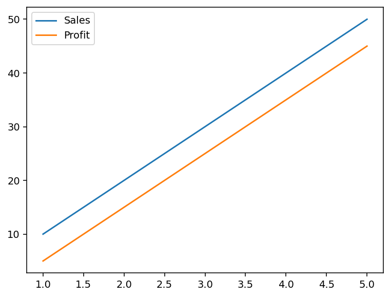

A legend explains what each line or dataset represents.

We can provide a label while plotting:

```python
plt.plot(x, y, label="Sales")
```

Then use:

```python
plt.legend()
```

Example:

```python
import matplotlib.pyplot as plt

x = [1, 2, 3, 4]

sales = [10, 20, 30, 40]
profit = [5, 15, 20, 30]

plt.plot(x, sales, label="Sales")
plt.plot(x, profit, label="Profit")

plt.legend()

plt.show()
```

---

## Legend Location

We can control the position using `loc`.

```python
plt.legend(loc="upper left")
```

Common locations include:

```python
plt.legend(loc="upper right")
plt.legend(loc="upper left")
plt.legend(loc="lower left")
plt.legend(loc="lower right")
```

We can also use numerical location codes:

```python
plt.legend(loc=0)
plt.legend(loc=1)
plt.legend(loc=2)
plt.legend(loc=3)
plt.legend(loc=4)
```

---

# 20. Adding a Grid

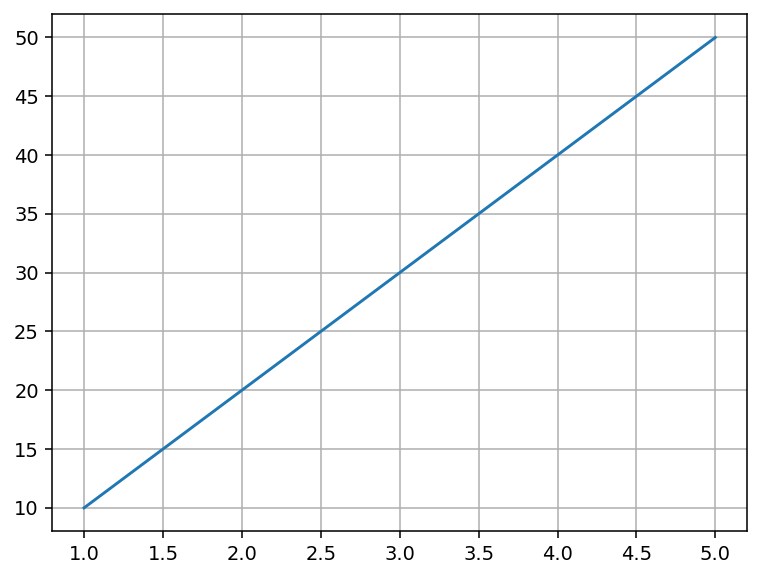

A grid provides a reference system that makes values easier to read.

Use:

```python
plt.grid(True)
```

Example:

```python
import matplotlib.pyplot as plt

x = [1, 2, 3, 4]
y = [10, 20, 30, 40]

plt.plot(x, y)

plt.grid(True)

plt.show()
```

---

# 21. Controlling Colours

We can give different colours to different lines.

Example:

```python
import numpy as np
import matplotlib.pyplot as plt

x = np.arange(1, 5)

plt.plot(x, 'r')
plt.plot(x + 1, 'g')
plt.plot(x + 2, 'b')

plt.show()
```

Common colour abbreviations:

| Abbreviation | Colour  |
| ------------ | ------- |
| `b`          | Blue    |
| `c`          | Cyan    |
| `g`          | Green   |
| `k`          | Black   |
| `r`          | Red     |
| `m`          | Magenta |
| `y`          | Yellow  |

We can also use the full colour name:

```python
plt.plot(x, color="red")
```

Other ways of specifying colours include:

* Full colour names
* Hexadecimal values
* RGB tuples
* Grayscale values

Example:

```python
plt.plot(x, color="#FF00FF")
```

---

# 22. Controlling Line Styles

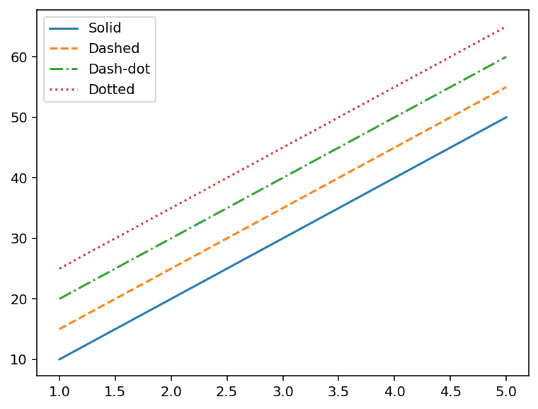

Matplotlib provides different line styles.

| Symbol | Line Style |
| ------ | ---------- |
| `-`    | Solid      |
| `--`   | Dashed     |
| `-.`   | Dash-dot   |
| `:`    | Dotted     |

Example:

```python
import numpy as np
import matplotlib.pyplot as plt

x = np.arange(1, 5)

plt.plot(x, '--')
plt.plot(x + 1, '-.')
plt.plot(x + 2, ':')

plt.show()
```

We can also use the keyword:

```python
plt.plot(x, linestyle="--")
```

or:

```python
plt.plot(x, ls="--")
```

---

# 23. Markers

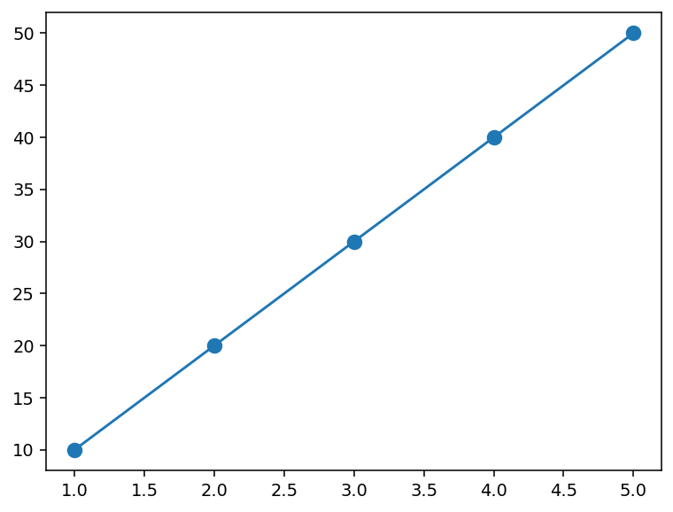

Markers show individual data points on a plot.

Example:

```python
plt.plot(x, y, marker="o")
```

Some common markers are:

| Marker | Meaning  |
| ------ | -------- |
| `o`    | Circle   |
| `s`    | Square   |
| `^`    | Triangle |
| `*`    | Star     |
| `+`    | Plus     |
| `x`    | X        |
| `d`    | Diamond  |

Example:

```python
plt.plot(
    x,
    y,
    marker="o"
)
```

---

## Marker Size

Marker size can be controlled using `ms`.

```python
plt.plot(
    x,
    y,
    marker="o",
    ms=10
)
```

---

# 24. Matplotlib Styles

Matplotlib provides predefined styles.

To see available styles:

```python
plt.style.available
```

Example:

```python
print(plt.style.available)
```

To apply a style:

```python
plt.style.use("style-name")
```

For example:

```python
plt.style.use("ggplot")
```

After applying a style, the plots created afterwards use that style.

> **Note:** Some older Matplotlib notebooks may contain style names that are no longer available in newer Matplotlib versions. Check `plt.style.available` before using a style.

---

# 25. Line Plot


A line plot is used to show trends or changes in data.

The main function is:

```python
plt.plot()
```

Example:

```python
import matplotlib.pyplot as plt

months = [1, 2, 3, 4, 5, 6]
sales = [100, 150, 180, 220, 250, 300]

plt.plot(months, sales)

plt.xlabel("Month")
plt.ylabel("Sales")
plt.title("Monthly Sales")

plt.show()
```

---

# 26. Scatter Plot

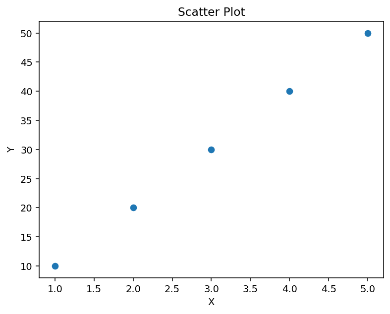

A scatter plot represents data using individual points.

Use:

```python
plt.scatter()
```

Example:

```python
import matplotlib.pyplot as plt

x = [1, 2, 3, 4, 5]
y = [10, 25, 15, 35, 30]

plt.scatter(x, y)

plt.show()
```

Scatter plots are useful for understanding the relationship between two variables.

---

# 27. Histogram

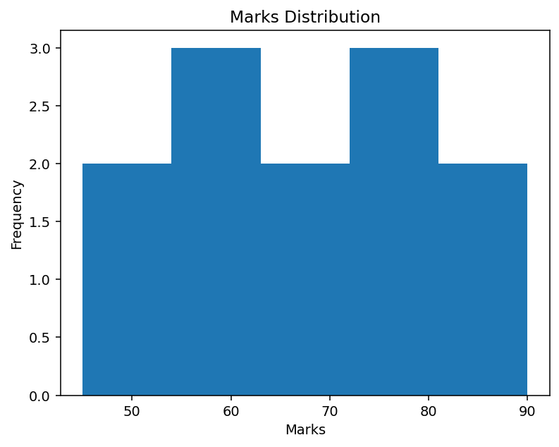

A histogram shows the distribution of numerical data.

Use:

```python
plt.hist()
```

Example:

```python
import matplotlib.pyplot as plt

marks = [
    45, 50, 55, 60,
    62, 65, 70, 72,
    75, 80, 85, 90
]

plt.hist(marks)

plt.show()
```

---

## Bins

Bins divide the data into intervals.

Example:

```python
plt.hist(marks, bins=5)
```

---

# 28. Bar Chart

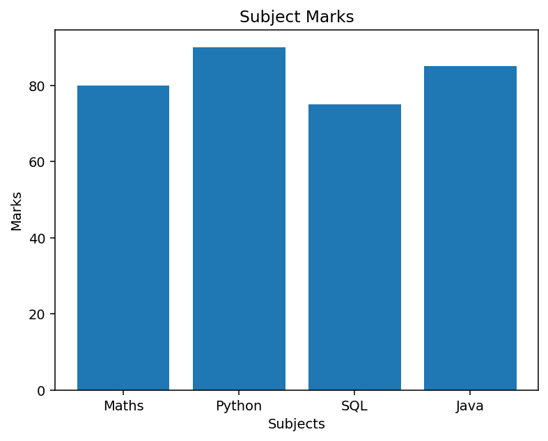

A bar chart is useful for comparing values across categories.

Use:

```python
plt.bar()
```

Example:

```python
import matplotlib.pyplot as plt

subjects = ["Maths", "Python", "SQL", "Java"]
marks = [80, 90, 75, 85]

plt.bar(subjects, marks)

plt.show()
```

---

# 29. Horizontal Bar Chart

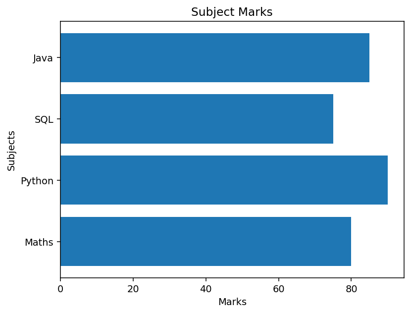

A horizontal bar chart uses:

```python
plt.barh()
```

Example:

```python
import matplotlib.pyplot as plt

subjects = ["Maths", "Python", "SQL", "Java"]
marks = [80, 90, 75, 85]

plt.barh(subjects, marks)

plt.show()
```

---

# 30. Stacked Bar Chart

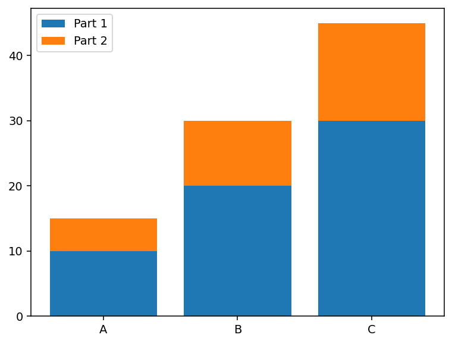

A stacked bar chart places one dataset on top of another.

The `bottom` parameter is used for stacking.

Example:

```python
import matplotlib.pyplot as plt

x = ["A", "B", "C"]

A = [10, 20, 30]
B = [5, 10, 15]

plt.bar(x, A)
plt.bar(x, B, bottom=A)

plt.show()
```

The second set of bars starts from the values of the first set.

---

# 31. Error Bar Chart

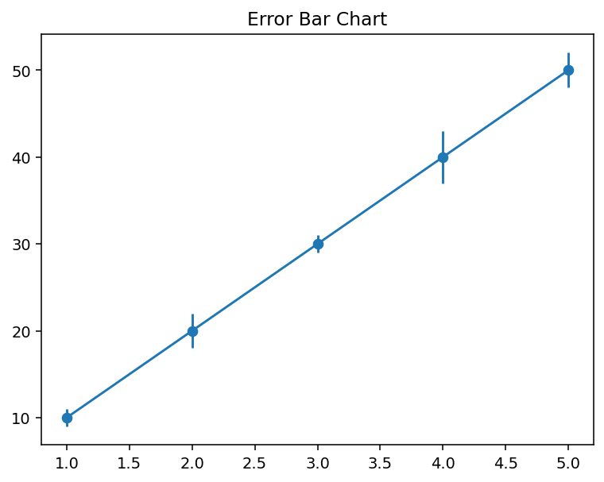

An error bar chart shows values together with error or uncertainty.

Use:

```python
plt.errorbar()
```

Example:

```python
import matplotlib.pyplot as plt

x = [1, 2, 3, 4]
y = [10, 20, 30, 40]

error = [1, 2, 1, 3]

plt.errorbar(
    x,
    y,
    yerr=error
)

plt.show()
```

Here:

```text
yerr = error values
```

---

# 32. Pie Chart

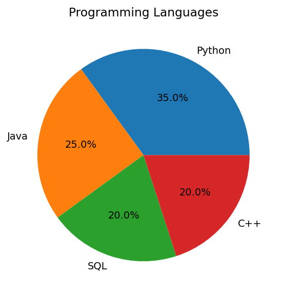

A pie chart represents data as sectors of a circle.

The sectors are also called **wedges**.

The size of each sector represents its proportion of the whole.

Use:

```python
plt.pie()
```

Example:

```python
import matplotlib.pyplot as plt

values = [35, 25, 20, 20]

labels = [
    "Computer",
    "Electronics",
    "Mechanical",
    "Chemical"
]

plt.pie(
    values,
    labels=labels
)

plt.show()
```

---

# 33. Box Plot

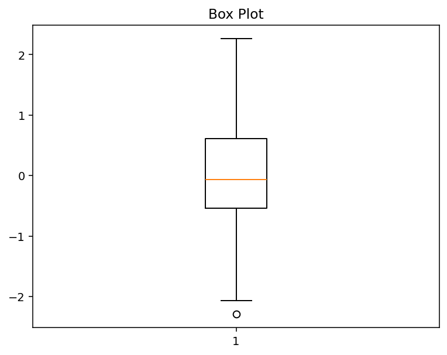

A box plot is used to understand the distribution of data.

It can show:

* Median
* Quartiles
* Minimum
* Maximum
* Outliers

Use:

```python
plt.boxplot()
```

Example:

```python
import numpy as np
import matplotlib.pyplot as plt

data = np.random.randn(100)

plt.boxplot(data)

plt.show()
```

---

# 34. Area Chart

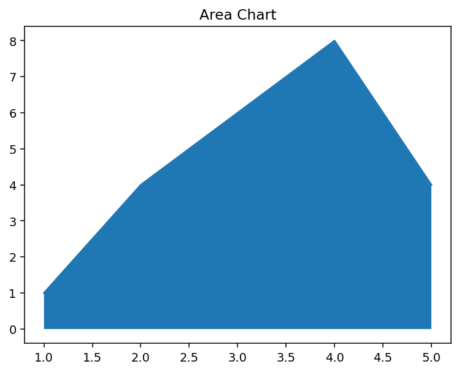

An Area Chart is similar to a Line Chart.

The area between the X-axis and the line is filled.

## `fill_between()`

Example:

```python
import matplotlib.pyplot as plt

x = range(1, 6)
y = [1, 4, 6, 8, 4]

plt.fill_between(x, y)

plt.show()
```

---

## `stackplot()`

We can also create an area chart using:

```python
plt.stackplot(x, y)
```

Example:

```python
import matplotlib.pyplot as plt

x = [1, 2, 3, 4]

y1 = [10, 20, 30, 40]
y2 = [5, 10, 15, 20]

plt.stackplot(x, y1, y2)

plt.show()
```

---

# 35. Contour Plot

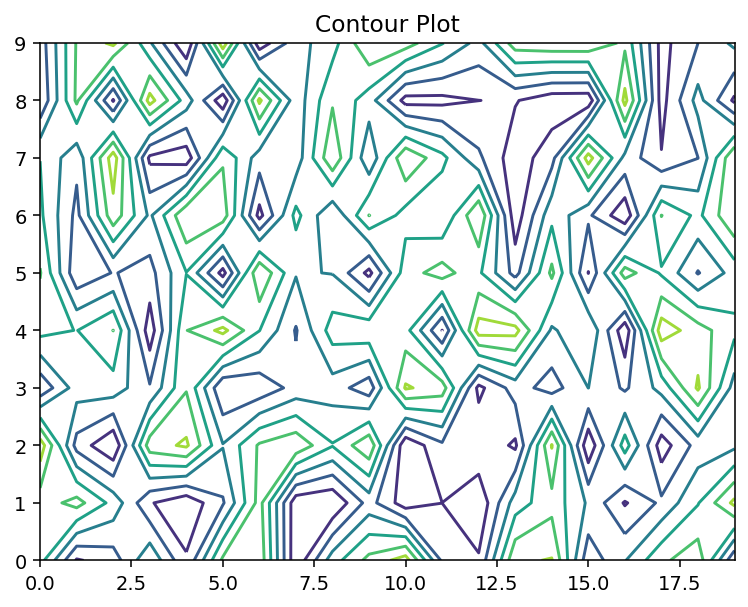

A contour plot is useful for representing three-dimensional data in two dimensions.

Contour lines are also called:

* Level lines
* Isolines

Use:

```python
plt.contour()
```

Example:

```python
import numpy as np
import matplotlib.pyplot as plt

matrix = np.random.rand(10, 20)

cp = plt.contour(matrix)

plt.show()
```

The `contour()` function takes a 2D array as input.

---

## Contour Levels

The number of contour levels can also be specified.

```python
plt.contour(matrix, 10)
```

Here, `10` represents the number of levels.

---

# 36. Displaying Images with Matplotlib

Matplotlib can also be used to display images.

For image handling, we can use the **Pillow** library.

## Installing Pillow

```python
pip install pillow
```

## Importing Pillow

```python
from PIL import Image
```

## Opening an Image

```python
image = Image.open("image.jpg")
```

We can check the type:

```python
type(image)
```

---

## Converting Image to NumPy Array

We can convert the image into a NumPy array:

```python
image_arr = np.array(image)
```

We can check its shape:

```python
image_arr.shape
```

---

## Displaying the Image

Use:

```python
plt.imshow(image_arr)
plt.show()
```

Complete example:

```python
import numpy as np
import matplotlib.pyplot as plt
from PIL import Image

image = Image.open("image.jpg")

image_arr = np.array(image)

plt.imshow(image_arr)

plt.show()
```

---

# 37. Working with NumPy

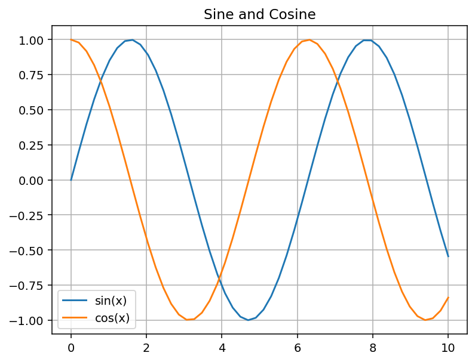

NumPy arrays can be directly used with Matplotlib.

Example:

```python
import numpy as np
import matplotlib.pyplot as plt

x = np.array([1, 2, 3, 4, 5])
y = np.array([10, 20, 30, 40, 50])

plt.plot(x, y)

plt.show()
```

NumPy can also be used to generate data.

Example:

```python
x = np.arange(1, 11)
y = x ** 2

plt.plot(x, y)

plt.show()
```

Another example:

```python
x = np.linspace(0, 10, 50)

plt.plot(x, np.sin(x), "-")
plt.plot(x, np.cos(x), "--")

plt.show()
```

---

# 38. Practical IPL Data Analysis

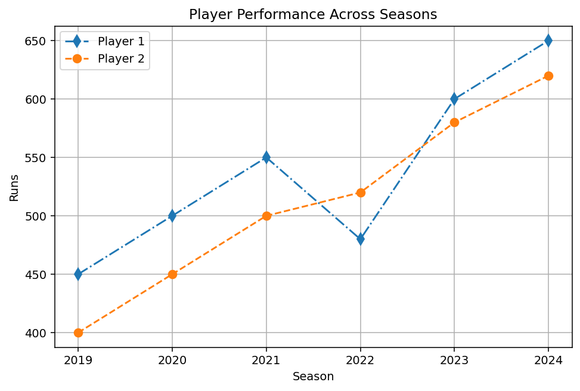

Matplotlib can be used with real-world numerical data.

In the practical example, IPL data is used to compare player information across different seasons.

The data includes:

* Seasons
* Players
* Salary
* Games

Example seasons:

```python
Seasons = [
    "2015",
    "2016",
    "2017",
    "2018",
    "2019",
    "2020",
    "2021",
    "2022",
    "2023",
    "2024"
]
```

A dictionary can be used to map seasons to positions:

```python
Sdict = {
    "2015": 0,
    "2016": 1,
    "2017": 2,
    "2018": 3,
    "2019": 4,
    "2020": 5,
    "2021": 6,
    "2022": 7,
    "2023": 8,
    "2024": 9
}
```

---

## Plotting Player Data

Example:

```python
import matplotlib.pyplot as plt

plt.plot(
    Salary[0],
    ls="-.",
    c="black",
    marker="d",
    ms=7
)

plt.plot(
    Salary[1],
    ls="--",
    c="red",
    marker="o",
    ms=7
)

plt.show()
```

---

## Adding Season Names

Instead of showing numerical positions on the X-axis, we can display the actual seasons.

```python
plt.xticks(
    list(range(0, 10)),
    Seasons
)
```

We can also rotate the labels:

```python
plt.xticks(
    list(range(0, 10)),
    Seasons,
    rotation="vertical"
)
```

---

## Adding Player Names

We can use the `label` parameter.

```python
plt.plot(
    Salary[0],
    ls="-.",
    c="black",
    marker="d",
    ms=7,
    label=Players[0]
)

plt.plot(
    Salary[1],
    ls="--",
    c="red",
    marker="o",
    ms=7,
    label=Players[1]
)

plt.legend()

plt.show()
```

This demonstrates how Matplotlib can be used to compare multiple datasets and customise the final visualization.

---

# 39. Saving Plots

Matplotlib provides:

```python
plt.savefig()
```

to save a plot as an image file.

Example:

```python
import matplotlib.pyplot as plt

x = [1, 2, 3, 4]
y = [10, 20, 30, 40]

plt.plot(x, y)

plt.savefig("plot.png")
```

We can save using different file extensions.

Examples:

```python
plt.savefig("plot.png")
plt.savefig("plot.jpg")
plt.savefig("plot.svg")
plt.savefig("plot.pdf")
```

---

# 40. Complete Plot Example

The following example combines several concepts:

```python
import matplotlib.pyplot as plt

months = ["Jan", "Feb", "Mar", "Apr", "May"]

sales = [100, 150, 130, 180, 220]

plt.figure(figsize=(8, 5))

plt.plot(
    months,
    sales,
    color="blue",
    linestyle="-",
    marker="o",
    ms=8,
    label="Sales"
)

plt.xlabel("Month")
plt.ylabel("Sales")

plt.title("Monthly Sales")

plt.xticks(rotation=45)

plt.grid()
plt.legend()

plt.show()
```

This example uses:

* Figure size
* Line plot
* Colour
* Line style
* Marker
* Marker size
* X-axis label
* Y-axis label
* Title
* Tick rotation
* Grid
* Legend

---

# 41. Quick Revision

## Import Matplotlib

```python
import matplotlib.pyplot as plt
```

## Import NumPy

```python
import numpy as np
```

## Display Plot

```python
plt.show()
```

## Line Plot

```python
plt.plot(x, y)
```

## Scatter Plot

```python
plt.scatter(x, y)
```

## Histogram

```python
plt.hist(data)
```

## Bar Chart

```python
plt.bar(x, y)
```

## Horizontal Bar Chart

```python
plt.barh(x, y)
```

## Error Bar

```python
plt.errorbar(x, y, yerr=error)
```

## Pie Chart

```python
plt.pie(values)
```

## Box Plot

```python
plt.boxplot(data)
```

## Area Chart

```python
plt.fill_between(x, y)
```

## Stacked Area Chart

```python
plt.stackplot(x, y)
```

## Contour Plot

```python
plt.contour(data)
```

## Figure

```python
plt.figure()
```

## Subplots

```python
fig, ax = plt.subplots()
```

## Current Figure

```python
plt.gcf()
```

## Current Axes

```python
plt.gca()
```

## X-axis Limits

```python
plt.xlim()
```

## Y-axis Limits

```python
plt.ylim()
```

## X-axis Ticks

```python
plt.xticks()
```

## Y-axis Ticks

```python
plt.yticks()
```

## X-axis Label

```python
plt.xlabel()
```

## Y-axis Label

```python
plt.ylabel()
```

## Title

```python
plt.title()
```

## Legend

```python
plt.legend()
```

## Grid

```python
plt.grid()
```

## Save Plot

```python
plt.savefig()
```

---

# 42. Plot Selection Guide

| Plot           | Function               | Main Purpose                    |
| -------------- | ---------------------- | ------------------------------- |
| Line Plot      | `plt.plot()`           | Show trends                     |
| Scatter Plot   | `plt.scatter()`        | Show relationships              |
| Histogram      | `plt.hist()`           | Show distribution               |
| Bar Chart      | `plt.bar()`            | Compare categories              |
| Horizontal Bar | `plt.barh()`           | Compare categories horizontally |
| Stacked Bar    | `plt.bar()` + `bottom` | Compare parts of a whole        |
| Error Bar      | `plt.errorbar()`       | Show error or uncertainty       |
| Pie Chart      | `plt.pie()`            | Show parts of a whole           |
| Box Plot       | `plt.boxplot()`        | Show distribution and outliers  |
| Area Chart     | `fill_between()`       | Show values using filled areas  |
| Stack Plot     | `stackplot()`          | Show stacked areas              |
| Contour Plot   | `plt.contour()`        | Represent 2D/3D-related data    |

---

# 43. Summary

Matplotlib is an important Python library for data visualization.

In this guide, we learned:

* Data Visualization
* Matplotlib basics
* Installing Matplotlib
* Importing Matplotlib
* Displaying plots
* Matplotlib object hierarchy
* Pyplot API
* Object-Oriented API
* Figure and Axes
* Subplots
* Basic plotting
* Multiline plots
* Parts of a plot
* Figure size
* Axis limits
* X and Y ticks
* Labels
* Titles
* Legends
* Grid
* Colours
* Line styles
* Markers
* Matplotlib styles
* Line plots
* Scatter plots
* Histograms
* Bar charts
* Horizontal bar charts
* Stacked bar charts
* Error bar charts
* Pie charts
* Box plots
* Area charts
* Contour plots
* Image visualization
* NumPy with Matplotlib
* Practical IPL data analysis
* Saving plots

Matplotlib gives us the tools to convert numerical data into clear and meaningful visualizations.
