# Matplotlib

Matplotlib is a Python library used to create charts and visualizations. It helps us explore data, compare values, identify patterns, and communicate results clearly.

## Topics Covered

- Installing and importing Matplotlib
- Pyplot and Object-Oriented APIs
- Figures, Axes, and subplots
- Line, scatter, bar, histogram, pie, box, area, error-bar, and contour plots
- Plot titles, axis labels, ticks, legends, grids, colours, line styles, and markers
- Figure size, axis limits, and plot styles
- Saving plots
- Using NumPy with Matplotlib
- Choosing a suitable plot for a task

## 1. Installation and Import

Install Matplotlib:

```bash
pip install matplotlib
```

Import the commonly used libraries:

```python
import numpy as np
import matplotlib.pyplot as plt
```

## 2. Figure, Axes, and APIs

A **Figure** is the complete canvas. An **Axes** is the area where data is plotted.

Matplotlib has two common APIs:

- **Pyplot API:** convenient for simple plots.
- **Object-Oriented API:** gives direct control over Figure and Axes objects; useful for multiple plots.

### Pyplot API

```python
plt.plot([1, 2, 3, 4], [10, 20, 15, 25])
plt.title("Simple Plot")
plt.show()
```

Output: a line plot with points (1, 10), (2, 20), (3, 15), and (4, 25).

### Object-Oriented API

```python
fig, ax = plt.subplots()
ax.plot([1, 2, 3, 4], [10, 20, 15, 25], marker="o")
ax.set_title("Simple Plot")
ax.set_xlabel("X")
ax.set_ylabel("Y")
plt.show()
```

Output: the same data plotted using an explicit Axes object.

## 3. Figure Size and Subplots

Use `figsize=(width, height)` to set the figure size in inches.

```python
fig, ax = plt.subplots(figsize=(7, 4))
ax.plot([1, 2, 3], [2, 4, 3])
ax.set_title("Figure with Custom Size")
plt.show()
```

Create multiple plots in one figure:

```python
x = np.linspace(0, 2 * np.pi, 100)

fig, ax = plt.subplots(1, 2, figsize=(8, 3.5))
ax[0].plot(x, np.sin(x))
ax[0].set_title("Sine")
ax[1].plot(x, np.cos(x))
ax[1].set_title("Cosine")
plt.tight_layout()
plt.show()
```

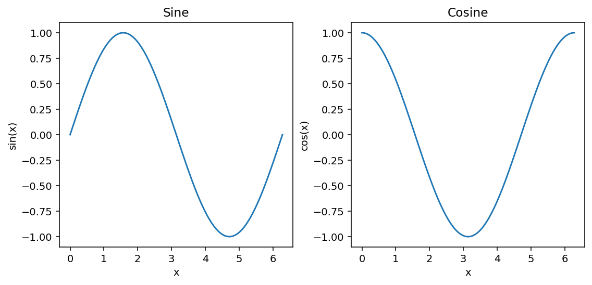

Important parameter options:

| Parameter | Use |
|---|---|
| `nrows`, `ncols` | Set the number of rows and columns |
| `figsize` | Set figure width and height in inches |
| `sharex=True` | Share the X-axis across subplots |
| `sharey=True` | Share the Y-axis across subplots |
| `layout="constrained"` | Help prevent labels and titles from overlapping |

## 4. Line Plot

A line plot is commonly used to show trends or changes across an ordered sequence, such as time.

```python
months = ["Jan", "Feb", "Mar", "Apr", "May"]
sales = [120, 150, 135, 180, 220]

plt.figure(figsize=(7, 4.5))
plt.plot(months, sales, marker="o", label="Sales")
plt.title("Monthly Sales")
plt.xlabel("Month")
plt.ylabel("Sales")
plt.grid(True, alpha=0.3)
plt.legend()
plt.show()
```

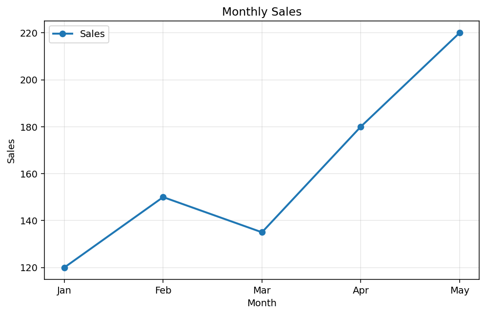

Important parameter options:

| Parameter | Use |
|---|---|
| `color` or `c` | Set the line colour |
| `linestyle` or `ls` | Set the line style, such as `"-"`, `"--"`, `"-."`, or `":"` |
| `linewidth` or `lw` | Set line thickness |
| `marker` | Add a marker at each data point |
| `markersize` or `ms` | Set marker size |
| `label` | Give the line a name for the legend |

## 5. Scatter Plot

A scatter plot displays individual points and helps inspect the relationship between two numerical variables.

```python
hours = [1, 2, 3, 4, 5, 6, 7, 8]
marks = [2, 3, 5, 4, 6, 8, 7, 9]

plt.scatter(hours, marks, s=65)
plt.title("Study Hours vs Marks")
plt.xlabel("Study Hours")
plt.ylabel("Marks")
plt.grid(True, alpha=0.3)
plt.show()
```

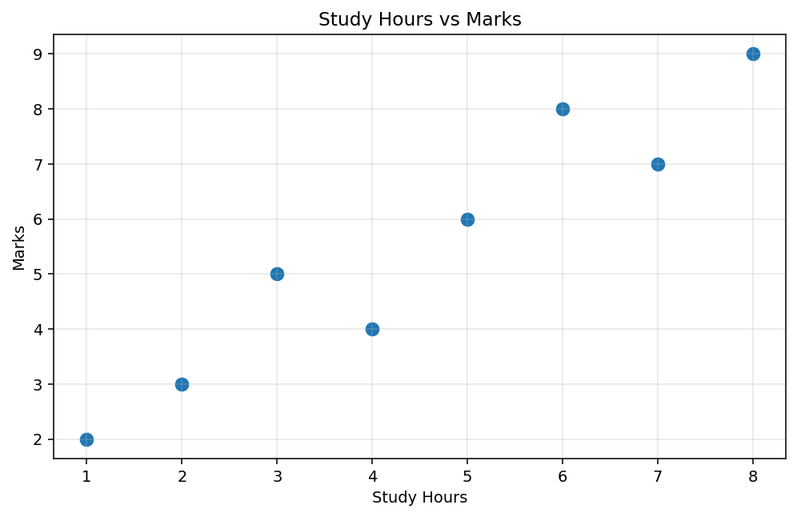

Important parameter options:

| Parameter | Use |
|---|---|
| `s` | Set marker area |
| `c` or `color` | Set marker colour |
| `marker` | Set marker shape |
| `alpha` | Set transparency |
| `label` | Name the dataset in the legend |

## 6. Histogram

A histogram shows the distribution of numerical data by grouping values into bins.

```python
rng = np.random.default_rng(12)
marks = rng.normal(65, 10, 300)

plt.hist(marks, bins=12, edgecolor="black")
plt.title("Distribution of Marks")
plt.xlabel("Marks")
plt.ylabel("Frequency")
plt.show()
```

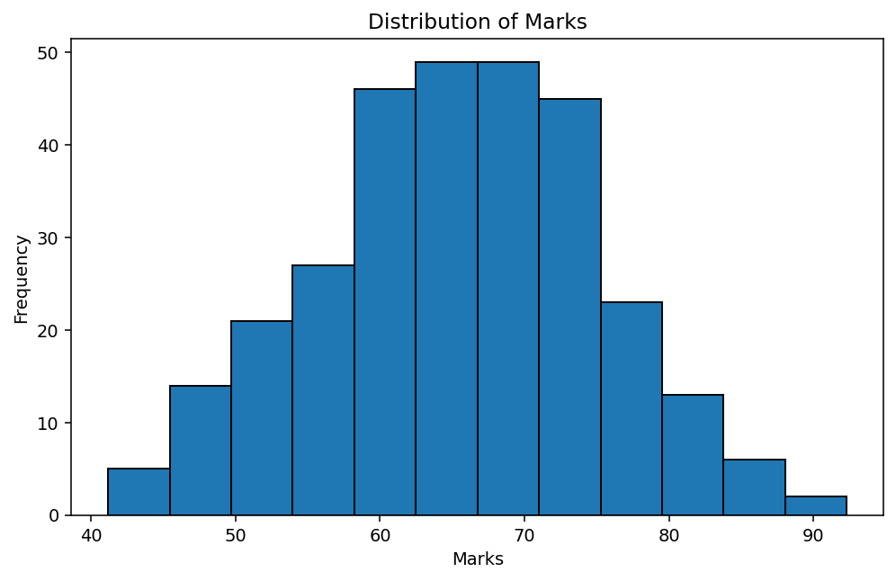

Important parameter options:

| Parameter | Use |
|---|---|
| `bins` | Set the number of bins or bin boundaries |
| `range` | Set the data range included |
| `density=True` | Normalize the histogram so its area is 1 |
| `color` | Set bar colour |
| `edgecolor` | Set the edge colour of bins |
| `alpha` | Set transparency |

## 7. Bar Chart

A bar chart compares values across categories.

```python
courses = ["Python", "Java", "SQL", "Excel"]
scores = [85, 70, 78, 65]

plt.bar(courses, scores)
plt.title("Course Scores")
plt.xlabel("Course")
plt.ylabel("Score")
plt.ylim(0, 100)
plt.show()
```

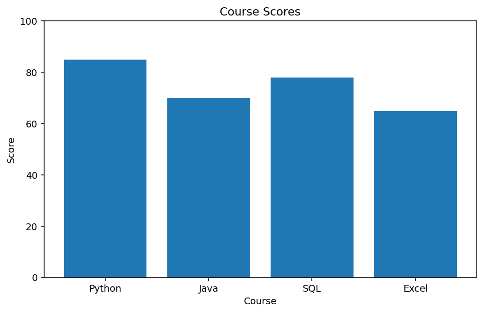

Important parameter options:

| Parameter | Use |
|---|---|
| `width` | Set bar width |
| `color` | Set bar colour |
| `edgecolor` | Set bar edge colour |
| `align` | Align bars to their positions |
| `label` | Name the bars in the legend |

## 8. Horizontal Bar Chart

Use `barh()` when category names are long or horizontal comparison is easier to read.

```python
courses = ["Python", "Java", "SQL", "Excel"]
scores = [85, 70, 78, 65]

plt.barh(courses, scores)
plt.title("Course Scores")
plt.xlabel("Score")
plt.ylabel("Course")
plt.xlim(0, 100)
plt.show()
```

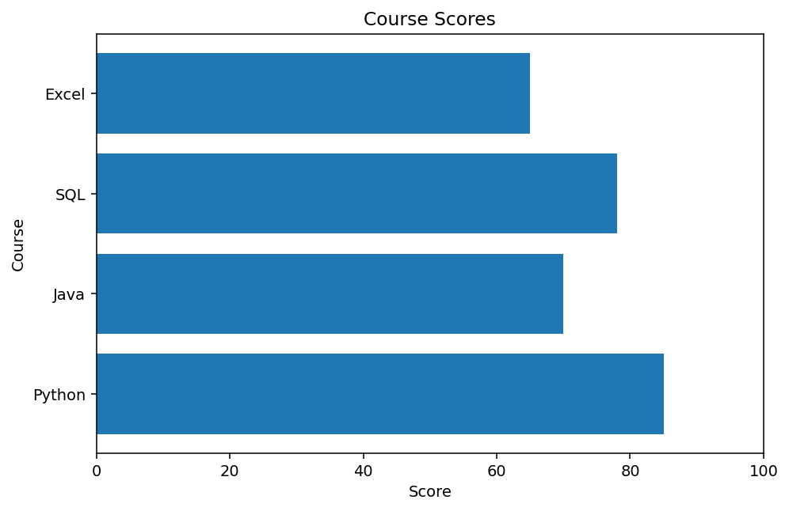

Important parameter options:

| Parameter | Use |
|---|---|
| `height` | Set bar thickness |
| `color` | Set bar colour |
| `edgecolor` | Set bar edge colour |
| `left` | Set the horizontal starting position |
| `label` | Name the bars in the legend |

## 9. Stacked Bar Chart

A stacked bar chart displays the total and the contribution of different groups. The `bottom` parameter sets where each additional group starts.

```python
quarters = ["Q1", "Q2", "Q3", "Q4"]
product_a = [20, 25, 22, 30]
product_b = [15, 18, 20, 17]

plt.bar(quarters, product_a, label="Product A")
plt.bar(quarters, product_b, bottom=product_a, label="Product B")
plt.title("Quarterly Sales by Product")
plt.xlabel("Quarter")
plt.ylabel("Sales")
plt.legend()
plt.show()
```

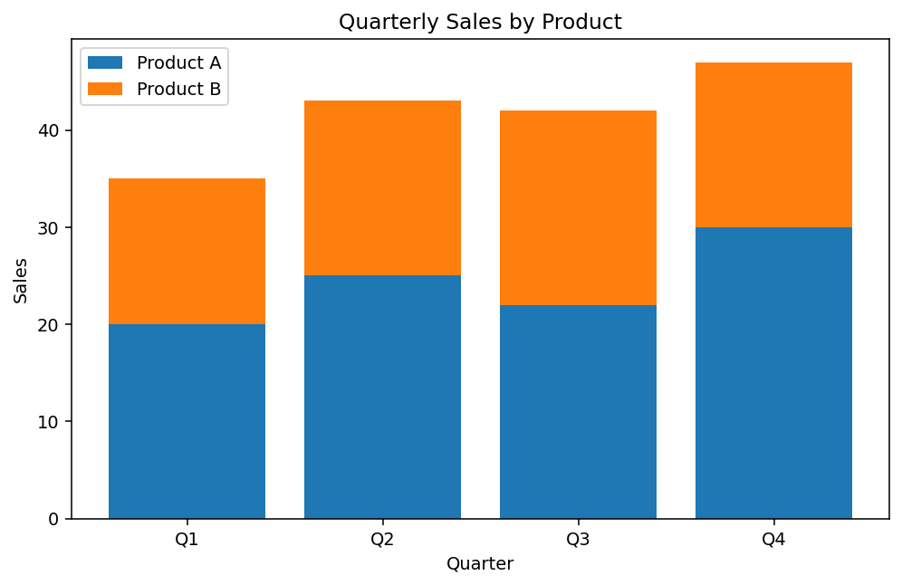

Important parameter options:

| Parameter | Use |
|---|---|
| `bottom` | Set the vertical starting point for each stack |
| `width` | Set bar width |
| `color` | Set bar colour |
| `label` | Name each group in the legend |

## 10. Error Bar Chart

Error bars show uncertainty or variation around measured values.

```python
x = np.arange(1, 6)
values = [10, 12, 11, 15, 14]
errors = [1.0, 1.5, 0.8, 1.2, 1.0]

plt.errorbar(x, values, yerr=errors, fmt="o-", capsize=5)
plt.title("Measurements with Error")
plt.xlabel("Measurement")
plt.ylabel("Value")
plt.grid(True, alpha=0.3)
plt.show()
```

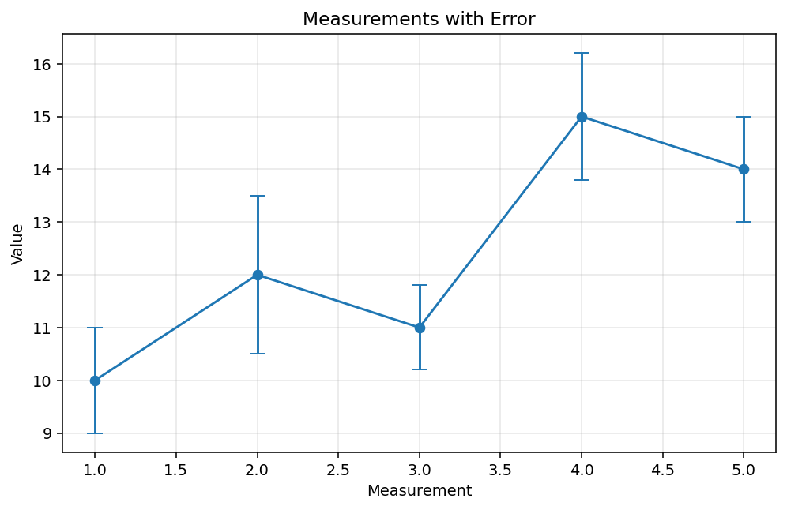

Important parameter options:

| Parameter | Use |
|---|---|
| `yerr` | Set vertical error sizes |
| `xerr` | Set horizontal error sizes |
| `fmt` | Set marker and line format |
| `capsize` | Set the width of error-bar caps |
| `ecolor` | Set error-bar colour |
| `elinewidth` | Set error-line thickness |

## 11. Pie Chart

A pie chart shows how categories contribute to a whole. Use it for a small number of categories.

```python
labels = ["Python", "Java", "SQL", "Other"]
values = [40, 25, 20, 15]

plt.pie(values, labels=labels, autopct="%1.1f%%", startangle=90)
plt.title("Favourite Languages")
plt.show()
```

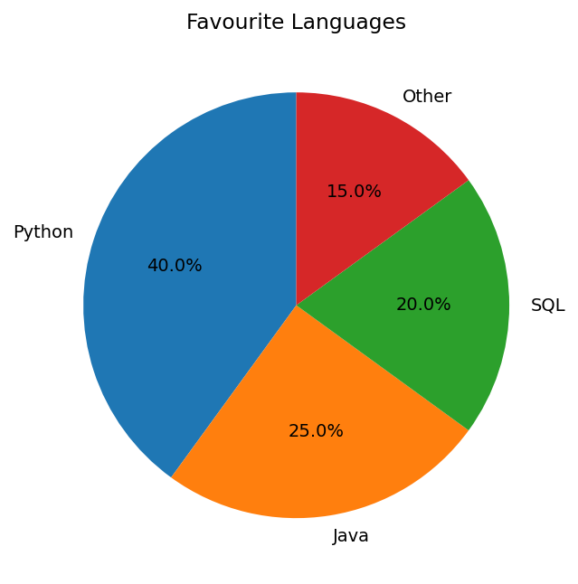

Important parameter options:

| Parameter | Use |
|---|---|
| `labels` | Add category names |
| `autopct` | Display values or percentages on slices |
| `startangle` | Set the starting angle |
| `explode` | Offset selected slices from the centre |
| `colors` | Set slice colours |
| `shadow` | Add a shadow effect |

## 12. Box Plot

A box plot summarizes a numerical distribution using quartiles, the median, whiskers, and possible outliers.

```python
rng = np.random.default_rng(12)
class_a = rng.normal(60, 8, 80)
class_b = rng.normal(68, 10, 80)
class_c = rng.normal(72, 7, 80)

plt.boxplot([class_a, class_b, class_c], labels=["Class A", "Class B", "Class C"])
plt.title("Marks by Class")
plt.xlabel("Class")
plt.ylabel("Marks")
plt.show()
```

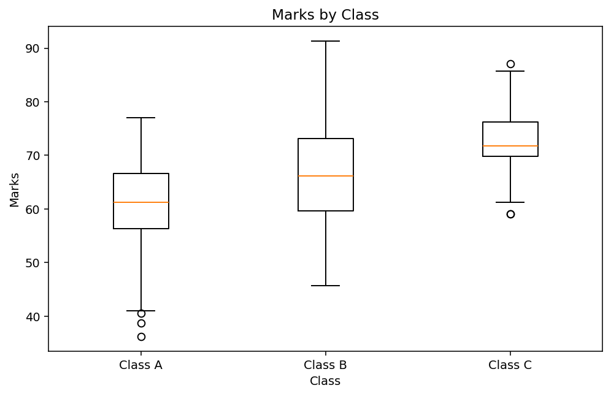

Important parameter options:

| Parameter | Use |
|---|---|
| `vert` | Choose vertical or horizontal boxes |
| `showmeans=True` | Display the mean |
| `showfliers=False` | Hide points beyond the whisker range |
| `patch_artist=True` | Allow box faces to be filled with colour |
| `labels` / `tick_labels` | Set category labels; use the parameter supported by your Matplotlib version |

## 13. Area Chart

An area chart fills the region between a line and a baseline. `fill_between()` can also fill the region between two curves.

```python
period = [1, 2, 3, 4, 5]
values = [10, 16, 13, 22, 25]

plt.fill_between(period, values, alpha=0.35, label="Value")
plt.plot(period, values, marker="o")
plt.title("Growth Over Time")
plt.xlabel("Period")
plt.ylabel("Value")
plt.legend()
plt.show()
```

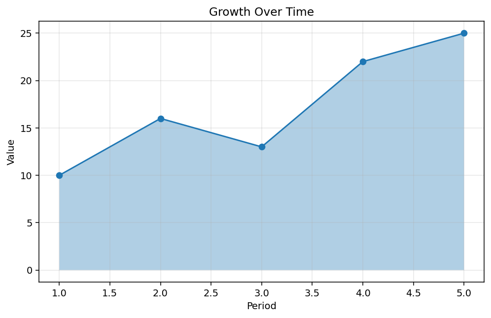

Important parameter options:

| Parameter | Use |
|---|---|
| `y1` | Set the upper curve or values |
| `y2` | Set the lower curve or baseline |
| `where` | Choose which intervals are filled |
| `color` | Set the fill colour |
| `alpha` | Set transparency |
| `interpolate=True` | Interpolate where the `where` condition changes |

For stacked area charts, use `plt.stackplot(x, y1, y2, ...)`.

## 14. Contour Plot

A contour plot shows levels of a value across two dimensions. It is useful for data represented on an X-Y grid.

```python
x = np.linspace(-3, 3, 100)
y = np.linspace(-3, 3, 100)
X, Y = np.meshgrid(x, y)
Z = np.sin(X**2 + Y**2) / (1 + 0.15 * (X**2 + Y**2))

contours = plt.contourf(X, Y, Z, levels=12)
plt.colorbar(contours, label="Value")
plt.title("Contour Plot")
plt.xlabel("X")
plt.ylabel("Y")
plt.show()
```

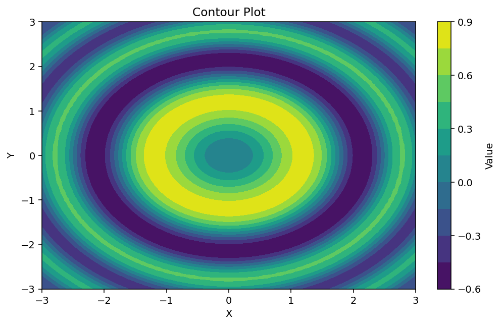

Important parameter options:

| Parameter | Use |
|---|---|
| `levels` | Set the contour levels |
| `cmap` | Choose the colour map |
| `alpha` | Set transparency |
| `linewidths` | Set contour-line thickness when using `contour()` |
| `extend` | Control how values outside the levels are shown |

## 15. Customizing a Plot

These options work with many plot types.

```python
months = ["Jan", "Feb", "Mar", "Apr", "May"]
sales = [120, 150, 135, 180, 220]

fig, ax = plt.subplots(figsize=(7, 4.5))
ax.plot(months, sales, color="purple", linestyle="--",
        marker="o", markersize=7, label="Sales")
ax.set_title("Monthly Sales")
ax.set_xlabel("Month")
ax.set_ylabel("Sales")
ax.set_ylim(100, 240)
ax.grid(True, alpha=0.3)
ax.legend(loc="upper left")
plt.tight_layout()
plt.show()
```

Important parameter options:

| Function / parameter | Use |
|---|---|
| `title()` / `set_title()` | Add a plot title |
| `xlabel()` / `set_xlabel()` | Label the X-axis |
| `ylabel()` / `set_ylabel()` | Label the Y-axis |
| `xlim()` / `set_xlim()` | Set X-axis limits |
| `ylim()` / `set_ylim()` | Set Y-axis limits |
| `xticks()` / `set_xticks()` | Set X-axis tick positions and labels |
| `yticks()` / `set_yticks()` | Set Y-axis tick positions and labels |
| `legend()` | Display dataset labels |
| `grid(True)` | Display a grid |
| `rotation` | Rotate tick labels |
| `alpha` | Set transparency |
| `figsize` | Set figure size |

Common colour abbreviations include `b` (blue), `g` (green), `r` (red), `c` (cyan), `m` (magenta), `y` (yellow), `k` (black), and `w` (white). Full colour names and hexadecimal values such as `"#FF00FF"` can also be used.

Common line styles:

| Style | Use |
|---|---|
| `"-"` | Solid |
| `"--"` | Dashed |
| `"-."` | Dash-dot |
| `":"` | Dotted |

Common markers include `"o"` (circle), `"s"` (square), `"^"` (triangle), `"*"` (star), `"+"` (plus), and `"x"` (cross).

## 16. Plot Styles

Matplotlib has built-in styles that can change the appearance of plots.

```python
print(plt.style.available)
```

Apply a style before creating a plot:

```python
plt.style.use("ggplot")
plt.plot([1, 2, 3, 4], [10, 15, 12, 20], marker="o")
plt.title("Styled Plot")
plt.show()
```

Use a style name that appears in `plt.style.available`.

## 17. Saving a Plot

Use `savefig()` to save the current figure. Call it before `plt.show()` for a straightforward workflow.

```python
plt.plot([1, 2, 3, 4], [10, 20, 15, 25], marker="o")
plt.title("Plot to Save")
plt.savefig("plot.png", dpi=300, bbox_inches="tight")
plt.show()
```

Important parameter options:

| Parameter | Use |
|---|---|
| `fname` | Set the output filename or path |
| `dpi` | Set image resolution |
| `bbox_inches="tight"` | Reduce extra whitespace around the plot |
| `transparent=True` | Save with a transparent background |
| `format` | Set the output file format |

Common formats include PNG, JPG, SVG, and PDF.

## 18. Displaying an Image

Matplotlib can display an image array with `imshow()`. To open an image file, Pillow can be used.

```bash
pip install pillow
```

```python
import numpy as np
import matplotlib.pyplot as plt
from PIL import Image

image = Image.open("photo_used.png")
image_array = np.array(image)

plt.imshow(image_array)
plt.axis("off")
plt.show()
```

Keep your image file in the same working directory as the script or provide the correct file path. This example expects a file named `photo_used.png`; add your own image with that name if you want to run it.

## 19. NumPy with Matplotlib

NumPy is useful for generating values to plot.

```python
x = np.linspace(0, 10, 100)
y = x ** 2

plt.plot(x, y)
plt.title("y = x squared")
plt.xlabel("x")
plt.ylabel("y")
plt.show()
```

Useful NumPy functions for plotting:

| Function | Use |
|---|---|
| `np.array()` | Create an array from values |
| `np.arange()` | Generate values with a fixed step |
| `np.linspace()` | Generate a fixed number of evenly spaced values |
| `np.sin()` / `np.cos()` | Calculate sine or cosine values |
| `np.random.default_rng()` | Create a random number generator for sample data |
| `np.meshgrid()` | Create coordinate grids for contour plots |

## 20. Choosing a Plot

| Plot | Function | Use |
|---|---|---|
| Line | `plot()` | Show a trend or change |
| Scatter | `scatter()` | Explore the relationship between numerical variables |
| Histogram | `hist()` | Inspect a numerical distribution |
| Bar | `bar()` | Compare categories |
| Horizontal bar | `barh()` | Compare categories with horizontal bars |
| Stacked bar | `bar()` with `bottom` | Compare totals and their parts |
| Error bar | `errorbar()` | Display measurement uncertainty |
| Pie | `pie()` | Show proportions for a few categories |
| Box | `boxplot()` | Summarize a distribution and identify possible outliers |
| Area | `fill_between()` | Emphasize values across an interval |
| Stacked area | `stackplot()` | Compare cumulative values across groups |
| Contour | `contour()` / `contourf()` | Show levels over a two-dimensional grid |

## Points to Remember

```text
1. Import pyplot using: import matplotlib.pyplot as plt
2. Use plt.show() to display a plot in a Python script.
3. Use plt.subplots() for a Figure and one or more Axes.
4. Prefer the Object-Oriented API for multiple or complex plots.
5. Add a title and axis labels so the plot is understandable.
6. Use a legend when plotting multiple datasets with labels.
7. Use bins to control how a histogram groups values.
8. Use bottom to stack bar chart values.
9. Use savefig() to save a figure to a file.
10. Choose a plot type that matches the question and the data.
11. Matplotlib parameter names can vary by function and version; check the function documentation when needed.
```
