# Seaborn: Data Visualization

Seaborn is a Python library built on Matplotlib that helps create statistical visualizations. This guide includes the code used to generate each chart, a short explanation, and its output image.

---

## 1. Installation

Install the libraries used in these examples:

```bash
pip install pandas numpy matplotlib seaborn
```

Import the libraries:

```python
import pandas as pd
import numpy as np
import seaborn as sns
import matplotlib.pyplot as plt

sns.set_theme(style="whitegrid")
```

---

## 2. Create an Example Dataset

This small, illustrative dataset is used throughout the examples. It means you can run the code without downloading another file.

```python
df = pd.DataFrame({
    "Student": ["Amina", "Bilal", "Chen", "Diya", "Ethan", "Farah",
                "Gopal", "Hana", "Imran", "Jia", "Kabir", "Lina"],
    "StudyHours": [1, 2, 2, 3, 3, 4, 4, 5, 5, 6, 6, 7],
    "Score": [42, 48, 51, 55, 59, 62, 67, 70, 74, 78, 84, 91],
    "Department": ["A", "B", "A", "C", "B", "A", "C", "B", "A", "C", "B", "A"],
    "Attendance": [60, 65, 70, 72, 75, 78, 80, 82, 85, 88, 92, 96],
    "ProjectScore": [45, 50, 53, 58, 61, 65, 68, 73, 76, 80, 86, 94]
})

print(df.head())
```

The data is made up for practice, so the charts demonstrate how Seaborn works rather than making real-world claims.

### How to Read Parameter Options

The tables below list common values for important Seaborn parameters, not every parameter supported by each function. A column name such as `hue="Department"` tells Seaborn which column to use; Boolean values such as `kde=True` turn an option on or off. Some options vary by Seaborn version, so check the installed version's documentation when an option is unavailable.

Matplotlib commands such as `plt.title()`, `plt.xlabel()`, `plt.ylabel()`, `plt.tight_layout()`, and `plt.show()` are used for chart labels, layout, and display. They are not Seaborn parameters, so their options are not covered in the tables.

---

## 3. Histogram with KDE

A histogram groups numeric values into bins to show their frequency. The KDE curve adds a smoothed estimate of the distribution.

```python
sns.histplot(data=df, x="Score", bins=6, kde=True, color="#4C72B0")
plt.title("Distribution of Student Scores")
plt.xlabel("Score")
plt.ylabel("Number of students")
plt.tight_layout()
plt.show()
```

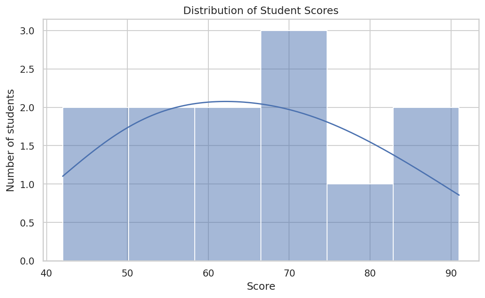

### Important Seaborn Parameter Options

| Parameter | Common values | Effect |
|---|---|---|
| `bins` | Integer such as `5`, `10`, `20`; `"auto"` | Controls the number or automatic selection of histogram bins. |
| `kde` | `True`, `False` | Adds or hides the KDE curve. |
| `stat` | `"count"`, `"frequency"`, `"probability"`, `"percent"`, `"density"` | Changes what the bar heights represent. |
| `element` | `"bars"`, `"step"`, `"poly"` | Changes the histogram's visual form. |
| `fill` | `True`, `False` | Fills or leaves histogram elements unfilled where supported. |
| `multiple` | `"layer"`, `"dodge"`, `"stack"`, `"fill"` | Controls how distributions are arranged when comparing groups. |
| `hue` | `None` or a column name, e.g. `"Department"` | Splits the data into groups and distinguishes them by color. |

---

## 4. KDE Plot

A Kernel Density Estimate (KDE) plot shows a smoothed estimate of where values are concentrated in a numeric distribution.

```python
sns.kdeplot(data=df, x="Attendance", fill=True, color="#4C72B0")
plt.title("Attendance Distribution (KDE)")
plt.xlabel("Attendance (%)")
plt.ylabel("Estimated density")
plt.tight_layout()
plt.show()
```

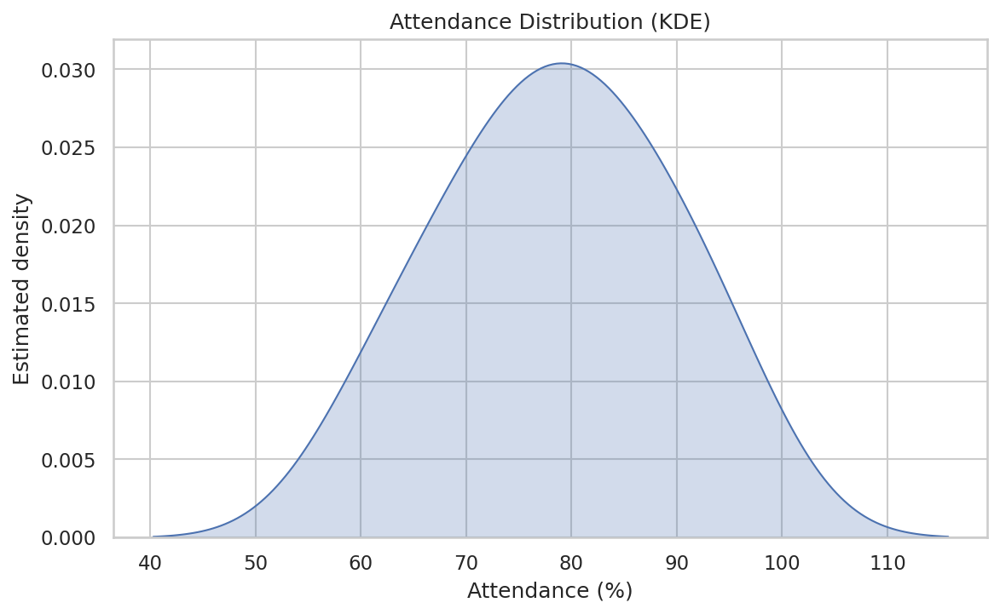

### Important Seaborn Parameter Options

| Parameter | Common values | Effect |
|---|---|---|
| `fill` | `True`, `False` | Fills or outlines the density area. |
| `hue` | `None` or a column name | Draws separate distributions for groups. |
| `bw_adjust` | Positive number, e.g. `0.5`, `1`, `2` | Smaller values produce more detail; larger values produce a smoother curve. |
| `multiple` | `"layer"`, `"stack"`, `"fill"` | Controls how grouped density curves are displayed. |
| `common_norm` | `True`, `False` | Controls whether grouped densities are normalized together or separately. |

---

## 5. ECDF Plot

An empirical cumulative distribution function (ECDF) shows the proportion of observations that are less than or equal to each value.

```python
sns.ecdfplot(data=df, x="Score", color="#4C72B0")
plt.title("Cumulative Distribution of Scores")
plt.xlabel("Score")
plt.ylabel("Cumulative proportion")
plt.tight_layout()
plt.show()
```

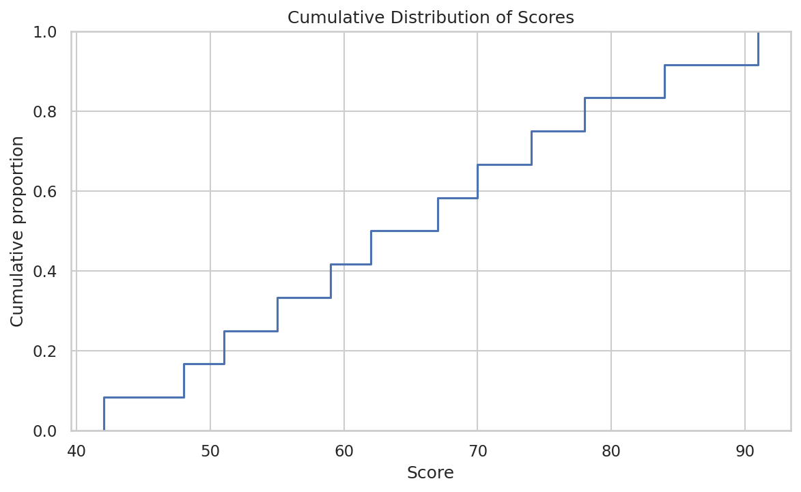

### Important Seaborn Parameter Options

| Parameter | Common values | Effect |
|---|---|---|
| `stat` | `"proportion"`, `"count"` | Shows cumulative proportion or cumulative count. |
| `complementary` | `True`, `False` | Shows the complementary cumulative distribution when enabled. |
| `hue` | `None` or a column name | Draws separate ECDF curves for groups. |
| `weights` | Name of a weights column or `None` | Gives observations different contributions to the cumulative distribution. |

---

## 6. Count Plot

A count plot counts the number of observations in each category. It is useful for checking how many records belong to each group.

```python
sns.countplot(
    data=df,
    x="Department",
    order=sorted(df["Department"].unique()),
    color="#4C72B0"
)
plt.title("Number of Students by Department")
plt.xlabel("Department")
plt.ylabel("Student count")
plt.tight_layout()
plt.show()
```

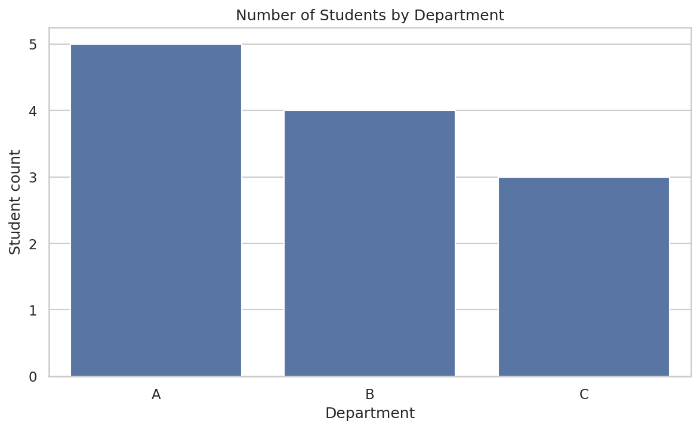

### Important Seaborn Parameter Options

| Parameter | Common values | Effect |
|---|---|---|
| `x`, `y` | A categorical column name; use one axis for categories | Chooses the axis used for category counts. |
| `hue` | `None` or a column name | Splits each category into colored groups. |
| `order` | List of category names | Sets the order of categories. |
| `hue_order` | List of group names | Sets the order of hue groups. |
| `stat` | `"count"`, `"percent"`, `"probability"` (supported in recent Seaborn versions) | Changes counts to relative values where supported. |
| `dodge` | `True`, `False` | Separates hue groups or lets them share a category position. |

---

## 7. Bar Plot

A bar plot compares a summary statistic, such as the mean score, across categories. By default, Seaborn displays the mean and an uncertainty interval.

```python
sns.barplot(data=df, x="Department", y="Score",
            errorbar=("ci", 95), color="#4C72B0)
plt.title("Mean Score by Department")
plt.xlabel("Department")
plt.ylabel("Mean score")
plt.tight_layout()
plt.show()
```

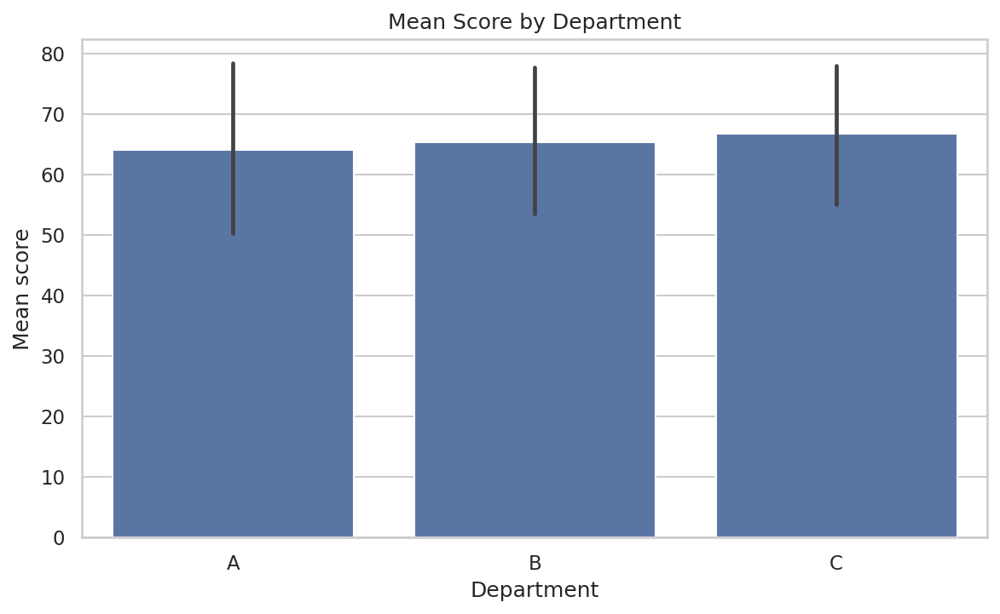

### Important Seaborn Parameter Options

| Parameter | Common values | Effect |
|---|---|---|
| `estimator` | `np.mean`, `np.median`, `sum`, or another aggregation function | Chooses the summary statistic represented by each bar. |
| `errorbar` | `"ci"`, `"se"`, `"sd"`, `"pi"`; a tuple such as `("ci", 95)`; `None` | Chooses the uncertainty interval or hides it. Exact options depend on Seaborn version. |
| `hue` | `None` or a column name | Adds a second categorical grouping using color. |
| `order` | List of category names | Controls category order. |
| `orient` | `"v"`, `"h"`, or `None` | Sets vertical or horizontal orientation, or lets Seaborn infer it. |
| `dodge` | `True`, `False` | Separates bars for hue groups or places them together. |

---

## 8. Box Plot

A box plot summarizes a distribution using quartiles and whiskers. Points beyond the whiskers may be potential outliers and should be investigated.

```python
sns.boxplot(data=df, x="Department", y="Score", color="#4C72B0)
plt.title("Score Distribution by Department")
plt.xlabel("Department")
plt.ylabel("Score")
plt.tight_layout()
plt.show()
```

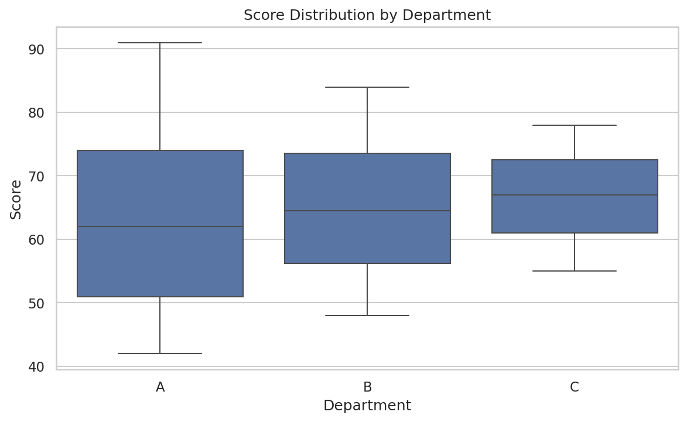

### Important Seaborn Parameter Options

| Parameter | Common values | Effect |
|---|---|---|
| `hue` | `None` or a column name | Adds a grouping within each category. |
| `order` | List of category names | Sets the category order. |
| `orient` | `"v"`, `"h"`, or `None` | Controls vertical or horizontal orientation. |
| `showfliers` | `True`, `False` | Shows or hides points beyond the whiskers. |
| `whis` | `1.5`, a number, or a percentile pair such as `(5, 95)` | Controls how whiskers are calculated. |
| `width` | Number, e.g. `0.5`, `0.8` | Controls box width. |
| `dodge` | `True`, `False` | Controls separation of hue-grouped boxes. |

---

## 9. Violin Plot

A violin plot shows the shape of a distribution for each category. The inner quartile marks help compare the middle of each distribution.

```python
sns.violinplot(data=df, x="Department", y="Score",
               inner="quartile", cut=0, color="#4C72B0")
plt.title("Score Distribution by Department (Violin Plot)")
plt.xlabel("Department")
plt.ylabel("Score")
plt.tight_layout()
plt.show()
```

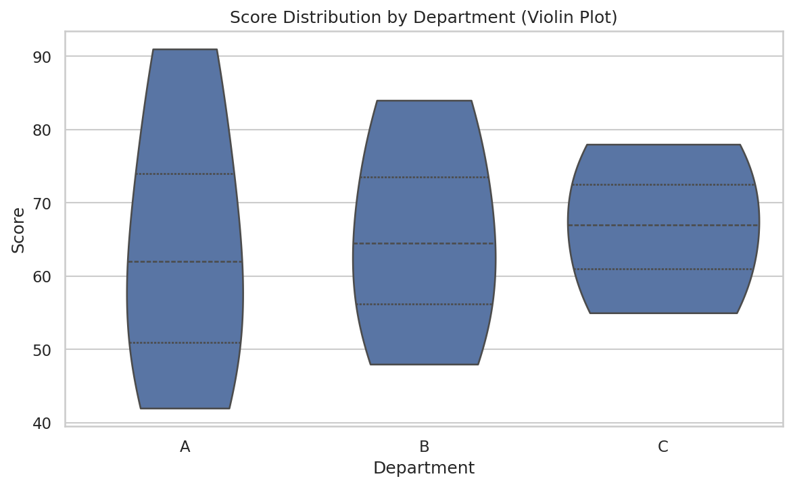

### Important Seaborn Parameter Options

| Parameter | Common values | Effect |
|---|---|---|
| `inner` | `"box"`, `"quart"`, `"point"`, `"stick"`, `None` | Chooses the marks shown inside each violin. |
| `cut` | Number, commonly `0` or `2` | Controls how far the density extends beyond the observed data range. |
| `bw_method` | `"scott"`, `"silverman"`, or a number (version-dependent) | Controls KDE bandwidth selection. |
| `density_norm` | `"area"`, `"count"`, `"width"` | Controls how violin widths are scaled in recent Seaborn versions. |
| `hue` | `None` or a column name | Adds group-based color. |
| `split` | `True`, `False` | Can draw hue groups on opposite sides of one violin when the data/design supports it. |
| `dodge` | `True`, `False` | Separates hue-grouped violins. |

---

## 10. Strip Plot

A strip plot displays individual observations for each category. Jitter spreads points slightly to make overlapping observations easier to see.

```python
sns.stripplot(data=df, x="Department", y="Score",
              jitter=0.18, alpha=0.8, color="#4C72B0")
plt.title("Individual Scores by Department")
plt.xlabel("Department")
plt.ylabel("Score")
plt.tight_layout()
plt.show()
```

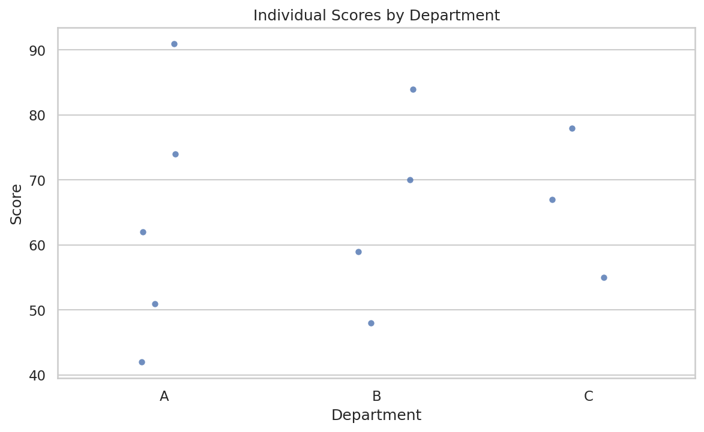

### Important Seaborn Parameter Options

| Parameter | Common values | Effect |
|---|---|---|
| `jitter` | `True`, `False`, or a number such as `0.1` | Spreads points sideways to reduce overlap. |
| `hue` | `None` or a column name | Colors points by group. |
| `dodge` | `True`, `False` | Separates hue groups along the category axis. |
| `size` | Positive number, e.g. `4`, `6` | Sets marker size. |
| `alpha` | Number from `0` to `1` | Controls marker transparency. |
| `orient` | `"v"`, `"h"`, or `None` | Controls plot orientation. |

---

## 11. Swarm Plot

A swarm plot arranges individual points to reduce overlap. It works well for small datasets, but can become crowded when there are many observations.

```python
sns.swarmplot(data=df, x="Department", y="Score",
              size=6, color="#4C72B0")
plt.title("Scores by Department (Swarm Plot)")
plt.xlabel("Department")
plt.ylabel("Score")
plt.tight_layout()
plt.show()
```

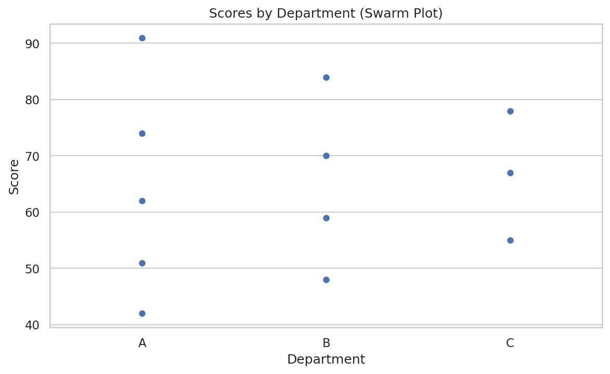

### Important Seaborn Parameter Options

| Parameter | Common values | Effect |
|---|---|---|
| `hue` | `None` or a column name | Colors points by group. |
| `dodge` | `True`, `False` | Separates hue groups where applicable. |
| `size` | Positive number, e.g. `4`, `6` | Sets marker size. |
| `orient` | `"v"`, `"h"`, or `None` | Controls plot orientation. |
| `warn_thresh` | Number from `0` to `1` | Sets the crowding threshold that triggers a warning. |
| `native_scale` | `True`, `False` | Preserves numeric/datetime category spacing when enabled in supported versions. |

---

## 12. Scatter Plot

A scatter plot displays the relationship between two numeric variables. The `hue` parameter uses color to distinguish departments.

```python
sns.scatterplot(data=df, x="StudyHours", y="Score",
                hue="Department", s=90)
plt.title("Study Hours vs Score")
plt.xlabel("Study hours")
plt.ylabel("Score")
plt.tight_layout()
plt.show()
```

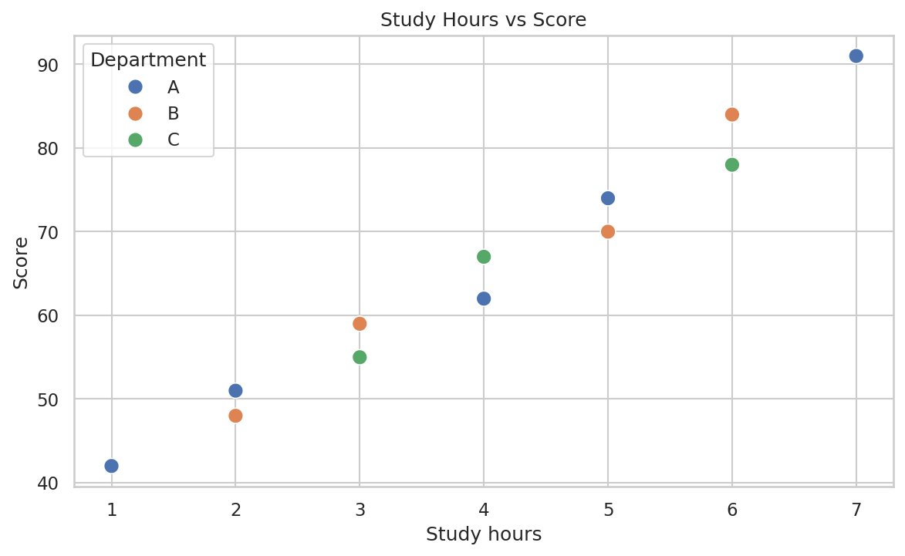

### Important Seaborn Parameter Options

| Parameter | Common values | Effect |
|---|---|---|
| `hue` | `None` or a column name | Maps groups to colors. |
| `style` | `None` or a column name | Maps groups to marker styles. |
| `size` | `None`, a column name, or a numeric value | Maps data to marker sizes or sets a fixed size where supported. |
| `palette` | Palette name such as `"deep"`, `"Set2"`, `"viridis"`, or a color list/dictionary | Chooses colors for hue groups. |
| `markers` | `True`, `False`, or a marker list/dictionary | Controls marker styles for style groups. |
| `sizes` | Tuple such as `(20, 200)` or a mapping | Controls the marker-size range for numeric size mapping. |
| `legend` | `True`, `False`, `"auto"`, `"brief"`, `"full"` | Controls legend display and detail. |

---

## 13. Regression Plot

A regression plot adds a fitted linear trend line to the data. The line describes an association and does not prove that one variable causes another.

```python
sns.regplot(
    data=df,
    x="StudyHours",
    y="Score",
    color="#4C72B0",
    scatter_kws={"alpha": 0.75},
    line_kws={"color": "red"}
)
plt.title("Study Hours vs Score with Regression Line")
plt.xlabel("Study hours")
plt.ylabel("Score")
plt.tight_layout()
plt.show()
```

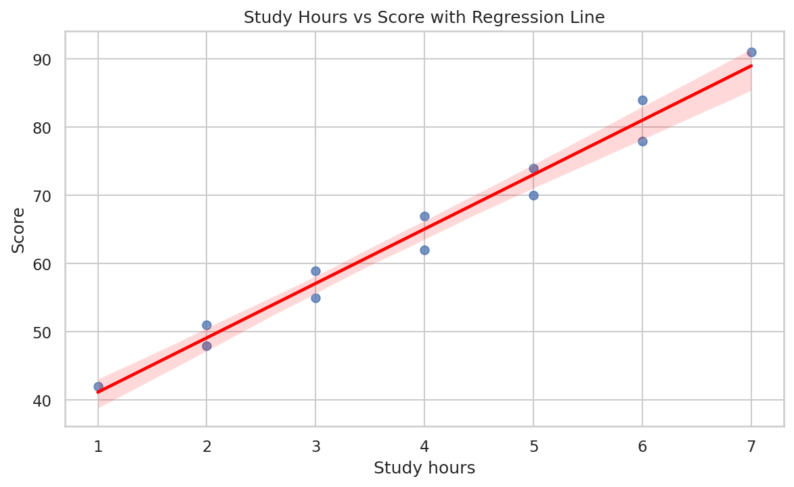

### Important Seaborn Parameter Options

| Parameter | Common values | Effect |
|---|---|---|
| `order` | Positive integer, e.g. `1`, `2`, `3` | Fits a polynomial regression of the selected order. |
| `logistic` | `True`, `False` | Fits a logistic regression instead of ordinary linear regression when enabled. |
| `lowess` | `True`, `False` | Uses a locally weighted smoother when enabled. |
| `ci` | Number such as `95`, or `None` | Sets the confidence interval level or hides the interval; this option is deprecated in newer versions in favor of `errorbar` in some functions. |
| `x_estimator` | Function such as `np.mean`, or `None` | Aggregates repeated x values before plotting. |
| `scatter` | `True`, `False` | Shows or hides the data points. |
| `robust` | `True`, `False` | Uses robust regression to reduce sensitivity to outliers. |

---

## 14. Residual Plot

A residual plot shows model errors against the predictor. Patterns in the residuals can suggest that a simple linear model does not fully describe the data.

```python
sns.residplot(data=df, x="StudyHours", y="Score",
              lowess=True, color="#4C72B0")
plt.title("Residual Plot for Score")
plt.xlabel("Study hours")
plt.ylabel("Residual")
plt.tight_layout()
plt.show()
```

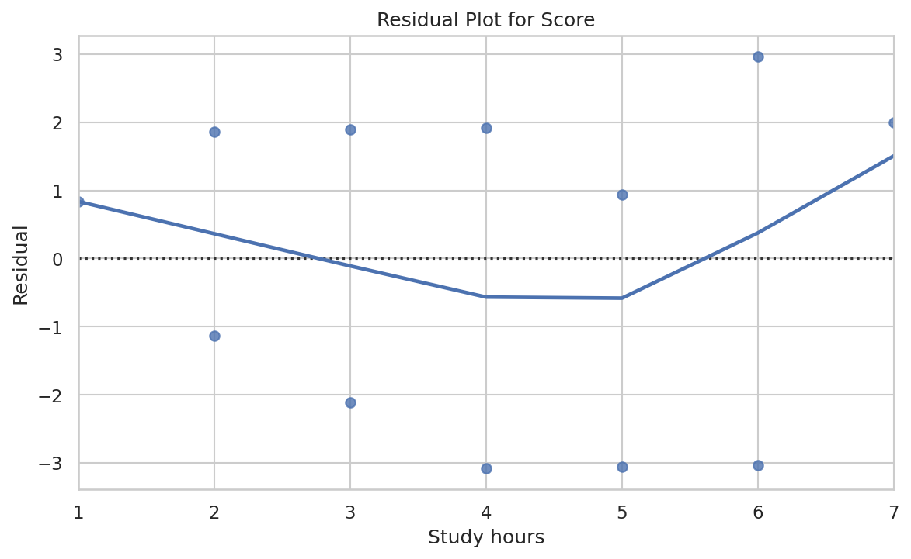

### Important Seaborn Parameter Options

| Parameter | Common values | Effect |
|---|---|---|
| `lowess` | `True`, `False` | Adds a locally weighted smooth trend through the residuals. |
| `resid` | `True`, `False` | Controls whether residuals or the response values are plotted, where supported. |
| `x_partial`, `y_partial` | Column names or `None` | Partial out other variables before plotting, where supported. |
| `scatter` | `True`, `False` | Shows or hides individual points. |
| `x`, `y` | Numeric column names | Selects the predictor and response variables used to calculate the residual plot. |

---

## 15. Line Plot

A line plot connects values along an ordered x-axis. This example orders the observations by study hours to show how scores vary in the sample.

```python
line_df = df.sort_values("StudyHours")

sns.lineplot(data=line_df, x="StudyHours", y="Score",
             marker="o", errorbar=None, color="#4C72B0")
plt.title("Score by Study Hours")
plt.xlabel("Study hours")
plt.ylabel("Score")
plt.tight_layout()
plt.show()
```

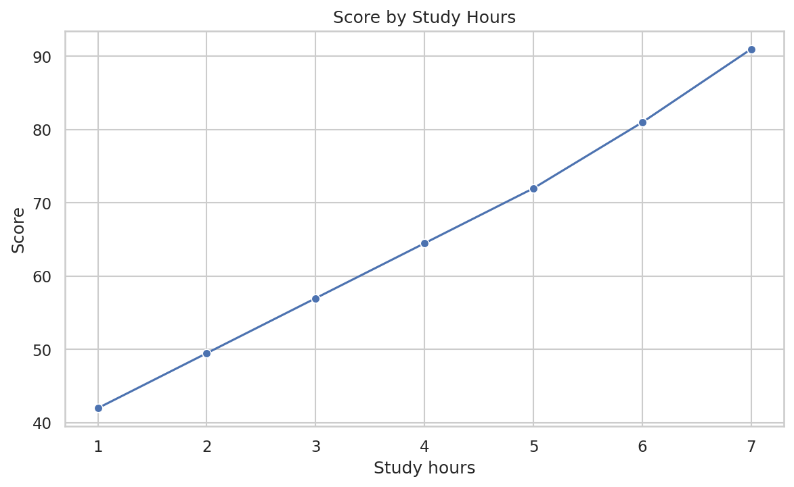

### Important Seaborn Parameter Options

| Parameter | Common values | Effect |
|---|---|---|
| `estimator` | `np.mean`, `np.median`, or `None` | Chooses how repeated y values at each x value are summarized; `None` draws observations without aggregation. |
| `errorbar` | `"ci"`, `"se"`, `"sd"`, `"pi"`, tuple forms, or `None` | Chooses an uncertainty interval or hides it. |
| `hue` | `None` or a column name | Draws separate colored lines for groups. |
| `style` | `None` or a column name | Varies line dashes and/or markers by group. |
| `markers` | `True`, `False`, or marker specification | Controls markers for groups. |
| `dashes` | `True`, `False`, or dash specification | Controls dashed line styles for groups. |
| `sort` | `True`, `False` | Sorts x values before connecting points. |

---

## 16. Joint Plot

A joint plot combines a relationship plot with the distributions of both variables along the edges. The `kind="reg"` option adds a regression line.

```python
sns.jointplot(data=df, x="StudyHours", y="Score",
              kind="reg", height=6)
plt.show()
```

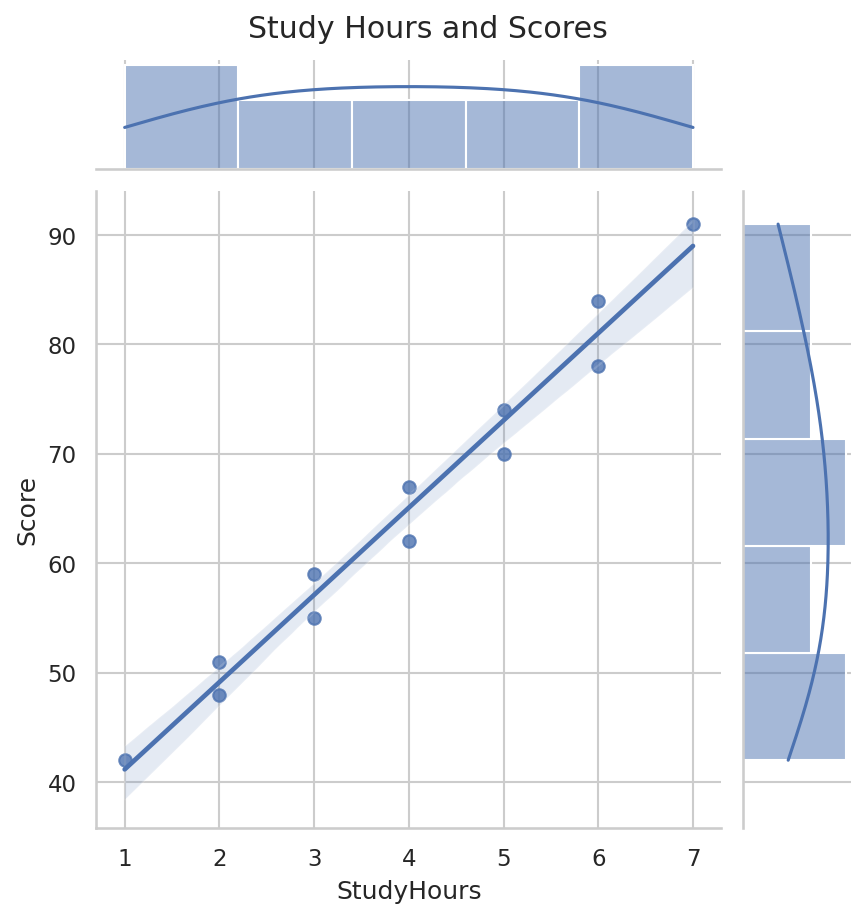

### Important Seaborn Parameter Options

| Parameter | Common values | Effect |
|---|---|---|
| `kind` | `"scatter"`, `"kde"`, `"hist"`, `"hex"`, `"reg"`, `"resid"` | Chooses the main relationship plot. |
| `height` | Positive number, e.g. `5`, `6` | Sets figure height in inches. |
| `ratio` | Positive integer | Controls the size ratio between the central plot and marginal plots. |
| `hue` | `None` or a column name | Colors observations by group for supported plot kinds. |
| `marginal_ticks` | `True`, `False` | Controls ticks on marginal axes. |
| `dropna` | `True`, `False` | Controls whether rows with missing x/y values are dropped. |

---

## 17. Pair Plot

A pair plot displays pairwise relationships between several numeric columns. The `hue` parameter colors observations by department.

```python
sns.pairplot(
    df,
    vars=["StudyHours", "Score", "Attendance"],
    hue="Department",
    corner=True
)
plt.show()
```

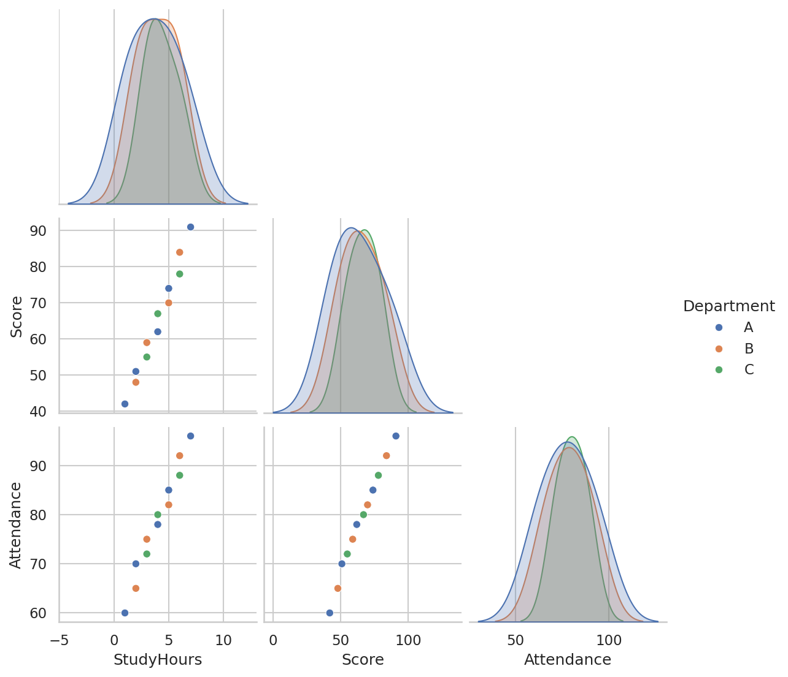

### Important Seaborn Parameter Options

| Parameter | Common values | Effect |
|---|---|---|
| `vars` | List of column names | Selects variables to compare. |
| `hue` | `None` or a column name | Colors observations by group. |
| `kind` | `"scatter"`, `"kde"`, `"hist"`, `"reg"` | Chooses the off-diagonal plot type. |
| `diag_kind` | `"auto"`, `"hist"`, `"kde"`, `None` | Chooses plots on the diagonal. |
| `corner` | `True`, `False` | Shows only the lower triangle when enabled. |
| `palette` | Palette name, list, or dictionary | Chooses colors for hue groups. |
| `plot_kws` | Dictionary | Passes additional options to off-diagonal plots. |

---

## 18. Correlation Heatmap

A heatmap uses color to show values in a matrix. Correlations closer to `1` indicate positive linear association, while values closer to `-1` indicate negative linear association.

```python
numeric_df = df.select_dtypes(include="number")
correlation = numeric_df.corr()

sns.heatmap(correlation, annot=True, cmap="coolwarm",
            center=0, vmin=-1, vmax=1, fmt=".2f")
plt.title("Correlation Heatmap")
plt.tight_layout()
plt.show()
```

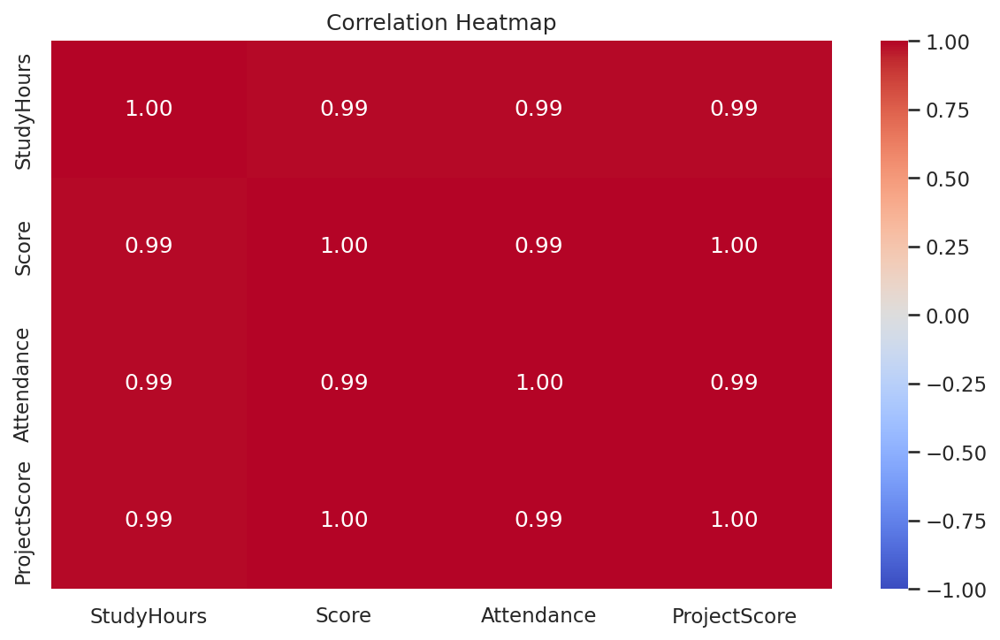

### Important Seaborn Parameter Options

| Parameter | Common values | Effect |
|---|---|---|
| `annot` | `True`, `False`, or an annotation matrix | Shows or hides values inside cells. |
| `fmt` | `"d"`, `".1f"`, `".2f"`, etc. | Formats numbers shown by `annot=True`. |
| `cmap` | `"coolwarm"`, `"viridis"`, `"magma"`, `"vlag"`, etc. | Chooses the color map. |
| `center` | Number, e.g. `0`, or `None` | Sets the value centered in the color map. |
| `vmin`, `vmax` | Numeric values or `None` | Sets the lower and upper color scale limits. |
| `linewidths` | Number, e.g. `0`, `0.5`, `1` | Sets the width of lines between cells. |
| `square` | `True`, `False` | Makes cells square when enabled. |
| `mask` | Boolean matrix | Hides selected cells. |

---

## 19. Clustermap

A clustermap groups rows and columns with similar numeric patterns. Standardizing the columns helps compare variables with different scales.

```python
cluster_data = df[
    ["StudyHours", "Score", "Attendance", "ProjectScore"]
]

sns.clustermap(cluster_data, standard_scale=1,
               cmap="vlag", figsize=(8, 6))
plt.show()
```

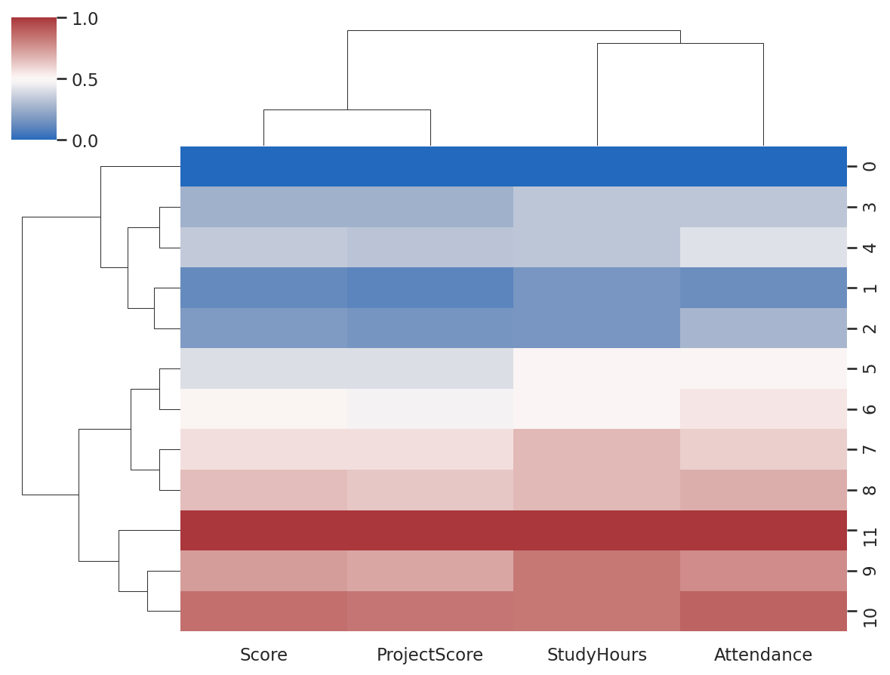

### Important Seaborn Parameter Options

| Parameter | Common values | Effect |
|---|---|---|
| `standard_scale` | `0`, `1`, or `None` | Scales each row (`0`) or column (`1`) to a 0–1 range, or does not apply this scaling. |
| `z_score` | `0`, `1`, or `None` | Standardizes rows or columns using z-scores. |
| `method` | `"average"`, `"single"`, `"complete"`, `"ward"`, etc. | Chooses the hierarchical clustering linkage method. |
| `metric` | `"euclidean"`, `"correlation"`, `"cityblock"`, etc. | Chooses the distance metric. |
| `row_cluster`, `col_cluster` | `True`, `False` | Enables or disables clustering of rows and columns. |
| `cmap` | Palette name, e.g. `"vlag"`, `"viridis"` | Chooses the heatmap color map. |
| `figsize` | Tuple, e.g. `(8, 6)` | Sets the figure size. |

---

## 20. Figure-Level `relplot()`

`relplot()` is a figure-level function that can divide a relationship chart into panels. Here, each panel represents one department.

```python
sns.relplot(
    data=df,
    x="StudyHours",
    y="Score",
    hue="Department",
    col="Department",
    kind="scatter",
    height=3.2
)
plt.show()
```

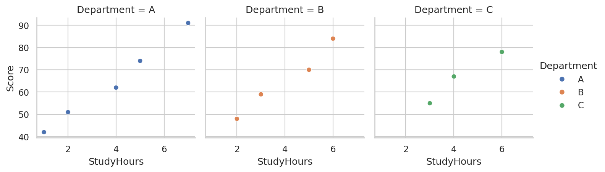

### Important Seaborn Parameter Options

| Parameter | Common values | Effect |
|---|---|---|
| `kind` | `"scatter"`, `"line"` | Chooses scatter or line plots. |
| `hue` | `None` or a column name | Encodes groups with color. |
| `style` | `None` or a column name | Encodes groups with marker/line style. |
| `size` | `None` or a column name | Encodes a variable using marker size or line width. |
| `col`, `row` | Column names or `None` | Creates panels by category or value. |
| `col_wrap` | Positive integer or `None` | Wraps column facets into multiple rows. |
| `height` | Positive number | Sets height of each facet in inches. |
| `aspect` | Positive number | Sets each facet's width-to-height ratio. |

---

## 21. Figure-Level `catplot()`

`catplot()` is a flexible interface for categorical charts. Its `kind` parameter can be changed to `"box"`, `"violin"`, `"bar"`, or `"strip"`.

```python
sns.catplot(
    data=df,
    x="Department",
    y="Score",
    kind="box",
    height=4,
    aspect=1.3,
    color="#4C72B0"
)
plt.title("Scores by Department (catplot)")
plt.show()
```

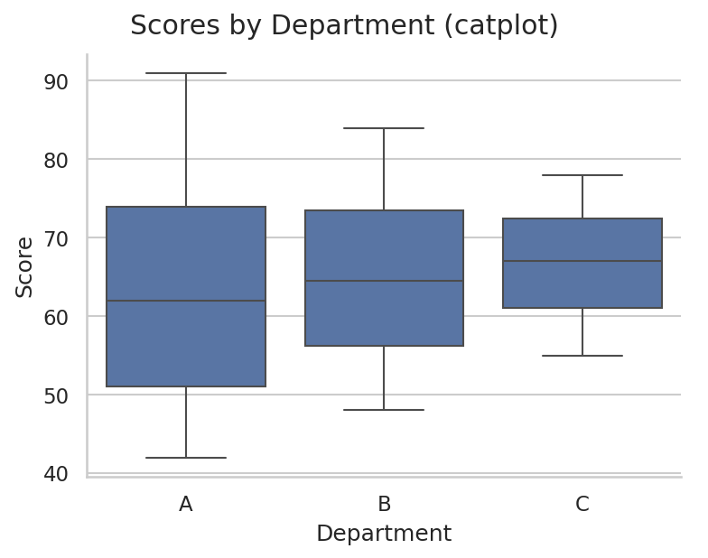

### Important Seaborn Parameter Options

| Parameter | Common values | Effect |
|---|---|---|
| `kind` | `"strip"`, `"swarm"`, `"box"`, `"violin"`, `"boxen"`, `"point"`, `"bar"`, `"count"` | Chooses the categorical plot type. |
| `hue` | `None` or a column name | Adds a grouping shown with color. |
| `row`, `col` | Column names or `None` | Creates separate panels for groups. |
| `height` | Positive number | Sets height of each facet in inches. |
| `aspect` | Positive number | Sets each facet's width-to-height ratio. |
| `order` | List of category names | Sets the category order. |
| `dodge` | `True`, `False` | Separates hue groups where the plot type supports it. |

---

## 22. Figure-Level `displot()`

`displot()` is a figure-level interface for distribution plots. The `hue` parameter makes it possible to compare score distributions across departments.

```python
sns.displot(
    data=df,
    x="Score",
    hue="Department",
    kind="hist",
    bins=6,
    element="step",
    height=4,
    aspect=1.4
)
plt.show()
```

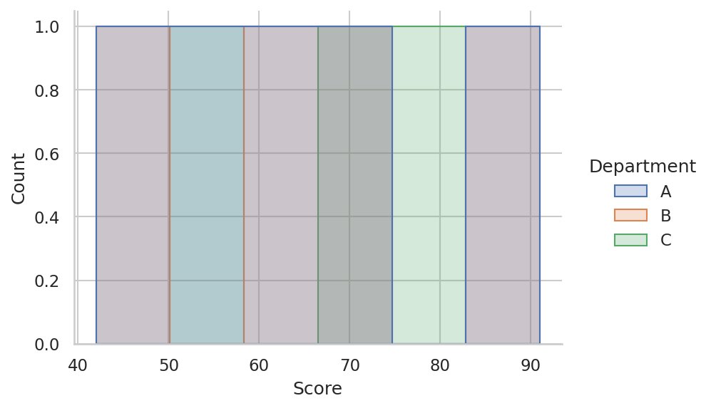

### Important Seaborn Parameter Options

| Parameter | Common values | Effect |
|---|---|---|
| `kind` | `"hist"`, `"kde"`, `"ecdf"` | Chooses the distribution plot type. |
| `hue` | `None` or a column name | Compares distributions across groups. |
| `bins` | Integer, sequence of bin edges, or `"auto"` | Controls histogram binning when `kind="hist"`. |
| `element` | `"bars"`, `"step"`, `"poly"` | Changes histogram appearance. |
| `multiple` | `"layer"`, `"stack"`, `"dodge"`, `"fill"` | Controls how grouped histograms are arranged. |
| `height` | Positive number | Sets figure height in inches. |
| `aspect` | Positive number | Sets figure width relative to height. |
| `col`, `row` | Column names or `None` | Splits distributions into panels. |

---

## 23. Styling with `hue`, `style`, and Palettes

The `hue` parameter distinguishes categories using color, while `style` can distinguish them using marker shapes. Titles, axis labels, and legends make charts easier to understand.

```python
sns.set_theme(style="ticks", palette="colorblind")

ax = sns.scatterplot(
    data=df,
    x="StudyHours",
    y="ProjectScore",
    hue="Department",
    style="Department",
    s=100
)
ax.set_title("Study Hours vs Project Score by Department")
ax.set_xlabel("Study hours")
ax.set_ylabel("Project score")
sns.move_legend(ax, "upper left", bbox_to_anchor=(1, 1))
plt.tight_layout()
plt.show()

# Optional: restore the default notebook theme
sns.set_theme(style="whitegrid")
```

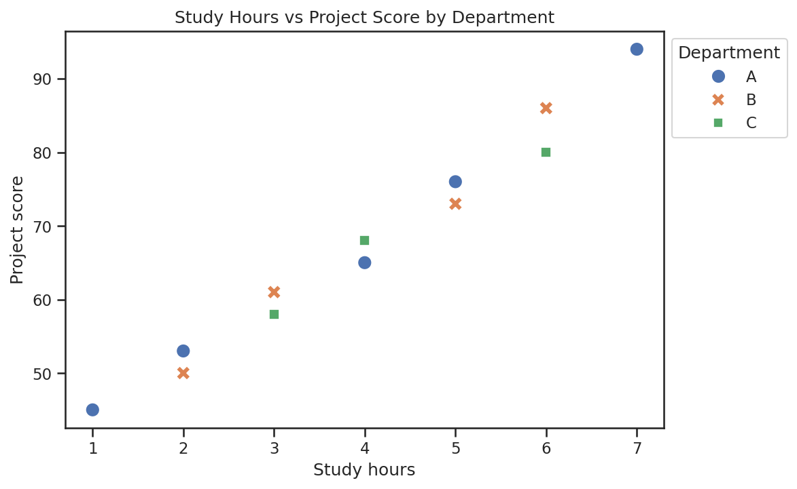

### Important Seaborn Styling Options

| Parameter / function | Common values | Effect |
|---|---|---|
| `hue` | `None` or a column name | Uses color to distinguish groups. |
| `style` | `None` or a column name | Uses marker shapes to distinguish groups. |
| `palette` | `"deep"`, `"muted"`, `"bright"`, `"pastel"`, `"dark"`, `"colorblind"`, or a custom palette | Chooses colors for groups. |
| `s` | Positive number, e.g. `40`, `100` | Sets scatter marker area in points squared. |
| `sns.set_theme(style=...)` | `"darkgrid"`, `"whitegrid"`, `"dark"`, `"white"`, `"ticks"` | Sets the overall plot theme. |
| `sns.move_legend()` | A location such as `"upper left"`, `"lower right"`, `"best"` where supported | Moves the legend to a chosen position. |

---

## Quick Plot Selection Guide

| Goal | Useful functions |
|---|---|
| Inspect a numeric distribution | `histplot()`, `kdeplot()`, `ecdfplot()` |
| Count categories | `countplot()` |
| Compare values across groups | `barplot()`, `boxplot()`, `violinplot()` |
| Show individual observations | `stripplot()`, `swarmplot()` |
| Explore numeric relationships | `scatterplot()`, `lineplot()` |
| Show a fitted trend | `regplot()`, `lmplot()` |
| Compare multiple panels | `relplot()`, `catplot()`, `displot()` |
| Inspect pairwise relationships | `pairplot()`, `jointplot()` |
| Visualize correlations | `heatmap()` |
| Cluster numeric patterns | `clustermap()` |
| Inspect model errors | `residplot()` |

## How to Run the Python File

From the project folder, run:

```bash
python seaborn_visualizations.py
```

The script creates the charts in the `images/` folder. Keep the `README.md` and `images/` folder together so the images render correctly on GitHub.

## Important Notes

- Use a chart that answers a clear question.
- Add meaningful titles and axis labels.
- Check data types and missing values before plotting.
- Investigate potential outliers instead of removing them automatically.
- Correlation and regression show association; they do not establish cause and effect.

---

## Points to Remember

- Seaborn is a Python library used for statistical data visualization.
- Seaborn is built on top of Matplotlib.
- Import Seaborn using `import seaborn as sns`.
- Import Pandas using `import pandas as pd` when working with DataFrames.
- Most Seaborn functions work directly with Pandas DataFrames.
- Use `data=df` to specify the DataFrame containing your data.
- Use `x` and `y` to select the columns for the axes.
- Use `hue` to differentiate categories using different colors.
- Use `palette` to choose a color palette, such as `"viridis"`, `"Set2"`, or `"coolwarm"`.
- Use `style` to represent categories with different marker styles in supported plots.
- Use `size` to represent values through different marker sizes in supported plots.
- Use `sns.set_theme()` to customize the overall appearance of Seaborn charts.
- Use `plt.title()` to set the chart title and `plt.show()` to display the chart.
- Use `figsize` in Matplotlib when you need to adjust the figure size.
- Use `kde=True` in supported distribution plots to display a Kernel Density Estimate curve.
- Use `bins` in histograms to control how data is divided into intervals.
- Use `multiple="layer"`, `"stack"`, or `"dodge"` in supported distribution plots to change how groups are displayed.
- Use `kind` in functions such as `sns.displot()` and `sns.catplot()` to select the type of plot.
- Use `countplot()` to count observations in categories.
- Use `barplot()` to visualize a statistical estimate for each category.
- Use `boxplot()` to understand the median, quartiles, spread, and potential outliers.
- Use `heatmap()` to visualize values in a matrix using colors.
- Use `pairplot()` to explore relationships between multiple numerical variables.
- Use `jointplot()` to visualize the relationship between two variables and their distributions.
- Use `regplot()` to visualize a relationship with a fitted regression line.
- Use `lmplot()` to explore regression relationships across groups.
- Use `col` and `row` in supported figure-level functions to create separate plots for different categories.
- Use `savefig()` from Matplotlib to save a visualization as an image.
- Check the documentation for each function because available parameters and accepted values vary between plots.
- Remember that `sns.*` functions belong to Seaborn, while `plt.*` functions generally belong to Matplotlib.
- Choose the chart type according to your data and the relationship you want to understand.
