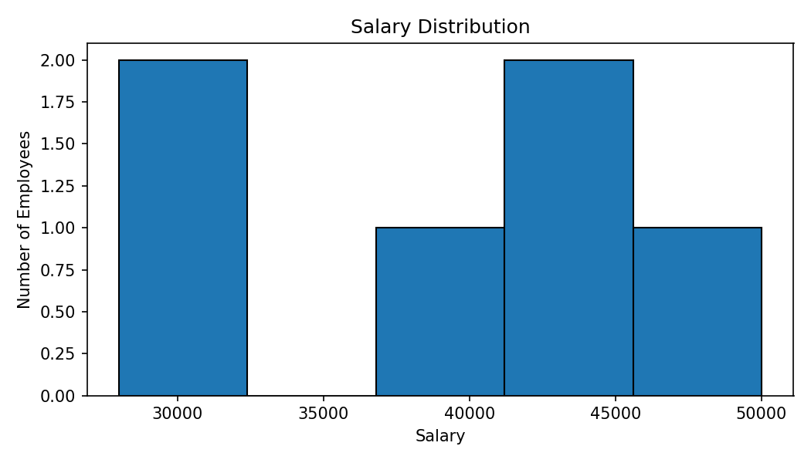
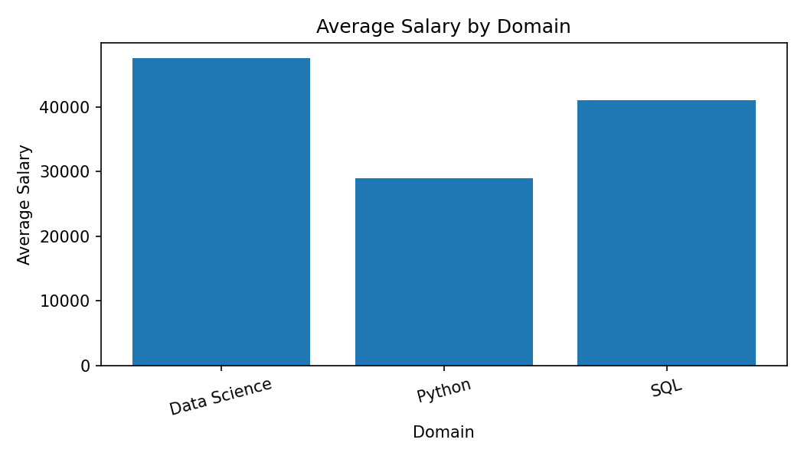
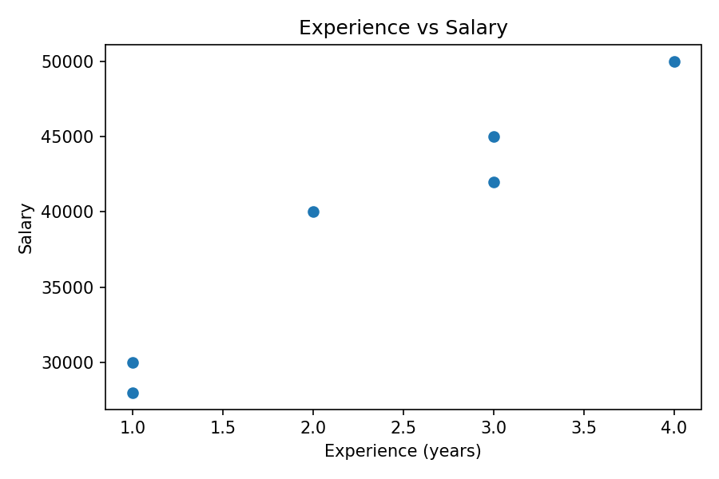

# Exploratory Data Analysis (EDA)

Exploratory Data Analysis (EDA) is the process of understanding a dataset before performing further analysis or building a Machine Learning model. It involves inspecting the data to understand its structure, size, column names, data types, and the information contained in each column. This helps us understand what the dataset represents and whether it is suitable for the task.

Data cleaning is an important part of EDA. It involves identifying and handling missing values, duplicate records, incorrect data types, inconsistent text, and invalid values. These issues can affect the accuracy of analysis, so they should be investigated and handled according to the requirements of the dataset.

EDA also involves summarizing and visualizing data to identify patterns, trends, and relationships between variables. Using Pandas, Matplotlib, and Seaborn, we can explore data through tables, summary information, histograms, bar charts, and scatter plots. These methods help us understand the data more clearly and identify unusual observations that may require further investigation.

The main goal of EDA is to gain a clear understanding of the dataset, identify data-quality issues, and discover useful insights before drawing conclusions. It also helps us decide what preprocessing or further analysis may be required before using the data for Machine Learning. EDA is an iterative process in which we inspect, clean, explore, and review the data until we have a reliable understanding of its contents and limitations.

---

## Complete EDA Workflow

**1. Load Data**

Read data from CSV, Excel, or another supported source.

**2. Inspect Data**

Check rows, columns, data types, column names, and sample records.


**3. Clean Data**

Identify and handle missing values, duplicate records, inconsistent values, and incorrect data types.


**4. Summarize and Explore**

Use Pandas operations and descriptive summaries to understand the dataset.


**5. Visualize Patterns**

Create suitable charts to explore distributions, compare categories, and identify relationships or unusual values.


**6. Document Findings**

Record important observations, assumptions, data-cleaning decisions, and limitations.


**7. Prepare for Further Analysis or Machine Learning**

Save the cleaned dataset and relevant outputs for further analysis or Machine Learning.

**Note:** The EDA workflow is iterative. If you discover an unexpected value or data-quality issue, return to the relevant inspection or cleaning step and investigate it before continuing.

---

## 1. Install and Import Libraries

Install the libraries used in the examples:

```bash
pip install pandas numpy matplotlib seaborn openpyxl
```

Import them:

```python
import pandas as pd
import numpy as np
import matplotlib.pyplot as plt
import seaborn as sns
```

- `pandas`: load, inspect, clean, and analyse tabular data.
- `numpy`: numerical operations.
- `matplotlib` and `seaborn`: charts.
- `openpyxl`: support for many Excel `.xlsx` files.

---

## 2. Create a Sample DataFrame

The following small DataFrame is used in the examples below.

```python
import pandas as pd

data = {
    "Name": ["Aman", "Riya", "Rahul", "Neha", "Arjun", "Sara"],
    "Age": [21, 22, 20, 21, 23, 22],
    "Domain": ["Python", "Data Science", "Python", "SQL", "Data Science", "SQL"],
    "Salary": [30000, 45000, 28000, 40000, 50000, 42000],
    "Experience": [1, 3, 1, 2, 4, 3],
    "City": ["Lucknow", "Delhi", "Lucknow", "Mumbai", "Delhi", "Mumbai"]
}

df = pd.DataFrame(data)
print(df)
```

**Output**

```text
    Name  Age        Domain  Salary  Experience     City
0   Aman   21        Python   30000           1  Lucknow
1   Riya   22  Data Science   45000           3    Delhi
2  Rahul   20        Python   28000           1  Lucknow
3   Neha   21           SQL   40000           2   Mumbai
4  Arjun   23  Data Science   50000           4    Delhi
5   Sara   22           SQL   42000           3   Mumbai
```

This is sample learning data, not a representative study of salaries.

---

## 3. Load Data

### CSV

```python
df = pd.read_csv("employee_test_data.csv")
print(df.head())
```

`read_csv()` options you may use include `sep`, `usecols`, `dtype`, `na_values`, `nrows`, and `encoding`.

### Excel

```python
df = pd.read_excel("employee_raw_data.xlsx")
print(df.head())
```

To select a worksheet:

```python
df = pd.read_excel("employee_raw_data.xlsx", sheet_name="Sheet1")
```

The worksheet name must match the workbook. Other common methods are `pd.read_json()`, `pd.read_parquet()`, and `pd.read_sql()`.

---

## 4. Inspect the Dataset

### `head()` and `tail()`

```python
print(df.head(3))
print(df.tail(2))
```

`head(3)` shows the first three rows; `tail(2)` shows the last two.

### `shape`

```python
print(df.shape)
```

**Output for the sample DataFrame**

```text
(6, 6)
```

The tuple means **6 rows and 6 columns**.

### `columns` and `dtypes`

```python
print(df.columns)
print(df.dtypes)
```

`columns` displays column names. `dtypes` displays the detected type of each column.

### `info()`

```python
df.info()
```

Shows column names, non-missing counts, data types, and memory information. Exact output depends on the dataset.

### `describe()`

```python
print(df.describe())
```

Shows a summary of numerical columns. Descriptive statistics are covered briefly here; study the meanings and assumptions in your Statistics notes.

### `sample()`

```python
print(df.sample(3, random_state=42))
```

Selects three random rows. `random_state` makes the selection repeatable for the same data and execution conditions.

---

## 5. Check Missing Values

### Count missing values

```python
print(df.isna().sum())
```

**Example output when no sample values are missing**

```text
Name          0
Age           0
Domain        0
Salary        0
Experience    0
City          0
dtype: int64
```

### Missing-value percentage

```python
missing_percent = (df.isna().mean() * 100).round(2)
print(missing_percent)
```

This gives the percentage of missing values in each column.

### Remove or fill missing values

```python
# Remove rows containing at least one missing value
df_without_missing = df.dropna()

# Fill missing numerical values using the column median
df["Age"] = df["Age"].fillna(df["Age"].median())

# Fill missing category labels where appropriate
df["City"] = df["City"].fillna("Unknown")
```

Do not remove or fill values automatically. First investigate why values are missing and how the decision affects the analysis.

---

## 6. Find and Handle Duplicates

### Count duplicate rows

```python
print(df.duplicated().sum())
```

**Output for the sample DataFrame**

```text
0
```

### View duplicates and remove them

```python
print(df[df.duplicated(keep=False)])

df_unique = df.drop_duplicates()
```

To check repeated combinations of selected columns:

```python
print(df.duplicated(subset=["Name", "City"]).sum())
```

Only remove records after deciding what makes a row a duplicate in your dataset.

---

## 7. Clean Column Names and Text

### Remove spaces from column names

```python
df.columns = df.columns.astype(str).str.strip()
```

### Rename a column

```python
df = df.rename(columns={"Experience": "Exp"})
```

### Clean text values

```python
df["Name"] = df["Name"].astype("string").str.strip()
df["City"] = df["City"].astype("string").str.title()
```

### Replace inconsistent labels

```python
df["City"] = df["City"].replace({
    "NY": "New York",
    "ny": "New York"
})
```

Use replacements only after confirming that the values mean the same thing.

### Use regular expressions

```python
values = pd.Series(["34 years", "28 years", "unknown"])
numbers = values.str.extract(r"(\\d+)", expand=False)
print(numbers)
```

**Output**

```text
0      34
1      28
2     NaN
dtype: object
```

Regular expressions can extract patterns, but always review what the transformation changes or loses.

---

## 8. Convert Data Types

### Convert text to numbers

```python
values = pd.Series(["100", "250", "unknown"])
numbers = pd.to_numeric(values, errors="coerce")
print(numbers)
```

**Output**

```text
0    100.0
1    250.0
2      NaN
dtype: float64
```

`errors="coerce"` converts invalid values to missing values. Inspect them rather than silently ignoring them.

### Convert to datetime

```python
dates = pd.to_datetime(
    pd.Series(["2026-01-10", "2026-02-15", "invalid"]),
    errors="coerce"
)
print(dates)
```

**Output**

```text
0   2026-01-10
1   2026-02-15
2          NaT
dtype: datetime64[ns]
```

Other useful methods include `astype()` and `convert_dtypes()`.

---

## 9. Explore Numerical and Categorical Columns

Statistics such as mean, median, variance, standard deviation, quantiles, skewness, and distributions are important for EDA, but detailed theory belongs in Statistics notes.

```python
print(df["Salary"].describe())
print(df["Domain"].value_counts())
print(df["Domain"].value_counts(normalize=True).round(2))
```

- `describe()` gives a quick numerical summary.
- `value_counts()` counts each category.
- `normalize=True` returns proportions instead of raw counts.

---

## 10. Visualize the Data

The `images/` folder contains example plots generated from the sample DataFrame. These are illustrative images; your charts will depend on your dataset.

### Salary distribution

```python
plt.figure(figsize=(7, 4))
sns.histplot(data=df, x="Salary", bins=5)
plt.title("Salary Distribution")
plt.xlabel("Salary")
plt.ylabel("Number of Employees")
plt.tight_layout()
plt.savefig("images/salary_distribution.png", dpi=150)
plt.show()
```



A histogram shows how numerical values are distributed across bins.

### Compare average salary by domain

```python
summary = df.groupby("Domain", as_index=False)["Salary"].mean()

sns.barplot(data=summary, x="Domain", y="Salary")
plt.title("Average Salary by Domain")
plt.xlabel("Domain")
plt.ylabel("Average Salary")
plt.xticks(rotation=15)
plt.tight_layout()
plt.savefig("images/average_salary_by_domain.png", dpi=150)
plt.show()
```



A bar chart compares a summary value across categories. Always check how many observations are in each group.

### Explore two numerical variables

```python
sns.scatterplot(data=df, x="Experience", y="Salary")
plt.title("Experience vs Salary")
plt.xlabel("Experience (years)")
plt.ylabel("Salary")
plt.tight_layout()
plt.savefig("images/experience_vs_salary.png", dpi=150)
plt.show()
```



A scatter plot helps reveal possible relationships, clusters, and unusual observations. A visible relationship does not prove causation.

### Other useful plots

| Plot | Common purpose |
|---|---|
| Box plot | Compare spread and flag potential outliers |
| Count plot | Compare category counts |
| Heatmap | Display a correlation matrix or a table of values |
| Line plot | Show values over an ordered sequence or time |
| Pair plot | Inspect pairwise numerical relationships |

Choose plots based on the question, variable types, sample size, and readability.

---

## 11. Grouping and Comparing Variables

### `groupby()` and `agg()`

```python
summary = df.groupby("Domain")["Salary"].agg(
    ["count", "mean", "median", "min", "max"]
)
print(summary)
```

This summarizes salary within each domain. The `count` column helps show how many records contribute to each group.

### `crosstab()`

```python
print(pd.crosstab(df["City"], df["Domain"]))
```

`crosstab()` counts combinations of categories.

### `pivot_table()`

```python
table = pd.pivot_table(
    df,
    values="Salary",
    index="City",
    columns="Domain",
    aggfunc="mean"
)
print(table)
```

These tools are useful for comparing groups. Interpret differences carefully when groups are small or not comparable.

---

## 12. Correlation and Outlier Checks

These are EDA screening tools. Detailed statistical interpretation belongs in Statistics notes.

### Correlation matrix

```python
numeric_df = df.select_dtypes(include="number")
correlation = numeric_df.corr()
print(correlation)
```

Visualize it:

```python
sns.heatmap(correlation, annot=True, center=0)
plt.title("Correlation Matrix")
plt.tight_layout()
plt.show()
```

Correlation measures association, not cause and effect. A near-zero linear correlation also does not rule out every possible relationship.

### Flag potential outliers with the IQR rule

```python
q1 = df["Salary"].quantile(0.25)
q3 = df["Salary"].quantile(0.75)
iqr = q3 - q1

lower_fence = q1 - 1.5 * iqr
upper_fence = q3 + 1.5 * iqr

potential_outliers = df[
    (df["Salary"] < lower_fence) |
    (df["Salary"] > upper_fence)
]
print(potential_outliers)
```

A flagged value is not automatically wrong. Check data-entry errors, units, domain rules, and whether the observation is valid before deciding what to do.

---

## 13. Datetime, Text, and Feature Engineering Basics

### Extract date components

```python
df["Date"] = pd.to_datetime(df["Date"], errors="coerce")
df["Year"] = df["Date"].dt.year
df["Month"] = df["Date"].dt.month
df["Day_Name"] = df["Date"].dt.day_name()
```

Replace `"Date"` with a column that exists in your dataset.

### Inspect text length

```python
df["Text_Length"] = df["Comment"].astype("string").str.len()
```

Replace `"Comment"` with a text column in your data.

### Create groups from numerical values

```python
df["Experience_Level"] = pd.cut(
    df["Experience"],
    bins=[-1, 2, 5, float("inf")],
    labels=["Beginner", "Intermediate", "Experienced"]
)
```

The example boundaries are arbitrary and should be chosen for the real task.

Other feature-engineering topics include one-hot encoding, ordinal encoding, scaling, derived columns, and missing-value indicators. For Machine Learning, fit preprocessing steps using training data only to avoid data leakage.

---

## 14. Save Outputs

### Save a cleaned CSV

```python
df.to_csv("cleaned_data.csv", index=False)
```

### Save an Excel file

```python
df.to_excel("cleaned_data.xlsx", index=False)
```

### Save a chart

```python
plt.savefig("images/my_plot.png", dpi=150, bbox_inches="tight")
```

Create the `images/` folder before saving a chart if it does not exist:

```python
from pathlib import Path
Path("images").mkdir(exist_ok=True)
```

Keep raw data separate from generated outputs so that your workflow can be repeated.

---

## 15. EDA Checklist

Before finishing an EDA task, check that you have:

- [ ] Understood what each row and column represents.
- [ ] Inspected the dataset shape, column names, and data types.
- [ ] Checked missing values and duplicates.
- [ ] Reviewed inconsistent text and invalid values.
- [ ] Verified type conversions.
- [ ] Explored numerical and categorical columns.
- [ ] Used visualizations relevant to the question.
- [ ] Investigated unusual values rather than deleting them automatically.
- [ ] Recorded important cleaning decisions.
- [ ] Summarized findings and limitations.
- [ ] Saved cleaned data and plots separately from raw data.

## Common Mistakes

- Dropping every row with missing values without checking the impact.
- Removing every potential outlier automatically.
- Treating correlation as causation.
- Interpreting small or biased samples as representative of a population.
- Converting values without checking which values failed.
- Making charts without labels or a clear question.
- Fitting preprocessing steps on validation or test data when building a model.

---

## How to Use This Folder

### Open the Notebook

Open `EDA.ipynb` in Jupyter Notebook, JupyterLab, or VS Code. Run the cells from top to bottom and review the outputs and plots.

### Run the Python Script

From a terminal in this folder:

```bash
python EDA_py.py
```

The script uses the included input files and saves cleaned output files according to its code. Check the paths and column names before adapting it to another dataset.

## Points to Remember

- Always inspect the dataset using `head()`, `tail()`, `shape`, `columns`, `info()`, and `dtypes` before starting EDA.
- Understand the meaning of each column and identify numerical, categorical, and datetime variables.
- Check missing values using `isnull().sum()` and handle them according to the data and analysis requirements.
- Check duplicate records using `duplicated()` and remove them only when appropriate.
- Correct inconsistent text, column names, data types, and invalid values before analysis.
- Convert columns to suitable data types using functions such as `to_numeric()` and `to_datetime()`.
- Use filtering, sorting, `groupby()`, `value_counts()`, `crosstab()`, and `pivot_table()` to explore the data.
- Choose visualizations based on the question. Use histograms for distributions, bar charts for category comparisons, and scatter plots for relationships.
- Investigate potential outliers before deciding whether to keep, correct, or remove them.
- Keep raw data unchanged and save cleaned data separately.
- Add clear titles, axis labels, and legends to charts whenever required.
- Document important findings, assumptions, and limitations.
- Remember that correlation does not prove causation.
- Detailed statistical concepts such as mean, median, standard deviation, quartiles, and correlation are covered in the Statistics notes.
- Make sure the EDA process is reproducible and verify the results before using the cleaned data for further analysis or Machine Learning.