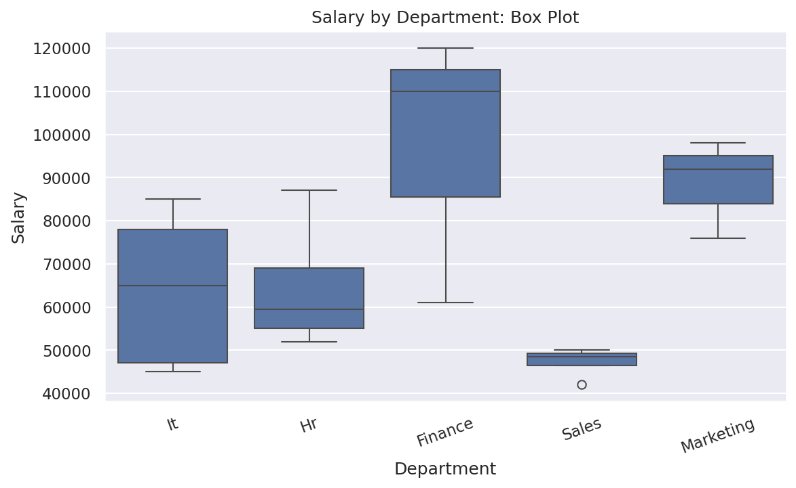
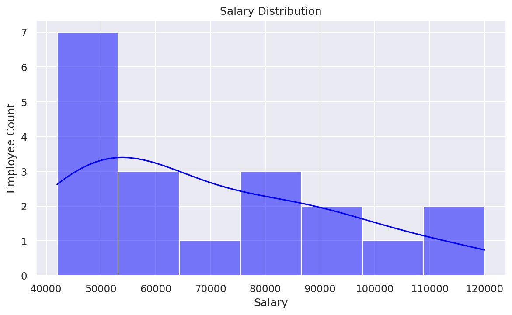
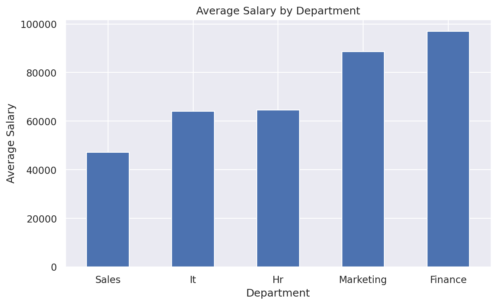
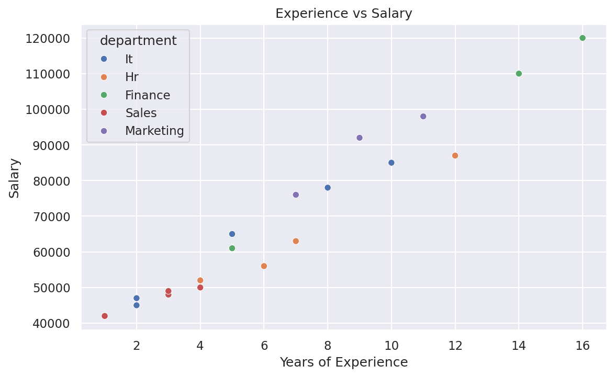
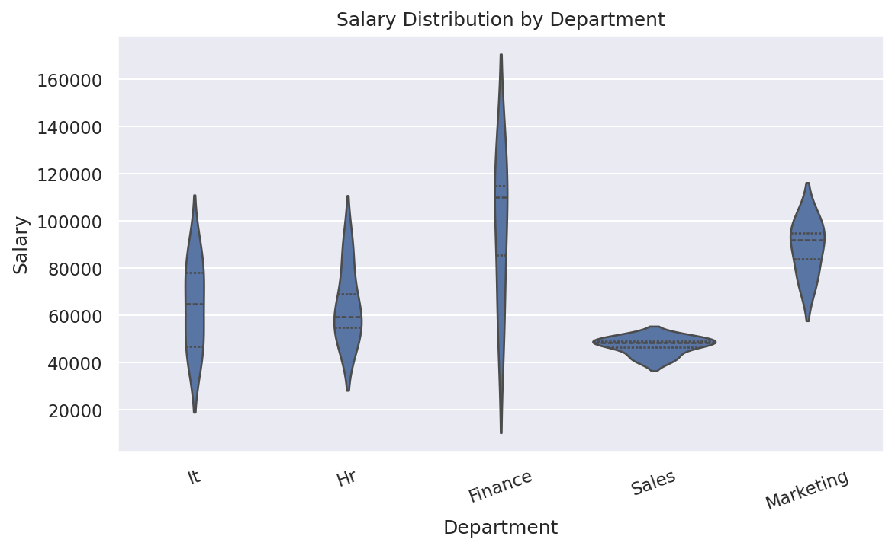
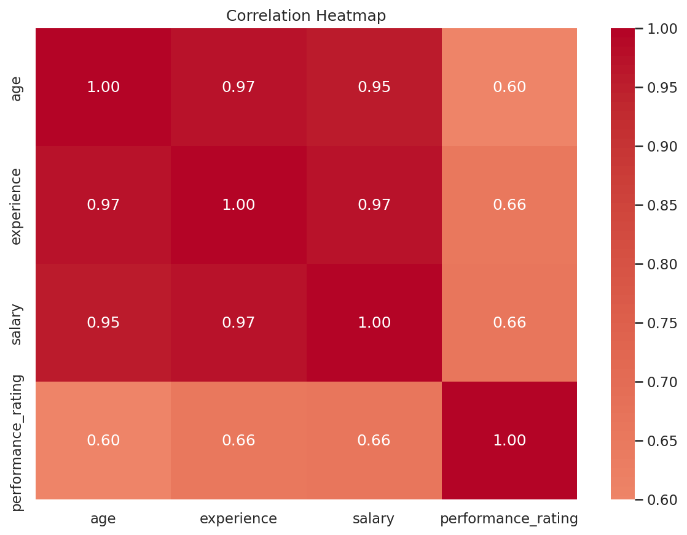
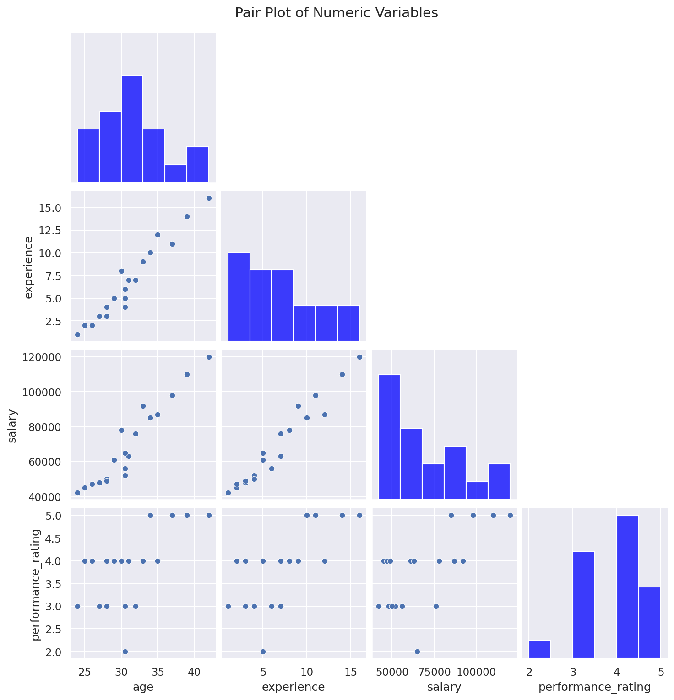
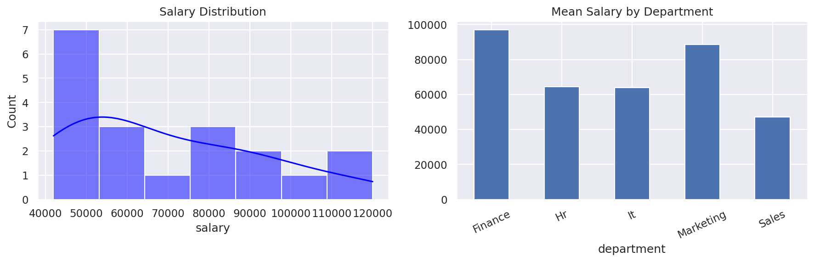

# Data Cleaning and Data Visualization

This folder provides a practical, example-driven guide to preparing messy tabular data and communicating findings with Matplotlib and Seaborn. It uses the included `employee_raw_data.csv` dataset, which intentionally contains inconsistent text, missing values, a duplicate row, and an implausible age so you can practise a realistic workflow.

> **Learning approach:** inspect first, clean deliberately, compare before and after, visualize to answer a question, and keep the original file unchanged. The sample choices are teaching examples, not universal rules for every dataset.

## Topics Covered

### Data cleaning
- Read CSV data and inspect `head()`, `tail()`, `sample()`, `shape`, `columns`, `dtypes`, `info()` and `describe()`.
- Check missing values with `isna()`, `notna()`, `isna().sum()` and missing-value percentages.
- Drop rows/columns when justified; fill numeric values with mean/median and categorical values with mode or an explicit label.
- Find and remove exact duplicates; inspect duplicates by key columns.
- Normalize column names and trim/case-normalize text.
- Use string operations and regular expressions to clean text and validate email-like strings.
- Convert numeric, date and categorical columns; handle parsing errors deliberately.
- Validate ranges and business rules; distinguish invalid values from genuine unusual values.
- Detect outliers with IQR; understand filtering versus capping/winsorization and why neither should be automatic.
- Transform features with `cut()`/`qcut()`, create date-based features and use `get_dummies()` for categorical encoding.
- Compare data quality before and after cleaning; export a separate cleaned CSV.

### Data visualization
- Matplotlib basics: figure/axes, titles, axis labels, ticks, legends, grids, annotations, limits, layout and saving figures.
- Choose a chart to answer a question rather than adding charts without a purpose.
- Histogram and KDE for distributions; bar/count plots for categories; line plots for ordered/time data; scatter plots for relationships.
- Box and violin plots for distribution comparisons and potential outliers.
- Correlation heatmaps and pair plots for numeric relationships.
- Subplots to place multiple views in one figure.
- Use color/hue and legends thoughtfully; format labels and avoid misleading scales.

## 1. Install and Import Libraries

```bash
pip install pandas numpy matplotlib seaborn jupyter
```

```python
from pathlib import Path
import pandas as pd
import numpy as np
import matplotlib.pyplot as plt
import seaborn as sns
```

## 2. Load and Inspect Data

```python
df = pd.read_csv("employee_raw_data.csv")
print(df.head())       # first five rows
print(df.shape)        # (rows, columns)
print(df.columns)      # column labels
print(df.dtypes)       # data type of each column
df.info()              # non-null counts and memory info
print(df.describe(include="all"))
```

For example, `df.head()` returns the first five records; `df.tail(3)` returns the last three. Use `df.sample(5, random_state=1)` for a reproducible random sample.

## 3. Check Data Quality Before Cleaning

```python
print("Missing values:\n", df.isna().sum())
print("Missing percentage:\n", (df.isna().mean() * 100).round(1))
print("Exact duplicates:", df.duplicated().sum())
print("Duplicate employee IDs:", df["Employee ID"].duplicated().sum())
print("Unique departments:", df["Department"].unique())
```

`duplicated()` checks full rows by default. Pass `subset=["Employee ID"]` when a particular key should be unique, then investigate collisions before deleting records.

## 4. Standardize Column Names and Text

```python
df.columns = (df.columns.str.strip().str.lower()
              .str.replace(r"[^a-z0-9]+", "_", regex=True)
              .str.strip("_"))
df["employee_name"] = df["employee_name"].astype("string").str.strip().str.title()
df["department"] = df["department"].astype("string").str.strip().str.title()
df["email"] = df["email"].astype("string").str.strip().str.lower()
```

- `str.strip()` removes leading/trailing whitespace.
- `str.lower()` and `str.title()` normalize capitalization.
- Regular expressions can replace repeated spaces or remove unwanted characters, but inspect the result so meaningful symbols are not lost.

## 5. Convert Data Types and Parse Dates

```python
df["salary"] = pd.to_numeric(df["salary"], errors="coerce")
df["age"] = pd.to_numeric(df["age"], errors="coerce")
df["join_date"] = pd.to_datetime(df["join_date"], errors="coerce")
```

`errors="coerce"` converts unparseable values to missing values. Count and inspect those newly missing values; do not silently assume conversion was successful.

## 6. Handle Missing Values

```python
# Count missing values
print(df.isna().sum())

# Numeric example: median is less affected by extreme values than mean
median_age = df["age"].median()
df["age"] = df["age"].fillna(median_age)

# Categorical example: use the most common category where justified
mode_department = df["department"].mode(dropna=True)
if not mode_department.empty:
    df["department"] = df["department"].fillna(mode_department.iloc[0])

# Alternative approaches (choose based on context):
# df.dropna(subset=["salary"])                 # remove rows missing salary
# df["department"].fillna("Unknown")          # keep missingness explicit
# df.dropna(axis=1, thresh=int(len(df) * 0.7))  # example threshold for columns
```

There is no single best strategy. Consider why a value is missing, how much is missing, and whether imputation could distort the analysis. For time series, forward/backward fill may be appropriate only when the ordering and domain support it.

## 7. Remove Duplicates Carefully

```python
print(df[df.duplicated(keep=False)])
df = df.drop_duplicates().copy()
# Key-based example: investigate first, then apply if employee_id must be unique
# df = df.drop_duplicates(subset=["employee_id"], keep="last")
```

Do not delete records solely because a name repeats: two people may share a name. Decide which columns define a duplicate for the task.

## 8. Validate Values and Clean with Regex

```python
# Basic range check; treat values outside the range as suspicious, not automatically wrong
invalid_age = ~df["age"].between(18, 65) & df["age"].notna()
print(df.loc[invalid_age, ["employee_name", "age"]])

# Basic email-format check (not proof that an email address exists)
df["email_valid"] = df["email"].str.match(
    r"^[\w.+-]+@[\w-]+\.[\w.-]+$", na=False
)
print(df.loc[~df["email_valid"], ["employee_name", "email"]])

# Replace repeated whitespace in a text column
# df["notes"] = df["notes"].str.replace(r"\s+", " ", regex=True).str.strip()
```

Use domain rules to identify impossible values (for example, negative experience). A regex check is a basic format check, not complete validation.

## 9. Detect and Treat Potential Outliers

```python
q1 = df["salary"].quantile(0.25)
q3 = df["salary"].quantile(0.75)
iqr = q3 - q1
lower = q1 - 1.5 * iqr
upper = q3 + 1.5 * iqr
outliers = df[df["salary"].lt(lower) | df["salary"].gt(upper)]
print(outliers[["employee_name", "salary"]])
```

IQR is a screening rule, not proof of an error. Investigate flagged records. Depending on the objective, keep valid extremes, correct confirmed errors, filter with justification, or cap values. Example capping (use only when justified):

```python
# df["salary_capped"] = df["salary"].clip(lower=lower, upper=upper)
```



## 10. Transform Features and Encode Categories

```python
# Turn a continuous value into labelled groups
# df["experience_band"] = pd.cut(
#     df["experience"], bins=[-1, 2, 5, 10, float("inf")],
#     labels=["0-2", "3-5", "6-10", "10+"]
# )

# One-hot encode a categorical column (creates indicator columns)
# encoded = pd.get_dummies(df, columns=["department"], dtype=int)

# Date-derived feature
# df["join_year"] = df["join_date"].dt.year
```

Fit transformations such as scaling, imputation, and encoding on training data only when building predictive models, to avoid data leakage.

## 11. Check the Cleaning Results and Save

```python
print("Shape after cleaning:", df.shape)
print("Missing values after cleaning:\n", df.isna().sum())
print("Duplicate rows after cleaning:", df.duplicated().sum())
df.to_csv("employee_cleaned_data.csv", index=False)
```

Keep raw data unchanged and save cleaned data separately. Document decisions so another person can reproduce them.

# Data Visualization

## 12. Matplotlib Figure, Axes, Labels, Legend and Grid

```python
fig, ax = plt.subplots(figsize=(8, 5))
ax.plot([1, 2, 3, 4], [10, 14, 12, 18], marker="o", label="Example")
ax.set(title="Example Trend", xlabel="Period", ylabel="Value")
ax.legend()
ax.grid(True, alpha=0.3)
ax.annotate("Peak", xy=(4, 18), xytext=(3, 16), arrowprops={"arrowstyle": "->"})
fig.tight_layout()
fig.savefig("example_trend.png", dpi=150, bbox_inches="tight")
plt.show()
```

Use `fig` for the overall figure and `ax` for one plot area. `tight_layout()` helps prevent labels from being clipped. Save at a suitable resolution for reports.

## 13. Histogram and KDE: Distribution

```python
sns.histplot(data=df, x="salary", bins=7, kde=True)
plt.title("Salary Distribution")
plt.xlabel("Salary")
plt.ylabel("Employee Count")
plt.tight_layout()
plt.show()
```



A histogram groups numeric values into bins. KDE adds a smoothed density estimate; its shape depends on bandwidth and sample size.

## 14. Bar and Count Plots: Categories

```python
avg_salary = df.groupby("department", observed=True)["salary"].mean().sort_values()
avg_salary.plot(kind="bar")
plt.title("Average Salary by Department")
plt.xlabel("Department")
plt.ylabel("Average Salary")
plt.xticks(rotation=0)
plt.tight_layout()
plt.show()

# Count of records in each department
sns.countplot(data=df, x="department")
plt.xticks(rotation=30)
plt.tight_layout()
plt.show()
```



Bar charts compare a summary across categories. Count plots show category frequency. For comparisons, include sample sizes or uncertainty when relevant.

## 15. Scatter Plot: Relationship Between Two Numeric Variables

```python
sns.scatterplot(data=df, x="experience", y="salary", hue="department")
plt.title("Experience vs Salary")
plt.xlabel("Years of Experience")
plt.ylabel("Salary")
plt.tight_layout()
plt.show()
```



Look for clusters, direction, and unusual points. Association does not establish causation; overlapping points can also hide observations.

## 16. Box Plot and Violin Plot: Compare Distributions

```python
sns.boxplot(data=df, x="department", y="salary")
plt.xticks(rotation=25)
plt.tight_layout()
plt.show()

sns.violinplot(data=df, x="department", y="salary", inner="quartile")
plt.xticks(rotation=25)
plt.tight_layout()
plt.show()
```




Box plots summarize median, quartiles and potential outliers. Violin plots show a smoothed distribution shape; they can be misleading with very small groups.

## 17. Correlation Heatmap

```python
numeric = df.select_dtypes(include="number")
corr = numeric.corr()
sns.heatmap(corr, annot=True, fmt=".2f", center=0)
plt.title("Correlation Heatmap")
plt.tight_layout()
plt.show()
```



Correlation measures association between numeric variables, often linear for Pearson correlation. It does not imply causation, and missing values/sample size can affect the result.

## 18. Pair Plot

```python
sns.pairplot(df[["age", "experience", "salary", "performance_rating"]], corner=True)
plt.show()
```



Pair plots combine pairwise scatter plots and single-variable distributions. They are most useful for a manageable number of numeric columns.

## 19. Multiple Plots with Subplots

```python
fig, axes = plt.subplots(1, 2, figsize=(12, 4))
sns.histplot(df["salary"], bins=7, kde=True, ax=axes[0])
axes[0].set_title("Salary Distribution")
df.groupby("department", observed=True)["salary"].mean().plot(kind="bar", ax=axes[1])
axes[1].set_title("Mean Salary by Department")
axes[1].tick_params(axis="x", rotation=30)
fig.tight_layout()
plt.show()
```



Subplots make it easier to compare complementary views in one figure. Keep scales and labels clear, and avoid overcrowding.

## 20. Choose a Chart for the Question

| Question | Common chart | Useful for |
|---|---|---|
| How is a numeric variable distributed? | Histogram, KDE | Shape, skew and concentration |
| How do categories compare? | Bar chart | Counts or summary values |
| How do two numeric variables relate? | Scatter plot | Clusters and association |
| How do groups' distributions differ? | Box/violin plot | Median, spread and shape |
| Which numeric variables move together? | Correlation heatmap | Quick correlation overview |
| How do several numeric variables pair up? | Pair plot | Exploratory relationships |
| How does a measure change over time? | Line plot | Ordered/time trends |

## Practical Checklist

- [ ] Inspect data before changing it.
- [ ] Check missing values, duplicates, data types, ranges and category spelling.
- [ ] Choose cleaning methods based on context and document assumptions.
- [ ] Compare quality checks before and after cleaning.
- [ ] Keep raw and cleaned files separate.
- [ ] Give every chart a clear question, title and labelled axes.
- [ ] Use legends and color consistently; don't rely on color alone.
- [ ] Avoid misleading axes and unnecessary 3D effects.
- [ ] Do not treat outliers as errors automatically or correlation as causation.
