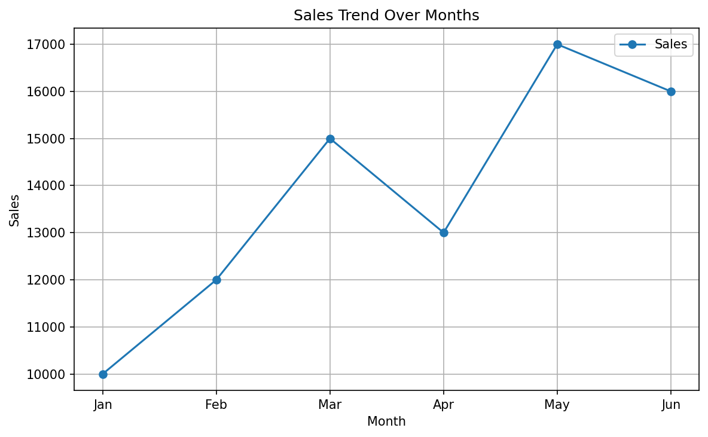
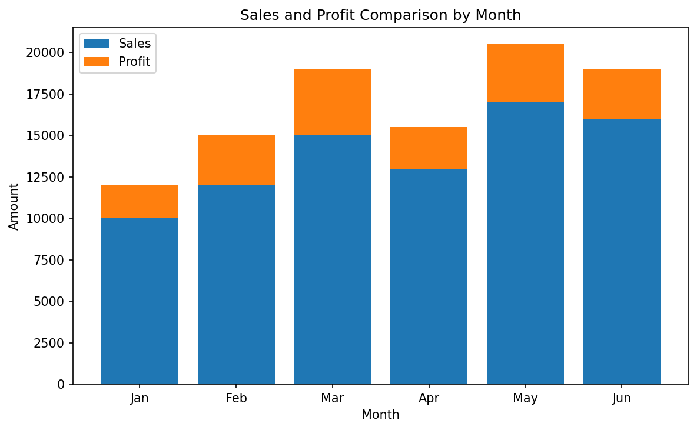
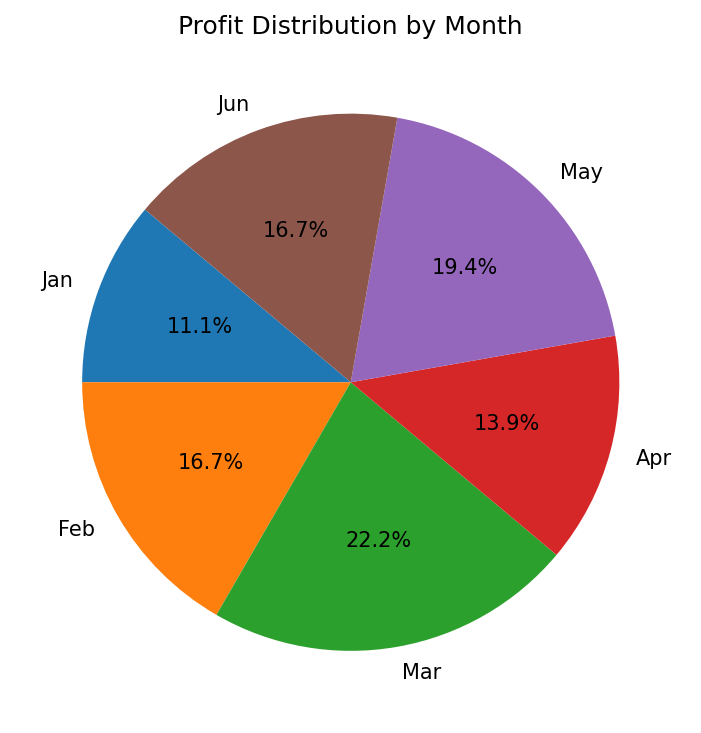
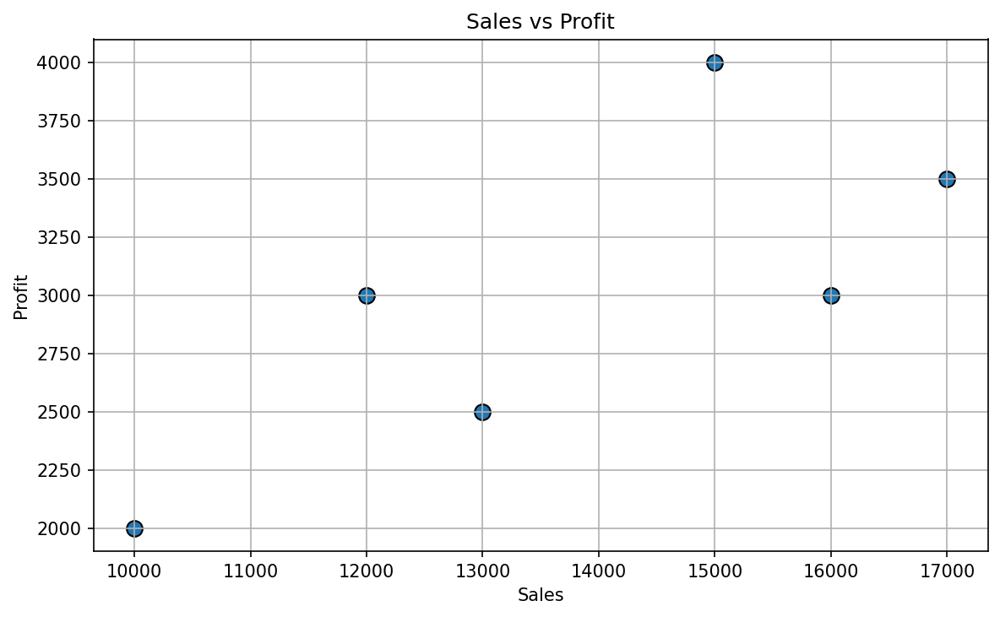
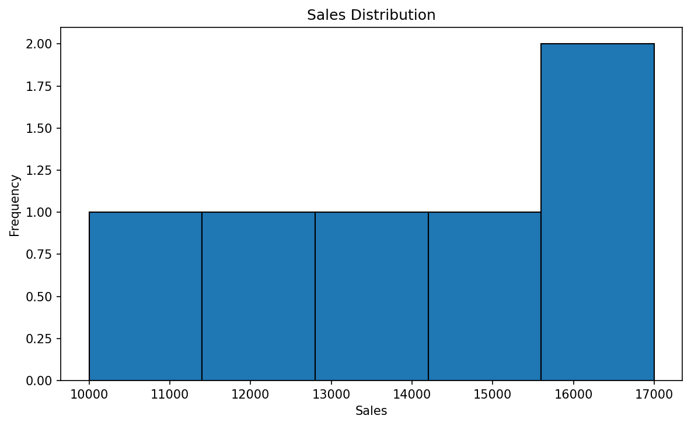
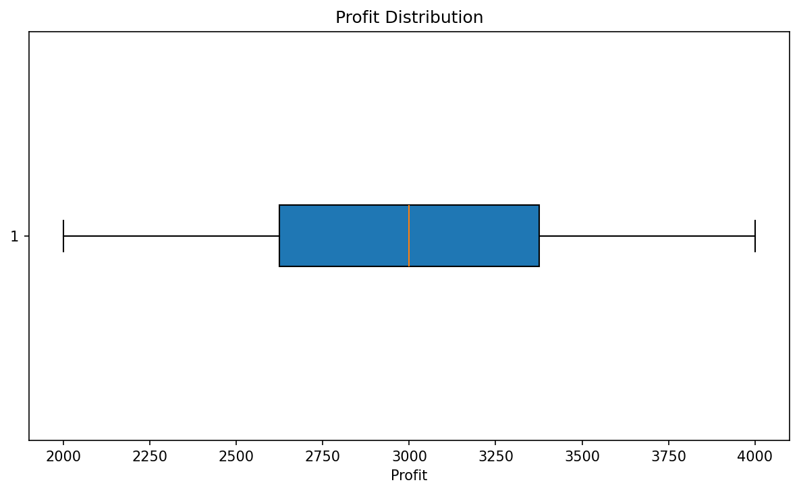

# Gradio

Gradio is a Python library that helps you turn a Python function into an interactive web interface. Instead of building the frontend manually with HTML, CSS, and JavaScript, you can define the function, choose input and output components, and launch a usable interface with a few lines of Python.

In this folder, we build a **Sales & Profit Visual Explorer**. A user chooses a chart type, and Gradio calls a Python function that creates the selected Matplotlib chart and displays it in the browser.

## Folder Structure

```text
05_Gradio/
├── images/
│   ├── line_plot.png
│   ├── stacked_bar_chart.png
│   ├── pie_chart.png
│   ├── scatter_plot.png
│   ├── histogram.png
│   └── box_plot.png
├── Gradio.ipynb
├── gradio_app.py
└── README.md
```

- `Gradio.ipynb` — learn the concepts step by step in Jupyter Notebook.
- `gradio_app.py` — run the complete interactive app.
- `images/` — saved output images for the six visualizations.
- `README.md` — explanations, examples, setup, and outputs.

## 1. What Is Gradio?

**Gradio** is an open-source Python library for creating user interfaces around Python functions. It is useful for sharing and demonstrating:

- Machine learning models
- Data analysis and visualizations
- Image and text processing functions
- Small Python tools and calculators
- AI demos and prototypes

### Why use Gradio?

1. **Python-first:** Build an interface mostly using Python.
2. **Inputs:** Add text boxes, radio buttons, dropdowns, sliders, checkboxes, and file uploads.
3. **Outputs:** Display text, labels, tables, images, audio, video, plots, and other supported results.
4. **Fast prototyping:** Turn an existing Python function into a small web app without writing a complete frontend.
5. **Easy demonstrations:** Run the app locally and, when needed, configure a share link through Gradio's supported options.

Gradio creates the interface; it does not replace the data-processing or plotting libraries. In this project, Pandas stores the data, Matplotlib draws the charts, and Gradio connects the user's selection to the chart-generating function.

## 2. How a Gradio App Works

The general flow is:

1. **Input component:** The user selects an option in the browser.
2. **Python function:** Gradio passes the selected value to the function.
3. **Processing:** The function uses Python, Pandas, Matplotlib, or another library to produce a result.
4. **Output component:** Gradio displays the returned result in the browser.

For this project:

```text
User selects a chart
        ↓
gr.Radio sends the selected chart type
        ↓
generate_plot(plot_type) creates a Matplotlib figure
        ↓
gr.Plot displays the figure in the interface
```

## 3. Install the Required Libraries

Run this in the VS Code terminal:

```bash
python -m pip install gradio pandas matplotlib
```

Or run this in a Jupyter Notebook cell:

```python
%pip install gradio pandas matplotlib
```

What each library does:

- `gradio` — creates the web interface.
- `pandas` — stores and organises the sample data.
- `matplotlib` — creates the visualizations.

Do not write `pip install gradio` as a normal statement inside a `.py` file. Run installation commands in the terminal, or use `%pip` in a notebook.

## 4. Prepare the Sample Data

```python
import pandas as pd

data = {
    "Month": ["Jan", "Feb", "Mar", "Apr", "May", "Jun"],
    "Sales": [10000, 12000, 15000, 13000, 17000, 16000],
    "Profit": [2000, 3000, 4000, 2500, 3500, 3000],
}

df = pd.DataFrame(data)
print(df)
```

### Output

| Month | Sales | Profit |
|---|---:|---:|
| Jan | 10000 | 2000 |
| Feb | 12000 | 3000 |
| Mar | 15000 | 4000 |
| Apr | 13000 | 2500 |
| May | 17000 | 3500 |
| Jun | 16000 | 3000 |

This is example data created for learning; it is not a real business dataset.

## 5. The Main Gradio Concepts

### `gr.Interface()`

`gr.Interface()` connects a Python function to an interface. You normally provide:

- `fn` — the function Gradio should call.
- `inputs` — the component or components that collect input.
- `outputs` — the component or components that display the result.
- `title` — the heading shown in the app.
- `description` — short information shown below the heading.

Example:

```python
import gradio as gr

def greet(name):
    return "Hello, " + name + "!"

demo = gr.Interface(
    fn=greet,
    inputs=gr.Textbox(label="Your name"),
    outputs=gr.Textbox(label="Greeting"),
    title="Greeting App",
)

demo.launch()
```

**What happens?** The user enters a name, Gradio calls `greet(name)`, and the returned greeting appears in the output box.

### `gr.Radio()`

A radio component lets the user select one option from a list. Our project uses it to select the chart:

```python
gr.Radio(
    ["Line Plot", "Stacked Bar Chart", "Pie Chart"],
    label="Choose Plot Type",
    value="Line Plot",
)
```

- The list contains the available options.
- `label` describes the control.
- `value` sets the initial selection.

### `gr.Plot()`

`gr.Plot()` is an output component for plotting libraries such as Matplotlib. In our app, the function returns a Matplotlib figure and Gradio renders it.

```python
outputs=gr.Plot(label="Visualization")
```

### `demo.launch()`

`launch()` starts the Gradio app. When run locally, Gradio prints a local URL in the terminal. Open that URL in a browser to use the interface.

In the Python script, we use:

```python
if __name__ == "__main__":
    demo.launch()
```

This means the app launches when the script is run directly, but does not automatically launch just because another Python file imports it.

## 6. Visualizations and Their Outputs

The app has six chart options. These images are saved in the `images/` folder so you can preview the expected visual output without launching the app.

### 6.1 Line Plot

A line plot shows how a value changes across an ordered sequence. Here it shows monthly sales.



**How to read it:** Each marker represents a month's sales. The line connects the months so the trend is easier to see.

### 6.2 Stacked Bar Chart

A stacked bar chart places one bar series on top of another. In this example, Profit is drawn above Sales.



**How to read it:** Each month has a bar for Sales with Profit stacked on top. The full height represents Sales plus Profit in this chart design.

### 6.3 Pie Chart

A pie chart shows each month's profit as a share of total profit.



**How to read it:** Each slice represents a month. The percentage label shows that month's share of the combined profit values.

### 6.4 Scatter Plot

A scatter plot shows the relationship between two numerical variables.



**How to read it:** Each point represents one month. Sales are on the horizontal axis and Profit is on the vertical axis. This small sample can show the pattern of the supplied values, but it is not enough to establish a reliable general relationship.

### 6.5 Histogram

A histogram groups numerical values into ranges, called bins.



**How to read it:** The horizontal axis represents sales ranges and the vertical axis shows how many values fall into each range.

### 6.6 Box Plot

A box plot summarises the distribution of numerical values.



**How to read it:** The box and whiskers summarise the spread of the profit values. The line inside the box marks the median.

## 7. Understand the `generate_plot()` Function

The app's function receives the selected chart name:

```python
def generate_plot(plot_type):
    fig, ax = plt.subplots(figsize=(8, 5))

    if plot_type == "Line Plot":
        ax.plot(df["Month"], df["Sales"], marker="o", label="Sales")
        ax.set_title("Sales Trend Over Months")
        ax.set_xlabel("Month")
        ax.set_ylabel("Sales")
        ax.grid(True)
        ax.legend()

    # Additional elif branches create the other charts.

    fig.tight_layout()
    return fig
```

- `plot_type` receives the value selected by the user.
- `plt.subplots()` creates a figure and an axes object.
- `if` and `elif` choose which chart to draw.
- `ax.plot()`, `ax.bar()`, `ax.pie()`, and other Matplotlib methods draw the chart.
- `fig.tight_layout()` adjusts spacing.
- `return fig` sends the figure back to Gradio.

**Important:** The example above shows the line-plot branch and a placeholder comment. The complete implementation with all six chart types is in `gradio_app.py` and in the notebook.

## 8. Connect the Function to Gradio

The main interface looks like this:

```python
demo = gr.Interface(
    fn=generate_plot,
    inputs=gr.Radio(
        [
            "Line Plot",
            "Stacked Bar Chart",
            "Pie Chart",
            "Scatter Plot",
            "Histogram",
            "Box Plot",
        ],
        label="Choose Plot Type",
        value="Line Plot",
    ),
    outputs=gr.Plot(label="Visualization"),
    title="Sales & Profit Visual Explorer",
    description="Choose a chart type to visualize the sample monthly sales and profit data.",
)

demo.launch()
```

- `fn=generate_plot` tells Gradio which function to run.
- `inputs=gr.Radio(...)` gives the user six chart options.
- `outputs=gr.Plot(...)` displays the returned chart.
- `title` and `description` explain the app.
- `demo.launch()` starts the interface.

## 9. Run the Application

Open a terminal in the `05_Gradio` folder and run:

```bash
python -m pip install gradio pandas matplotlib
python gradio_app.py
```

Then:

1. Wait for Gradio to print the local URL in the terminal.
2. Open that URL in your browser.
3. Select a chart from **Choose Plot Type**.
4. View the chart in the **Visualization** output area.
5. Choose another chart to update the output.

The app's output is interactive: the saved PNG files are previews, while the running Gradio app lets you change the selected chart.

## 10. Points to Remember

- Gradio creates the user interface around a Python function.
- `gr.Interface()` connects the function, inputs, and outputs.
- `gr.Radio()` lets the user choose one item from a set of options.
- `gr.Plot()` displays a returned Matplotlib figure.
- `demo.launch()` starts the app.
- Pandas and Matplotlib do the data handling and chart creation; Gradio connects them to the browser.
- The images in `images/` are static previews. Use `python gradio_app.py` for the interactive app.
- The sales and profit values in this folder are sample data.
