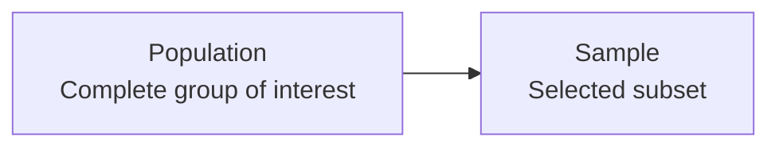

# 01 — Statistics Fundamentals

Statistics is the foundation for understanding data. Before applying machine learning algorithms or performing advanced data analysis, it is important to understand what the data represents, how it was collected, how it should be measured, and how conclusions can be drawn from it.

This chapter develops these foundations step by step. The emphasis is on concepts that are directly useful when working with datasets, analysing variables, preparing data, selecting samples, and interpreting statistical results.

---

## 1. Introduction to Statistics

Statistics is the study of **collecting, organising, summarising, analysing, interpreting, and communicating data**.

In a typical data problem, the raw observations are usually not immediately useful. We first need to understand what each observation represents, what type of variable is being measured, whether the observations are reliable, and whether the available data represents the population we want to study.

Statistics provides a systematic way to answer questions such as:

- What does the data look like?
- How much variation is present?
- Is a sample representative of a population?
- How can a population be studied when observing every member is impractical?
- Are two variables related?
- Can a conclusion about a population be made from a sample?
- How much uncertainty is present in a statistical conclusion?

Statistics can be broadly divided into two major areas:

### Descriptive Statistics

Descriptive statistics summarises the data that has already been observed.

Examples include:

- Mean
- Median
- Mode
- Range
- Variance
- Standard deviation
- Frequency distributions
- Graphs and tables

### Inferential Statistics

Inferential statistics uses information from a sample to make conclusions about a larger population.

For example, suppose a university has 20,000 students and we survey 500 students about their average daily study time. We may use the sample to estimate the study behaviour of the entire student population.

The distinction is important:

> **Descriptive statistics describes the observed data, while inferential statistics uses observed data to learn about a larger population.**

---

## 2. Data and Observations

### 2.1 What is Data?

**Data** is a collection of facts, measurements, values, observations, or records collected for a particular purpose.

Examples:

| Student | Age | Study Hours | Branch |
|---|---:|---:|---|
| A | 20 | 3.5 | CSE |
| B | 21 | 5.0 | CSE |
| C | 20 | 2.0 | ECE |
| D | 22 | 4.5 | CSE |

Here:

- Age is a variable.
- Study Hours is a variable.
- Branch is a variable.
- Each student's recorded values form an observation.

### 2.2 Observation

An **observation** is one recorded instance in a dataset.

If a dataset contains 1,000 students, it generally contains 1,000 observations, where each observation represents one student.

In a tabular dataset:

- Rows commonly represent observations.
- Columns commonly represent variables or features.

For example:

```
          Age    Height    Weight
Row 1      20      170       60
Row 2      21      165       55
Row 3      19      172       64
```

There are three observations and three variables.

---

## 3. Population and Sample

One of the most important ideas in statistics is the distinction between a **population** and a **sample**.

### 3.1 Population

A **population** is the complete set of individuals, objects, events, or measurements that we are interested in studying.

For example:

- All students in a university
- All customers of a company
- All houses in a city
- All transactions made by a bank during a year

The population does not necessarily mean people. It means the complete group relevant to the statistical question.

### 3.2 Sample

A **sample** is a subset of the population selected for analysis.

Suppose a university has 20,000 students, but we collect information from 500 students.

Then:

- Population = 20,000 students
- Sample = 500 selected students

### 3.3 Why Use a Sample?

Studying the complete population may be:

- Expensive
- Time-consuming
- Logistically difficult
- Sometimes impossible

Sampling allows us to study a manageable portion of the population.

The quality of the sample matters greatly. A large sample is not automatically a good sample. If the sampling method systematically excludes important parts of the population, the resulting conclusions can still be misleading.

### Population and Sample Diagram

The **population** is the complete group being studied. A **sample** is a smaller subset selected from that population.



For example, if a university has 20,000 students and information is collected from 500 selected students:

- **Population = 20,000 students**
- **Sample = 500 selected students**
- The 500 students are part of the 20,000-student population.

The important relationship is:

**Sample ⊂ Population**


---

## 4. Parameter and Statistic

A **parameter** is a numerical value describing a population.

A **statistic** is a numerical value calculated from a sample.

For example, suppose we want to know the average height of all students in a university.

- Average height of all students = population parameter
- Average height of selected students = sample statistic

Common notation is:

| Quantity | Population | Sample |
|---|---|---|
| Mean | $\mu$ | $\bar{x}$ |
| Standard deviation | $\sigma$ | $s$ |
| Variance | $\sigma^2$ | $s^2$ |
| Size | $N$ | $n$ |

The distinction becomes especially important in inferential statistics because sample statistics are often used to estimate unknown population parameters.

---

## 5. Statistical Inference — Basic Idea

**Statistical inference** is the process of using sample information to draw conclusions about a population.

Consider a company with 100,000 customers. It may be impractical to ask every customer whether they are satisfied with a product.

Instead, the company can select a sample of customers and calculate the percentage who are satisfied.

The sample result can then be used to learn about the larger population.

A simple inference process is:

```
Population
    ↓
Select Sample
    ↓
Collect Data
    ↓
Calculate Sample Statistics
    ↓
Make Inference
    ↓
Draw Conclusion About Population
```

Statistical inference is built on the idea that a properly selected sample can provide useful information about a larger population.

However, every inference contains uncertainty. The sample is only one possible subset of the population, so its results may differ from the true population values.

---

## 6. Types of Data

Understanding the type of data is essential because different statistical methods are appropriate for different types of variables.

Data can first be classified as **qualitative** or **quantitative**.

### 6.1 Qualitative Data

Qualitative data describes categories or qualities rather than numerical measurements.

Examples:

- Gender
- Blood group
- Department
- Product category
- Payment method

For example:

```
Payment Method
----------------
Cash
UPI
Card
Cash
UPI
```

These values represent categories.

Although categories may sometimes be represented using numbers such as `1`, `2`, and `3`, the numbers themselves do not necessarily represent measurable quantities.

### 6.2 Quantitative Data

Quantitative data represents numerical quantities that can be measured or counted.

Examples:

- Age
- Height
- Weight
- Salary
- Number of purchases
- Number of website visits

Quantitative data is commonly divided into **discrete** and **continuous** data.

---

## 7. Discrete and Continuous Data

### 7.1 Discrete Data

Discrete data consists of countable values.

Examples:

- Number of students
- Number of products sold
- Number of defects
- Number of calls received

For example, the number of products sold could be:

```
0, 1, 2, 3, 4, 5, ...
```

We normally do not say that a shop sold `3.7` complete products.

### 7.2 Continuous Data

Continuous data can take any value within a range.

Examples:

- Height
- Weight
- Temperature
- Time
- Distance

For example, a person's height could be:

```
170 cm
170.2 cm
170.25 cm
170.253 cm
```

The exact recorded precision depends on the measuring instrument.

### Comparison

| Property | Discrete | Continuous |
|---|---|---|
| Nature | Countable | Measurable |
| Values | Separate values | Any value in an interval |
| Example | Number of customers | Customer waiting time |
| Common operation | Counting | Measurement |

---

## 8. Levels of Measurement

The **level of measurement** describes the mathematical properties of the values stored in a variable.

There are four commonly used levels:

1. Nominal
2. Ordinal
3. Interval
4. Ratio


### 8.1 Nominal Scale

Nominal data represents categories without a natural order.

Examples:

- Blood group
- City
- Department
- Browser type
- Product category

For example:

```
Blood Group:
A
B
AB
O
```

There is no meaningful ranking such as:

```
A > B > AB > O
```

The categories are simply different.

### 8.2 Ordinal Scale

Ordinal data contains categories that have a meaningful order or ranking.

Examples:

- Satisfaction level
- Education level
- Risk category
- Competition position

For example:

```
Poor < Average < Good < Excellent
```

The order is meaningful, but the difference between adjacent categories is not necessarily equal.

For example, the difference between "Poor" and "Average" cannot automatically be assumed to be the same as the difference between "Good" and "Excellent".

### 8.3 Interval Scale

Interval data has ordered values with meaningful and equal differences, but it does not have a true zero.

A common example is temperature measured in Celsius.

For example:

```
10°C → 20°C → 30°C
```

The difference between 10°C and 20°C is the same size as the difference between 20°C and 30°C.

However, 0°C does not mean the complete absence of temperature.

Therefore, saying that 20°C is twice as hot as 10°C is not a meaningful ratio interpretation.

### 8.4 Ratio Scale

Ratio data has:

- Meaningful order
- Equal intervals
- A meaningful zero

Examples:

- Weight
- Height
- Age
- Distance
- Income
- Time duration

For example, 20 kg is twice 10 kg because zero kilograms represents the absence of mass.

### Summary

| Scale | Order | Equal Differences | True Zero |
|---|---|---|---|
| Nominal | No | No | No |
| Ordinal | Yes | Not necessarily | No |
| Interval | Yes | Yes | No |
| Ratio | Yes | Yes | Yes |

---

## 9. Independent and Dependent Variables

A **variable** is a characteristic that can take different values across observations.

In many statistical studies, variables are described according to their roles.

### Independent Variable

The **independent variable** is the variable that is changed, controlled, or used as a predictor.

### Dependent Variable

The **dependent variable** is the outcome or response that is measured.

For example, suppose we study whether study time affects exam score.

- Study hours → independent variable
- Exam score → dependent variable

The idea can be represented as:

```
Study Hours
     ↓
Exam Score
```

In predictive modelling, predictor variables are often used to estimate an outcome variable. The statistical distinction should not automatically be interpreted as proof that one variable causes the other; causation depends on the study design and evidence.

---

## 10. Types of Data Based on Structure

Data can also be classified according to how it is stored and organised.

### 10.1 Structured Data

Structured data follows a defined format, commonly rows and columns.

Example:

| ID | Age | Salary |
|---|---:|---:|
| 101 | 24 | 35000 |
| 102 | 26 | 42000 |
| 103 | 23 | 30000 |

Relational database tables and CSV files are common examples.

### 10.2 Semi-Structured Data

Semi-structured data does not follow a strict table structure but contains organisational information such as keys, tags, or metadata.

Examples:

- JSON
- XML
- HTML

Example JSON:

```json
{
  "name": "Aman",
  "age": 22,
  "city": "Lucknow"
}
```

### 10.3 Unstructured Data

Unstructured data does not follow a predefined tabular structure.

Examples:

- Images
- Audio
- Video
- Free-form text
- Documents

The distinction is useful because the method used to store, clean, process, and analyse data depends partly on its structure.

---

## 11. Primary and Secondary Data

### 11.1 Primary Data

**Primary data** is collected directly by the researcher or organisation for the current study.

Examples:

- Conducting a survey
- Performing an experiment
- Interviewing customers
- Recording measurements

### 11.2 Secondary Data

**Secondary data** has already been collected by another person, organisation, or system and is reused for a different analysis.

Examples:

- Government datasets
- Public research datasets
- Company reports
- Historical records
- Existing databases

### Comparison

| Primary Data | Secondary Data |
|---|---|
| Collected directly | Already available |
| Designed for the current purpose | Originally collected for another purpose |
| Greater control over collection | Less control over original collection |
| Can be expensive to collect | Often faster and cheaper to obtain |

Before using secondary data, it is important to understand its source, collection method, definitions, missing values, and limitations.

---

## 12. Methods of Data Collection

The method used to collect data affects its quality and the conclusions that can be drawn from it.

### 12.1 Surveys

A survey collects information by asking respondents questions.

Examples:

- Customer satisfaction survey
- Student feedback form
- Market research questionnaire

Important considerations include:

- Clear questions
- Appropriate response options
- Avoiding leading questions
- Selecting an appropriate sample
- Handling non-response

### 12.2 Interviews

Interviews involve directly asking participants questions.

They can provide detailed information but may require more time and resources.

### 12.3 Observation

In an observational study, researchers record behaviour or measurements without assigning an intervention.

For example, a company might observe customer movement inside a store.

### 12.4 Experiments

An experiment involves deliberately changing one or more conditions and observing the resulting outcome.

Experiments can be useful when studying cause-and-effect relationships because the researcher has greater control over the conditions.

### 12.5 Existing Records and Databases

Data may also be collected automatically from systems such as:

- Transaction databases
- Application logs
- Sensors
- Websites
- Enterprise software

The collection method should always be considered when evaluating the quality and meaning of the resulting dataset.

---

## 13. Sampling

**Sampling** is the process of selecting a subset of observations from a population.

A sampling method should be selected according to the research question, population structure, available resources, and desired level of representativeness.


### 13.1 Simple Random Sampling

In simple random sampling, each population member has an equal or known chance of being selected, depending on the sampling design.

Suppose a university has 10,000 students and we randomly select 500 students.

The selected 500 students form the sample.

The main advantage is that the selection process is straightforward and reduces some forms of selection bias when implemented properly.

### 13.2 Systematic Sampling

Systematic sampling selects observations at regular intervals after an appropriate starting point.

Suppose a list contains 10,000 customers and we need a sample of 1,000 customers.

The sampling interval can be calculated as:

$$
k = \frac{N}{n}
$$

where:

- $N$ = population size
- $n$ = required sample size
- $k$ = sampling interval

Substituting:

$$
k = \frac{10000}{1000} = 10
$$

Therefore, after choosing a suitable random starting point, every 10th customer can be selected.

### 13.3 Stratified Sampling

In stratified sampling, the population is divided into meaningful groups called **strata**, and samples are selected from each group.

Suppose a university contains:

- 60% CSE students
- 25% ECE students
- 15% Mechanical students

A stratified sample can preserve these proportions.

If the total sample size is 1,000:

$$
n_{CSE} = 1000 \times 0.60 = 600
$$

$$
n_{ECE} = 1000 \times 0.25 = 250
$$

$$
n_{Mechanical} = 1000 \times 0.15 = 150
$$

Thus:

$$
\boxed{600 + 250 + 150 = 1000}
$$

Stratification is useful when important subgroups need appropriate representation.

### 13.4 Cluster Sampling

In cluster sampling, the population is divided into clusters, and entire clusters or groups are selected.

For example, instead of selecting individual students from every college in a city, a researcher might randomly select several colleges and survey students within the selected colleges.

Cluster sampling can reduce collection cost when population members are geographically or organisationally grouped.

### 13.5 Convenience Sampling

Convenience sampling selects observations that are easy to access.

Examples:

- Asking friends to complete a survey
- Surveying people in one easily accessible location
- Using only volunteers who respond to an online post

It is easy and inexpensive, but it can introduce substantial selection bias because the sample may not represent the population.

### Sampling Methods Comparison

| Method | Basic Idea | Main Advantage | Main Limitation |
|---|---|---|---|
| Simple Random | Randomly select individuals | Simple and transparent | Requires a suitable sampling frame |
| Systematic | Select every $k$th observation | Easy to implement | Periodic patterns can cause problems |
| Stratified | Sample from important subgroups | Good subgroup representation | Requires information about strata |
| Cluster | Select groups or clusters | Can reduce cost | Clusters may be internally similar |
| Convenience | Select easily available observations | Fast and inexpensive | High risk of bias |

---

## 14. Sampling Bias

**Sampling bias** occurs when the sampling process systematically produces a sample that does not adequately represent the target population.

Consider a survey about student satisfaction that is conducted only among students who voluntarily visit a particular student club.

Students who do not visit that club have no opportunity to participate. If club members have systematically different experiences, the sample may not represent the entire student population.

Common sources include:

- Convenience sampling
- Undercoverage
- Voluntary response
- Non-response
- Poorly designed sampling frames

Sampling bias is particularly dangerous because increasing the sample size does not necessarily remove systematic bias.

A very large biased sample can still produce a biased estimate.

---

## 15. Sampling Error

Even when sampling is performed correctly, a sample may not exactly match the population.

This difference is called **sampling error**.

Suppose the true population mean is:

$$
\mu = 50
$$

and a sample produces:

$$
\bar{x} = 48
$$

The difference is:

$$
\bar{x} - \mu = 48 - 50 = -2
$$

So the sample mean differs from the population mean by 2 units.

Sampling error is a consequence of using a sample rather than observing the entire population.

It is different from sampling bias:

- **Sampling error** is random variation caused by selecting a sample.
- **Sampling bias** is systematic distortion caused by the sampling process.

---

## 16. Non-Sampling Errors

Not all errors come from sampling.

**Non-sampling errors** can occur during data collection, recording, processing, or reporting.

Examples include:

### Measurement Error

The measured value differs from the true value because of an inaccurate instrument or measurement procedure.

### Response Error

A participant provides an incorrect answer.

### Non-Response Error

Selected participants do not respond, and those who respond differ systematically from those who do not.

### Data Entry Error

A value is incorrectly entered into a database.

For example:

```
Correct age: 21
Entered age: 211
```

### Processing Error

Errors occur during data transformation, aggregation, or computation.

These errors can affect both descriptive and inferential results.

---

## 17. Observational Study vs Experiment

An **observational study** observes variables without assigning a treatment or intervention.

An **experiment** deliberately assigns a treatment or changes a condition and measures the outcome.

### Example

Suppose we want to study whether a new teaching method improves examination performance.

#### Observational approach

We observe students who naturally use different study methods and compare their scores.

#### Experimental approach

We assign students to groups and provide one group with the new teaching method.

The second design provides greater control over the treatment assignment.

### Comparison

| Observational Study | Experiment |
|---|---|
| Observe existing conditions | Assign or control conditions |
| No researcher-assigned treatment | Researcher assigns treatment/intervention |
| Often easier to conduct | Often more controlled |
| Causal conclusions can be difficult | Better suited to causal investigation when properly designed |

A statistical association observed in an observational study should not automatically be interpreted as causation.

---

## 18. Frequency

**Frequency** tells us how many times a value or category occurs.

Suppose the following are examination scores:

```
10, 20, 20, 30, 20, 40, 30, 20
```

The frequency of 20 is 4 because it occurs four times.

We can represent the frequencies as:

| Score | Frequency |
|---:|---:|
| 10 | 1 |
| 20 | 4 |
| 30 | 2 |
| 40 | 1 |

The total frequency is:

$$
1 + 4 + 2 + 1 = 8
$$

which equals the number of observations.

---

## 19. Frequency Distribution

A **frequency distribution** organises observations according to their values or intervals and records how frequently they occur.

For larger datasets, individual values may be grouped into intervals.

Example:

| Score Interval | Frequency |
|---|---:|
| 0–10 | 3 |
| 11–20 | 7 |
| 21–30 | 12 |
| 31–40 | 8 |

The frequency distribution makes the overall pattern of the data easier to inspect.

### Relative Frequency

Relative frequency expresses a frequency as a proportion of the total number of observations.

If:

- Frequency = $f$
- Total observations = $n$

then:

$$
R = \frac{f}{n}
$$

If a category occurs 20 times in 100 observations:

$$
R = \frac{20}{100} = 0.20
$$

As a percentage:

$$
0.20 \times 100 = 20\%
$$

Therefore, the category represents **20% of the observations**.

---

## 20. Statistical Notation

Statistical notation provides a compact language for describing data and calculations.

Suppose the observations are:

$$
x_1, x_2, x_3, \ldots, x_n
$$

where:

- $x_i$ represents the $i$th observation.
- $n$ represents the number of observations.

### Summation Notation

The symbol $\sum$ represents addition.

For example:

$$
\sum_{i=1}^{n} x_i
$$

means:

$$
x_1 + x_2 + x_3 + \cdots + x_n
$$

If the observations are:

```
10, 20, 30
```

then:

$$
\sum_{i=1}^{3}x_i = 10 + 20 + 30 = 60
$$

### Mean Notation

The sample mean is written as:

$$
\bar{x} = \frac{\sum_{i=1}^{n}x_i}{n}
$$

The population mean is written as:

$$
\mu = \frac{\sum_{i=1}^{N}x_i}{N}
$$

The difference in notation reminds us whether we are describing a sample or the entire population.

---

## 21. Basic Statistical Calculations

### 21.1 Arithmetic Mean

The arithmetic mean is obtained by adding all observations and dividing by the number of observations.

For the sample:

$$
\bar{x} = \frac{\sum_{i=1}^{n}x_i}{n}
$$

### Worked Example

Consider:

```
10, 20, 30, 40, 50
```

Step 1: Add the values.

$$
10 + 20 + 30 + 40 + 50 = 150
$$

Step 2: Count the observations.

$$
n = 5
$$

Step 3: Apply the formula.

$$
\bar{x} = \frac{150}{5}
$$

Therefore:

$$
\boxed{\bar{x} = 30}
$$

The average value is **30**.

---

### 21.2 Weighted Mean

Sometimes different observations have different importance or weights.

The weighted mean is:

$$
\bar{x}_w = \frac{\sum_{i=1}^{n}w_i x_i}{\sum_{i=1}^{n}w_i}
$$

where:

- $x_i$ = observation
- $w_i$ = weight assigned to the observation

#### Worked Example

Suppose three components have scores and weights:

| Component | Score | Weight |
|---|---:|---:|
| Assignment | 80 | 2 |
| Midterm | 70 | 3 |
| Final | 90 | 5 |

First calculate weighted scores:

$$
80(2)=160
$$

$$
70(3)=210
$$

$$
90(5)=450
$$

Then:

$$
\sum w_i x_i = 160 + 210 + 450 = 820
$$

and:

$$
\sum w_i = 2 + 3 + 5 = 10
$$

Therefore:

$$
\bar{x}_w = \frac{820}{10}
$$

$$
\boxed{\bar{x}_w = 82}
$$

---

### 21.3 Range

The **range** is the difference between the largest and smallest observations.

$$
R = x_{\max} - x_{\min}
$$

For:

```
12, 15, 20, 27, 30
```

we have:

$$
x_{\max}=30
$$

$$
x_{\min}=12
$$

Therefore:

$$
R = 30 - 12 = 18
$$

$$
\boxed{R=18}
$$

The range gives a simple measure of spread, but it depends only on the two extreme observations.

---

### 21.4 Percentage

A percentage expresses a part relative to a whole.

$$
P = \frac{\text{Part}}{\text{Whole}}\times100
$$

Suppose 72 out of 90 students passed.

$$
P = \frac{72}{90}\times100
$$

$$
P = 0.8\times100
$$

$$
\boxed{P=80\%}
$$

---

### 21.5 Proportion

A proportion is the fraction of the whole represented by a particular part.

$$
p = \frac{x}{n}
$$

For 72 successful outcomes out of 90:

$$
p = \frac{72}{90}=0.8
$$

Thus the proportion is:

$$
\boxed{p=0.8}
$$

and the corresponding percentage is 80%.

---

## 22. Data Quality and Statistical Thinking

Statistical analysis is only as reliable as the data and reasoning behind it.

Before calculating statistics, ask:

### Is the data relevant?

Does the dataset actually measure the question being investigated?

### Is the data accurate?

Are the recorded values correct?

### Is the data complete?

Are important observations or variables missing?

### Is the sample representative?

Does the sample reasonably represent the target population?

### How was the data collected?

The collection process can introduce bias or measurement errors.

### Are the variables defined clearly?

For example, "income" could mean monthly income, annual income, household income, or individual income.

### Are units consistent?

For example:

```
Height:
170 cm
1.75 m
```

These values must be interpreted using consistent units before analysis.

Statistical thinking means looking beyond a calculated number and asking **where the number came from, what it represents, and what limitations apply to it**.

---

## 23. Complete Real-World Example

Consider a university with **10,000 students**.

The university wants to estimate the average number of hours students spend studying each day.

Studying all 10,000 students may require substantial time and resources, so the university selects a sample of **500 students**.

### Step 1: Identify the Population

The population is:

$$
N = 10000
$$

Therefore, the population consists of all 10,000 students.

### Step 2: Select the Sample

The university selects:

$$
n = 500
$$

students.

### Step 3: Identify the Variable

The variable is:

> Daily study time in hours.

This is **quantitative** data.

Because time can take decimal values, it is generally treated as a **continuous** variable.

### Step 4: Calculate the Sample Mean

Suppose the total study hours recorded across the 500 students is:

$$
\sum_{i=1}^{500}x_i = 1750
$$

The sample mean is:

$$
\bar{x} = \frac{\sum_{i=1}^{n}x_i}{n}
$$

Substitute the values:

$$
\bar{x} = \frac{1750}{500}
$$

Therefore:

$$
\boxed{\bar{x}=3.5\text{ hours}}
$$

The average study time in the sample is **3.5 hours per day**.

### Step 5: Interpret Carefully

The value 3.5 hours describes the **sample** directly.

If the sample was selected appropriately and is reasonably representative, the result can be used to estimate the average study time of the population.

However, the sample mean is not automatically equal to the true population mean.

This example demonstrates why population, sample, variable type, sampling, and statistical notation are all connected within a single analysis.

---

## 24. Common Mistakes

### Mistake 1: Confusing Population and Sample

A sample is not the entire population.

### Mistake 2: Treating Category Codes as Numerical Measurements

If:

```
1 = CSE
2 = ECE
3 = ME
```

the numbers are labels. Calculating their arithmetic mean does not generally have a meaningful interpretation.

### Mistake 3: Assuming a Large Sample Is Always Representative

Sample size alone does not guarantee representativeness.

### Mistake 4: Confusing Sampling Error with Sampling Bias

Sampling error is random variation from selecting a sample.

Sampling bias is systematic distortion in the sampling process.

### Mistake 5: Assuming Correlation or Association Proves Causation

Two variables can move together because of confounding variables, reverse causality, coincidence, or other mechanisms.

### Mistake 6: Ignoring Measurement Units

A statistical calculation can be numerically correct but practically meaningless if the units are inconsistent.

### Mistake 7: Ignoring Missing or Incorrect Data

Incorrect, incomplete, or poorly collected data can produce misleading statistical results.

---

## 25. Points to Remember

1. **Data** consists of observations collected for a purpose.
2. A **population** is the complete group of interest.
3. A **sample** is a subset of the population.
4. A **parameter** describes a population.
5. A **statistic** describes a sample.
6. **Descriptive statistics** summarises observed data.
7. **Inferential statistics** uses sample information to learn about a population.
8. **Qualitative data** represents categories or qualities.
9. **Quantitative data** represents numerical quantities.
10. **Discrete data** is countable.
11. **Continuous data** is measurable over a range.
12. **Nominal data** has categories without order.
13. **Ordinal data** has ordered categories.
14. **Interval data** has equal differences but no true zero.
15. **Ratio data** has equal differences and a meaningful zero.
16. Sampling methods strongly affect the quality of statistical conclusions.
17. A large biased sample can still produce biased results.
18. Sampling error and sampling bias are different concepts.
19. Non-sampling errors can occur during measurement, recording, and processing.
20. Statistical calculations should always be interpreted in the context of how the data was collected.

---

## 26. Important Formula Summary

### Sampling Interval

$$
k = \frac{N}{n}
$$

where:

- $N$ = population size
- $n$ = sample size
- $k$ = sampling interval

### Relative Frequency

$$
R = \frac{f}{n}
$$

where:

- $f$ = frequency
- $n$ = total number of observations

### Sample Mean

$$
\bar{x} = \frac{\sum_{i=1}^{n}x_i}{n}
$$

### Population Mean

$$
\mu = \frac{\sum_{i=1}^{N}x_i}{N}
$$

### Weighted Mean

$$
\bar{x}_w = \frac{\sum_{i=1}^{n}w_i x_i}{\sum_{i=1}^{n}w_i}
$$

### Range

$$
R = x_{\max}-x_{\min}
$$

### Proportion

$$
p = \frac{x}{n}
$$

### Percentage

$$
P = \frac{\text{Part}}{\text{Whole}}\times100
$$

---

## 27. Quick Concept Comparison

| Concept | Meaning |
|---|---|
| Population | Complete group of interest |
| Sample | Selected subset of the population |
| Parameter | Numerical description of a population |
| Statistic | Numerical description of a sample |
| Descriptive Statistics | Summarises observed data |
| Inferential Statistics | Draws conclusions about a population |
| Qualitative Data | Categorical data |
| Quantitative Data | Numerical data |
| Discrete Data | Countable numerical data |
| Continuous Data | Measurable numerical data |
| Sampling Error | Random difference caused by sampling |
| Sampling Bias | Systematic distortion caused by sampling |
| Primary Data | Collected directly for the study |
| Secondary Data | Previously collected data reused for analysis |

---

## 28. References

1. Open educational statistics and data-analysis resources from GeeksforGeeks.
2. Standard introductory statistics concepts covering populations, samples, variables, measurement scales, sampling, and descriptive statistics.
3. Course notes and classroom material used for the Mathematics & Statistics section of this repository.

---

## Chapter Summary

Statistics begins with understanding **what the data represents and how it was obtained**. Before calculating a mean or applying a statistical method, we need to identify the population, sample, variables, measurement scale, sampling method, and possible sources of error.

These fundamentals provide the base for the later chapters on descriptive statistics, probability, probability distributions, inference, hypothesis testing, ANOVA, correlation, regression, and other statistical methods.
