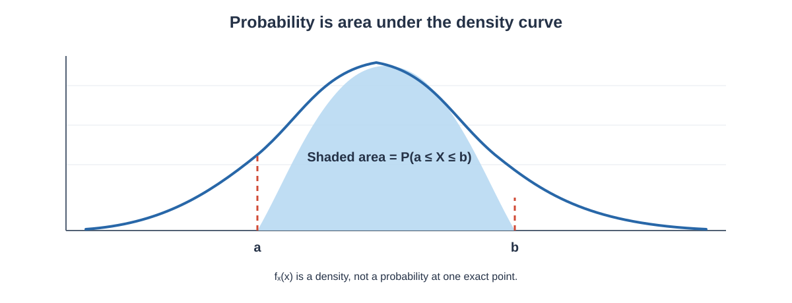

# Probability Distributions

A **probability distribution** describes how probabilities are assigned to the possible values of a random variable.

*Visual reference: common discrete and continuous distribution shapes. Source: [Codefinity — Probability Distributions](https://codefinity.com/).*

In the previous chapter, probability was introduced through events, conditional probability, independence, Bayes' theorem, and random variables. A probability distribution takes the next step: it tells us **which values a random variable can take and how probability is distributed across those values**.

Probability distributions are fundamental because they provide mathematical models for uncertain quantities such as:

- Number of purchases
- Number of defective products
- Number of arrivals
- Waiting time
- Measurement error
- Examination scores
- Heights and weights
- Sample statistics

This chapter develops discrete and continuous probability distributions, probability mass functions, probability density functions, cumulative distribution functions, expected value, variance, and important distributions such as Bernoulli, Binomial, Poisson, Uniform, Normal, Exponential, and related distributions.

---

# 1. Random Variables and Probability Distributions

A **random variable** is a numerical function that assigns a value to each outcome of a random experiment.

A random variable is commonly represented by:

$$
X
$$

For example, suppose a coin is tossed three times and $X$ represents the number of Heads.

The possible values are:

$$
X\in\{0,1,2,3\}
$$

A probability distribution tells us the probability associated with each possible value of $X$.

For example:

| $X$ | $P(X)$ |
|---:|---:|
| 0 | 0.125 |
| 1 | 0.375 |
| 2 | 0.375 |
| 3 | 0.125 |

The probabilities must satisfy:

$$
P(X=x)\geq0
$$

and:

$$
\sum_xP(X=x)=1
$$

A probability distribution therefore provides a complete probabilistic description of a random variable under the chosen model.

---

# 2. Discrete Probability Distribution

A **discrete random variable** takes countable values.

Examples include:

- Number of customers
- Number of defective items
- Number of successes
- Number of emails received
- Number of Heads in repeated coin tosses

A discrete probability distribution assigns a probability to each possible value.

For a discrete random variable, the probability of a particular value can be positive:

$$
P(X=x)>0
$$

for some values of $x$.

---

# 3. Continuous Probability Distribution

A **continuous random variable** can take values over an interval.

Examples include:

- Height
- Weight
- Temperature
- Time
- Distance
- Measurement error

For a continuous random variable, probability is assigned to intervals rather than individual exact points.

Under the usual continuous probability model:

$$
P(X=x)=0
$$

for any single exact value $x$.

However:

$$
P(a<X<b)
$$

can be positive.

This distinction is important because continuous probability distributions are described using a **probability density function** rather than assigning positive probability to every exact value.

---

# 4. Discrete vs Continuous Distributions

| Feature | Discrete | Continuous |
|---|---|---|
| Possible values | Countable | Values over intervals |
| Individual value probability | Can be positive | Usually zero |
| Main function | PMF | PDF |
| Probability | Sum of probabilities | Area under density |
| Examples | Binomial, Poisson | Normal, Uniform, Exponential |

The choice between a discrete and continuous model depends on the nature of the random variable and the assumptions of the problem.

---

# 5. Probability Mass Function

The **probability mass function (PMF)** gives the probability that a discrete random variable equals a particular value.

It is written as:

$$
p_X(x)=P(X=x)
$$

A valid PMF must satisfy two conditions.

### Condition 1: Non-Negativity

$$
p_X(x)\geq0
$$

### Condition 2: Total Probability

$$
\sum_xp_X(x)=1
$$

### Example

Suppose:

| $x$ | $P(X=x)$ |
|---:|---:|
| 0 | 0.2 |
| 1 | 0.5 |
| 2 | 0.3 |

Check the total:

$$
0.2+0.5+0.3=1
$$

Therefore, the probabilities form a valid PMF.

---

# 6. Probability Density Function

A **probability density function (PDF)** describes the density of probability for a continuous random variable.

It is commonly written as:

$$
f_X(x)
$$

A valid PDF must satisfy:

$$
f_X(x)\geq0
$$

and:

$$
\int_{-\infty}^{\infty}f_X(x)\,dx=1
$$

The probability that $X$ lies between $a$ and $b$ is:

$$
P(a\leq X\leq b)
=
\int_a^b f_X(x)\,dx
$$

For continuous distributions, the probability corresponds to **area under the density curve**.

**How to read this graph:** The curve is the probability density function $f_X(x)$. The shaded area between $a$ and $b$ is the probability that the random variable falls in that interval:

$
P(a\leq X\leq b)
=
\int_a^b f_X(x)\,dx
$

The total area under a valid density curve is 1, while the probability at any one exact point of a continuous distribution is 0.

Because a single point has zero width:

$$
P(X=a)=0
$$

and therefore:

$$
P(a<X<b)=P(a\leq X\leq b)
$$

for a continuous random variable.

---

# 7. Cumulative Distribution Function

The **cumulative distribution function (CDF)** gives the probability that a random variable is less than or equal to a specified value.

It is written as:

$$
F_X(x)=P(X\leq x)
$$

### For a Discrete Random Variable

$$
F_X(x)=\sum_{t\leq x}P(X=t)
$$

### For a Continuous Random Variable

$$
F_X(x)=\int_{-\infty}^{x}f_X(t)\,dt
$$

A CDF always satisfies:

$$
0\leq F_X(x)\leq1
$$

It is also non-decreasing.

As $x$ moves from very small values to very large values, the cumulative probability moves from values near 0 toward 1.

---

# 8. Relationship Between PMF, PDF, and CDF

The three concepts describe probability in different ways.

### PMF

Used for discrete random variables:

$$
P(X=x)
$$

### PDF

Used for continuous random variables:

$$
f_X(x)
$$

Probability over an interval is calculated using area:

$$
P(a<X<b)=\int_a^b f_X(x)\,dx
$$

### CDF

Used for both discrete and continuous random variables:

$$
F_X(x)=P(X\leq x)
$$

For a continuous distribution, the PDF and CDF are related by:

$$
f_X(x)=\frac{d}{dx}F_X(x)
$$

when the derivative exists.

The CDF can be recovered from the PDF using:

$$
F_X(x)=\int_{-\infty}^{x}f_X(t)\,dt
$$

---

# 9. Expected Value of a Discrete Random Variable

The expected value represents the theoretical long-run average.

For a discrete random variable:

$$
E(X)=\sum_xxP(X=x)
$$

### Worked Example

Suppose:

| $X$ | $P(X)$ |
|---:|---:|
| 0 | 0.2 |
| 1 | 0.5 |
| 2 | 0.3 |

Then:

$$
E(X)=0(0.2)+1(0.5)+2(0.3)
$$

$$
E(X)=0+0.5+0.6
$$

Therefore:

$$
\boxed{E(X)=1.1}
$$

The expected value does not need to be one of the possible outcomes.

---

# 10. Expected Value of a Continuous Random Variable

For a continuous random variable:

$$
E(X)=\int_{-\infty}^{\infty}xf_X(x)\,dx
$$

The function $xf_X(x)$ weights each possible value by its probability density.

The integral combines these weighted values over the entire range of the random variable.

---

# 11. Variance of a Random Variable

Variance measures the spread of a random variable around its mean.

The definition is:

$$
Var(X)=E[(X-\mu)^2]
$$

where:

$$
\mu=E(X)
$$

An equivalent formula is:

$$
\boxed{Var(X)=E(X^2)-[E(X)]^2}
$$

The standard deviation is:

$$
SD(X)=\sqrt{Var(X)}
$$

A larger variance indicates greater dispersion under the same measurement scale.

---

# 12. Bernoulli Distribution

The **Bernoulli distribution** models a single trial with exactly two possible outcomes.

The outcomes are often called:

- Success
- Failure

Let:

$$
X=
\begin{cases}
1 & \text{success}\\
0 & \text{failure}
\end{cases}
$$

Let:

$$
P(X=1)=p
$$

Then:

$$
P(X=0)=1-p
$$

The PMF is:

$$
\boxed{
P(X=x)=p^x(1-p)^{1-x}
}
$$

for:

$$
x\in\{0,1\}
$$

### Mean

The expected value is:

$$
\boxed{E(X)=p}
$$

### Variance

The variance is:

$$
\boxed{Var(X)=p(1-p)}
$$

### Example

Suppose a customer makes a purchase with probability:

$$
p=0.2
$$

Then:

$$
P(X=1)=0.2
$$

and:

$$
P(X=0)=0.8
$$

The expected value is:

$$
E(X)=0.2
$$

and the variance is:

$$
Var(X)=0.2(0.8)
$$

Therefore:

$$
\boxed{Var(X)=0.16}
$$

---

# 13. Binomial Distribution

The **Binomial distribution** models the number of successes in a fixed number of independent Bernoulli trials when each trial has the same probability of success.

Suppose:

- $n$ = number of trials
- $p$ = probability of success
- $X$ = number of successes

Then:

$$
X\sim Binomial(n,p)
$$

The probability of exactly $x$ successes is:

$$
\boxed{
P(X=x)=
\binom{n}{x}
p^x(1-p)^{n-x}
}
$$

where:

$$
x=0,1,2,\ldots,n
$$

### Conditions for a Binomial Model

A Binomial model generally requires:

1. Fixed number of trials.
2. Two possible outcomes per trial.
3. Constant probability of success.
4. Independence between trials.

### Worked Example

A fair coin is tossed 4 times. What is the probability of exactly 2 Heads?

Here:

$$
n=4
$$

$$
p=0.5
$$

$$
x=2
$$

Apply the formula:

$$
P(X=2)=
\binom{4}{2}(0.5)^2(0.5)^2
$$

Since:

$$
\binom{4}{2}=6
$$

we obtain:

$$
P(X=2)=6(0.25)(0.25)
$$

$$
\boxed{P(X=2)=0.375}
$$

or:

$$
\boxed{37.5\%}
$$

### Mean

For a Binomial random variable:

$$
\boxed{E(X)=np}
$$

### Variance

$$
\boxed{Var(X)=np(1-p)}
$$

For $n=4$ and $p=0.5$:

$$
E(X)=4(0.5)=2
$$

and:

$$
Var(X)=4(0.5)(0.5)=1
$$

---

# 14. Binomial Probability for At Least and At Most

The Binomial formula gives the probability of exactly $x$ successes.

For an event such as "at least 3 successes":

$$
P(X\geq3)
$$

we can add the probabilities:

$$
P(X\geq3)=P(X=3)+P(X=4)+\cdots+P(X=n)
$$

Alternatively, use the complement:

$$
P(X\geq3)=1-P(X\leq2)
$$

The complement approach can sometimes require fewer calculations.

---

# 15. Poisson Distribution

The **Poisson distribution** models the number of events occurring within a fixed interval of time, distance, area, or another exposure unit under appropriate assumptions.

Let:

$$
X\sim Poisson(\lambda)
$$

where $\lambda$ represents the average number of events in the interval.

The PMF is:

$$
\boxed{
P(X=x)=
\frac{e^{-\lambda}\lambda^x}{x!}
}
$$

for:

$$
x=0,1,2,\ldots
$$

### Mean

$$
\boxed{E(X)=\lambda}
$$

### Variance

$$
\boxed{Var(X)=\lambda}
$$

Thus, for a Poisson distribution:

$$
E(X)=Var(X)=\lambda
$$

### Worked Example

Suppose a support centre receives an average of 3 calls per minute.

Let:

$$
\lambda=3
$$

What is the probability of receiving exactly 2 calls in one minute?

Use:

$$
P(X=2)=
\frac{e^{-3}3^2}{2!}
$$

Since:

$$
3^2=9
$$

and:

$$
2!=2
$$

we obtain:

$$
P(X=2)=
\frac{9e^{-3}}{2}
$$

Using:

$$
e^{-3}\approx0.0498
$$

we get:

$$
P(X=2)\approx
\frac{9(0.0498)}{2}
$$

$$
P(X=2)\approx0.224
$$

Therefore:

$$
\boxed{P(X=2)\approx0.224}
$$

or approximately:

$$
\boxed{22.4\%}
$$

---

# 16. Geometric Distribution

The **Geometric distribution** models the number of trials required to obtain the first success.

Let:

- $p$ = probability of success on each trial
- $X$ = trial number on which the first success occurs

Then:

$$
P(X=x)=(1-p)^{x-1}p
$$

for:

$$
x=1,2,3,\ldots
$$

### Worked Example

Suppose a trial has success probability:

$$
p=0.2
$$

What is the probability that the first success occurs on the third trial?

We need:

$$
P(X=3)
$$

Apply the formula:

$$
P(X=3)=(1-0.2)^2(0.2)
$$

$$
=(0.8)^2(0.2)
$$

$$
=0.64(0.2)
$$

Therefore:

$$
\boxed{P(X=3)=0.128}
$$

or:

$$
\boxed{12.8\%}
$$

---

# 17. Negative Binomial Distribution

The Negative Binomial distribution generalises the Geometric distribution by considering the number of trials needed to obtain a specified number of successes.

If $X$ is the number of trials required to obtain $r$ successes, then one common form is:

$$
P(X=x)=
\binom{x-1}{r-1}
p^r(1-p)^{x-r}
$$

where:

$$
x=r,r+1,\ldots
$$

The exact parameterisation can vary between textbooks and software libraries, so the definition of the random variable should always be checked.

The Geometric distribution is a special case with:

$$
r=1
$$

---

# 18. Hypergeometric Distribution

The **Hypergeometric distribution** models the number of successes in a sample drawn **without replacement** from a finite population.

Suppose:

- $N$ = population size
- $K$ = number of successes in the population
- $n$ = sample size
- $X$ = number of successes selected

Then:

$$
P(X=x)=
\frac{
\binom{K}{x}
\binom{N-K}{n-x}
}{
\binom{N}{n}
}
$$

The important feature is **sampling without replacement**.

### Example

A box contains 10 products.

- 4 are defective.
- 6 are non-defective.

Three products are selected without replacement.

What is the probability that exactly 2 are defective?

Here:

$$
N=10
$$

$$
K=4
$$

$$
n=3
$$

$$
x=2
$$

Therefore:

$$
P(X=2)=
\frac{
\binom{4}{2}
\binom{6}{1}
}{
\binom{10}{3}
}
$$

Calculate:

$$
\binom{4}{2}=6
$$

$$
\binom{6}{1}=6
$$

$$
\binom{10}{3}=120
$$

Therefore:

$$
P(X=2)=\frac{36}{120}
$$

$$
\boxed{P(X=2)=0.3}
$$

or:

$$
\boxed{30\%}
$$

---

# 19. Uniform Distribution

The **continuous Uniform distribution** assigns equal density across an interval.

If:

$$
X\sim Uniform(a,b)
$$

then its PDF is:

$$
f(x)=
\begin{cases}
\frac{1}{b-a} & a\leq x\leq b\\
0 & \text{otherwise}
\end{cases}
$$

The graph is rectangular because the density is constant throughout the interval.

### Mean

$$
\boxed{E(X)=\frac{a+b}{2}}
$$

### Variance

$$
\boxed{Var(X)=\frac{(b-a)^2}{12}}
$$

### Worked Example

Suppose:

$$
X\sim Uniform(0,10)
$$

The probability that $X$ lies between 2 and 6 is the length of the required interval divided by the total interval length:

$$
P(2\leq X\leq6)=
\frac{6-2}{10-0}
$$

$$
=\frac{4}{10}
$$

Therefore:

$$
\boxed{P(2\leq X\leq6)=0.4}
$$

The mean is:

$$
E(X)=\frac{0+10}{2}
$$

$$
\boxed{E(X)=5}
$$

---

# 20. Normal Distribution

The **Normal distribution** is one of the most important continuous probability distributions.

It is symmetric and bell-shaped.

A Normal random variable is commonly written as:

$$
X\sim N(\mu,\sigma^2)
$$

where:

- $\mu$ = mean
- $\sigma^2$ = variance
- $\sigma$ = standard deviation

Its PDF is:

$$
\boxed{
f(x)=
\frac{1}{\sigma\sqrt{2\pi}}
e^{-\frac{(x-\mu)^2}{2\sigma^2}}
}
$$

for:

$$
-\infty<x<\infty
$$

### Important Properties

For a Normal distribution:

$$
\text{Mean}=\text{Median}=\text{Mode}=\mu
$$

The distribution is symmetric around $\mu$.

Approximately:

- 68% of observations lie within 1 standard deviation.
- 95% lie within 2 standard deviations.
- 99.7% lie within 3 standard deviations.

This is commonly called the **68–95–99.7 rule**.

---

# 21. Standard Normal Distribution

The **Standard Normal distribution** has:

$$
\mu=0
$$

and:

$$
\sigma=1
$$

It is commonly represented by:

$$
Z\sim N(0,1)
$$

A general Normal variable can be standardised using the **z-score**:

$$
\boxed{
Z=\frac{X-\mu}{\sigma}
}
$$

The z-score tells us how many standard deviations an observation lies above or below the mean.

### Worked Example

Suppose:

$$
X=70
$$

$$
\mu=60
$$

$$
\sigma=5
$$

Then:

$$
Z=\frac{70-60}{5}
$$

$$
Z=\frac{10}{5}
$$

Therefore:

$$
\boxed{Z=2}
$$

The observation is 2 standard deviations above the mean.

---

# 22. Empirical Rule

For an approximately Normal distribution:

### Within 1 Standard Deviation

$$
\mu-\sigma \leq X\leq\mu+\sigma
$$

contains approximately 68% of observations.

### Within 2 Standard Deviations

$$
\mu-2\sigma \leq X\leq\mu+2\sigma
$$

contains approximately 95%.

### Within 3 Standard Deviations

$$
\mu-3\sigma \leq X\leq\mu+3\sigma
$$

contains approximately 99.7%.

### Example

Suppose:

$$
\mu=100
$$

and:

$$
\sigma=10
$$

Approximately 95% of observations lie between:

$$
100-2(10)
$$

and:

$$
100+2(10)
$$

Therefore:

$$
\boxed{80\leq X\leq120}
$$

---

# 23. Exponential Distribution

The **Exponential distribution** is commonly used to model waiting time until an event occurs under an appropriate constant-rate process.

Let:

$$
X\sim Exponential(\lambda)
$$

where $\lambda>0$ is the rate parameter.

Its PDF is:

$$
f(x)=
\begin{cases}
\lambda e^{-\lambda x} & x\geq0\\
0 & x<0
\end{cases}
$$

### Mean

$$
\boxed{E(X)=\frac{1}{\lambda}}
$$

### Variance

$$
\boxed{Var(X)=\frac{1}{\lambda^2}}
$$

### CDF

$$
\boxed{
F(x)=1-e^{-\lambda x}
}
$$

for $x\geq0$.

### Worked Example

Suppose the average waiting time is 5 minutes.

Then:

$$
E(X)=5
$$

Since:

$$
E(X)=\frac{1}{\lambda}
$$

we have:

$$
\lambda=\frac{1}{5}=0.2
$$

What is the probability that the waiting time is less than 3 minutes?

Use the CDF:

$$
P(X\leq3)=1-e^{-0.2(3)}
$$

$$
=1-e^{-0.6}
$$

Using:

$$
e^{-0.6}\approx0.5488
$$

we get:

$$
P(X\leq3)\approx1-0.5488
$$

Therefore:

$$
\boxed{P(X\leq3)\approx0.4512}
$$

or approximately:

$$
\boxed{45.12\%}
$$

---

# 24. Memoryless Property of the Exponential Distribution

The Exponential distribution has an important property called **memorylessness**.

For $s,t\geq0$:

$$
P(X>s+t\mid X>s)=P(X>t)
$$

This means that, given the process has already lasted for $s$ units of time, the additional waiting time has the same distribution as a fresh waiting time under the model.

This property distinguishes the Exponential distribution from many other continuous distributions.

---

# 25. Geometric and Exponential Distributions

The Geometric and Exponential distributions have a conceptual similarity.

- Geometric distribution → number of discrete trials until a success.
- Exponential distribution → continuous waiting time until an event.

Both have a memoryless property under their standard definitions.

The difference is the nature of the random variable:

| Distribution | Random Variable |
|---|---|
| Geometric | Discrete trial count |
| Exponential | Continuous waiting time |

---

# 26. Poisson and Exponential Relationship

The Poisson and Exponential distributions are closely related when modelling a Poisson process with constant event rate.

- Poisson distribution → number of events in an interval.
- Exponential distribution → waiting time between events.

If events occur at rate $\lambda$:

$$
N(t)\sim Poisson(\lambda t)
$$

for the number of events in time $t$.

The waiting time to the next event can be modelled as:

$$
X\sim Exponential(\lambda)
$$

under the standard Poisson-process assumptions.

---

# 27. Normal Distribution and Z-Scores

The z-score transformation:

$$
Z=\frac{X-\mu}{\sigma}
$$

converts a Normal random variable into the standard scale.

Suppose:

$$
X\sim N(50,10^2)
$$

and:

$$
X=70
$$

Then:

$$
Z=\frac{70-50}{10}
$$

$$
\boxed{Z=2}
$$

This means the value is two standard deviations above the mean.

A z-score can be positive, negative, or zero:

- Positive → above mean
- Negative → below mean
- Zero → exactly at mean

---

# 28. Expected Value and Variance Rules

Probability distributions become easier to manipulate when we know the standard rules for expectation and variance.

For constants $a$ and $b$:

$$
E(aX+b)=aE(X)+b
$$

For variance:

$$
Var(aX+b)=a^2Var(X)
$$

Adding a constant changes the location but does not change the variance.

Multiplying a random variable by $a$ multiplies its standard deviation by $|a|$ and variance by $a^2$.

---

# 29. Sum of Independent Random Variables

If $X$ and $Y$ are independent:

$$
E(X+Y)=E(X)+E(Y)
$$

and:

$$
Var(X+Y)=Var(X)+Var(Y)
$$

More generally, for independent random variables:

$$
Var\left(\sum_{i=1}^{n}X_i\right)
=
\sum_{i=1}^{n}Var(X_i)
$$

Independence is important for the simple variance addition rule.

Without independence:

$$
Var(X+Y)
=
Var(X)+Var(Y)+2Cov(X,Y)
$$

---

# 30. Law of Total Expectation

If $Y$ represents another random variable or conditioning variable, the law of total expectation states:

$$
E(X)=E[E(X\mid Y)]
$$

This means that the overall expected value can be obtained by averaging conditional expected values.

For a discrete $Y$:

$$
E(X)=\sum_yE(X\mid Y=y)P(Y=y)
$$

This is useful when a random variable behaves differently across different groups or conditions.

---

# 31. Central Limit Theorem — Introduction

The **Central Limit Theorem (CLT)** is one of the most important results connecting probability distributions with statistical inference.

Under appropriate conditions, the distribution of the sample mean becomes approximately Normal as the sample size becomes sufficiently large, even when the original population distribution is not Normal.

Suppose independent observations have:

- Mean $\mu$
- Variance $\sigma^2$

For a sample of size $n$, the sample mean is:

$$
\bar{X}=\frac{1}{n}\sum_{i=1}^{n}X_i
$$

Its mean is:

$$
E(\bar{X})=\mu
$$

and its variance is:

$$
Var(\bar{X})=\frac{\sigma^2}{n}
$$

Therefore, its standard deviation is:

$$
\boxed{
SE(\bar{X})=\frac{\sigma}{\sqrt{n}}
}
$$

Under the CLT, the standardised sample mean becomes approximately standard Normal for sufficiently large samples under suitable assumptions:

$$
Z=
\frac{\bar{X}-\mu}
{\sigma/\sqrt{n}}
$$

The exact quality of the Normal approximation depends on the underlying distribution, sample size, dependence structure, and other conditions.

---

# 32. Worked CLT Example

Suppose a population has:

$$
\mu=100
$$

and:

$$
\sigma=20
$$

A random sample of:

$$
n=100
$$

observations is collected.

The standard error of the sample mean is:

$$
SE(\bar{X})=
\frac{\sigma}{\sqrt{n}}
$$

Substitute:

$$
SE(\bar{X})=
\frac{20}{\sqrt{100}}
$$

$$
=\frac{20}{10}
$$

Therefore:

$$
\boxed{SE(\bar{X})=2}
$$

This means the sampling distribution of the mean has standard deviation 2 under the stated assumptions.

The CLT is the bridge from probability distributions to many methods of statistical inference.

---

# 33. Choosing a Probability Distribution

A probability distribution should not be selected simply because its name is familiar.

Ask:

### Is the random variable discrete or continuous?

- Count → often discrete
- Measurement or time → often continuous

### Is there a fixed number of trials?

If yes, and each trial has two outcomes with constant success probability, the Binomial distribution may be appropriate.

### Are we counting events in an interval?

A Poisson model may be appropriate under its assumptions.

### Are we waiting for the first success?

A Geometric model may be appropriate for discrete trials.

### Are we sampling without replacement from a finite population?

A Hypergeometric model may be appropriate.

### Is the variable approximately symmetric and bell-shaped?

A Normal model may be appropriate.

### Are we modelling a continuous waiting time?

An Exponential model may be appropriate under a constant-rate process.

The assumptions behind the model are more important than simply memorising the formula.

---

# 34. Distribution Comparison

| Distribution | Type | Main Use | Parameters |
|---|---|---|---|
| Bernoulli | Discrete | One success/failure trial | $p$ |
| Binomial | Discrete | Number of successes in fixed trials | $n,p$ |
| Poisson | Discrete | Event count in an interval | $\lambda$ |
| Geometric | Discrete | Trial count until first success | $p$ |
| Negative Binomial | Discrete | Trials until specified successes | $r,p$ |
| Hypergeometric | Discrete | Sampling without replacement | $N,K,n$ |
| Uniform | Continuous | Equal density over an interval | $a,b$ |
| Normal | Continuous | Symmetric bell-shaped measurements | $\mu,\sigma^2$ |
| Exponential | Continuous | Waiting time under constant rate | $\lambda$ |

---

# 35. Common Mistakes

### Mistake 1: Confusing PMF and PDF

A PMF gives probabilities for discrete values.

A PDF gives density for a continuous variable.

### Mistake 2: Treating PDF Values as Probabilities

For a continuous distribution:

$$
f(x)
$$

is a density, not generally the probability that $X=x$.

The probability is obtained from area:

$$
P(a<X<b)=\int_a^b f(x)\,dx
$$

### Mistake 3: Forgetting the Conditions of a Binomial Model

A Binomial model requires an appropriate fixed-trial, two-outcome structure with constant success probability and independence.

### Mistake 4: Confusing Poisson Rate and Probability

The parameter $\lambda$ is an average rate, not itself necessarily a probability.

### Mistake 5: Confusing Variance With Standard Deviation

Variance is measured in squared units.

Standard deviation is measured in the original units.

### Mistake 6: Using a Normal Model Automatically

Not every numerical dataset is Normally distributed.

The shape and modelling assumptions must be considered.

### Mistake 7: Confusing Geometric and Exponential Distributions

Geometric is discrete.

Exponential is continuous.

### Mistake 8: Ignoring Sampling Without Replacement

If the population is finite and sampling is without replacement, the Hypergeometric model may be more appropriate than a Binomial model.

### Mistake 9: Assuming the CLT Means the Original Data Becomes Normal

The CLT concerns the distribution of a suitable sample statistic, especially the sample mean, not necessarily the original observations.

---

# 36. Points to Remember

1. A probability distribution describes how probability is assigned to a random variable.
2. Discrete random variables have countable possible values.
3. Continuous random variables take values over intervals.
4. A PMF is used for discrete random variables.
5. A PDF is used for continuous random variables.
6. A CDF gives $P(X\leq x)$.
7. Expected value describes a theoretical long-run average.
8. Variance measures squared spread.
9. Standard deviation is the square root of variance.
10. Bernoulli models one success/failure trial.
11. Binomial models the number of successes in fixed independent trials.
12. Poisson models event counts over an interval under appropriate assumptions.
13. Geometric models trials until the first success.
14. Negative Binomial models trials until a specified number of successes.
15. Hypergeometric models sampling without replacement.
16. Uniform assigns constant density over an interval.
17. Normal is a symmetric bell-shaped continuous distribution.
18. The z-score measures distance from the mean in standard-deviation units.
19. Exponential models continuous waiting time under a constant-rate process.
20. Poisson and Exponential distributions are closely related through the Poisson process.
21. The CLT concerns the sampling distribution of suitable statistics such as the sample mean.
22. Always check the assumptions before selecting a probability distribution.

---

# 37. Important Formula Summary

### PMF

$$
p_X(x)=P(X=x)
$$

### CDF

$$
F_X(x)=P(X\leq x)
$$

### Continuous Probability

$$
P(a\leq X\leq b)
=
\int_a^b f_X(x)\,dx
$$

### Expected Value — Discrete

$$
E(X)=\sum_xxP(X=x)
$$

### Expected Value — Continuous

$$
E(X)=\int_{-\infty}^{\infty}xf_X(x)\,dx
$$

### Variance

$$
Var(X)=E[(X-E(X))^2]
$$

### Alternative Variance Formula

$$
Var(X)=E(X^2)-[E(X)]^2
$$

### Bernoulli

$$
P(X=x)=p^x(1-p)^{1-x}
$$

### Bernoulli Mean

$$
E(X)=p
$$

### Bernoulli Variance

$$
Var(X)=p(1-p)
$$

### Binomial

$$
P(X=x)=
\binom{n}{x}p^x(1-p)^{n-x}
$$

### Binomial Mean

$$
E(X)=np
$$

### Binomial Variance

$$
Var(X)=np(1-p)
$$

### Poisson

$$
P(X=x)=
\frac{e^{-\lambda}\lambda^x}{x!}
$$

### Poisson Mean and Variance

$$
E(X)=Var(X)=\lambda
$$

### Geometric

$$
P(X=x)=(1-p)^{x-1}p
$$

### Negative Binomial

$$
P(X=x)=
\binom{x-1}{r-1}
p^r(1-p)^{x-r}
$$

### Hypergeometric

$$
P(X=x)=
\frac{
\binom{K}{x}
\binom{N-K}{n-x}
}{
\binom{N}{n}
}
$$

### Uniform PDF

$$
f(x)=\frac{1}{b-a}
$$

for:

$$
a\leq x\leq b
$$

### Uniform Mean

$$
E(X)=\frac{a+b}{2}
$$

### Uniform Variance

$$
Var(X)=\frac{(b-a)^2}{12}
$$

### Normal PDF

$$
f(x)=
\frac{1}{\sigma\sqrt{2\pi}}
e^{-\frac{(x-\mu)^2}{2\sigma^2}}
$$

### Z-Score

$$
Z=\frac{X-\mu}{\sigma}
$$

### Exponential PDF

$$
f(x)=\lambda e^{-\lambda x}
$$

for:

$$
x\geq0
$$

### Exponential CDF

$$
F(x)=1-e^{-\lambda x}
$$

### Exponential Mean

$$
E(X)=\frac{1}{\lambda}
$$

### Exponential Variance

$$
Var(X)=\frac{1}{\lambda^2}
$$

### Sample Mean Standard Error

$$
SE(\bar{X})=\frac{\sigma}{\sqrt{n}}
$$

---

# 38. Quick Concept Comparison

| Concept | Main Question |
|---|---|
| PMF | What is $P(X=x)$ for a discrete value? |
| PDF | How is continuous probability density distributed? |
| CDF | What is $P(X\leq x)$? |
| Expected Value | What is the theoretical average? |
| Variance | How spread out is the random variable? |
| Bernoulli | What happens in one success/failure trial? |
| Binomial | How many successes occur in fixed trials? |
| Poisson | How many events occur in an interval? |
| Geometric | How many trials until the first success? |
| Negative Binomial | How many trials until a specified number of successes? |
| Hypergeometric | How many successes are selected without replacement? |
| Uniform | Is density constant across an interval? |
| Normal | Is the variable modelled by a symmetric bell curve? |
| Exponential | How long until an event occurs? |
| Z-score | How many standard deviations from the mean? |
| CLT | What happens to the sampling distribution of the mean as sample size grows? |

---

# 39. Chapter Summary

Probability distributions provide mathematical models for random variables.

The first distinction is between **discrete and continuous random variables**. Discrete variables use probability mass functions, while continuous variables use probability density functions. The cumulative distribution function provides a common framework for describing the probability that a random variable is less than or equal to a given value.

The **Bernoulli and Binomial distributions** describe success/failure processes. The **Poisson distribution** describes event counts, while the **Geometric and Negative Binomial distributions** describe trial counts until specified successes. The **Hypergeometric distribution** is appropriate for sampling without replacement.

For continuous variables, the **Uniform distribution** represents constant density over an interval, the **Normal distribution** provides the familiar bell-shaped model, and the **Exponential distribution** models waiting time under a constant-rate process.

Expected value and variance provide numerical summaries of probability distributions, while standardisation through the z-score provides a common scale for Normal variables.

Finally, the **Central Limit Theorem** explains why the sampling distribution of the mean becomes approximately Normal under suitable conditions as the sample size increases. This result provides an important foundation for inferential statistics.

The most important habit is not to memorise distributions mechanically. Instead, identify the random variable, understand the data-generating process, check the assumptions, and then select an appropriate probability model.

---

# 40. References

1. Standard introductory probability and statistics resources covering discrete and continuous probability distributions.
2. Open educational resources covering PMF, PDF, CDF, Bernoulli, Binomial, Poisson, Normal, Uniform, Exponential, and related distributions.
3. Course notes and classroom material used for the Mathematics & Statistics section of this repository.
