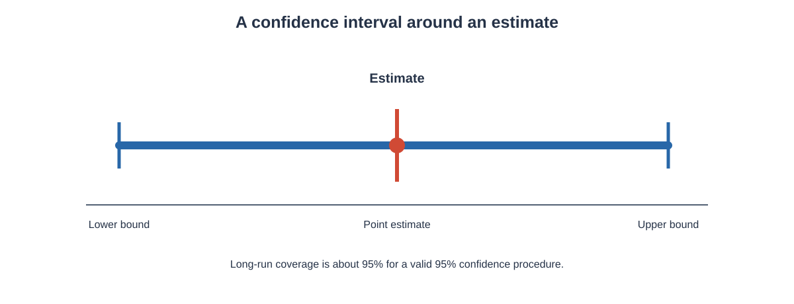
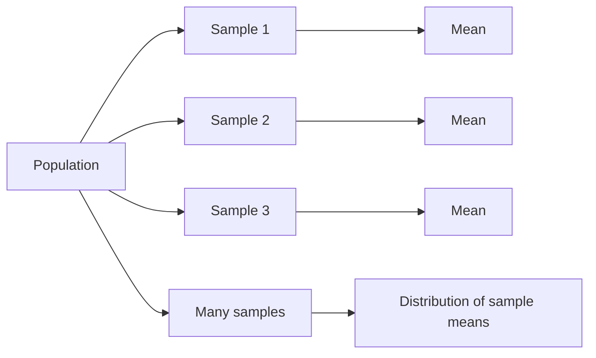
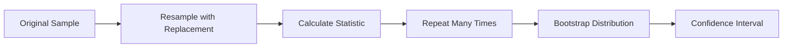

# Inferential Statistics

Inferential statistics is the branch of statistics used to draw conclusions about a **population** from information collected from a **sample**.

In descriptive statistics, we mainly organise, summarise, and describe the data that we already have. Inferential statistics goes one step further. We use a sample to estimate unknown population quantities and to describe how uncertain those estimates are.

For example, suppose a university has 20,000 students and we want to know the average time students spend studying each day. It may be difficult to ask every student. Instead, we can select a sample of students, calculate the sample mean, and use that result to estimate the population mean.

The important idea is that a sample is only one possible sample from the population. Therefore, an estimate obtained from one sample can differ from the estimate obtained from another sample. Inferential statistics provides mathematical methods for understanding and measuring this sampling uncertainty.

This chapter focuses on the foundations of inference, sampling distributions, standard error, point estimation, properties of estimators, confidence intervals, margin of error, and sample-size determination.

---

## 1. Population and Sample

A **population** is the complete group about which we want to make a conclusion.

A **sample** is a selected subset of that population.

A useful way to represent the relationship is:

**Sample ⊂ Population**

Suppose a company has 50,000 customers and wants to estimate the average amount spent per customer.

- Population: all 50,000 customers
- Sample: a selected group of customers
- Population mean: the true average spending of all customers
- Sample mean: the average spending of the selected customers

The population value is usually unknown, while the sample value can be calculated from observed data.

---

## 2. Parameter and Statistic

A **parameter** is a numerical value that describes a population.

A **statistic** is a numerical value calculated from a sample.

| Population | Sample |
|---|---|
| Population mean $\mu$ | Sample mean $\bar{x}$ |
| Population variance $\sigma^2$ | Sample variance $s^2$ |
| Population standard deviation $\sigma$ | Sample standard deviation $s$ |
| Population proportion $p$ | Sample proportion $\hat{p}$ |

The distinction is important because inferential statistics uses statistics to learn about unknown parameters.

**How to read this graph:** The dot represents a point estimate and the horizontal line represents an interval estimate. The exact interval depends on the sample and method. A 95% confidence procedure captures the fixed population parameter in about 95% of intervals over repeated samples when its assumptions hold; it does not mean there is a 95% probability that a fixed parameter lies in this particular interval after it has been calculated.

For example, if the true average height of all students is $\mu$, we may not know $\mu$. We can take a sample and calculate $\bar{x}$. We then use $\bar{x}$ as an estimate of $\mu$.

---

## 3. Why Sampling Creates Uncertainty

Consider a population with a fixed average.

If we repeatedly select samples of the same size, the samples will generally contain different observations. Therefore, their sample means will not usually be identical.

For example:

| Sample | Sample Mean |
|---|---:|
| Sample 1 | 68.2 |
| Sample 2 | 67.5 |
| Sample 3 | 68.7 |
| Sample 4 | 67.9 |
| Sample 5 | 68.4 |

The population mean has not changed. The variation occurs because different samples contain different observations.

This variation in a statistic from sample to sample is called **sampling variability**.

Inferential statistics must therefore answer two questions:

1. What is our best estimate of the population parameter?
2. How much uncertainty is associated with that estimate?

Point estimation answers the first question, while interval estimation provides a range of plausible values and answers the second more directly.

---

# 4. Sampling Methods

The quality of an inference depends strongly on how the sample is selected.

## 4.1 Simple Random Sampling

In **simple random sampling**, every member of the population has an equal or known opportunity to be selected.

Suppose a college has 10,000 students and we randomly select 500 students.

If the selection mechanism gives every student an equal chance of selection, the resulting sample is a simple random sample.

Random sampling helps reduce systematic selection bias.

---

## 4.2 Stratified Sampling

In **stratified sampling**, the population is divided into meaningful groups called **strata**, and samples are taken from the strata.

For example, a university population could be divided by year:

- First year
- Second year
- Third year
- Fourth year

A sample can then be selected from each group.

Stratification can be useful when different groups need representation in the sample.

---

## 4.3 Systematic Sampling

In **systematic sampling**, observations are selected according to a fixed interval after an appropriate starting point.

For example, from an ordered list of customers, we might select every 20th customer after choosing a random starting position.

---

## 4.4 Cluster Sampling

In **cluster sampling**, the population is divided into natural groups called clusters. Some clusters are selected, and observations within selected clusters are studied.

For example, instead of randomly selecting individual students from every college, a researcher might randomly select several colleges and study students within those colleges.

---

## 4.5 Convenience Sampling

A **convenience sample** consists of observations that are easy to access.

For example, asking only people standing near a particular shop is convenient, but that group may not represent the entire target population.

Convenience sampling can create selection bias and should not automatically be treated as representative of the population.

---

# 5. Sampling Distribution

A **sampling distribution** is the probability distribution of a statistic obtained from repeated samples of the same size from a population.

This is one of the most important ideas in inferential statistics.

Suppose we repeatedly:

1. Take a sample of size $n$.
2. Calculate the sample mean $\bar{x}$.
3. Record the value.
4. Repeat the process many times.

The collection of all those sample means forms the **sampling distribution of the sample mean**.

The important point is that the sampling distribution is a distribution of a **statistic**, not a distribution of individual observations.

---

# 6. Sampling Distribution of the Sample Mean

Let the population have:

- Mean = $\mu$
- Standard deviation = $\sigma$

Take random samples of size $n$ and calculate the sample mean $\bar{x}$ for each sample.

The sampling distribution of $\bar{x}$ has:

$$
E(\bar{x}) = \mu
$$

and

$$
SD(\bar{x}) = \frac{\sigma}{\sqrt{n}}
$$

The standard deviation of the sampling distribution of the sample mean is called the **standard error of the mean**.

Therefore,

$$
SE(\bar{x}) = \frac{\sigma}{\sqrt{n}}
$$

If $\sigma$ is unknown, it is commonly estimated using the sample standard deviation:

$$
SE(\bar{x}) = \frac{s}{\sqrt{n}}
$$

where:

- $\bar{x}$ = sample mean
- $\mu$ = population mean
- $\sigma$ = population standard deviation
- $s$ = sample standard deviation
- $n$ = sample size

---

# 7. Why the Standard Error Decreases with Sample Size

From

$$
SE(\bar{x}) = \frac{\sigma}{\sqrt{n}}
$$

we can see that increasing $n$ decreases the standard error.

Suppose $\sigma = 12$.

For $n=36$:

$$
SE = \frac{12}{\sqrt{36}}
$$

$$
SE = \frac{12}{6} = 2
$$

For $n=144$:

$$
SE = \frac{12}{\sqrt{144}}
$$

$$
SE = \frac{12}{12} = 1
$$

Therefore, increasing the sample size from 36 to 144 reduces the standard error from 2 to 1.

Notice that the sample size had to become **four times larger** to make the standard error half as large.

This happens because the standard error decreases with $\sqrt{n}$, not directly with $n$.

---

# 8. Sampling Distribution of a Sample Proportion

Suppose a population has a true proportion $p$ with a particular characteristic.

For example, $p$ may represent the proportion of customers who prefer a particular product.

From a sample of size $n$, the sample proportion is:

$$
\hat{p} = \frac{x}{n}
$$

where:

- $x$ = number of observations with the characteristic
- $n$ = sample size
- $\hat{p}$ = sample proportion

The expected value is:

$$
E(\hat{p}) = p
$$

The standard deviation of the sampling distribution is:

$$
SD(\hat{p}) = \sqrt{\frac{p(1-p)}{n}}
$$

This is the standard error when the population proportion is known.

In practice, when $p$ is unknown, the standard error can be estimated using $\hat{p}$:

$$
SE(\hat{p}) = \sqrt{\frac{\hat{p}(1-\hat{p})}{n}}
$$

---

## Worked Example: Sample Proportion

Suppose 120 out of 200 surveyed customers prefer Product A.

Then:

$$
\hat{p} = \frac{120}{200}
$$

$$
\hat{p}=0.60
$$

So the estimated proportion is:

$$
\boxed{\hat{p}=0.60}
$$

or 60%.

Using the sample proportion to estimate the standard error:

$$
SE(\hat{p}) =
\sqrt{\frac{0.60(1-0.60)}{200}}
$$

$$
=
\sqrt{\frac{0.60(0.40)}{200}}
$$

$$
=
\sqrt{\frac{0.24}{200}}
$$

$$
=
\sqrt{0.0012}
$$

$$
\approx 0.0346
$$

Therefore:

$$
\boxed{SE(\hat{p})\approx0.0346}
$$

The estimated sampling variability of the sample proportion is about 0.0346.

---

# 9. Standard Error

The **standard error (SE)** measures the variability of a statistic across repeated samples.

It is different from the standard deviation of individual observations.

For a sample mean:

$$
SE(\bar{x})=\frac{\sigma}{\sqrt{n}}
$$

or, when $\sigma$ is unknown:

$$
SE(\bar{x})=\frac{s}{\sqrt{n}}
$$

For a sample proportion:

$$
SE(\hat{p}) =
\sqrt{\frac{\hat{p}(1-\hat{p})}{n}}
$$

The standard error becomes smaller as the sample size becomes larger.

### Standard deviation vs standard error

| Standard Deviation | Standard Error |
|---|---|
| Describes variability of observations | Describes variability of a statistic |
| Usually refers to the data | Refers to repeated-sample estimates |
| Does not automatically shrink because more observations are collected | Usually decreases as sample size increases |
| Measures spread in the population/sample | Measures sampling uncertainty |

A common mistake is to use the terms standard deviation and standard error interchangeably. They describe different ideas.

---

# 10. Point Estimation

A **point estimate** is a single numerical value used to estimate an unknown population parameter.

Examples:

- $\bar{x}$ estimates $\mu$
- $\hat{p}$ estimates $p$
- $s^2$ estimates $\sigma^2$

Suppose a sample of 100 students has an average study time of 4.8 hours per day.

Then:

$$
\bar{x}=4.8
$$

The point estimate of the population mean study time is:

$$
\boxed{\hat{\mu}=4.8\text{ hours}}
$$

The point estimate gives one best estimate, but it does not by itself show how uncertain the estimate is.

For that reason, point estimates are often accompanied by standard errors or confidence intervals.

---

# 11. Estimator and Estimate

An **estimator** is a rule or statistic used to estimate a population parameter.

An **estimate** is the numerical value obtained after applying the estimator to a particular sample.

For example:

$$
\bar{X}=\frac{1}{n}\sum_{i=1}^{n}X_i
$$

is an estimator of $\mu$.

If a particular sample produces:

$$
\bar{x}=72.4
$$

then 72.4 is the estimate.

This distinction is useful:

- **Estimator:** the procedure/statistic
- **Estimate:** the resulting number

---

# 12. Properties of a Good Estimator

A useful estimator should have desirable statistical properties.

Three important properties are:

1. Unbiasedness
2. Consistency
3. Efficiency

---

# 13. Unbiased Estimator

An estimator $\hat{\theta}$ is unbiased for a parameter $\theta$ if:

$$
E(\hat{\theta})=\theta
$$

This means that over repeated samples, the estimator's average value equals the true parameter.

For the sample mean:

$$
E(\bar{X})=\mu
$$

Therefore, the sample mean is an unbiased estimator of the population mean.

### Example

Suppose an estimator produces values:

$$
8,\ 10,\ 12
$$

with equal probability.

Its expected value is:

$$
E(\hat{\theta})
=
\frac{8+10+12}{3}
$$

$$
=\frac{30}{3}
$$

$$
=10
$$

If the true parameter is 10, the estimator is unbiased.

Unbiasedness does not mean that every individual estimate equals the true value. It means that the estimator is correct **on average over repeated sampling**.

---

# 14. Bias of an Estimator

The bias of an estimator is:

$$
Bias(\hat{\theta})=E(\hat{\theta})-\theta
$$

If:

$$
E(\hat{\theta})=\theta
$$

then:

$$
Bias(\hat{\theta})=0
$$

and the estimator is unbiased.

### Example

Suppose:

$$
E(\hat{\theta})=52
$$

and:

$$
\theta=50
$$

Then:

$$
Bias(\hat{\theta})=52-50
$$

$$
\boxed{Bias=2}
$$

The estimator has an upward bias of 2.

Bias and variance are studied more deeply in the dedicated Bias and Variance chapter. Here, bias is introduced only as a property of estimators.

---

# 15. Consistent Estimator

An estimator is **consistent** if it approaches the true parameter as the sample size becomes very large.

Informally:

> More and more data should make the estimator increasingly close to the true population parameter.

For an estimator $\hat{\theta}_n$:

$$
\hat{\theta}_n \rightarrow \theta
\quad\text{as }n\rightarrow\infty
$$

Consistency is different from unbiasedness.

An estimator can have some bias for finite samples and still become increasingly accurate as the sample size grows.

---

# 16. Efficient Estimator

When comparing unbiased estimators of the same parameter, an estimator with smaller variance is generally considered more efficient.

Suppose two unbiased estimators have:

$$
Var(\hat{\theta}_1)=4
$$

and

$$
Var(\hat{\theta}_2)=9
$$

Both have the same expected value, but estimator 1 has smaller variance.

Therefore, estimator 1 is more efficient because its estimates fluctuate less across repeated samples.

Efficiency is about **precision**, while unbiasedness is about **correctness on average**.

---

# 17. Confidence Interval

A **confidence interval (CI)** is an interval estimate constructed from sample data.

Instead of reporting only one value such as:

$$
\bar{x}=72
$$

we may report:

$$
68 < \mu < 76
$$

with a specified confidence level.

A confidence interval has two main parts:

1. Point estimate
2. Margin of error

In general, a confidence interval is calculated as:

$
\text{Confidence Interval} = \text{Point Estimate} \pm \text{Margin of Error}
$

For many common intervals, the margin of error is:

$
\text{Margin of Error} = \text{Critical Value} \times \text{Standard Error}
$

Therefore:

$$
CI=
\text{Estimate}
\pm
\text{Critical Value}\times SE
$$

---

# 18. Confidence Level

Common confidence levels include:

- 90%
- 95%
- 99%

A 95% confidence procedure is designed so that, in repeated sampling under the stated assumptions, approximately 95% of intervals constructed by that procedure would contain the true parameter.

It is important not to interpret a confidence level as saying that the fixed population parameter has a 95% probability of being inside one already-calculated interval.

The population parameter is treated as fixed. The interval is the random quantity because it depends on the sample.

---

# 19. Critical Values

A **critical value** determines how far we extend from the point estimate to construct an interval.

For a standard normal distribution, common two-sided critical values are approximately:

| Confidence Level | $z^*$ |
|---|---:|
| 90% | 1.645 |
| 95% | 1.96 |
| 99% | 2.576 |

As the confidence level increases, the critical value increases.

Therefore, holding everything else constant, higher confidence produces a wider interval.

---

# 20. Confidence Interval for a Population Mean When $\sigma$ Is Known

If the population standard deviation $\sigma$ is known, a confidence interval for $\mu$ can be written as:

$$
\bar{x}
\pm
z^*\frac{\sigma}{\sqrt{n}}
$$

Equivalently:

$$
CI=
\bar{x}\pm z^*SE(\bar{x})
$$

where:

- $\bar{x}$ = sample mean
- $z^*$ = critical value
- $\sigma$ = population standard deviation
- $n$ = sample size

---

## Worked Example: Mean with Known Population Standard Deviation

Suppose:

- Sample mean = 72
- Population standard deviation = 10
- Sample size = 100
- Confidence level = 95%

For 95% confidence:

$$
z^*=1.96
$$

First calculate the standard error:

$$
SE=\frac{\sigma}{\sqrt{n}}
$$

$$
=\frac{10}{\sqrt{100}}
$$

$$
=\frac{10}{10}
$$

$$
=1
$$

Now calculate the margin of error:

$$
ME=1.96(1)=1.96
$$

Therefore:

$$
CI=72\pm1.96
$$

Lower limit:

$$
72-1.96=70.04
$$

Upper limit:

$$
72+1.96=73.96
$$

Therefore:

$$
\boxed{CI=(70.04,\ 73.96)}
$$

The 95% confidence procedure gives an interval from 70.04 to 73.96.

---

# 21. Confidence Interval for a Population Mean When $\sigma$ Is Unknown

In many real situations, the population standard deviation is unknown.

We then use the sample standard deviation $s$ and the **t-distribution**.

The confidence interval is:

$$
\bar{x}
\pm
t^*
\frac{s}{\sqrt{n}}
$$

where:

- $\bar{x}$ = sample mean
- $t^*$ = t critical value
- $s$ = sample standard deviation
- $n$ = sample size

The t-distribution depends on the **degrees of freedom**:

$$
df=n-1
$$

---

# 22. Why the t-Distribution Is Used

When $\sigma$ is unknown, replacing $\sigma$ with $s$ introduces additional uncertainty.

The t-distribution accounts for this additional uncertainty.

Compared with the standard normal distribution, the t-distribution has heavier tails, especially for small sample sizes.

As the degrees of freedom become large, the t-distribution becomes increasingly similar to the standard normal distribution.

Therefore:

- Small sample + unknown $\sigma$ → t-distribution is especially important.
- Large degrees of freedom → t critical values approach z critical values.

---

## Worked Example: Mean with Unknown $\sigma$

Suppose:

- $\bar{x}=50$
- $s=8$
- $n=16$
- Confidence level = 95%

Degrees of freedom:

$$
df=n-1
$$

$$
df=16-1=15
$$

For 95% confidence with 15 degrees of freedom:

$$
t^*\approx2.131
$$

Standard error:

$$
SE=\frac{s}{\sqrt{n}}
$$

$$
=\frac{8}{4}
$$

$$
=2
$$

Margin of error:

$$
ME=t^*\times SE
$$

$$
=2.131(2)
$$

$$
=4.262
$$

Confidence interval:

$$
50\pm4.262
$$

Lower limit:

$$
50-4.262=45.738
$$

Upper limit:

$$
50+4.262=54.262
$$

Therefore:

$$
\boxed{CI\approx(45.74,\ 54.26)}
$$

---

# 23. Confidence Interval for a Population Proportion

For a sufficiently large sample, a common approximate confidence interval for a population proportion is:

$$
\hat{p}
\pm
z^*
\sqrt{\frac{\hat{p}(1-\hat{p})}{n}}
$$

where:

- $\hat{p}$ = sample proportion
- $z^*$ = normal critical value
- $n$ = sample size

The standard error is:

$$
SE(\hat{p})
=
\sqrt{\frac{\hat{p}(1-\hat{p})}{n}}
$$

---

## Worked Example: Confidence Interval for a Proportion

Suppose 120 out of 200 customers prefer Product A.

We have:

$$
\hat{p}=\frac{120}{200}=0.60
$$

For 95% confidence:

$$
z^*=1.96
$$

Standard error:

$$
SE=
\sqrt{\frac{0.60(1-0.60)}{200}}
$$

$$
=
\sqrt{\frac{0.24}{200}}
$$

$$
=
\sqrt{0.0012}
$$

$$
\approx0.0346
$$

Margin of error:

$$
ME=1.96(0.0346)
$$

$$
\approx0.0678
$$

Confidence interval:

$$
0.60\pm0.0678
$$

Lower limit:

$$
0.60-0.0678=0.5322
$$

Upper limit:

$$
0.60+0.0678=0.6678
$$

Therefore:

$$
\boxed{CI\approx(0.532,\ 0.668)}
$$

In percentage form, the interval is approximately:

$
\boxed{53.2\% \text{ to } 66.8\%}
$

---

# 24. Conditions for a Proportion Confidence Interval

The normal approximation for a proportion should be used only when the sample is sufficiently large for the approximation to be reasonable.

A common rule checks:

$$
n\hat{p}\ge10
$$

and

$$
n(1-\hat{p})\ge10
$$

These conditions help ensure that both expected counts are sufficiently large.

For small samples or proportions close to 0 or 1, more appropriate methods may be needed.

---

# 25. Confidence Interval for the Difference Between Two Means

Suppose we want to estimate the difference between two population means:

$$
\mu_1-\mu_2
$$

A common large-sample form is:

$$
(\bar{x}_1-\bar{x}_2)
\pm
z^*SE(\bar{x}_1-\bar{x}_2)
$$

For independent samples, an estimated standard error can be written as:

$$
SE(\bar{x}_1-\bar{x}_2)
=
\sqrt{
\frac{s_1^2}{n_1}
+
\frac{s_2^2}{n_2}
}
$$

A corresponding t-based interval is commonly used when population standard deviations are unknown.

The exact degrees-of-freedom calculation depends on the assumptions and method used. For unequal variances, Welch's method is widely used.

---

## Worked Example: Difference Between Two Means

Suppose two independent groups have:

| Group | Mean | SD | Sample Size |
|---|---:|---:|---:|
| Group 1 | 82 | 10 | 100 |
| Group 2 | 78 | 12 | 144 |

Estimated difference:

$$
\bar{x}_1-\bar{x}_2
=
82-78
=
4
$$

Estimated standard error:

$$
SE=
\sqrt{
\frac{10^2}{100}
+
\frac{12^2}{144}
}
$$

$$
=
\sqrt{
\frac{100}{100}
+
\frac{144}{144}
}
$$

$$
=\sqrt{1+1}
$$

$$
=\sqrt{2}
$$

$$
\approx1.414
$$

Using a 95% normal critical value as an illustrative large-sample approximation:

$$
ME=1.96(1.414)
$$

$$
\approx2.77
$$

Therefore:

$$
CI=4\pm2.77
$$

$$
\boxed{CI\approx(1.23,\ 6.77)}
$$

The estimated mean difference is about 4 units, with this interval giving the corresponding range under the stated approximation.

---

# 26. Confidence Interval for the Difference Between Two Proportions

Suppose two independent groups have sample proportions $\hat{p}_1$ and $\hat{p}_2$.

The estimated difference is:

$$
\hat{p}_1-\hat{p}_2
$$

A common large-sample confidence interval is:

$$
(\hat{p}_1-\hat{p}_2)
\pm
z^*
SE
$$

where:

$$
SE=
\sqrt{
\frac{\hat{p}_1(1-\hat{p}_1)}{n_1}
+
\frac{\hat{p}_2(1-\hat{p}_2)}{n_2}
}
$$

---

## Worked Example

Suppose:

- Group 1: 60 successes out of 100
- Group 2: 45 successes out of 100

Then:

$$
\hat{p}_1=0.60
$$

and

$$
\hat{p}_2=0.45
$$

Difference:

$$
\hat{p}_1-\hat{p}_2
=
0.60-0.45
=
0.15
$$

Standard error:

$$
SE=
\sqrt{
\frac{0.60(0.40)}{100}
+
\frac{0.45(0.55)}{100}
}
$$

$$
=
\sqrt{
0.0024+0.002475
}
$$

$$
=
\sqrt{0.004875}
$$

$$
\approx0.0698
$$

For a 95% confidence interval:

$$
ME=1.96(0.0698)
$$

$$
\approx0.1368
$$

Therefore:

$$
CI=0.15\pm0.1368
$$

$$
\boxed{CI\approx(0.0132,\ 0.2868)}
$$

The estimated difference is about 15 percentage points.

---

# 27. Margin of Error

The **margin of error** is the amount added to and subtracted from the point estimate to create the interval.

For a mean with known $\sigma$:

$$
ME=z^*\frac{\sigma}{\sqrt{n}}
$$

For a mean using the t-distribution:

$$
ME=t^*\frac{s}{\sqrt{n}}
$$

For a proportion:

$$
ME=z^*
\sqrt{
\frac{\hat{p}(1-\hat{p})}{n}
}
$$

A larger margin of error means less precision.

A smaller margin of error means greater precision.

---

# 28. Factors Affecting Margin of Error

Three important factors are:

### 28.1 Confidence Level

Increasing the confidence level increases the critical value.

Therefore:

$$
\text{Higher confidence}
\Rightarrow
\text{larger margin of error}
$$

### 28.2 Sample Size

Increasing the sample size decreases the standard error.

Therefore:

$$
\text{Larger sample}
\Rightarrow
\text{smaller margin of error}
$$

### 28.3 Variability

Greater population or sample variability increases the standard error.

Therefore:

$$
\text{Greater variability}
\Rightarrow
\text{larger margin of error}
$$

---

# 29. Width of a Confidence Interval

For a symmetric interval:

$$
\text{Width}
=
\text{Upper Limit}-\text{Lower Limit}
$$

If:

$$
CI=(70.04,\ 73.96)
$$

then:

$$
Width=73.96-70.04
$$

$$
=3.92
$$

The half-width is the margin of error:

$$
\frac{3.92}{2}=1.96
$$

Therefore:

$$
\boxed{\text{Margin of Error}=\frac{\text{CI Width}}{2}}
$$

for a symmetric confidence interval.

---

# 30. Effect of Confidence Level on Interval Width

Suppose all other factors remain constant.

A 90% confidence interval is generally narrower than a 95% interval, and a 95% interval is generally narrower than a 99% interval.

The reason is that higher confidence requires a larger critical value.

Conceptually:

$$
90\% < 95\% < 99\%
$$

leads to:

$$
z^*_{90}<z^*_{95}<z^*_{99}
$$

and therefore:

$$
ME_{90}<ME_{95}<ME_{99}
$$

A researcher therefore trades interval width for confidence level.

---

# 31. Effect of Sample Size on Interval Width

For a mean:

$$
ME=z^*\frac{\sigma}{\sqrt{n}}
$$

Suppose everything except $n$ remains fixed.

If $n$ increases, $\sqrt{n}$ increases, so the margin of error decreases.

For example:

| Sample Size | Relative Standard Error |
|---:|---:|
| $n$ | $1/\sqrt{n}$ |
| $4n$ | $1/(2\sqrt{n})$ |
| $9n$ | $1/(3\sqrt{n})$ |

Therefore, to reduce the standard error by half, the sample size generally needs to be multiplied by four.

---

# 32. Sample Size for Estimating a Population Mean

Suppose we want the margin of error for estimating a population mean to be no more than $E$.

Using the normal approximation:

$$
E=z^*\frac{\sigma}{\sqrt{n}}
$$

Rearrange:

$$
E\sqrt{n}=z^*\sigma
$$

$$
\sqrt{n}=\frac{z^*\sigma}{E}
$$

Squaring both sides:

$$
n=
\left(
\frac{z^*\sigma}{E}
\right)^2
$$

Therefore:

$$
\boxed{
n=
\left(
\frac{z^*\sigma}{E}
\right)^2
}
$$

Because sample size must be an integer and the desired error must not be exceeded, the result is normally **rounded up**.

---

## Worked Example: Required Sample Size for a Mean

Suppose:

- $\sigma=12$
- Desired margin of error $E=2$
- 95% confidence
- $z^*=1.96$

Then:

$$
n=
\left(
\frac{1.96(12)}{2}
\right)^2
$$

First:

$$
1.96(12)=23.52
$$

Then:

$$
\frac{23.52}{2}=11.76
$$

Square:

$$
n=(11.76)^2
$$

$$
n=138.2976
$$

Round upward:

$$
\boxed{n=139}
$$

At least 139 observations are required under these assumptions.

---

# 33. Sample Size for Estimating a Population Proportion

For estimating a population proportion with margin of error $E$, a common planning formula is:

$$
n=
\frac{(z^*)^2p(1-p)}{E^2}
$$

If the population proportion $p$ is unknown, a conservative choice is:

$$
p=0.5
$$

because:

$$
p(1-p)
$$

is maximised at $p=0.5$.

The formula then becomes:

$$
n=
\frac{(z^*)^2(0.5)(0.5)}{E^2}
$$

or:

$$
\boxed{
n=
\frac{(z^*)^2(0.25)}{E^2}
}
$$

Again, round upward.

---

## Worked Example: Required Sample Size for a Proportion

Suppose we want:

- 95% confidence
- Margin of error = 0.05
- Unknown population proportion

Use:

$$
p=0.5
$$

and:

$$
z^*=1.96
$$

Then:

$$
n=
\frac{(1.96)^2(0.5)(0.5)}{(0.05)^2}
$$

Calculate:

$$
(1.96)^2=3.8416
$$

and:

$$
(0.5)(0.5)=0.25
$$

Therefore:

$$
n=
\frac{3.8416(0.25)}{0.0025}
$$

$$
=
\frac{0.9604}{0.0025}
$$

$$
=384.16
$$

Round upward:

$$
\boxed{n=385}
$$

Therefore, a sample of at least 385 observations is required under these assumptions.

---

# 34. Point Estimate vs Interval Estimate

| Point Estimate | Interval Estimate |
|---|---|
| Gives one value | Gives a range |
| Easy to report | Communicates uncertainty |
| Example: $\bar{x}=72$ | Example: $(70,74)$ |
| Does not show sampling uncertainty directly | Incorporates sampling uncertainty |
| Useful as a summary estimate | Useful when precision and uncertainty matter |

A point estimate and confidence interval are complementary rather than competing approaches.

---

# 35. Confidence Interval vs Prediction Interval

These two intervals answer different questions.

A **confidence interval** estimates a population parameter, such as the population mean.

A **prediction interval** is used to predict the value of a future individual observation.

For example:

- Confidence interval: "What is the population's average delivery time?"
- Prediction interval: "What delivery time might we expect for one future order?"

A prediction interval is generally wider because it must account for both uncertainty in estimating the population mean and the natural variability of an individual observation.

Prediction intervals are not the main focus of this chapter, but the distinction is important.

---

# 36. Finite Population Correction

When sampling without replacement from a finite population and the sample is a substantial fraction of the population, the standard error can be adjusted using the **finite population correction (FPC)**.

The correction factor is:

$$
FPC=
\sqrt{
\frac{N-n}{N-1}
}
$$

where:

- $N$ = population size
- $n$ = sample size

The adjusted standard error is:

$$
SE_{adjusted}
=
SE\times
\sqrt{
\frac{N-n}{N-1}
}
$$

When the sample is small compared with the population, the correction is close to 1 and has little effect.

---

## Worked Example: Finite Population Correction

Suppose:

$$
N=1000
$$

and:

$$
n=100
$$

Then:

$$
FPC=
\sqrt{
\frac{1000-100}{1000-1}
}
$$

$$
=
\sqrt{
\frac{900}{999}
}
$$

$$
\approx0.949
$$

Therefore, the standard error would be multiplied by approximately 0.949.

---

# 37. Bootstrap Confidence Intervals

The **bootstrap** is a resampling method used to estimate sampling variability.

Instead of repeatedly collecting new samples from the population, we repeatedly sample **with replacement** from the observed sample.

Suppose the original sample is:

$$
[10,\ 12,\ 15,\ 18,\ 20]
$$

A bootstrap sample of the same size might be:

$$
[12,\ 12,\ 18,\ 20,\ 10]
$$

Another bootstrap sample might be:

$$
[15,\ 15,\ 10,\ 20,\ 18]
$$

For each bootstrap sample, calculate the statistic of interest, such as the mean.

After many repetitions, the bootstrap statistics form an empirical sampling distribution.

A confidence interval can then be obtained using an appropriate bootstrap method, such as the percentile method.

The bootstrap is particularly useful when an analytical sampling distribution is difficult to derive or when the statistic is complicated.

---

# 38. Bootstrap Procedure

A basic bootstrap procedure is:

1. Start with the observed sample.
2. Draw a new sample of the same size **with replacement**.
3. Calculate the statistic.
4. Repeat many times.
5. Examine the resulting bootstrap distribution.
6. Use an appropriate interval method to construct a confidence interval.

The bootstrap does not magically remove uncertainty. It uses the observed sample to approximate the sampling behaviour of the statistic.

---

# 39. Worked Bootstrap Example

Suppose the observed sample is:

$$
[4,\ 5,\ 6,\ 7,\ 8]
$$

The sample mean is:

$$
\bar{x}
=
\frac{4+5+6+7+8}{5}
$$

$$
=
\frac{30}{5}
$$

$$
=6
$$

Now imagine repeatedly generating bootstrap samples of size 5 with replacement.

For example:

| Bootstrap Sample | Mean |
|---|---:|
| [4, 4, 5, 7, 8] | 5.6 |
| [5, 6, 6, 8, 8] | 6.6 |
| [4, 5, 5, 6, 7] | 5.4 |
| [6, 7, 7, 8, 8] | 7.2 |

With thousands of bootstrap repetitions, the resulting means approximate the sampling distribution of the sample mean.

In a real analysis, software would be used to generate many resamples and construct the chosen bootstrap confidence interval.

---

# 40. Sampling Distribution vs Bootstrap Distribution

These concepts are related but not identical.

| Sampling Distribution | Bootstrap Distribution |
|---|---|
| Based on repeated samples from the population | Based on repeated resamples from the observed sample |
| Describes theoretical or actual sampling behaviour | Approximates sampling behaviour using available data |
| Population-based concept | Sample-based computational method |
| May have an analytical formula | Often generated computationally |

The bootstrap is therefore a practical way to approximate sampling distributions when direct mathematical calculations are difficult.

---

# 41. Standard Error and Confidence Interval: Complete Example

Suppose a random sample of 64 observations has:

$$
\bar{x}=75
$$

and:

$$
s=16
$$

We want a 95% confidence interval for the population mean.

Since the population standard deviation is unknown, use the t-distribution.

Degrees of freedom:

$$
df=64-1=63
$$

For 95% confidence, the t critical value is approximately:

$$
t^*\approx2.000
$$

Standard error:

$$
SE=
\frac{s}{\sqrt{n}}
$$

$$
=
\frac{16}{\sqrt{64}}
$$

$$
=
\frac{16}{8}
$$

$$
=2
$$

Margin of error:

$$
ME=2.000(2)=4
$$

Confidence interval:

$$
75\pm4
$$

Therefore:

$$
\boxed{CI=(71,\ 79)}
$$

The point estimate is 75, and the estimated population mean is represented by the interval from 71 to 79 at the stated confidence level.

---

# 42. Complete Proportion Inference Example

Suppose a survey asks 500 customers whether they would recommend a service.

Out of 500 customers, 325 say yes.

The sample proportion is:

$$
\hat{p}=\frac{325}{500}
$$

$$
=0.65
$$

Therefore:

$$
\boxed{\hat{p}=0.65}
$$

The estimated standard error is:

$$
SE=
\sqrt{
\frac{0.65(1-0.65)}{500}
}
$$

$$
=
\sqrt{
\frac{0.65(0.35)}{500}
}
$$

$$
=
\sqrt{
\frac{0.2275}{500}
}
$$

$$
=
\sqrt{0.000455}
$$

$$
\approx0.0213
$$

For 95% confidence:

$$
ME=1.96(0.0213)
$$

$$
\approx0.0417
$$

Therefore:

$$
CI=0.65\pm0.0417
$$

Lower limit:

$$
0.65-0.0417=0.6083
$$

Upper limit:

$$
0.65+0.0417=0.6917
$$

Thus:

$$
\boxed{CI\approx(0.608,\ 0.692)}
$$

or approximately:

$$
\boxed{60.8\%\text{ to }69.2\%}
$$

---

# 43. How to Choose the Basic Confidence Interval

A useful starting guide is:

| Parameter | Population SD Known? | Common Method |
|---|---|---|
| One mean | Yes | z-based interval |
| One mean | No | t-based interval |
| One proportion | Not applicable | Large-sample proportion interval |
| Difference of two means | Usually unknown | t-based method |
| Difference of two proportions | Not applicable | Large-sample proportion method |

The exact method should also consider sample size, independence, distributional assumptions, and the study design.

---

# 44. Assumptions Behind Inference

Inferential methods are based on assumptions.

Common assumptions include:

### Randomness

The sample should be obtained through an appropriate sampling mechanism when the goal is population inference.

### Independence

Observations should be independent when the chosen method requires independence.

### Appropriate Distributional Conditions

Some methods rely on approximately normal sampling distributions or sufficiently large samples.

### Representative Sampling

A very large sample does not automatically fix a badly biased sampling process.

For example, a huge convenience sample can still systematically misrepresent the target population.

---

# 45. Large Sample Does Not Automatically Mean Good Sample

Sample size and sampling quality are different concepts.

Suppose a population has one million people. A sample of 100,000 people may still be misleading if all 100,000 are selected from a group that differs systematically from the target population.

On the other hand, a properly selected smaller sample can sometimes provide a useful estimate.

Therefore:

$$
\boxed{
\text{Large sample size} \neq \text{automatically unbiased inference}
}
$$

Sampling design and data quality matter.

---

# 46. Statistical Precision vs Practical Importance

A confidence interval describes statistical uncertainty, but it does not automatically tell us whether a difference is practically important.

For example, an estimate might be very precise because the sample is extremely large.

A tiny difference could then be estimated with a very narrow interval.

Statistical precision answers:

> How accurately have we estimated the parameter?

Practical importance asks:

> Is the size of the effect meaningful in the real situation?

These are different questions.

---

# 47. Common Mistakes in Inferential Statistics

### Mistake 1: Treating a sample statistic as exactly equal to the population parameter

A sample mean is an estimate, not automatically the exact population mean.

### Mistake 2: Confusing standard deviation and standard error

Standard deviation describes variation in observations.

Standard error describes sampling variability of a statistic.

### Mistake 3: Saying a 95% confidence interval has a 95% probability of containing the fixed parameter

The standard frequentist interpretation concerns the long-run performance of the interval procedure.

### Mistake 4: Assuming larger confidence means a narrower interval

Higher confidence normally requires a wider interval when other factors are fixed.

### Mistake 5: Forgetting to use the t-distribution when appropriate

When $\sigma$ is unknown, the t-distribution is commonly used for inference about a mean, especially with smaller samples.

### Mistake 6: Forgetting degrees of freedom

For the one-sample t procedure:

$$
df=n-1
$$

### Mistake 7: Rounding sample size downward

Required sample sizes should normally be rounded **upward**.

### Mistake 8: Believing a large sample removes selection bias

Increasing $n$ reduces sampling variability but does not automatically remove systematic bias caused by poor sampling.

### Mistake 9: Using a formula without checking assumptions

A formula is not a substitute for checking whether the method is appropriate.

### Mistake 10: Reporting only a point estimate when uncertainty matters

A point estimate is often more informative when accompanied by a standard error or confidence interval.

---

# 48. Important Interpretation Rules

When reporting an estimate, consider including:

1. The point estimate
2. The confidence level
3. The confidence interval
4. The method used
5. Important assumptions

For example:

> The estimated population mean is 75 units, with a 95% confidence interval of approximately 71 to 79 units.

This is more informative than reporting only:

> Mean = 75.

---

# 49. Quick Comparison of Core Concepts

| Concept | Main Question |
|---|---|
| Sampling distribution | How does a statistic vary across samples? |
| Standard error | How variable is the statistic across samples? |
| Point estimate | What single value estimates the parameter? |
| Unbiasedness | Is the estimator correct on average? |
| Consistency | Does the estimator approach the true value as $n$ grows? |
| Efficiency | How precise is the estimator relative to alternatives? |
| Confidence interval | What range is produced by the confidence procedure? |
| Margin of error | How far does the interval extend from the estimate? |
| Sample size calculation | How much data is needed for a desired precision? |
| Bootstrap | How can sampling behaviour be approximated from observed data? |

---

# 50. Important Formula Summary

## Sample Mean

$$
\bar{x}
=
\frac{1}{n}
\sum_{i=1}^{n}x_i
$$

## Standard Error of Mean

Known $\sigma$:

$$
SE(\bar{x})=\frac{\sigma}{\sqrt{n}}
$$

Estimated using $s$:

$$
SE(\bar{x})=\frac{s}{\sqrt{n}}
$$

## Sample Proportion

$$
\hat{p}=\frac{x}{n}
$$

## Standard Error of Proportion

$$
SE(\hat{p})
=
\sqrt{
\frac{\hat{p}(1-\hat{p})}{n}
}
$$

## Bias

$$
Bias(\hat{\theta})
=
E(\hat{\theta})-\theta
$$

## z-Based Mean Confidence Interval

$$
\bar{x}
\pm
z^*
\frac{\sigma}{\sqrt{n}}
$$

## t-Based Mean Confidence Interval

$$
\bar{x}
\pm
t^*
\frac{s}{\sqrt{n}}
$$

## Degrees of Freedom for One-Sample t

$$
df=n-1
$$

## Proportion Confidence Interval

$$
\hat{p}
\pm
z^*
\sqrt{
\frac{\hat{p}(1-\hat{p})}{n}
}
$$

## Difference of Two Means

$$
(\bar{x}_1-\bar{x}_2)
\pm
\text{critical value}\times
SE(\bar{x}_1-\bar{x}_2)
$$

with the common independent-sample standard error:

$$
SE=
\sqrt{
\frac{s_1^2}{n_1}
+
\frac{s_2^2}{n_2}
}
$$

## Difference of Two Proportions

$$
(\hat{p}_1-\hat{p}_2)
\pm
z^*
\sqrt{
\frac{\hat{p}_1(1-\hat{p}_1)}{n_1}
+
\frac{\hat{p}_2(1-\hat{p}_2)}{n_2}
}
$$

## Sample Size for a Mean

$$
n=
\left(
\frac{z^*\sigma}{E}
\right)^2
$$

## Sample Size for a Proportion

$$
n=
\frac{(z^*)^2p(1-p)}{E^2}
$$

When $p$ is unknown:

$$
n=
\frac{(z^*)^2(0.25)}{E^2}
$$

## Finite Population Correction

$$
FPC=
\sqrt{
\frac{N-n}{N-1}
}
$$

---

# 51. Points to Remember

1. Inferential statistics uses sample information to learn about a population.
2. A population parameter describes the population.
3. A sample statistic describes the sample.
4. Different samples produce different statistics.
5. The sampling distribution describes the behaviour of a statistic across repeated samples.
6. The standard error measures sampling variability.
7. The standard error of the mean decreases as sample size increases.
8. A point estimate gives a single estimated value.
9. A confidence interval gives an interval produced by a confidence procedure.
10. Higher confidence generally produces a wider interval.
11. Larger samples generally produce narrower intervals.
12. The t-distribution is commonly used for means when the population standard deviation is unknown.
13. Degrees of freedom for a one-sample t procedure are $n-1$.
14. Unbiasedness means the estimator is correct on average.
15. Consistency means the estimator approaches the true parameter as sample size grows.
16. Efficiency concerns the variability of an estimator relative to alternatives.
17. A large sample does not automatically eliminate sampling bias.
18. Required sample sizes should generally be rounded upward.
19. Confidence intervals should be interpreted in terms of the long-run behaviour of the procedure.
20. Bootstrap methods approximate sampling behaviour by repeatedly resampling from the observed data.
21. Statistical precision and practical importance are different concepts.
22. Always check the assumptions before applying an inferential method.

---

# 52. Chapter Summary

Inferential statistics provides a framework for moving from sample data to conclusions about a population.

The process begins with the distinction between **population parameters** and **sample statistics**. Because different samples produce different statistics, an estimate has sampling uncertainty. The **sampling distribution** describes this variability.

The **standard error** measures the typical sampling variability of a statistic. For a sample mean, the standard error decreases as the square root of the sample size increases.

A **point estimate** gives a single numerical estimate of a population parameter. Useful estimators are evaluated using properties such as **unbiasedness, consistency, and efficiency**.

A **confidence interval** extends a point estimate by a margin of error. The interval depends on the estimate, standard error, critical value, confidence level, and sample size. For means, the standard normal distribution is used when the population standard deviation is known, while the t-distribution is commonly used when it is unknown.

For proportions, the sample proportion $\hat{p}$ is used to estimate the population proportion $p$. Confidence intervals can also be constructed for differences between means and differences between proportions under appropriate conditions.

Sample-size formulas allow us to plan studies around a desired margin of error. The finite population correction can be relevant when sampling a substantial fraction of a finite population.

Finally, the **bootstrap** provides a computational approach for approximating sampling distributions by repeatedly resampling from the observed data.

The central idea of inferential statistics can be summarised as:

$$
\boxed{
\text{Sample Data}
\rightarrow
\text{Statistic}
\rightarrow
\text{Sampling Uncertainty}
\rightarrow
\text{Inference About Population}
}
$$

---

# 53. References

- OpenStax, *Introductory Statistics*.
- NIST/SEMATECH, *e-Handbook of Statistical Methods*.
- Penn State Eberly College of Science, *STAT Online*.
- Montgomery & Runger, *Applied Statistics and Probability for Engineers*.
- Casella & Berger, *Statistical Inference*.
