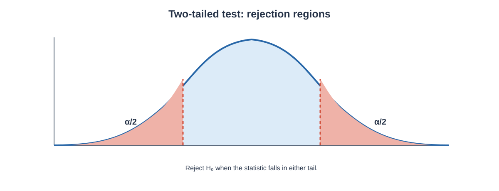
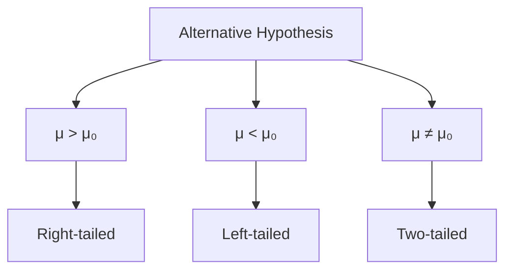

# Hypothesis Testing

Hypothesis testing is a statistical framework used to evaluate claims about a population using sample data.

In inferential statistics, we often do not have information about every member of a population. Instead, we collect a sample and use the sample evidence to evaluate a specific claim about an unknown population parameter.

For example, suppose a company claims that the average delivery time is 30 minutes. We can collect a random sample of delivery times and ask whether the sample provides sufficient statistical evidence to question the claim.

Hypothesis testing gives us a structured process for making this decision.

The central idea is not to prove that a claim is absolutely true or false. Instead, we begin with a **null hypothesis**, measure how unusual the observed sample result would be if that null hypothesis were true, and then decide whether the evidence is strong enough to reject the null hypothesis.

This chapter focuses on the complete foundation of hypothesis testing: null and alternative hypotheses, test statistics, significance level, p-values, critical values, one-tailed and two-tailed tests, errors, power, z-tests, t-tests, proportion tests, practical interpretation, assumptions, and common mistakes.

---

# 1. What Is a Hypothesis?

A **statistical hypothesis** is a statement about a population parameter or probability distribution.

Examples include:

- The population mean is 50.
- The population proportion is 0.40.
- The average lifetime of a product is greater than 1,000 hours.
- The population mean differs from 75.

A hypothesis is expressed in terms of a population parameter rather than an individual observation.

For example:

$$
\mu=50
$$

is a statement about a population mean.

Similarly:

$$
p=0.40
$$

is a statement about a population proportion.

---

# 2. Hypothesis Testing as a Decision Process

A hypothesis test can be viewed as a sequence:

The mathematical calculation is only one part of hypothesis testing.

**How to read this graph:** The central region contains test-statistic values more compatible with the null model. The shaded tails are rejection regions; for a two-tailed test, the significance level $\alpha$ is split between both tails ($\alpha/2$ each).

A correct hypothesis test also requires:

1. clearly defining the population parameter;
2. stating the null and alternative hypotheses;
3. selecting an appropriate test;
4. choosing a significance level;
5. calculating the test statistic;
6. obtaining the p-value or critical value;
7. making the statistical decision;
8. interpreting the result in the original context.

---

# 3. Null Hypothesis

The **null hypothesis**, written as $H_0$, represents the default claim or a specific population value against which evidence is evaluated.

Examples:

$$
H_0:\mu=50
$$

or:

$$
H_0:p=0.40
$$

The null hypothesis commonly contains an equality:

$$
=
$$

It can also be expressed using inequalities when the equivalent boundary formulation is appropriate.

The null hypothesis is not necessarily the researcher's preferred claim. It is the reference assumption used to evaluate the sample evidence.

---

# 4. Alternative Hypothesis

The **alternative hypothesis**, written as $H_1$ or $H_a$, represents the claim that is supported when the evidence is sufficiently inconsistent with the null hypothesis.

The three common forms are:

### Two-sided

$$
H_a:\mu\ne\mu_0
$$

### Right-tailed

$$
H_a:\mu>\mu_0
$$

### Left-tailed

$$
H_a:\mu<\mu_0
$$

The alternative hypothesis determines the direction of the test.

---

# 5. Null and Alternative Hypotheses Together

Suppose a company claims:

> The average delivery time is 30 minutes.

If we want to test whether the true average is different from 30 minutes:

$$
H_0:\mu=30
$$

$$
H_a:\mu\ne30
$$

This is a **two-tailed test** because deviations in either direction are considered evidence against the null hypothesis.

If we instead want to test whether delivery takes longer than claimed:

$$
H_0:\mu=30
$$

$$
H_a:\mu>30
$$

This is a **right-tailed test**.

If we want to test whether delivery is faster:

$$
H_0:\mu=30
$$

$$
H_a:\mu<30
$$

This is a **left-tailed test**.

---

# 6. The Equality Belongs to the Null Hypothesis

A common beginner mistake is to write:

$$
H_0:\mu\ne50
$$

and:

$$
H_a:\mu=50
$$

for an ordinary two-sided test.

The standard formulation is:

$$
H_0:\mu=50
$$

and:

$$
H_a:\mu\ne50
$$

The null hypothesis provides the reference value used to calculate the test statistic.

---

# 7. Significance Level

The **significance level**, denoted by $\alpha$, is the probability threshold used to decide when sample evidence is sufficiently unusual under the null hypothesis.

Common values include:

$$
\alpha=0.10
$$

$$
\alpha=0.05
$$

and:

$$
\alpha=0.01
$$

For example, if:

$$
\alpha=0.05
$$

we use a 5% significance level.

The significance level is selected **before** examining the result in a formal analysis.

---

# 8. Meaning of $\alpha=0.05$

A significance level of 0.05 means that the testing procedure allows a 5% probability of rejecting a true null hypothesis under the relevant assumptions.

This is called a **Type I error rate**.

It does not mean:

> There is a 5% probability that the null hypothesis is true.

That is an incorrect interpretation.

---

# 9. Test Statistic

A **test statistic** measures how far the observed sample result is from the value expected under the null hypothesis, usually after standardising by the relevant standard error.

For a mean with known population standard deviation:

$$
z=
\frac{\bar{x}-\mu_0}
{\sigma/\sqrt{n}}
$$

where:

- $\bar{x}$ = sample mean
- $\mu_0$ = mean specified by the null hypothesis
- $\sigma$ = population standard deviation
- $n$ = sample size

The numerator:

$$
\bar{x}-\mu_0
$$

is the difference between the observed sample mean and the null value.

The denominator:

$$
\frac{\sigma}{\sqrt{n}}
$$

is the standard error.

---

# 10. Interpreting a z Test Statistic

Suppose:

$$
z=2
$$

This means the observed sample mean is approximately two standard errors above the null-hypothesised mean.

If:

$$
z=-2
$$

the observed sample mean is approximately two standard errors below the null value.

A test statistic close to zero indicates that the observed sample result is relatively close to what the null hypothesis predicts.

A large absolute value:

$$
|z|
$$

indicates stronger disagreement with the null hypothesis.

---

# 11. p-Value

The **p-value** is the probability, assuming the null hypothesis is true, of obtaining a test statistic at least as extreme as the one observed, in the direction specified by the alternative hypothesis.

This definition has several important parts:

- assume $H_0$ is true;
- consider the observed test statistic;
- consider outcomes at least as extreme;
- use the direction specified by $H_a$.

A small p-value indicates that the observed result would be unusual under the null hypothesis.

---

# 12. p-Value Decision Rule

Compare the p-value with $\alpha$.

If:

$$
p\text{-value}\le\alpha
$$

then:

$$
\boxed{\text{Reject }H_0}
$$

If:

$$
p\text{-value}>\alpha
$$

then:

$$
\boxed{\text{Fail to reject }H_0}
$$

We normally do not say "accept $H_0$" merely because the p-value is larger than $\alpha$.

Failing to reject means that the sample does not provide sufficient evidence against the null hypothesis at the chosen significance level.

---

# 13. Why We Say "Fail to Reject"

Suppose a test produces:

$$
p=0.20
$$

with:

$$
\alpha=0.05
$$

Since:

$$
0.20>0.05
$$

we fail to reject $H_0$.

This does not prove that $H_0$ is true.

It means the evidence is not sufficiently strong to reject the null hypothesis under the chosen procedure.

---

# 14. Critical Value Method

Instead of calculating a p-value, we can compare the test statistic with a **critical value**.

For a two-sided z-test at:

$$
\alpha=0.05
$$

the critical values are approximately:

$$
-1.96
$$

and:

$$
+1.96
$$

The rejection region is:

$$
z<-1.96
$$

or:

$$
z>1.96
$$

Equivalently:

$$
|z|>1.96
$$

leads to rejection.

If:

$$
-1.96\le z\le1.96
$$

we fail to reject the null hypothesis.

---

# 15. p-Value Method vs Critical Value Method

Both methods lead to the same statistical decision when applied correctly.

| p-Value Method | Critical Value Method |
|---|---|
| Calculate p-value | Calculate test statistic |
| Compare p-value with $\alpha$ | Compare statistic with critical value |
| Reject if $p\le\alpha$ | Reject if statistic lies in rejection region |
| Often convenient with software | Useful for visualising rejection regions |

The p-value method is commonly used in practical data analysis because software reports p-values directly.

---

# 16. One-Tailed and Two-Tailed Tests

The alternative hypothesis determines the tail structure.

### Right-tailed

$$
H_a:\mu>\mu_0
$$

The rejection region is in the right tail.

### Left-tailed

$$
H_a:\mu<\mu_0
$$

The rejection region is in the left tail.

### Two-tailed

$$
H_a:\mu\ne\mu_0
$$

The rejection regions are in both tails.

---

# 17. Right-Tailed Test

Suppose:

$$
H_0:\mu=50
$$

and:

$$
H_a:\mu>50
$$

The test asks whether the sample provides evidence that the population mean is **greater than 50**.

For a z-test at $\alpha=0.05$:

$$
z^*=1.645
$$

Reject if:

$$
z>1.645
$$

The entire significance level is placed in the right tail.

---

# 18. Left-Tailed Test

Suppose:

$$
H_0:\mu=50
$$

and:

$$
H_a:\mu<50
$$

At $\alpha=0.05$:

$$
z^*=-1.645
$$

Reject if:

$$
z<-1.645
$$

The significance level is placed in the left tail.

---

# 19. Two-Tailed Test

Suppose:

$$
H_0:\mu=50
$$

and:

$$
H_a:\mu\ne50
$$

At:

$$
\alpha=0.05
$$

the significance level is split between the two tails:

$$
\frac{\alpha}{2}=0.025
$$

in each tail.

The critical values are:

$$
-1.96
$$

and:

$$
+1.96
$$

Reject if:

$$
|z|>1.96
$$

---

# 20. Type I Error

A **Type I error** occurs when we reject a true null hypothesis.

Symbolically:

$$
\text{Reject }H_0
\quad\text{when }H_0\text{ is true}
$$

The probability of a Type I error is controlled by $\alpha$.

Therefore:

$$
P(\text{Type I Error})=\alpha
$$

under the standard testing framework.

For example, if:

$$
\alpha=0.05
$$

the procedure has a 5% Type I error rate under the relevant assumptions.

---

# 21. Type II Error

A **Type II error** occurs when we fail to reject a false null hypothesis.

Symbolically:

$$
\text{Fail to reject }H_0
\quad\text{when }H_0\text{ is false}
$$

The probability of a Type II error is denoted by:

$$
\beta
$$

Therefore:

$$
P(\text{Type II Error})=\beta
$$

---

# 22. Type I and Type II Errors Together

| Reality | Decision | Result |
|---|---|---|
| $H_0$ true | Reject $H_0$ | Type I error |
| $H_0$ true | Fail to reject $H_0$ | Correct decision |
| $H_0$ false | Reject $H_0$ | Correct rejection |
| $H_0$ false | Fail to reject $H_0$ | Type II error |

This table is useful for remembering the two types of error.

---

# 23. Statistical Power

The **power** of a hypothesis test is the probability of correctly rejecting a false null hypothesis.

Power is:

$$
Power=1-\beta
$$

A test with high power is more likely to detect a real difference when one exists.

Power depends on factors such as:

- sample size;
- effect size;
- variability;
- significance level;
- whether the test is one-tailed or two-tailed.

Increasing sample size generally increases power when the other factors remain appropriate.

---

# 24. Factors That Increase Power

### Larger sample size

A larger sample generally reduces standard error and makes real departures from the null easier to detect.

### Larger true effect

If the true population parameter is farther from the null value, it is easier for the test to detect the difference.

### Lower variability

Less variability produces a smaller standard error and can make the signal easier to detect.

### Larger significance level

Increasing $\alpha$ makes rejection easier, which generally increases power but also increases the Type I error rate.

There is therefore a trade-off.

---

# 25. z-Test for a Population Mean

When the population standard deviation $\sigma$ is known, a one-sample z-test for a mean uses:

$$
z=
\frac{\bar{x}-\mu_0}
{\sigma/\sqrt{n}}
$$

where:

- $\bar{x}$ = sample mean
- $\mu_0$ = null-hypothesised mean
- $\sigma$ = known population standard deviation
- $n$ = sample size

---

## Worked Example: One-Sample z-Test

A company claims that the average delivery time is 30 minutes.

A random sample of 100 deliveries has:

$$
\bar{x}=32
$$

Suppose:

$$
\sigma=10
$$

We test:

$$
H_0:\mu=30
$$

against:

$$
H_a:\mu\ne30
$$

at:

$$
\alpha=0.05
$$

### Step 1: Calculate the standard error

$$
SE=
\frac{10}{\sqrt{100}}
$$

$$
=\frac{10}{10}
$$

$$
=1
$$

### Step 2: Calculate the test statistic

$$
z=
\frac{32-30}{1}
$$

$$
=2
$$

### Step 3: Compare with critical values

For a two-tailed test at 5%:

$$
z^*=\pm1.96
$$

Since:

$$
|2|>1.96
$$

we reject the null hypothesis.

### Conclusion

$$
\boxed{\text{Reject }H_0}
$$

There is sufficient statistical evidence at the 5% significance level that the population mean delivery time differs from 30 minutes.

---

# 26. p-Value for the Same z-Test

For:

$$
z=2
$$

in a two-tailed test:

$$
p=2P(Z\ge2)
$$

Using the standard normal distribution:

$$
P(Z\ge2)\approx0.0228
$$

Therefore:

$$
p\approx2(0.0228)
$$

$$
p\approx0.0456
$$

Since:

$$
0.0456<0.05
$$

we reject $H_0$.

The p-value and critical-value approaches give the same conclusion.

---

# 27. Right-Tailed z-Test Worked Example

Suppose a manufacturer claims that a machine produces an average of 100 units per hour.

We want to determine whether the actual mean production is **greater than 100**.

Given:

$$
\bar{x}=103
$$

$$
\sigma=12
$$

$$
n=64
$$

Test:

$$
H_0:\mu=100
$$

$$
H_a:\mu>100
$$

Use:

$$
\alpha=0.05
$$

Standard error:

$$
SE=\frac{12}{\sqrt{64}}
$$

$$
=\frac{12}{8}
$$

$$
=1.5
$$

Test statistic:

$$
z=
\frac{103-100}{1.5}
$$

$$
=2
$$

For a right-tailed 5% test:

$$
z^*=1.645
$$

Since:

$$
2>1.645
$$

we reject $H_0$.

Thus, there is sufficient evidence that the mean production rate is greater than 100 units per hour.

---

# 28. Left-Tailed z-Test Worked Example

Suppose a filling machine is expected to fill bottles with an average of 500 ml.

We want to test whether it is **underfilling**.

Given:

$$
\bar{x}=496
$$

$$
\sigma=12
$$

$$
n=36
$$

Hypotheses:

$$
H_0:\mu=500
$$

$$
H_a:\mu<500
$$

At:

$$
\alpha=0.05
$$

Standard error:

$$
SE=\frac{12}{\sqrt{36}}
$$

$$
=2
$$

Test statistic:

$$
z=
\frac{496-500}{2}
$$

$$
=-2
$$

The left-tail critical value is:

$$
-1.645
$$

Since:

$$
-2<-1.645
$$

we reject $H_0$.

There is sufficient evidence that the machine's mean fill amount is below 500 ml.

---

# 29. One-Sample t-Test

When the population standard deviation is unknown, the one-sample t-test is commonly used for testing a population mean.

The test statistic is:

$$
t=
\frac{\bar{x}-\mu_0}
{s/\sqrt{n}}
$$

where:

- $\bar{x}$ = sample mean
- $\mu_0$ = null-hypothesised mean
- $s$ = sample standard deviation
- $n$ = sample size

Degrees of freedom:

$$
df=n-1
$$

---

# 30. Worked Example: One-Sample t-Test

Suppose a sample of 16 observations has:

$$
\bar{x}=52
$$

$$
s=8
$$

We want to test:

$$
H_0:\mu=50
$$

against:

$$
H_a:\mu\ne50
$$

at:

$$
\alpha=0.05
$$

### Step 1: Degrees of freedom

$$
df=16-1=15
$$

### Step 2: Standard error

$$
SE=\frac{8}{\sqrt{16}}
$$

$$
=\frac{8}{4}
$$

$$
=2
$$

### Step 3: Test statistic

$$
t=
\frac{52-50}{2}
$$

$$
=1
$$

### Step 4: Critical value

For a two-tailed 5% test with 15 degrees of freedom:

$$
t^*\approx2.131
$$

### Step 5: Decision

Since:

$$
|1|<2.131
$$

we fail to reject $H_0$.

### Conclusion

There is not sufficient statistical evidence at the 5% level that the population mean differs from 50.

---

# 31. z-Test vs t-Test

| z-Test | t-Test |
|---|---|
| Population SD $\sigma$ known | Population SD usually unknown |
| Uses $\sigma$ | Uses sample SD $s$ |
| Uses standard normal distribution | Uses t-distribution |
| Critical value does not depend on sample degrees of freedom | Critical value depends on degrees of freedom |
| Common in theoretical/known-$\sigma$ situations | Common for one-sample means with unknown $\sigma$ |

The distinction should be based on the assumptions and available information, not simply on whether the sample is "small" or "large."

---

# 32. Test for a Population Proportion

Suppose we want to test:

$$
H_0:p=p_0
$$

The sample proportion is:

$$
\hat{p}=\frac{x}{n}
$$

Under the null hypothesis, the standard error used for the one-proportion z-test is:

$$
SE_0=
\sqrt{
\frac{p_0(1-p_0)}{n}
}
$$

The test statistic is:

$$
z=
\frac{\hat{p}-p_0}
{
\sqrt{
\frac{p_0(1-p_0)}{n}
}
}
$$

Notice that the null value $p_0$, rather than $\hat{p}$, is used in the denominator for the hypothesis test.

---

# 33. Worked Example: One-Proportion z-Test

A company claims that 60% of customers are satisfied.

A sample of 200 customers contains 140 satisfied customers.

Then:

$$
\hat{p}=\frac{140}{200}
$$

$$
=0.70
$$

We test:

$$
H_0:p=0.60
$$

against:

$$
H_a:p\ne0.60
$$

at:

$$
\alpha=0.05
$$

### Step 1: Null standard error

$$
SE_0=
\sqrt{
\frac{0.60(0.40)}{200}
}
$$

$$
=
\sqrt{0.0012}
$$

$$
\approx0.0346
$$

### Step 2: Test statistic

$$
z=
\frac{0.70-0.60}{0.0346}
$$

$$
\approx2.89
$$

### Step 3: Decision

For a two-tailed test at 5%:

$$
|z|>1.96
$$

Therefore:

$$
\boxed{\text{Reject }H_0}
$$

There is sufficient statistical evidence that the population satisfaction proportion differs from 60%.

---

# 34. Hypothesis Testing for a Difference Between Two Means

Suppose two independent groups have population means:

$$
\mu_1
$$

and:

$$
\mu_2
$$

We may test:

$$
H_0:\mu_1-\mu_2=0
$$

against:

$$
H_a:\mu_1-\mu_2\ne0
$$

A common estimated standard error for independent samples is:

$$
SE=
\sqrt{
\frac{s_1^2}{n_1}
+
\frac{s_2^2}{n_2}
}
$$

The test statistic can be formed as:

$$
t=
\frac{
(\bar{x}_1-\bar{x}_2)-0
}
{
\sqrt{
\frac{s_1^2}{n_1}
+
\frac{s_2^2}{n_2}
}
}
$$

When population variances are unknown and may differ, **Welch's t-test** is commonly preferred.

---

# 35. Worked Example: Difference Between Two Means

Suppose:

| Group | Mean | SD | n |
|---|---:|---:|---:|
| Group 1 | 82 | 10 | 100 |
| Group 2 | 78 | 12 | 144 |

We test:

$$
H_0:\mu_1-\mu_2=0
$$

against:

$$
H_a:\mu_1-\mu_2\ne0
$$

Estimated difference:

$$
82-78=4
$$

Standard error:

$$
SE=
\sqrt{
\frac{10^2}{100}
+
\frac{12^2}{144}
}
$$

$$
=
\sqrt{1+1}
$$

$$
=\sqrt{2}
$$

$$
\approx1.414
$$

Approximate test statistic:

$$
t=
\frac{4}{1.414}
$$

$$
\approx2.83
$$

A formal Welch test would use the appropriate Welch-Satterthwaite degrees of freedom and corresponding p-value.

The large absolute test statistic indicates evidence against the null hypothesis under the stated assumptions.

---

# 36. Hypothesis Test for Difference Between Two Proportions

Suppose:

$$
H_0:p_1-p_2=0
$$

The sample proportions are:

$$
\hat{p}_1
$$

and:

$$
\hat{p}_2
$$

Under the null hypothesis of equal proportions, the **pooled proportion** is commonly used:

$$
\hat{p}_{pooled}
=
\frac{x_1+x_2}{n_1+n_2}
$$

The null standard error is:

$$
SE_0=
\sqrt{
\hat{p}_{pooled}(1-\hat{p}_{pooled})
\left(
\frac{1}{n_1}+\frac{1}{n_2}
\right)
}
$$

The test statistic is:

$$
z=
\frac{\hat{p}_1-\hat{p}_2}
{SE_0}
$$

This is a hypothesis-testing formula. It differs from the confidence-interval standard error for estimating an unknown difference.

---

# 37. p-Value Interpretation

Suppose a test gives:

$$
p=0.003
$$

and:

$$
\alpha=0.05
$$

Because:

$$
0.003<0.05
$$

we reject the null hypothesis.

A correct interpretation is:

> The observed data provide strong statistical evidence against the null hypothesis at the 5% significance level.

A p-value is **not**:

- the probability that the null hypothesis is true;
- the probability that the alternative hypothesis is true;
- the probability that the result occurred by chance;
- the size of the effect.

---

# 38. Very Small p-Value Does Not Mean Large Effect

A very small p-value indicates strong evidence against the null hypothesis under the model.

It does not by itself tell us how large the effect is.

For example, with a very large sample, a tiny difference from the null value can produce a very small p-value.

Therefore, statistical inference should consider both:

- statistical evidence;
- effect magnitude and practical context.

Hypothesis testing answers a question about evidence against a null hypothesis. It does not replace estimation of the effect.

---

# 39. Statistical Significance

A result is called **statistically significant** at level $\alpha$ when:

$$
p\le\alpha
$$

and the null hypothesis is rejected.

For example:

$$
p=0.02
$$

at:

$$
\alpha=0.05
$$

is statistically significant.

But:

$$
p=0.08
$$

at:

$$
\alpha=0.05
$$

is not statistically significant.

Statistical significance should not automatically be interpreted as practical importance.

---

# 40. Confidence Intervals and Hypothesis Tests

Confidence intervals and two-sided hypothesis tests are closely related.

For many standard procedures, a 95% confidence interval corresponds to a two-sided hypothesis test at:

$$
\alpha=0.05
$$

For example, suppose we test:

$$
H_0:\mu=50
$$

at:

$$
\alpha=0.05
$$

If the corresponding 95% confidence interval does not contain 50, the two-sided test rejects $H_0$.

If the interval contains 50, the test fails to reject $H_0$.

This relationship is one reason confidence intervals are valuable: they show not only whether a null value is compatible with the data but also a range of plausible parameter values.

---

# 41. Complete Hypothesis Testing Workflow

A reliable workflow is:

### Step 1: Identify the population parameter

For example:

$$
\mu=\text{population mean}
$$

### Step 2: State the hypotheses

For example:

$$
H_0:\mu=50
$$

$$
H_a:\mu\ne50
$$

### Step 3: Select $\alpha$

For example:

$$
\alpha=0.05
$$

### Step 4: Select the appropriate test

For example, a one-sample t-test if $\sigma$ is unknown.

### Step 5: Calculate the test statistic

For a one-sample t-test:

$$
t=
\frac{\bar{x}-\mu_0}
{s/\sqrt{n}}
$$

### Step 6: Find the p-value or critical value

Use the appropriate probability distribution.

### Step 7: Make the decision

$$
p\le\alpha
\Rightarrow
\text{Reject }H_0
$$

otherwise:

$$
p>\alpha
\Rightarrow
\text{Fail to reject }H_0
$$

### Step 8: Interpret in context

Explain what the result means for the original research question.

---

# 42. Complete Worked Example

Suppose a university claims that the average daily study time of students is 4 hours.

A random sample of 36 students gives:

$$
\bar{x}=4.5
$$

and:

$$
s=1.2
$$

Test at:

$$
\alpha=0.05
$$

whether the population mean is different from 4 hours.

## Step 1: Hypotheses

$$
H_0:\mu=4
$$

$$
H_a:\mu\ne4
$$

This is two-tailed.

## Step 2: Degrees of freedom

$$
df=36-1=35
$$

## Step 3: Standard error

$$
SE=
\frac{1.2}{\sqrt{36}}
$$

$$
=\frac{1.2}{6}
$$

$$
=0.2
$$

## Step 4: Test statistic

$$
t=
\frac{4.5-4}{0.2}
$$

$$
=2.5
$$

## Step 5: Critical value

For a two-tailed test with:

$$
df=35
$$

and:

$$
\alpha=0.05
$$

the critical value is approximately:

$$
t^*\approx2.030
$$

## Step 6: Decision

Since:

$$
|2.5|>2.030
$$

we reject $H_0$.

## Final conclusion

$$
\boxed{\text{Reject }H_0}
$$

There is sufficient statistical evidence at the 5% significance level that the population mean daily study time differs from 4 hours.

---

# 43. Assumptions for a One-Sample Mean Test

A one-sample mean test generally requires attention to:

### Random sampling

The sample should be collected in a way that supports the intended inference.

### Independence

The observations should be independent when the method assumes independence.

### Distributional shape

For small samples, the population should be reasonably close to normal, especially when using the t procedure.

For larger samples, the sampling distribution of the mean can often be approximately normal under suitable conditions.

### No severe outliers

Extreme observations can strongly affect the sample mean and t statistic.

Assumptions should be checked rather than automatically assumed.

---

# 44. Assumptions for a Proportion Test

For the normal approximation to a one-proportion test, the expected numbers of successes and failures under the null are commonly checked:

$$
np_0\ge10
$$

and:

$$
n(1-p_0)\ge10
$$

These conditions help support the normal approximation.

For small samples, exact or alternative methods may be more appropriate.

---

# 45. Independent vs Paired Data

Two-sample methods require careful attention to how observations are related.

### Independent samples

The observations in one group are unrelated to observations in the other group.

Example:

- randomly selected students from two unrelated groups.

### Paired data

Observations are naturally matched.

Examples include:

- before-and-after measurements on the same people;
- matched subjects;
- repeated measurements on the same unit.

Paired data should generally be analysed through the within-pair differences rather than treating the two measurements as independent groups.

---

# 46. Paired t-Test Concept

Suppose each subject has a before measurement and an after measurement.

For each pair:

$$
d_i=After_i-Before_i
$$

Calculate the mean difference:

$$
\bar{d}
$$

and standard deviation of differences:

$$
s_d
$$

The paired t statistic is:

$$
t=
\frac{\bar{d}-\mu_{d,0}}
{s_d/\sqrt{n}}
$$

Usually the null hypothesis is:

$$
H_0:\mu_d=0
$$

The test is therefore a one-sample t-test applied to the paired differences.

---

# 47. Common Mistakes in Hypothesis Testing

### Mistake 1: Writing the hypotheses incorrectly

Always identify the population parameter first.

### Mistake 2: Putting the equality in the wrong hypothesis

The standard null hypothesis contains the equality for ordinary hypothesis tests.

### Mistake 3: Choosing the tail after seeing the result

The direction of the alternative hypothesis should be determined by the research question before analysing the result.

### Mistake 4: Saying "accept the null hypothesis"

Prefer:

> Fail to reject the null hypothesis.

### Mistake 5: Treating p-value as the probability that $H_0$ is true

A p-value is calculated under the assumption that $H_0$ is true.

### Mistake 6: Confusing statistical significance with practical importance

A statistically significant result may have a very small practical effect.

### Mistake 7: Ignoring assumptions

A test statistic and p-value are only meaningful when the underlying method is reasonably appropriate.

### Mistake 8: Using a sample standard deviation in a z formula as if it were a known population standard deviation

If $\sigma$ is unknown for a one-sample mean, a t-based procedure is commonly appropriate.

### Mistake 9: Forgetting the correct standard error

Different tests have different standard-error formulas.

### Mistake 10: Reporting only "significant" or "not significant"

A good result should report the test, estimate where useful, test statistic, p-value, significance level, and contextual conclusion.

---

# 48. Reporting a Hypothesis Test

A concise statistical report can include:

1. Hypotheses
2. Test used
3. Test statistic
4. Degrees of freedom, when applicable
5. p-value
6. Significance level
7. Decision
8. Contextual conclusion

For example:

> A one-sample t-test was conducted to test whether the population mean differs from 50. The test produced $t=2.50$ with 35 degrees of freedom. At $\alpha=0.05$, the null hypothesis was rejected, providing evidence that the population mean differs from 50.

This is much more informative than simply writing:

> Result is significant.

---

# 49. Relationship Between $\alpha$, p-Value, and Decision

The basic relationship is:

$$
p\le\alpha
\Rightarrow
\text{Reject }H_0
$$

and:

$$
p>\alpha
\Rightarrow
\text{Fail to reject }H_0
$$

Examples:

| p-value | $\alpha$ | Decision |
|---:|---:|---|
| 0.001 | 0.05 | Reject $H_0$ |
| 0.02 | 0.05 | Reject $H_0$ |
| 0.05 | 0.05 | Reject $H_0$ under the stated rule |
| 0.08 | 0.05 | Fail to reject $H_0$ |
| 0.20 | 0.05 | Fail to reject $H_0$ |

The equality case depends on the stated decision convention; the common rule is to reject when $p\le\alpha$.

---

# 50. What Happens When $\alpha$ Changes?

Suppose a p-value is:

$$
p=0.04
$$

At:

$$
\alpha=0.05
$$

we reject $H_0$.

But at:

$$
\alpha=0.01
$$

we fail to reject $H_0$.

Therefore, the decision depends on the significance level selected before the test.

A stricter significance level requires stronger evidence against the null hypothesis.

---

# 51. One-Sided vs Two-Sided Testing

A one-sided test asks whether the parameter differs in a **specified direction**.

For example:

$$
H_a:\mu>50
$$

A two-sided test asks whether the parameter differs in either direction:

$$
H_a:\mu\ne50
$$

A one-sided test should not be selected merely because it makes it easier to obtain significance.

The direction must be justified by the research question and study design.

---

# 52. Practical Significance

Suppose a sample of one million observations produces:

$$
p<0.001
$$

for a mean difference of only:

$$
0.01
$$

The result may be statistically significant because the sample is enormous.

But whether a difference of 0.01 matters in practice depends on the application.

Therefore, a complete analysis should consider:

- estimated effect;
- uncertainty;
- statistical evidence;
- practical context.

---

# 53. Multiple Testing Awareness

When many hypothesis tests are conducted, the probability of obtaining at least one false positive can increase.

For example, if many independent tests are performed at:

$$
\alpha=0.05
$$

some tests may produce small p-values simply by chance.

This chapter introduces the issue only. Methods for controlling the family-wise error rate or false discovery rate are more specialised topics and should be handled separately when required.

The important foundation is:

> More tests create more opportunities for false-positive findings.

---

# 54. Hypothesis Testing vs Estimation

Hypothesis testing and confidence intervals are closely related, but they answer slightly different questions.

| Hypothesis Testing | Estimation |
|---|---|
| Evaluates a specific null claim | Estimates a parameter |
| Produces a test statistic and p-value | Produces point/interval estimates |
| Focuses on evidence against $H_0$ | Focuses on magnitude and uncertainty |
| Decision often based on $\alpha$ | Interval based on confidence level |

A good statistical analysis often reports an estimate and its uncertainty rather than relying on a binary significant/not-significant statement alone.

---

# 55. Quick Test Selection Guide

| Situation | Common Basic Test |
|---|---|
| One population mean, known $\sigma$ | One-sample z-test |
| One population mean, unknown $\sigma$ | One-sample t-test |
| One population proportion | One-proportion z-test when approximation conditions are met |
| Two independent means | Two-sample t procedure |
| Paired measurements | Paired t-test |
| Two independent proportions | Two-proportion test |

The exact test should always be selected based on the data structure and assumptions.

ANOVA, chi-square tests, correlation tests, and regression inference belong to their respective later chapters rather than this chapter.

---

# 56. Important Formula Summary

## One-Sample z Statistic for a Mean

$$
z=
\frac{\bar{x}-\mu_0}
{\sigma/\sqrt{n}}
$$

## One-Sample t Statistic

$$
t=
\frac{\bar{x}-\mu_0}
{s/\sqrt{n}}
$$

with:

$$
df=n-1
$$

## One-Proportion z Statistic

$$
z=
\frac{\hat{p}-p_0}
{
\sqrt{
\frac{p_0(1-p_0)}{n}
}
}
$$

## Sample Proportion

$$
\hat{p}=\frac{x}{n}
$$

## Two-Sample Mean Standard Error

$$
SE=
\sqrt{
\frac{s_1^2}{n_1}
+
\frac{s_2^2}{n_2}
}
$$

## Pooled Proportion

$$
\hat{p}_{pooled}
=
\frac{x_1+x_2}{n_1+n_2}
$$

## Type I Error

$$
P(\text{Type I Error})=\alpha
$$

## Type II Error

$$
P(\text{Type II Error})=\beta
$$

## Power

$$
Power=1-\beta
$$

## p-Value Decision

$$
p\le\alpha
\Rightarrow
\text{Reject }H_0
$$

$$
p>\alpha
\Rightarrow
\text{Fail to reject }H_0
$$

---

# 57. Points to Remember

1. A statistical hypothesis is a claim about a population.
2. The null hypothesis is written as $H_0$.
3. The alternative hypothesis is written as $H_a$ or $H_1$.
4. The null hypothesis normally contains the equality.
5. The alternative determines whether the test is one-tailed or two-tailed.
6. $\alpha$ is the chosen significance level.
7. A p-value is calculated assuming the null hypothesis is true.
8. A small p-value provides stronger evidence against $H_0$.
9. Reject $H_0$ when $p\le\alpha$ under the standard decision rule.
10. If $p>\alpha$, fail to reject $H_0$.
11. Failing to reject $H_0$ does not prove that $H_0$ is true.
12. A Type I error means rejecting a true null hypothesis.
13. A Type II error means failing to reject a false null hypothesis.
14. Power is $1-\beta$.
15. A one-sample z-test for a mean assumes the population standard deviation is known.
16. A one-sample t-test uses the sample standard deviation when the population standard deviation is unknown.
17. For a one-sample t-test, $df=n-1$.
18. The null value is used when calculating the null standard error for a one-proportion z-test.
19. Statistical significance does not automatically imply practical importance.
20. Hypotheses should be specified before examining the test result.
21. Assumptions must be checked.
22. A p-value is not the probability that the null hypothesis is true.
23. Confidence intervals and two-sided hypothesis tests are closely related.
24. Reporting only "significant" is not a complete statistical conclusion.
25. The effect size and uncertainty should be considered along with the hypothesis-test decision.

---

# 58. Chapter Summary

Hypothesis testing provides a formal framework for evaluating population claims using sample evidence.

The process begins by identifying the population parameter and translating the research question into a **null hypothesis** and an **alternative hypothesis**. The null hypothesis represents the reference claim, while the alternative describes the departure that the test is designed to detect.

The significance level $\alpha$ defines the decision threshold. A test statistic measures how far the observed sample result is from the null value relative to its standard error. The resulting p-value measures how unusual the observed result, or something more extreme, would be if the null hypothesis were true.

The two basic decisions are:

$$
p\le\alpha
\Rightarrow
\text{Reject }H_0
$$

and:

$$
p>\alpha
\Rightarrow
\text{Fail to reject }H_0
$$

Hypothesis tests may be right-tailed, left-tailed, or two-tailed depending on the alternative hypothesis.

A **Type I error** occurs when a true null hypothesis is rejected, while a **Type II error** occurs when a false null hypothesis is not rejected. The power of a test is:

$$
Power=1-\beta
$$

For population means, a z-test is used in the known-$\sigma$ setting, while a t-test is commonly used when $\sigma$ is unknown. Proportion tests use the appropriate binomial-to-normal approximation when its conditions are satisfied. Two-sample and paired tests require additional attention to the structure of the observations.

A hypothesis test should never be reduced to the p-value alone. A good analysis considers the estimated effect, uncertainty, assumptions, statistical evidence, and practical context.

The overall process can be summarised as:

$$
\boxed{
\text{Research Question}
\rightarrow
H_0,H_a
\rightarrow
\alpha
\rightarrow
\text{Test Statistic}
\rightarrow
\text{p-Value/Critical Value}
\rightarrow
\text{Decision}
\rightarrow
\text{Contextual Conclusion}
}
$$

---

# 59. References

- OpenStax, *Introductory Statistics*.
- NIST/SEMATECH, *e-Handbook of Statistical Methods*.
- Penn State Eberly College of Science, *STAT Online*.
- Montgomery & Runger, *Applied Statistics and Probability for Engineers*.
- Casella & Berger, *Statistical Inference*.
