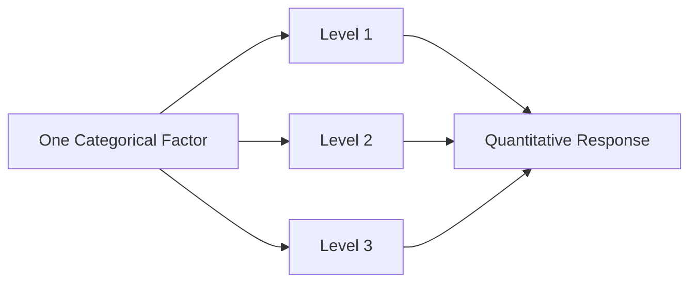
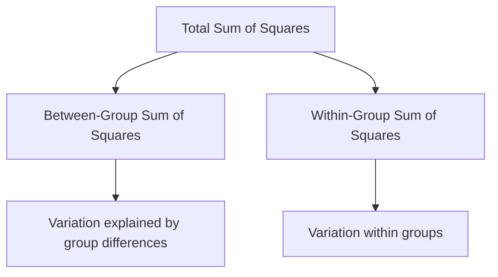
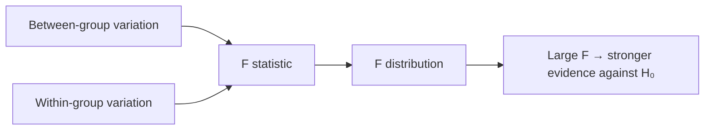

# ANOVA

ANOVA stands for **Analysis of Variance**.

ANOVA is a statistical method used to compare the means of multiple groups. The name can initially seem confusing because the main question is about **means**, while the calculation is based on **variability**.

The central idea is to compare two kinds of variation:

1. **Variation between groups** — how much the group means differ from one another.
2. **Variation within groups** — how much individual observations vary around their own group mean.

If the variation between groups is sufficiently large compared with the variation within groups, the data provide evidence that not all population means are equal.

A one-way ANOVA is especially useful when we want to compare three or more independent group means using one overall statistical test.

For example, suppose a researcher wants to compare the average exam score of students taught using three different teaching methods:

- Method A
- Method B
- Method C

Instead of performing several separate pairwise t-tests, a one-way ANOVA can test the overall equality of the group means.

This chapter focuses on the foundations of ANOVA, especially **one-way ANOVA**. It covers the logic of ANOVA, hypotheses, total/between/within variation, sums of squares, degrees of freedom, mean squares, the F-statistic, p-values, assumptions, ANOVA tables, effect size, post-hoc comparisons, and practical interpretation.

---

# 1. Why Do We Need ANOVA?

Suppose we have three groups:

| Group | Mean |
|---|---:|
| A | 70 |
| B | 74 |
| C | 82 |

We may want to know whether these observed differences are large enough to provide evidence that the population means are different.

If we compare the groups one pair at a time, we would need:

- A vs B
- A vs C
- B vs C

As the number of groups increases, the number of pairwise comparisons grows quickly.

ANOVA provides a single overall test of the null hypothesis that all population means are equal.

For $k$ groups:

$$
H_0:\mu_1=\mu_2=\cdots=\mu_k
$$

The alternative hypothesis is:

$$
H_a:\text{At least one population mean differs}
$$

Notice that the alternative hypothesis does **not** say that every mean is different.

---

# 2. One-Way ANOVA

A **one-way ANOVA** examines the effect of one categorical factor on a quantitative response variable.

For example:

- Factor: teaching method
- Levels: Method A, Method B, Method C
- Response: exam score

The factor has one dimension, which is why this is called **one-way ANOVA**.



The factor creates the groups whose means we want to compare.

---

# 3. Examples of One-Way ANOVA

One-way ANOVA can be used when comparing:

- average test scores across teaching methods;
- average production output across machine settings;
- average customer satisfaction across service plans;
- average response time across three or more systems;
- average measurement across several experimental conditions.

The response variable should be quantitative for the standard one-way ANOVA framework.

The grouping variable is categorical.

---

# 4. ANOVA Hypotheses

Suppose there are $k$ groups.

The null hypothesis is:

$$
H_0:\mu_1=\mu_2=\cdots=\mu_k
$$

The alternative hypothesis is:

$$
H_a:\text{At least one }\mu_i\text{ differs}
$$

For three groups:

$$
H_0:\mu_1=\mu_2=\mu_3
$$

and:

$$
H_a:\text{At least one population mean is different}
$$

The ANOVA test does not initially identify which particular groups differ.

That question is handled using appropriate **post-hoc comparisons** after a significant overall ANOVA result.

---

# 5. Why Is It Called Analysis of Variance?

Suppose the observations are divided into groups.

There are two major sources of variation.

### Within-group variation

Observations in the same group are not identical. They vary around their group mean.

### Between-group variation

The group means may differ from one another.

ANOVA compares these two sources of variation.

Conceptually:

$$
\boxed{
\text{Total Variation}
=
\text{Between-Group Variation}
+
\text{Within-Group Variation}
}
$$

If the group means are genuinely different, the between-group variation tends to be large relative to the within-group variation.

---

# 6. A Simple Example of Group Variation

Consider three groups:

| Group A | Group B | Group C |
|---:|---:|---:|
| 8 | 15 | 22 |
| 10 | 14 | 21 |
| 12 | 16 | 23 |

Group means:

$$
\bar{x}_A=10
$$

$$
\bar{x}_B=15
$$

$$
\bar{x}_C=22
$$

The group means are clearly separated.

Now imagine instead:

| Group A | Group B | Group C |
|---:|---:|---:|
| 10 | 10 | 11 |
| 11 | 12 | 10 |
| 12 | 11 | 12 |

The group means are much closer.

ANOVA asks whether the observed separation of group means is large compared with the variability within the groups.

---

# 7. Grand Mean

The **grand mean** is the mean of all observations combined.

If there are $N$ total observations:

$$
\bar{x}_{grand}
=
\frac{1}{N}
\sum_{i=1}^{N}x_i
$$

When groups have different sizes, the grand mean is naturally weighted by the number of observations in each group.

If group $i$ has $n_i$ observations and mean $\bar{x}_i$, then:

$$
\bar{x}_{grand}
=
\frac{
\sum_{i=1}^{k}n_i\bar{x}_i
}{
\sum_{i=1}^{k}n_i
}
$$

---

# 8. Worked Example: Grand Mean

Suppose:

| Group | Observations | Mean |
|---|---|---:|
| A | 10, 12, 14 | 12 |
| B | 16, 18, 20 | 18 |
| C | 22, 24, 26 | 24 |

There are:

$$
N=9
$$

total observations.

The grand mean is:

$$
\bar{x}_{grand}
=
\frac{
10+12+14+16+18+20+22+24+26
}{9}
$$

The sum is:

$$
162
$$

Therefore:

$$
\bar{x}_{grand}
=
\frac{162}{9}
$$

$$
\boxed{\bar{x}_{grand}=18}
$$

The grand mean provides the overall reference point for decomposing total variability.

---

# 9. Total Variation

Total variation measures how far every observation is from the grand mean.

The **total sum of squares** is:

$$
SS_{Total}
=
\sum_{i=1}^{N}
(x_i-\bar{x}_{grand})^2
$$

A large value means that the observations are widely spread around the grand mean.

A small value means that the observations are concentrated near the grand mean.

---

# 10. Between-Group Variation

Between-group variation measures how far each group mean is from the grand mean.

The **between-group sum of squares** is:

$$
SS_{Between}
=
\sum_{i=1}^{k}
n_i(\bar{x}_i-\bar{x}_{grand})^2
$$

where:

- $k$ = number of groups
- $n_i$ = sample size of group $i$
- $\bar{x}_i$ = mean of group $i$
- $\bar{x}_{grand}$ = grand mean

The factor $n_i$ appears because each group mean represents $n_i$ observations.

---

# 11. Within-Group Variation

Within-group variation measures how far individual observations are from their own group mean.

The **within-group sum of squares** is:

$$
SS_{Within}
=
\sum_{i=1}^{k}
\sum_{j=1}^{n_i}
(x_{ij}-\bar{x}_i)^2
$$

where:

- $x_{ij}$ = observation $j$ in group $i$
- $\bar{x}_i$ = mean of group $i$

This measures the variation that remains inside the groups.

---

# 12. Fundamental ANOVA Decomposition

The three sums of squares are related by:

$$
SS_{Total}
=
SS_{Between}
+
SS_{Within}
$$

This is the central variance-decomposition identity of one-way ANOVA.

The idea can be visualised as:



The total variation is separated into the part associated with group differences and the part remaining within groups.

---

# 13. Worked Example: Sum of Squares

Use the data:

| Group A | Group B | Group C |
|---:|---:|---:|
| 10 | 16 | 22 |
| 12 | 18 | 24 |
| 14 | 20 | 26 |

The group means are:

$$
\bar{x}_A=12
$$

$$
\bar{x}_B=18
$$

$$
\bar{x}_C=24
$$

and the grand mean is:

$$
\bar{x}_{grand}=18
$$

## Total Sum of Squares

For Group A:

$$
(10-18)^2+(12-18)^2+(14-18)^2
$$

$$
=64+36+16
$$

$$
=116
$$

For Group B:

$$
(16-18)^2+(18-18)^2+(20-18)^2
$$

$$
=4+0+4
$$

$$
=8
$$

For Group C:

$$
(22-18)^2+(24-18)^2+(26-18)^2
$$

$$
=16+36+64
$$

$$
=116
$$

Therefore:

$$
SS_{Total}=116+8+116
$$

$$
\boxed{SS_{Total}=240}
$$

---

# 14. Between-Group Sum of Squares Example

The group sizes are all:

$$
n_i=3
$$

The group means are:

$$
12,\ 18,\ 24
$$

and:

$$
\bar{x}_{grand}=18
$$

Therefore:

$$
SS_{Between}
=
3(12-18)^2
+
3(18-18)^2
+
3(24-18)^2
$$

$$
=
3(36)+3(0)+3(36)
$$

$$
=108+0+108
$$

$$
\boxed{SS_{Between}=216}
$$

---

# 15. Within-Group Sum of Squares Example

For Group A:

$$
(10-12)^2+(12-12)^2+(14-12)^2
$$

$$
=4+0+4
$$

$$
=8
$$

For Group B:

$$
(16-18)^2+(18-18)^2+(20-18)^2
$$

$$
=4+0+4
$$

$$
=8
$$

For Group C:

$$
(22-24)^2+(24-24)^2+(26-24)^2
$$

$$
=4+0+4
$$

$$
=8
$$

Therefore:

$$
SS_{Within}=8+8+8
$$

$$
\boxed{SS_{Within}=24}
$$

Check:

$$
SS_{Total}
=
SS_{Between}+SS_{Within}
$$

$$
240=216+24
$$

The decomposition is correct.

---

# 16. Degrees of Freedom

ANOVA uses degrees of freedom to convert sums of squares into mean squares.

For $k$ groups and $N$ total observations:

### Between groups

$$
df_{Between}=k-1
$$

### Within groups

$$
df_{Within}=N-k
$$

### Total

$$
df_{Total}=N-1
$$

The relationship is:

$$
df_{Total}
=
df_{Between}+df_{Within}
$$

---

# 17. Degrees of Freedom in the Worked Example

There are:

$$
k=3
$$

groups and:

$$
N=9
$$

observations.

Therefore:

$$
df_{Between}=3-1=2
$$

$$
df_{Within}=9-3=6
$$

and:

$$
df_{Total}=9-1=8
$$

Check:

$$
2+6=8
$$

So:

$$
\boxed{df_{Total}=df_{Between}+df_{Within}}
$$

---

# 18. Mean Square

A **mean square** is a sum of squares divided by its corresponding degrees of freedom.

Between-group mean square:

$$
MS_{Between}
=
\frac{SS_{Between}}
{df_{Between}}
$$

Within-group mean square:

$$
MS_{Within}
=
\frac{SS_{Within}}
{df_{Within}}
$$

The word "mean" here refers to averaging the sum of squared deviations over the appropriate degrees of freedom.

---

# 19. Worked Example: Mean Squares

From the previous example:

$$
SS_{Between}=216
$$

and:

$$
df_{Between}=2
$$

Therefore:

$$
MS_{Between}
=
\frac{216}{2}
$$

$$
\boxed{MS_{Between}=108}
$$

For within groups:

$$
SS_{Within}=24
$$

and:

$$
df_{Within}=6
$$

Therefore:

$$
MS_{Within}
=
\frac{24}{6}
$$

$$
\boxed{MS_{Within}=4}
$$

---

# 20. F-Statistic

The ANOVA test statistic is the **F-statistic**:

$$
F=
\frac{MS_{Between}}
{MS_{Within}}
$$

The logic is simple:

- large between-group variation suggests differences among means;
- within-group variation represents ordinary variation inside the groups.

If the between-group variation is much larger than the within-group variation, $F$ becomes large.

---

# 21. Worked Example: F-Statistic

From the previous calculations:

$$
MS_{Between}=108
$$

and:

$$
MS_{Within}=4
$$

Therefore:

$$
F=
\frac{108}{4}
$$

$$
\boxed{F=27}
$$

An F-statistic of 27 is large relative to what would usually be expected if all population means were equal.

The exact decision requires the appropriate F-distribution with:

$$
df_1=df_{Between}
$$

and:

$$
df_2=df_{Within}
$$

---

# 22. The F-Distribution

The F-statistic is compared with an **F-distribution**.

The F-distribution has two degrees of freedom:

$$
df_1=df_{Between}
$$

and:

$$
df_2=df_{Within}
$$

The F-distribution is nonnegative:

$$
F\ge0
$$

because it is a ratio of variance estimates.

The rejection region for the standard ANOVA F-test is in the **right tail**.



---

# 23. Why Is the ANOVA Test Right-Tailed?

The F-statistic is:

$$
F=
\frac{MS_{Between}}
{MS_{Within}}
$$

Both mean squares are nonnegative.

If the group means are similar, the ratio may be near 1.

If the group means differ substantially relative to within-group variation, the ratio becomes large.

Therefore, unusually **large** F values provide evidence against the null hypothesis.

---

# 24. ANOVA Decision Rule

Using the p-value method:

$$
p\le\alpha
\Rightarrow
\boxed{\text{Reject }H_0}
$$

and:

$$
p>\alpha
\Rightarrow
\boxed{\text{Fail to reject }H_0}
$$

Using the critical-value method:

$$
F>F_{critical}
\Rightarrow
\boxed{\text{Reject }H_0}
$$

Otherwise:

$$
F\le F_{critical}
\Rightarrow
\boxed{\text{Fail to reject }H_0}
$$

---

# 25. Complete ANOVA Table

A one-way ANOVA table commonly contains:

| Source | Sum of Squares | df | Mean Square | F |
|---|---:|---:|---:|---:|
| Between Groups | $SS_B$ | $k-1$ | $MS_B$ | $MS_B/MS_W$ |
| Within Groups | $SS_W$ | $N-k$ | $MS_W$ | — |
| Total | $SS_T$ | $N-1$ | — | — |

The F statistic is calculated from:

$$
F=
\frac{MS_B}{MS_W}
$$

---

# 26. Complete ANOVA Table for the Worked Example

We found:

$$
SS_B=216
$$

$$
SS_W=24
$$

$$
SS_T=240
$$

and:

$$
df_B=2
$$

$$
df_W=6
$$

$$
df_T=8
$$

Also:

$$
MS_B=108
$$

and:

$$
MS_W=4
$$

Therefore:

| Source | SS | df | MS | F |
|---|---:|---:|---:|---:|
| Between | 216 | 2 | 108 | 27 |
| Within | 24 | 6 | 4 | — |
| Total | 240 | 8 | — | — |

This table summarises the entire one-way ANOVA calculation.

---

# 27. Interpreting a Significant ANOVA

Suppose an ANOVA produces:

$$
p=0.003
$$

with:

$$
\alpha=0.05
$$

Since:

$$
0.003<0.05
$$

we reject:

$$
H_0
$$

The conclusion is:

> There is sufficient statistical evidence that not all population means are equal.

It is **not** correct to immediately say that every pair of groups is significantly different.

ANOVA gives an overall test.

---

# 28. What Does a Non-Significant ANOVA Mean?

Suppose:

$$
p=0.27
$$

and:

$$
\alpha=0.05
$$

Since:

$$
0.27>0.05
$$

we fail to reject $H_0$.

The appropriate conclusion is:

> There is not sufficient statistical evidence to conclude that the population means differ.

This does not prove that all population means are exactly equal.

---

# 29. Post-Hoc Comparisons

If the overall ANOVA is significant, we may want to know which groups differ.

This is where **post-hoc comparisons** are used.

Common methods include:

- Tukey's HSD;
- Bonferroni-adjusted comparisons;
- other multiple-comparison procedures.

The purpose is to compare individual groups while controlling the increased false-positive risk caused by making multiple comparisons.

---

# 30. Why Not Perform Many t-Tests?

Suppose there are three groups.

The pairwise comparisons are:

$$
\binom{3}{2}=3
$$

For five groups:

$$
\binom{5}{2}=10
$$

For ten groups:

$$
\binom{10}{2}=45
$$

The number of comparisons increases rapidly.

Repeated unadjusted testing increases the chance of false-positive findings.

ANOVA first provides an overall test, and post-hoc procedures provide controlled follow-up comparisons when appropriate.

---

# 31. Tukey's HSD

**Tukey's Honestly Significant Difference (HSD)** is a commonly used post-hoc procedure for comparing group means after ANOVA.

For equal group sizes, the basic HSD expression is:

$$
HSD=
q_{\alpha,k,df_W}
\sqrt{
\frac{MS_W}{n}
}
$$

where:

- $q$ = studentized-range critical value;
- $\alpha$ = significance level;
- $k$ = number of groups;
- $df_W$ = within-group degrees of freedom;
- $MS_W$ = within-group mean square;
- $n$ = group size.

The exact implementation can accommodate unequal group sizes through appropriate procedures.

The key idea is:

> A pairwise mean difference must be sufficiently large relative to the within-group variability to be considered significant under the chosen multiple-comparison procedure.

---

# 32. Post-Hoc Interpretation

Suppose an ANOVA is significant for three groups:

| Comparison | Adjusted p-value |
|---|---:|
| A vs B | 0.31 |
| A vs C | 0.002 |
| B vs C | 0.018 |

At:

$$
\alpha=0.05
$$

we would conclude:

- A vs B: not statistically significant;
- A vs C: statistically significant;
- B vs C: statistically significant.

Thus, the overall ANOVA tells us that not all means are equal, while post-hoc analysis identifies the specific differences.

---

# 33. ANOVA Assumptions

One-way ANOVA relies on important assumptions.

The main assumptions are:

1. independence;
2. appropriate measurement structure;
3. approximately normal errors within groups;
4. homogeneity of variances.

These assumptions support the validity of the F-test.

---

# 34. Independence

Observations should be independent within and between groups under the standard one-way ANOVA framework.

Independence is primarily a property of the study design and sampling process.

It cannot be guaranteed simply by looking at a dataset.

For example, repeated measurements from the same person are not automatically independent observations.

If observations are paired or repeated, another design and analysis may be appropriate.

---

# 35. Normality

The standard ANOVA model assumes that the errors within groups are approximately normally distributed.

The assumption is especially important for small samples.

With larger samples, ANOVA can often be reasonably robust to moderate departures from normality, particularly when group sizes are balanced.

However, extreme skewness and severe outliers can still cause problems.

---

# 36. Homogeneity of Variance

The standard one-way ANOVA assumes that the population variances are approximately equal across groups:

$$
\sigma_1^2
=
\sigma_2^2
=
\cdots
=
\sigma_k^2
$$

This is called **homogeneity of variance** or **equal variances**.

The idea is that the within-group variability should be reasonably comparable across groups.

---

# 37. Checking Variability Visually

Box plots can help compare the spread of groups.

For example, if one group has a much wider spread than all other groups, the equal-variance assumption deserves attention.

A visual check should consider:

- overall spread;
- outliers;
- skewness;
- differences in group size.

No single graph proves an assumption, but visual diagnostics are useful.

---

# 38. Levene's Test

**Levene's test** is commonly used to assess equality of variances.

Its null hypothesis is approximately:

$$
H_0:\sigma_1^2=\sigma_2^2=\cdots=\sigma_k^2
$$

The alternative is that at least one variance differs.

A small p-value provides evidence against equal variances.

However, an assumption test should not be used mechanically. Study design, sample sizes, graphical diagnostics, and robustness also matter.

---

# 39. Welch's ANOVA

When group variances are unequal, especially when group sizes are also unequal, the standard one-way ANOVA may not be the best choice.

**Welch's ANOVA** provides a more robust alternative when the equal-variance assumption is questionable.

The key distinction is:

- classical one-way ANOVA assumes equal variances;
- Welch's ANOVA does not require the same equal-variance assumption.

The choice should be based on the data structure and assumptions.

---

# 40. Balanced vs Unbalanced Designs

A **balanced design** has equal sample sizes in all groups.

For example:

| Group | n |
|---|---:|
| A | 30 |
| B | 30 |
| C | 30 |

An **unbalanced design** has different sample sizes:

| Group | n |
|---|---:|
| A | 20 |
| B | 30 |
| C | 45 |

Balanced designs are often easier to analyse and can be more robust to certain assumption violations.

Unequal group sizes are not automatically invalid, but they require more careful attention to variance assumptions and study design.

---

# 41. Effect Size in ANOVA

A statistically significant F-test tells us that there is evidence of a difference among population means.

It does not tell us how large the overall group effect is.

Effect-size measures provide additional information.

One common measure is **eta squared**:

$$
\eta^2=
\frac{SS_{Between}}
{SS_{Total}}
$$

It represents the proportion of total variation associated with differences between groups in the one-way ANOVA setting.

---

# 42. Worked Example: Eta Squared

From the previous example:

$$
SS_{Between}=216
$$

and:

$$
SS_{Total}=240
$$

Therefore:

$$
\eta^2=
\frac{216}{240}
$$

$$
=0.90
$$

Thus:

$$
\boxed{\eta^2=0.90}
$$

In this illustrative dataset, 90% of the total variation is associated with between-group differences.

This is a very large proportion, and the example was deliberately constructed with clearly separated group means.

Effect size should always be interpreted in context rather than using a single universal cutoff without considering the field.

---

# 43. Omega Squared

Another effect-size measure is **omega squared**:

$$
\omega^2=
\frac{
SS_{Between}-(k-1)MS_{Within}
}{
SS_{Total}+MS_{Within}
}
$$

Omega squared attempts to provide a less biased estimate of the population-level proportion of variance associated with the factor.

It is often useful when reporting ANOVA results because eta squared can be somewhat upward biased in finite samples.

---

# 44. Eta Squared vs Omega Squared

| Measure | Formula Idea | Interpretation |
|---|---|---|
| $\eta^2$ | $SS_B/SS_T$ | Sample proportion of total variation associated with groups |
| $\omega^2$ | Bias-adjusted form using $MS_W$ | More conservative population-oriented effect-size estimate |

Both are effect-size measures, not substitutes for the F-test itself.

---

# 45. ANOVA and the Two-Group Case

When there are exactly two groups, a one-way ANOVA and a corresponding independent-samples t-test are closely related.

For a two-group comparison under equivalent assumptions:

$$
F=t^2
$$

This means that the F-test and the two-sided t-test lead to the same overall significance decision in the corresponding two-group setting.

ANOVA becomes particularly useful when there are three or more groups because it provides one overall test rather than many unadjusted pairwise tests.

---

# 46. Worked Two-Group Relationship

Suppose:

$$
t=2.5
$$

Then:

$$
F=t^2
$$

$$
F=(2.5)^2
$$

$$
\boxed{F=6.25}
$$

The corresponding two-sided t-test and one-way ANOVA test are linked through this relationship under the equivalent two-group setup.

---

# 47. ANOVA as a Linear Model

One-way ANOVA can also be represented using a linear-model framework.

For observation $j$ in group $i$:

$$
x_{ij}=\mu+\tau_i+\epsilon_{ij}
$$

where:

- $\mu$ = overall mean;
- $\tau_i$ = effect associated with group $i$;
- $\epsilon_{ij}$ = random error.

The model separates systematic group differences from unexplained within-group variation.

A common constraint is imposed on the group effects so that the parameters are identifiable.

This connects ANOVA to the broader linear-model framework, but the central one-way ANOVA calculations remain based on sums of squares and the F statistic.

---

# 48. ANOVA Model Interpretation

The model:

$$
x_{ij}=\mu+\tau_i+\epsilon_{ij}
$$

can be understood as:

$$
\text{Observation}
=
\text{Overall Level}
+
\text{Group Effect}
+
\text{Random Error}
$$

If group effects are essentially zero, the group means are similar.

If group effects differ substantially, the group means separate.

The F-test evaluates whether the observed between-group variation is sufficiently large relative to the within-group variation.

---

# 49. Complete Manual ANOVA Calculation

Consider:

| Group A | Group B | Group C |
|---:|---:|---:|
| 10 | 16 | 22 |
| 12 | 18 | 24 |
| 14 | 20 | 26 |

## Step 1: Group means

$$
\bar{x}_A=12
$$

$$
\bar{x}_B=18
$$

$$
\bar{x}_C=24
$$

## Step 2: Grand mean

$$
\bar{x}_{grand}=18
$$

## Step 3: Between-group SS

$$
SS_B=216
$$

## Step 4: Within-group SS

$$
SS_W=24
$$

## Step 5: Total SS

$$
SS_T=240
$$

## Step 6: Degrees of freedom

$$
df_B=2
$$

$$
df_W=6
$$

$$
df_T=8
$$

## Step 7: Mean squares

$$
MS_B=\frac{216}{2}=108
$$

$$
MS_W=\frac{24}{6}=4
$$

## Step 8: F statistic

$$
F=\frac{108}{4}=27
$$

Therefore:

$$
\boxed{F=27}
$$

The final p-value would be obtained from the F-distribution with:

$$
df_1=2
$$

and:

$$
df_2=6
$$

---

# 50. ANOVA Calculation Flow

A useful memory sequence is:

$$
\boxed{
SS
\rightarrow
df
\rightarrow
MS
\rightarrow
F
\rightarrow
p
\rightarrow
\text{Decision}
}
$$

More specifically:

$$
SS_B
\rightarrow
df_B
\rightarrow
MS_B
$$

and:

$$
SS_W
\rightarrow
df_W
\rightarrow
MS_W
$$

then:

$$
F=
\frac{MS_B}{MS_W}
$$

and finally the F statistic is evaluated using the F-distribution.

---

# 51. Common Mistakes in ANOVA

### Mistake 1: Saying ANOVA compares variances rather than means

ANOVA uses variance decomposition to test whether population means differ.

### Mistake 2: Saying a significant ANOVA means every group differs

A significant ANOVA means at least one population mean differs.

### Mistake 3: Ignoring post-hoc analysis

If the overall ANOVA is significant and specific group differences are needed, an appropriate post-hoc procedure is required.

### Mistake 4: Performing many unadjusted t-tests

Multiple comparisons increase false-positive risk.

### Mistake 5: Forgetting the F ratio

The ANOVA statistic is:

$$
F=\frac{MS_B}{MS_W}
$$

### Mistake 6: Using the wrong degrees of freedom

For one-way ANOVA:

$$
df_B=k-1
$$

$$
df_W=N-k
$$

$$
df_T=N-1
$$

### Mistake 7: Ignoring unequal variances

When group variances are substantially different, especially with unequal group sizes, a robust alternative such as Welch's ANOVA may be appropriate.

### Mistake 8: Treating statistical significance as practical importance

A significant F-test does not tell us whether the difference is practically meaningful.

### Mistake 9: Ignoring outliers

Extreme observations can strongly influence means and sums of squares.

### Mistake 10: Forgetting independence

Repeated measurements or clustered observations may violate the assumptions of ordinary one-way ANOVA.

---

# 52. Reporting an ANOVA Result

A useful report includes:

1. the factor and response variable;
2. the F statistic;
3. numerator and denominator degrees of freedom;
4. the p-value;
5. the decision;
6. an effect size when appropriate;
7. post-hoc results if the overall test is significant.

For example:

> A one-way ANOVA was conducted to compare mean scores across three teaching methods. The analysis produced an F statistic of 27 with 2 and 6 degrees of freedom. The result was statistically significant at the chosen significance level, indicating that not all population means are equal. Post-hoc comparisons should be used to determine which group means differ.

This is more informative than simply saying:

> ANOVA is significant.

---

# 53. What ANOVA Does Not Tell Us

A significant ANOVA does not automatically tell us:

- which group is highest;
- which group is lowest;
- which pairs differ;
- how large the practical effect is;
- whether the result is scientifically important.

These questions require additional analysis.

The overall ANOVA answers the narrower question:

> Is there evidence that not all population means are equal?

---

# 54. ANOVA and Multiple Comparisons

Suppose there are four groups.

The number of pairwise comparisons is:

$$
\binom{4}{2}
=
\frac{4(3)}{2}
$$

$$
=6
$$

With six comparisons, using an unadjusted 5% significance level for every comparison can inflate the probability of at least one false positive.

Post-hoc procedures such as Tukey's method account for the multiple-comparison problem.

---

# 55. Choosing Between ANOVA and a t-Test

If there are exactly two independent groups, a two-sample t-test is usually the more direct presentation.

If there are three or more independent groups and the goal is to compare means, one-way ANOVA provides an overall test.

The two-group relationship:

$$
F=t^2
$$

explains why the methods are closely connected.

---

# 56. Choosing Between Classical ANOVA and Welch's ANOVA

A simplified decision guide is:

| Situation | Common Choice |
|---|---|
| Independent groups, approximately equal variances | One-way ANOVA |
| Independent groups, unequal variances | Welch's ANOVA |
| Repeated/paired measurements | Repeated-measures or paired framework |
| Two independent groups | Two-sample t procedure |
| Three or more independent groups | One-way ANOVA/Welch depending on assumptions |

The study design should be considered before choosing the test.

---

# 57. Nonparametric Alternative

When assumptions for one-way ANOVA are seriously violated and an appropriate transformation or robust method is not suitable, the **Kruskal-Wallis test** can be considered for comparing groups.

The Kruskal-Wallis test is based on ranks rather than the original observations.

Its null hypothesis is broadly that the groups come from the same distribution under the standard interpretation.

It is not simply a universal replacement for ANOVA, and the interpretation differs because it is rank-based.

---

# 58. ANOVA and Robustness

ANOVA can be reasonably robust to moderate violations of normality, particularly when:

- groups have similar sample sizes;
- there are no severe outliers;
- group variances are reasonably similar.

Severe violations can be more problematic.

Therefore, the goal should not be to mechanically reject or accept ANOVA based on one diagnostic test. Use:

- study design;
- group sizes;
- graphical inspection;
- variance comparisons;
- subject-matter knowledge.

---

# 59. Visualising ANOVA Data

Useful visualisations include:

- box plots;
- strip plots;
- jittered scatter plots;
- group mean plots with uncertainty;
- residual plots.

A box plot can show:

- median;
- quartiles;
- spread;
- potential outliers.

A group-level visualisation can make the mean differences easier to understand before performing the formal test.

---

# 60. Residuals

A residual is the difference between an observed value and its fitted group mean.

For observation $x_{ij}$:

$$
e_{ij}=x_{ij}-\bar{x}_i
$$

Residuals represent the within-group deviations that remain after accounting for group membership.

The within-group sum of squares can therefore be written as:

$$
SS_W=
\sum e_{ij}^2
$$

Residual analysis can help identify:

- nonconstant variance;
- unusual observations;
- strong non-normality;
- structural problems in the model.

---

# 61. Residual Example

Suppose Group A has:

$$
10,\ 12,\ 14
$$

with:

$$
\bar{x}_A=12
$$

Residuals are:

$$
10-12=-2
$$

$$
12-12=0
$$

$$
14-12=2
$$

Squared residuals:

$$
(-2)^2=4
$$

$$
0^2=0
$$

$$
2^2=4
$$

Therefore:

$$
SS_{Within,A}=8
$$

This is exactly the within-group contribution from Group A.

---

# 62. Balanced ANOVA Example

Consider three groups, each with four observations:

| Group A | Group B | Group C |
|---:|---:|---:|
| 12 | 16 | 20 |
| 13 | 17 | 21 |
| 11 | 15 | 19 |
| 14 | 18 | 22 |

Group means:

$$
\bar{x}_A=12.5
$$

$$
\bar{x}_B=16.5
$$

$$
\bar{x}_C=20.5
$$

The means are separated by approximately four units.

The within-group variation is relatively small compared with the between-group separation, so we would expect a relatively large F statistic.

The exact ANOVA should still be calculated rather than judging significance from the means alone.

---

# 63. Unequal Group Sizes

Consider:

| Group | n | Mean |
|---|---:|---:|
| A | 10 | 70 |
| B | 20 | 75 |
| C | 30 | 82 |

The grand mean is not:

$$
\frac{70+75+82}{3}
$$

because the groups have different sizes.

Instead:

$$
\bar{x}_{grand}
=
\frac{
10(70)+20(75)+30(82)
}{
10+20+30
}
$$

$$
=
\frac{700+1500+2460}{60}
$$

$$
=
\frac{4660}{60}
$$

$$
\boxed{\bar{x}_{grand}\approx77.67}
$$

This illustrates why group sizes matter in ANOVA calculations.

---

# 64. Grand Mean as a Weighted Mean

For unequal group sizes:

$$
\bar{x}_{grand}
=
\frac{
\sum n_i\bar{x}_i
}{
\sum n_i
}
$$

This is a weighted mean.

The larger groups receive greater weight because they contain more observations.

This is an important practical point when calculating ANOVA components manually.

---

# 65. Total, Between, and Within Variation

The ANOVA decomposition can be remembered as:

$$
\boxed{
SS_T=SS_B+SS_W
}
$$

where:

- $SS_T$ = total variation;
- $SS_B$ = between-group variation;
- $SS_W$ = within-group variation.

The corresponding degrees of freedom are:

$$
\boxed{
df_T=df_B+df_W
}
$$

and:

$$
\boxed{
MS=\frac{SS}{df}
}
$$

Finally:

$$
\boxed{
F=\frac{MS_B}{MS_W}
}
$$

These four relationships form the mathematical core of one-way ANOVA.

---

# 66. Interpreting the F Ratio

Suppose:

$$
F\approx1
$$

This suggests that between-group variation is similar to within-group variation.

Suppose:

$$
F=10
$$

This means the between-group mean square is ten times the within-group mean square.

Suppose:

$$
F=25
$$

The between-group variation is much larger relative to within-group variation.

A large F value is evidence against the null hypothesis, but statistical significance still depends on the appropriate F-distribution and degrees of freedom.

---

# 67. ANOVA p-Value

The p-value is calculated from the F-distribution:

$$
p=P(F_{df_1,df_2}\ge F_{observed})
$$

Because the F-test is right-tailed, the probability is the area to the right of the observed F statistic.

For example, if:

$$
F=8.5
$$

then the p-value is the right-tail probability beyond 8.5 for the appropriate degrees of freedom.

---

# 68. Worked Interpretation of an ANOVA Output

Suppose software reports:

```
F = 6.82
df_between = 2
df_within = 57
p-value = 0.0022
```

At:

$$
\alpha=0.05
$$

we have:

$$
0.0022<0.05
$$

Therefore:

$$
\boxed{\text{Reject }H_0}
$$

A suitable conclusion is:

> There is sufficient statistical evidence that the population means are not all equal.

The next step, if identifying individual differences is required, is an appropriate post-hoc analysis.

---

# 69. ANOVA vs Multiple Pairwise Tests

Suppose there are three groups.

A researcher might perform:

1. A vs B
2. A vs C
3. B vs C

ANOVA instead begins with:

$$
H_0:\mu_A=\mu_B=\mu_C
$$

This gives a single overall test.

If significant, post-hoc comparisons can then examine the individual group differences with an appropriate multiplicity adjustment.

The advantage is a controlled overall testing strategy rather than a collection of unadjusted comparisons.

---

# 70. Practical Interpretation of Effect Size

Suppose an ANOVA is statistically significant and:

$$
\eta^2=0.04
$$

The result indicates that the factor is associated with about 4% of the observed total variation in the sample under the eta-squared definition.

Whether 4% is practically important depends on:

- subject area;
- measurement scale;
- cost;
- scientific importance;
- business importance;
- consequences of the difference.

No universal percentage should automatically be labelled "important" without context.

---

# 71. Common Reporting Structure

A strong ANOVA report can follow:

> A one-way ANOVA was conducted to compare [response variable] across [groups]. The analysis produced $F(df_1,df_2)=...$ with $p=...$. At $\alpha=...$, the null hypothesis was [rejected/not rejected]. The result indicates [contextual conclusion]. The effect size was $\eta^2=...$. When appropriate, post-hoc comparisons showed [specific group differences].

This structure reports both statistical evidence and interpretation.

---

# 72. Points to Remember

1. ANOVA stands for Analysis of Variance.
2. One-way ANOVA compares means across multiple independent groups.
3. The null hypothesis states that all population means are equal.
4. The alternative says that at least one population mean differs.
5. ANOVA does not automatically tell us which groups differ.
6. A significant overall ANOVA can be followed by appropriate post-hoc comparisons.
7. Total variation is decomposed into between-group and within-group variation.
8. The core identity is:

$$
SS_T=SS_B+SS_W
$$

9. Between-group degrees of freedom are:

$$
df_B=k-1
$$

10. Within-group degrees of freedom are:

$$
df_W=N-k
$$

11. Total degrees of freedom are:

$$
df_T=N-1
$$

12. Mean square equals sum of squares divided by degrees of freedom.
13. The F statistic is:

$$
F=\frac{MS_B}{MS_W}
$$

14. The F-test is right-tailed.
15. A large F statistic provides evidence against equal population means.
16. Independence is a major assumption.
17. Standard ANOVA assumes approximately normal errors within groups.
18. Standard ANOVA assumes reasonably equal population variances.
19. Welch's ANOVA can be useful when equal variances are questionable.
20. Eta squared measures the proportion of total variation associated with group differences in the sample.
21. Omega squared provides a more conservative effect-size estimate.
22. Statistical significance does not automatically imply practical importance.
23. Two-group ANOVA is closely related to the two-sample t-test:

$$
F=t^2
$$

24. Multiple unadjusted pairwise tests can inflate false-positive risk.
25. Visual diagnostics should be used along with statistical calculations.
26. Repeated or paired observations require a different analysis framework.
27. A significant ANOVA means at least one mean differs, not necessarily that every mean differs.
28. The study design should be considered before selecting the test.

---

# 73. Important Formula Summary

## Grand Mean

$$
\bar{x}_{grand}
=
\frac{
\sum_{i=1}^{k}n_i\bar{x}_i
}{
N
}
$$

where:

$$
N=\sum_{i=1}^{k}n_i
$$

## Total Sum of Squares

$$
SS_T
=
\sum_{i=1}^{N}
(x_i-\bar{x}_{grand})^2
$$

## Between-Group Sum of Squares

$$
SS_B
=
\sum_{i=1}^{k}
n_i(\bar{x}_i-\bar{x}_{grand})^2
$$

## Within-Group Sum of Squares

$$
SS_W
=
\sum_{i=1}^{k}
\sum_{j=1}^{n_i}
(x_{ij}-\bar{x}_i)^2
$$

## Sum-of-Squares Decomposition

$$
SS_T=SS_B+SS_W
$$

## Degrees of Freedom

$$
df_B=k-1
$$

$$
df_W=N-k
$$

$$
df_T=N-1
$$

## Mean Squares

$$
MS_B=\frac{SS_B}{df_B}
$$

$$
MS_W=\frac{SS_W}{df_W}
$$

## F Statistic

$$
F=\frac{MS_B}{MS_W}
$$

## Eta Squared

$$
\eta^2=
\frac{SS_B}{SS_T}
$$

## Omega Squared

$$
\omega^2=
\frac{
SS_B-(k-1)MS_W
}{
SS_T+MS_W
}
$$

---

# 74. Chapter Summary

ANOVA provides a structured way to compare the means of multiple groups.

The central question is:

> Are the observed differences among group means large relative to the variability within the groups?

The method begins by defining:

$$
H_0:\mu_1=\mu_2=\cdots=\mu_k
$$

against:

$$
H_a:\text{At least one population mean differs}
$$

The total variability is divided into:

$$
SS_T=SS_B+SS_W
$$

Between-group variation measures how far the group means are from the grand mean. Within-group variation measures how far individual observations are from their own group means.

The sums of squares are converted into mean squares using degrees of freedom:

$$
MS_B=\frac{SS_B}{k-1}
$$

and:

$$
MS_W=\frac{SS_W}{N-k}
$$

The F statistic is:

$$
F=\frac{MS_B}{MS_W}
$$

A large F statistic indicates that the between-group variation is large relative to within-group variation.

The p-value is obtained from the F-distribution. If:

$$
p\le\alpha
$$

we reject the null hypothesis and conclude that there is statistical evidence that not all population means are equal.

A significant ANOVA does not identify the exact groups that differ. Appropriate post-hoc procedures, such as Tukey's HSD, can be used for follow-up comparisons.

The validity of the classical one-way ANOVA depends on assumptions including independence, approximately normal errors, and reasonably equal variances. When equal variances are questionable, Welch's ANOVA can be considered.

Finally, effect sizes such as $\eta^2$ and $\omega^2$ provide information about the magnitude of the group effect, which is important because statistical significance alone does not describe practical importance.

The complete logic can be summarised as:

$$
\boxed{
\text{Group Means}
\rightarrow
\text{Variance Decomposition}
\rightarrow
SS_B,SS_W
\rightarrow
MS_B,MS_W
\rightarrow
F
\rightarrow
p
\rightarrow
\text{Overall Decision}
}
$$

---

# 75. References

- OpenStax, *Introductory Statistics*.
- NIST/SEMATECH, *e-Handbook of Statistical Methods*.
- Penn State Eberly College of Science, *STAT Online*.
- Montgomery & Runger, *Applied Statistics and Probability for Engineers*.
- Casella & Berger, *Statistical Inference*.
