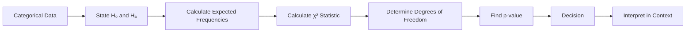

# Chi-Square Test

The **chi-square ($\chi^2$) test** is a family of statistical methods used primarily with **categorical data**.

Categorical data place observations into categories rather than measuring them on a continuous numerical scale. Examples include:

- gender category;
- product preference;
- payment method;
- pass/fail status;
- education level;
- customer satisfaction category.

Chi-square methods compare **observed frequencies** with frequencies expected under a statistical model or compare the pattern of frequencies across categorical variables.

The three main applications covered in this chapter are:

1. **Chi-square goodness-of-fit test** — whether observed category frequencies are consistent with a specified distribution.
2. **Chi-square test of independence** — whether two categorical variables are associated in a population.
3. **Chi-square test of homogeneity** — whether different populations or groups have the same distribution of a categorical variable.

The calculations are based on:

$$
\chi^2
=
\sum
\frac{(O-E)^2}{E}
$$

where:

- $O$ = observed frequency;
- $E$ = expected frequency.

This chapter focuses only on chi-square methods and their foundations. It does not cover ANOVA, correlation, regression, or unrelated hypothesis-testing procedures.

---

# 1. Categorical Data and Frequencies

Before studying chi-square tests, it is important to understand the type of data being analysed.

Suppose a survey asks 100 customers which payment method they prefer:

| Payment Method | Frequency |
|---|---:|
| Cash | 25 |
| Card | 45 |
| UPI | 30 |

The observations are categorical because each customer belongs to one category.

A **frequency** tells us how many observations fall into a category.

The total sample size is:

$$
N=25+45+30
$$

$$
\boxed{N=100}
$$

Chi-square methods work primarily with these frequency counts.

---

# 2. Observed Frequency

The **observed frequency**, denoted by $O$, is the actual number of observations recorded in a category.

For example, if 45 customers prefer card payment:

$$
O=45
$$

Observed frequencies come directly from the collected data.

---

# 3. Expected Frequency

The **expected frequency**, denoted by $E$, is the frequency we would expect under the null hypothesis.

Expected frequencies are not necessarily whole numbers.

For example:

$$
E=25.5
$$

is perfectly valid as an expected frequency.

The chi-square statistic measures the difference between observed and expected frequencies relative to the expected frequency.

---

# 4. Basic Chi-Square Statistic

The general chi-square statistic is:

$$
\chi^2
=
\sum
\frac{(O-E)^2}{E}
$$

For each category:

1. Calculate $O-E$.
2. Square the difference.
3. Divide by $E$.
4. Add the contributions across categories.

A large difference between observed and expected frequencies produces a larger contribution to $\chi^2$.

---

# 5. Understanding One Chi-Square Contribution

Suppose:

$$
O=30
$$

and:

$$
E=25
$$

Then:

$$
O-E=30-25
$$

$$
=5
$$

Square the difference:

$$
(5)^2=25
$$

Divide by expected frequency:

$$
\frac{25}{25}=1
$$

Therefore, this category contributes:

$$
\boxed{1}
$$

to the total chi-square statistic.

---

# 6. Why the Difference Is Squared

The difference:

$$
O-E
$$

can be positive or negative.

If we simply added these differences, positive and negative deviations could cancel each other.

Squaring makes every contribution nonnegative:

$$
(O-E)^2\ge0
$$

Therefore:

$$
\chi^2\ge0
$$

A value of zero occurs only when observed frequencies exactly equal expected frequencies in every category.

---

# 7. Chi-Square Test Workflow

The exact null hypothesis depends on the type of chi-square test being performed.

---

# 8. Main Types of Chi-Square Tests

| Test | Main Question |
|---|---|
| Goodness-of-fit | Does one categorical variable follow a specified distribution? |
| Independence | Are two categorical variables associated? |
| Homogeneity | Do different populations/groups have the same categorical distribution? |

Although the calculations are closely related, the interpretation of the hypotheses is different.

---

# 9. Chi-Square Goodness-of-Fit Test

The **goodness-of-fit test** is used when there is one categorical variable and we want to determine whether its observed distribution agrees with a specified theoretical or expected distribution.

For example, suppose a company expects:

- 50% of customers to choose Product A;
- 30% to choose Product B;
- 20% to choose Product C.

A sample can be tested to determine whether its observed category counts are consistent with these proportions.

---

# 10. Goodness-of-Fit Hypotheses

Suppose the expected category proportions are:

$$
p_1,\ p_2,\ldots,p_k
$$

The null hypothesis states:

$$
H_0:
\text{The population category proportions follow the specified distribution}
$$

The alternative states:

$$
H_a:
\text{The population category proportions do not follow the specified distribution}
$$

The null hypothesis defines the expected frequencies.

---

# 11. Expected Frequency in Goodness-of-Fit

If the total sample size is $N$ and the expected proportion for category $i$ is $p_i$, then:

$$
E_i=Np_i
$$

where:

- $N$ = total number of observations;
- $p_i$ = expected proportion for category $i$;
- $E_i$ = expected frequency for category $i$.

---

# 12. Worked Example: Expected Frequencies

Suppose:

$$
N=200
$$

and the expected proportions are:

| Category | Expected Proportion |
|---|---:|
| A | 0.50 |
| B | 0.30 |
| C | 0.20 |

For Category A:

$$
E_A=200(0.50)
$$

$$
\boxed{E_A=100}
$$

For Category B:

$$
E_B=200(0.30)
$$

$$
\boxed{E_B=60}
$$

For Category C:

$$
E_C=200(0.20)
$$

$$
\boxed{E_C=40}
$$

Check:

$$
100+60+40=200
$$

The expected frequencies must add to the total sample size.

---

# 13. Complete Goodness-of-Fit Example

Suppose a company expects customer choices to follow:

| Product | Expected Proportion |
|---|---:|
| A | 0.50 |
| B | 0.30 |
| C | 0.20 |

A sample of 200 customers produces:

| Product | Observed |
|---|---:|
| A | 90 |
| B | 70 |
| C | 40 |

Expected frequencies are:

| Product | Observed $O$ | Expected $E$ |
|---|---:|---:|
| A | 90 | 100 |
| B | 70 | 60 |
| C | 40 | 40 |

---

# 14. Goodness-of-Fit Chi-Square Calculation

For Product A:

$$
\frac{(90-100)^2}{100}
$$

$$
=
\frac{100}{100}
$$

$$
=1
$$

For Product B:

$$
\frac{(70-60)^2}{60}
$$

$$
=
\frac{100}{60}
$$

$$
\approx1.6667
$$

For Product C:

$$
\frac{(40-40)^2}{40}
$$

$$
=0
$$

Therefore:

$$
\chi^2
=
1+1.6667+0
$$

$$
\boxed{\chi^2\approx2.667}
$$

---

# 15. Degrees of Freedom for Goodness-of-Fit

If there are $k$ categories and no parameters are estimated from the data, the degrees of freedom are:

$$
df=k-1
$$

For three categories:

$$
df=3-1
$$

$$
\boxed{df=2}
$$

When parameters are estimated from the same data, the degrees of freedom may need adjustment.

A general form is:

$$
df=k-1-m
$$

where $m$ is the number of independently estimated parameters used to determine the expected probabilities.

---

# 16. Goodness-of-Fit Decision

For the previous example:

$$
\chi^2\approx2.667
$$

and:

$$
df=2
$$

The p-value is obtained from the chi-square distribution.

Using the chi-square survival probability:

$$
p=P(\chi^2_2\ge2.667)
$$

which is approximately:

$$
p\approx0.264
$$

At:

$$
\alpha=0.05
$$

we have:

$$
0.264>0.05
$$

Therefore:

$$
\boxed{\text{Fail to reject }H_0}
$$

There is not sufficient statistical evidence that the observed product distribution differs from the specified expected distribution.

---

# 17. Chi-Square Test of Independence

The **chi-square test of independence** is used to determine whether two categorical variables are associated.

For example:

- payment method and age group;
- product preference and gender category;
- education category and employment category.

The data are organised in a **contingency table**.

---

# 18. Contingency Table

Suppose we record preferred payment method and customer type:

| Customer Type | Cash | Card | UPI | Total |
|---|---:|---:|---:|---:|
| New | 20 | 30 | 50 | 100 |
| Returning | 30 | 40 | 30 | 100 |
| Total | 50 | 70 | 80 | 200 |

The rows represent one categorical variable.

The columns represent another categorical variable.

The cells contain observed frequencies.

---

# 19. Independence Hypotheses

For a test of independence:

$$
H_0:
\text{The two categorical variables are independent}
$$

and:

$$
H_a:
\text{The two categorical variables are associated}
$$

Independence means that knowing the category of one variable does not provide information about the category of the other variable, under the population model.

---

# 20. Expected Frequency in a Contingency Table

For each cell:

$$
E_{ij}
=
\frac{
(\text{Row Total})(\text{Column Total})
}{
\text{Grand Total}
}
$$

This is one of the most important formulas in the chi-square test of independence.

---

# 21. Worked Example: Expected Cell Frequency

Using the previous table, consider the cell:

> New customers who prefer Cash.

The row total is:

$$
100
$$

The Cash column total is:

$$
50
$$

The grand total is:

$$
200
$$

Therefore:

$$
E=
\frac{100(50)}{200}
$$

$$
=\frac{5000}{200}
$$

$$
\boxed{E=25}
$$

The observed frequency was 20.

Thus, the observed count is below the count expected under independence.

---

# 22. Complete Expected Frequency Table

Observed table:

| Customer Type | Cash | Card | UPI | Total |
|---|---:|---:|---:|---:|
| New | 20 | 30 | 50 | 100 |
| Returning | 30 | 40 | 30 | 100 |
| Total | 50 | 70 | 80 | 200 |

Expected frequencies:

### New–Cash

$$
E=\frac{100(50)}{200}=25
$$

### New–Card

$$
E=\frac{100(70)}{200}=35
$$

### New–UPI

$$
E=\frac{100(80)}{200}=40
$$

For Returning customers, the row total is also 100:

$$
E_{Returning,Cash}=25
$$

$$
E_{Returning,Card}=35
$$

$$
E_{Returning,UPI}=40
$$

Expected table:

| Customer Type | Cash | Card | UPI |
|---|---:|---:|---:|
| New | 25 | 35 | 40 |
| Returning | 25 | 35 | 40 |

---

# 23. Chi-Square Calculation for Independence

The statistic remains:

$$
\chi^2
=
\sum
\frac{(O-E)^2}{E}
$$

Calculate each cell contribution.

For New–Cash:

$$
\frac{(20-25)^2}{25}
=
\frac{25}{25}
=
1
$$

For New–Card:

$$
\frac{(30-35)^2}{35}
=
\frac{25}{35}
\approx0.7143
$$

For New–UPI:

$$
\frac{(50-40)^2}{40}
=
\frac{100}{40}
=
2.5
$$

For Returning–Cash:

$$
\frac{(30-25)^2}{25}
=1
$$

For Returning–Card:

$$
\frac{(40-35)^2}{35}
\approx0.7143
$$

For Returning–UPI:

$$
\frac{(30-40)^2}{40}
=2.5
$$

Therefore:

$$
\chi^2
=
1+0.7143+2.5+1+0.7143+2.5
$$

$$
\boxed{\chi^2\approx8.4286}
$$

---

# 24. Degrees of Freedom for Independence

For a contingency table with:

- $r$ rows;
- $c$ columns;

the degrees of freedom are:

$$
df=(r-1)(c-1)
$$

For the 2 × 3 table:

$$
df=(2-1)(3-1)
$$

$$
=1(2)
$$

$$
\boxed{df=2}
$$

---

# 25. Interpreting the Independence Test

Suppose the test produces:

$$
\chi^2=8.43
$$

with:

$$
df=2
$$

and:

$$
p\approx0.0148
$$

At:

$$
\alpha=0.05
$$

we have:

$$
0.0148<0.05
$$

Therefore:

$$
\boxed{\text{Reject }H_0}
$$

There is sufficient statistical evidence of an association between customer type and preferred payment method.

This does **not** establish causation.

---

# 26. Independence Does Not Mean Causation

Suppose a chi-square test finds an association between:

- education category;
- employment category.

A significant result means that the observed categorical distributions are not consistent with independence.

It does not prove that education category **causes** employment category.

Statistical association and causal relationships are different concepts.

---

# 27. Chi-Square Test of Homogeneity

The **chi-square test of homogeneity** is used to determine whether different populations or groups have the same distribution of a categorical variable.

For example, suppose three cities are surveyed about preferred transport:

- Bus
- Car
- Metro

We may ask whether the distribution of transport preference is the same across the three cities.

---

# 28. Homogeneity Hypotheses

The null hypothesis is:

$$
H_0:
\text{The categorical distribution is the same across the groups}
$$

The alternative is:

$$
H_a:
\text{At least one group has a different categorical distribution}
$$

The calculation is the same general chi-square framework used for contingency tables.

The interpretation of the research question is what distinguishes homogeneity from independence.

---

# 29. Independence vs Homogeneity

These tests can use the same mathematical machinery.

| Independence | Homogeneity |
|---|---|
| One population is classified by two categorical variables | Multiple groups/populations are compared on one categorical variable |
| Asks whether variables are associated | Asks whether distributions are the same |
| Uses a contingency table | Uses a contingency table |
| Same expected-frequency formula | Same expected-frequency formula |
| Same chi-square statistic | Same chi-square statistic |

The distinction is primarily in how the data were collected and how the question is framed.

---

# 30. General Contingency Table Structure

A contingency table can be represented as:

| | Category 1 | Category 2 | ... | Category $c$ | Total |
|---|---:|---:|---:|---:|---:|
| Group 1 | $O_{11}$ | $O_{12}$ | ... | $O_{1c}$ | $R_1$ |
| Group 2 | $O_{21}$ | $O_{22}$ | ... | $O_{2c}$ | $R_2$ |
| $\vdots$ | $\vdots$ | $\vdots$ | | $\vdots$ | $\vdots$ |
| Group $r$ | $O_{r1}$ | $O_{r2}$ | ... | $O_{rc}$ | $R_r$ |
| Total | $C_1$ | $C_2$ | ... | $C_c$ | $N$ |

The expected frequency for cell $(i,j)$ is:

$$
E_{ij}
=
\frac{R_iC_j}{N}
$$

---

# 31. Why Expected Frequencies Matter

The chi-square statistic asks:

> How different are the observed frequencies from what would be expected if the null hypothesis were true?

If:

$$
O=E
$$

then:

$$
\frac{(O-E)^2}{E}=0
$$

No discrepancy is contributed.

If $O$ is far from $E$, the contribution becomes larger.

Therefore, the total $\chi^2$ statistic measures the overall discrepancy between observed and expected frequencies.

---

# 32. Standardised Cell Contributions

For each cell, we can calculate:

$$
Contribution_{ij}
=
\frac{(O_{ij}-E_{ij})^2}{E_{ij}}
$$

A large contribution means that the cell contributes substantially to the overall chi-square statistic.

However, a large contribution does not by itself establish the overall test conclusion. The full statistic and appropriate degrees of freedom determine the p-value.

---

# 33. Pearson Residuals

A useful diagnostic for contingency tables is the Pearson residual:

$$
r_{ij}
=
\frac{O_{ij}-E_{ij}}
{\sqrt{E_{ij}}}
$$

The squared Pearson residual is:

$$
r_{ij}^2
=
\frac{(O_{ij}-E_{ij})^2}
{E_{ij}}
$$

Therefore, the chi-square statistic can be written as:

$$
\chi^2
=
\sum r_{ij}^2
$$

Large positive residuals indicate observed counts above expectation.

Large negative residuals indicate observed counts below expectation.

---

# 34. Expected Frequency Conditions

The chi-square approximation works best when expected frequencies are sufficiently large.

A commonly taught rule is that expected frequencies should generally not be too small, with many introductory treatments using:

$$
E\ge5
$$

as a practical guideline.

More refined rules depend on the test, table dimensions, and software/method.

The important point is:

> Do not automatically apply the ordinary chi-square approximation when expected cell counts are extremely small.

---

# 35. What to Do with Small Expected Frequencies

Possible approaches include:

- combine logically similar categories when scientifically justified;
- collect more data;
- use an exact test where appropriate;
- use a simulation-based method;
- choose a method specifically designed for sparse contingency tables.

Categories should not be combined merely to make the test work if doing so destroys meaningful information.

---

# 36. Yates' Continuity Correction

For a 2 × 2 contingency table, a continuity correction such as **Yates' correction** has historically been used in some settings.

The corrected statistic is:

$$
\chi^2_Y
=
\sum
\frac{
(|O-E|-0.5)^2
}{E}
$$

The correction reduces the discrepancy slightly.

Modern practice often depends on sample size, software defaults, and whether an exact method is preferred.

The key foundation is understanding the ordinary Pearson chi-square test first.

---

# 37. Fisher's Exact Test

For small 2 × 2 contingency tables, **Fisher's exact test** can be used instead of relying on the large-sample chi-square approximation.

It calculates probabilities based on the exact distribution of the table under the null hypothesis.

It is especially useful when expected counts are small.

The important distinction is:

- Pearson chi-square uses an approximate sampling distribution;
- Fisher's exact test uses an exact probability calculation for the specified 2 × 2 setup.

---

# 38. Effect Size for Chi-Square

A statistically significant chi-square result indicates evidence of a departure from the null hypothesis.

It does not automatically tell us how strong the association is.

For a contingency table, a common effect-size measure is **Cramer's V**.

For a table with $r$ rows and $c$ columns:

$$
V=
\sqrt{
\frac{\chi^2}
{N\min(r-1,c-1)}
}
$$

where:

- $\chi^2$ = chi-square statistic;
- $N$ = total sample size;
- $r$ = number of rows;
- $c$ = number of columns.

---

# 39. Cramer's V Worked Example

Suppose:

$$
\chi^2=8.4286
$$

for a 2 × 3 table with:

$$
N=200
$$

Then:

$$
\min(r-1,c-1)
=
\min(1,2)
=
1
$$

Therefore:

$$
V=
\sqrt{
\frac{8.4286}
{200(1)}
}
$$

$$
=
\sqrt{0.042143}
$$

$$
\approx0.205
$$

Therefore:

$$
\boxed{V\approx0.205}
$$

The size of an association should be interpreted using context rather than applying universal labels mechanically.

---

# 40. Phi Coefficient for a 2 × 2 Table

For a 2 × 2 table, the **phi coefficient** can be written as:

$$
\phi=
\sqrt{
\frac{\chi^2}{N}
}
$$

For a 2 × 2 table, phi and Cramer's V are equivalent in magnitude.

Phi can range from:

$$
-1\le\phi\le1
$$

when interpreted as a signed association measure under appropriate coding, while the Cramer's V formulation is nonnegative.

---

# 41. Chi-Square Test vs Proportion Test

A chi-square test can be related to tests of proportions in certain 2 × 2 settings.

For a 2 × 2 table, the Pearson chi-square statistic and the corresponding two-sided two-proportion z-test are closely related:

$$
\chi^2=z^2
$$

under the equivalent large-sample setup.

This relationship helps connect categorical-data methods.

---

# 42. Worked Relationship

Suppose a two-proportion test produces:

$$
z=2
$$

Then:

$$
\chi^2=z^2
$$

$$
=2^2
$$

$$
\boxed{\chi^2=4}
$$

The corresponding two-sided tests lead to equivalent large-sample significance conclusions under the same setup.

---

# 43. Complete Independence Example

Consider:

| Study Method | Pass | Fail | Total |
|---|---:|---:|---:|
| Method A | 70 | 30 | 100 |
| Method B | 50 | 50 | 100 |
| Total | 120 | 80 | 200 |

We want to test whether study method and pass/fail status are independent.

Hypotheses:

$$
H_0:
\text{Study method and outcome are independent}
$$

$$
H_a:
\text{Study method and outcome are associated}
$$

---

# 44. Expected Frequencies for the Pass/Fail Example

For Method A–Pass:

$$
E=
\frac{100(120)}{200}
$$

$$
=60
$$

For Method A–Fail:

$$
E=
\frac{100(80)}{200}
$$

$$
=40
$$

Because Method B also has a row total of 100:

$$
E_{B,Pass}=60
$$

and:

$$
E_{B,Fail}=40
$$

Expected table:

| Study Method | Pass | Fail |
|---|---:|---:|
| A | 60 | 40 |
| B | 60 | 40 |

---

# 45. Chi-Square Calculation for the Pass/Fail Example

Contributions:

Method A–Pass:

$$
\frac{(70-60)^2}{60}
=
\frac{100}{60}
\approx1.6667
$$

Method A–Fail:

$$
\frac{(30-40)^2}{40}
=
\frac{100}{40}
=2.5
$$

Method B–Pass:

$$
\frac{(50-60)^2}{60}
\approx1.6667
$$

Method B–Fail:

$$
\frac{(50-40)^2}{40}
=2.5
$$

Therefore:

$$
\chi^2
=
1.6667+2.5+1.6667+2.5
$$

$$
\boxed{\chi^2\approx8.3334}
$$

Degrees of freedom:

$$
df=(2-1)(2-1)
$$

$$
\boxed{df=1}
$$

This would provide evidence of an association at the 5% level because the corresponding p-value is below 0.05.

---

# 46. Goodness-of-Fit vs Independence

| Goodness-of-Fit | Independence |
|---|---|
| One categorical variable | Two categorical variables |
| Compare observed counts with specified proportions | Compare observed counts with counts expected under independence |
| Expected counts come from specified proportions | Expected counts come from row/column totals |
| $df$ commonly $k-1$ | $df=(r-1)(c-1)$ |

The same chi-square formula is used, but expected frequencies are determined differently.

---

# 47. Goodness-of-Fit vs Homogeneity

| Goodness-of-Fit | Homogeneity |
|---|---|
| One population/category variable | Multiple groups/populations |
| Compare with a specified distribution | Compare category distributions across groups |
| Expected counts from stated proportions | Expected counts from marginal totals |
| One categorical variable | One categorical outcome across groups |

The distinction is primarily based on the study design and research question.

---

# 48. Independence vs Homogeneity

The numerical calculations can be identical.

For example, a 3 × 4 table can be analysed with the same:

$$
\chi^2
=
\sum
\frac{(O-E)^2}{E}
$$

and:

$$
df=(r-1)(c-1)
$$

The difference is how the data were sampled and how the question is phrased.

### Independence

One population is classified according to two categorical variables.

### Homogeneity

Several populations or groups are compared on one categorical variable.

---

# 49. Assumptions and Conditions

Before using a chi-square test, check:

### Categorical counts

The data should be frequency counts in meaningful categories.

### Independence

Observations should be independent under the intended sampling design.

### Adequate expected frequencies

Expected counts should generally be sufficiently large for the chi-square approximation.

### Mutually exclusive categories

Each observation should contribute to the appropriate category according to the table design.

### Exhaustive categories

The categories should account for the observations included in the analysis.

---

# 50. Observations vs Percentages

Chi-square tests are normally performed using **counts**, not percentages alone.

For example:

| Group | Yes | No |
|---|---:|---:|
| A | 40 | 60 |
| B | 50 | 50 |

is directly usable.

If only percentages are reported, the corresponding sample sizes are needed to reconstruct the counts.

The sample size matters because the chi-square statistic depends on frequencies.

---

# 51. Weighted and Survey Data

Simple chi-square formulas assume ordinary frequency counts under the specified sampling framework.

Complex survey designs may require:

- survey weights;
- clustering adjustments;
- stratification adjustments;
- specialised survey chi-square procedures.

Therefore, ordinary chi-square formulas should not automatically be applied to complex survey data.

---

# 52. Zero Expected Frequencies

An expected frequency of zero creates a problem because:

$$
\frac{(O-E)^2}{E}
$$

would involve division by zero.

A valid chi-square model therefore requires positive expected frequencies for the cells included in the calculation.

A zero expected probability may indicate that the category specification or model needs to be reconsidered.

---

# 53. Negative Frequencies Are Impossible

Observed and expected frequencies represent counts or expected counts.

Therefore:

$$
O\ge0
$$

and:

$$
E\ge0
$$

Negative frequencies are not meaningful.

The expected frequencies must also be derived from a valid probability model or contingency-table structure.

---

# 54. Why Sample Size Matters

With very large samples, even a small difference between observed and expected proportions can produce a statistically significant chi-square result.

With small samples, a substantial-looking difference may not produce enough evidence to reject the null hypothesis.

Therefore:

> Statistical significance depends on both the size of the discrepancy and the amount of information in the sample.

This is why effect size and practical context should accompany the p-value whenever appropriate.

---

# 55. Statistical Significance vs Strength of Association

Suppose two analyses produce:

### Analysis A

$$
p<0.001
$$

with:

$$
V=0.08
$$

### Analysis B

$$
p=0.02
$$

with:

$$
V=0.35
$$

Analysis A may have stronger statistical evidence because of a larger sample, while Analysis B may show a stronger association.

The p-value and effect size answer different questions.

---

# 56. Residual Analysis in Contingency Tables

After a significant chi-square test, cell-level residuals can help identify where the discrepancies occur.

The Pearson residual is:

$$
r_{ij}
=
\frac{O_{ij}-E_{ij}}
{\sqrt{E_{ij}}}
$$

A positive residual indicates:

$$
O_{ij}>E_{ij}
$$

A negative residual indicates:

$$
O_{ij}<E_{ij}
$$

Large absolute residuals identify cells that contribute substantially to the overall discrepancy.

Adjusted residuals may be used when making more formal cell-level interpretations.

---

# 57. Practical Interpretation of a Cell

Suppose:

$$
O=70
$$

and:

$$
E=60
$$

Then:

$$
O-E=10
$$

The cell contains more observations than would be expected under the null model.

The Pearson residual is:

$$
r=
\frac{10}{\sqrt{60}}
$$

$$
\approx1.291
$$

This suggests a positive contribution to the overall chi-square statistic.

Cell-level interpretation should be performed carefully, especially when many cells are examined.

---

# 58. Multiple Comparisons After Chi-Square

A significant overall chi-square test does not necessarily identify which categories or groups are responsible.

Possible follow-up approaches include:

- examination of residuals;
- pairwise proportion comparisons with multiplicity adjustment;
- planned comparisons;
- category-specific analyses.

Any follow-up testing should account for multiple comparisons.

---

# 59. Continuity Correction in 2 × 2 Tables

For a 2 × 2 table, the uncorrected Pearson statistic is:

$$
\chi^2
=
\sum
\frac{(O-E)^2}{E}
$$

A continuity-corrected version uses:

$$
\chi^2_Y
=
\sum
\frac{
(|O-E|-0.5)^2
}{E}
$$

The correction generally makes the test more conservative.

Whether it should be used depends on the context, sample size, software method, and whether an exact test is more appropriate.

---

# 60. Fisher's Exact Test vs Chi-Square

| Chi-Square Test | Fisher's Exact Test |
|---|---|
| Uses chi-square approximation | Uses exact probability calculation |
| Appropriate with adequate expected counts | Useful for small 2 × 2 samples |
| Fast and widely used | Particularly useful for sparse tables |
| Common large-sample method | Exact method for the specified setup |

The ordinary chi-square test should not be used automatically when expected frequencies are extremely small.

---

# 61. Chi-Square Distribution

The chi-square distribution depends on degrees of freedom.

For:

$$
df
$$

degrees of freedom, we write:

$$
\chi^2_{df}
$$

The distribution is nonnegative:

$$
\chi^2\ge0
$$

It is generally right-skewed for small degrees of freedom and becomes more symmetric as degrees of freedom increase.

The right tail is used for the standard chi-square test because large values indicate a large discrepancy between observed and expected frequencies.

---

# 62. Degrees of Freedom Intuition

Degrees of freedom represent the number of independent pieces of information available after accounting for constraints.

For goodness-of-fit with $k$ categories and fixed expected proportions:

$$
df=k-1
$$

The reason is that once $k-1$ category counts are known, the final category is determined by the fixed total.

For a contingency table:

$$
df=(r-1)(c-1)
$$

because row and column totals impose constraints.

---

# 63. Worked Degrees of Freedom Example

Suppose a contingency table has:

$$
r=4
$$

rows and:

$$
c=3
$$

columns.

Then:

$$
df=(4-1)(3-1)
$$

$$
=3(2)
$$

$$
\boxed{df=6}
$$

The chi-square statistic is compared with a chi-square distribution with 6 degrees of freedom.

---

# 64. Complete Goodness-of-Fit Workflow

Suppose a die is claimed to be fair.

The categories are:

$$
1,2,3,4,5,6
$$

The null hypothesis is:

$$
H_0:
p_1=p_2=p_3=p_4=p_5=p_6=\frac16
$$

The alternative is:

$$
H_a:
\text{The die does not follow the specified fair-die distribution}
$$

If 600 rolls are observed, the expected frequency for each face is:

$$
E=600\left(\frac16\right)
$$

$$
\boxed{E=100}
$$

Observed counts can then be compared with 100 using:

$$
\chi^2
=
\sum_{i=1}^{6}
\frac{(O_i-100)^2}{100}
$$

Degrees of freedom:

$$
df=6-1=5
$$

---

# 65. Worked Fair-Die Example

Suppose the observed frequencies are:

| Face | Observed |
|---:|---:|
| 1 | 90 |
| 2 | 110 |
| 3 | 95 |
| 4 | 105 |
| 5 | 120 |
| 6 | 80 |

Each expected frequency is:

$$
E=100
$$

Calculate contributions:

$$
\frac{(90-100)^2}{100}=1
$$

$$
\frac{(110-100)^2}{100}=1
$$

$$
\frac{(95-100)^2}{100}=0.25
$$

$$
\frac{(105-100)^2}{100}=0.25
$$

$$
\frac{(120-100)^2}{100}=4
$$

$$
\frac{(80-100)^2}{100}=4
$$

Therefore:

$$
\chi^2
=
1+1+0.25+0.25+4+4
$$

$$
\boxed{\chi^2=10.5}
$$

Degrees of freedom:

$$
df=5
$$

The corresponding p-value can be obtained from the chi-square distribution.

---

# 66. Complete Independence Workflow

For a contingency table:

### Step 1

State:

$$
H_0:\text{variables are independent}
$$

and:

$$
H_a:\text{variables are associated}
$$

### Step 2

Calculate row totals, column totals, and grand total.

### Step 3

Calculate each expected frequency:

$$
E_{ij}=
\frac{R_iC_j}{N}
$$

### Step 4

Calculate:

$$
\chi^2=
\sum
\frac{(O-E)^2}{E}
$$

### Step 5

Calculate:

$$
df=(r-1)(c-1)
$$

### Step 6

Find the p-value.

### Step 7

Compare p-value with $\alpha$.

### Step 8

Interpret the result in context.

---

# 67. Goodness-of-Fit Workflow

For a goodness-of-fit test:

### Step 1

State the expected population proportions.

### Step 2

Calculate expected frequencies:

$$
E_i=Np_i
$$

### Step 3

Calculate:

$$
\chi^2
=
\sum
\frac{(O_i-E_i)^2}{E_i}
$$

### Step 4

Calculate degrees of freedom.

For fixed expected proportions:

$$
df=k-1
$$

### Step 5

Find the p-value.

### Step 6

Make the statistical decision.

### Step 7

Interpret the result in the original context.

---

# 68. Common Mistakes

### Mistake 1: Using percentages without sample sizes

Chi-square calculations require frequencies or enough information to reconstruct them.

### Mistake 2: Using observed frequencies to calculate expected frequencies

Expected frequencies must come from the null hypothesis.

### Mistake 3: Forgetting that expected frequencies need not be integers

Expected counts can be decimals.

### Mistake 4: Using the wrong degrees of freedom

For a contingency table:

$$
df=(r-1)(c-1)
$$

### Mistake 5: Saying a significant independence test proves causation

Association does not establish causation.

### Mistake 6: Ignoring small expected frequencies

The chi-square approximation can be unreliable with sparse tables.

### Mistake 7: Treating a significant test as proof that every cell differs

A significant overall test indicates an overall departure from the null model.

### Mistake 8: Forgetting the direction of interpretation

Large chi-square values indicate larger discrepancies between observed and expected frequencies.

### Mistake 9: Reporting only the p-value

Include the test, degrees of freedom, chi-square statistic, p-value, and contextual interpretation.

### Mistake 10: Combining categories without justification

Categories should be combined only when scientifically or substantively meaningful.

---

# 69. Reporting a Chi-Square Test

A standard report can include:

- test type;
- chi-square statistic;
- degrees of freedom;
- p-value;
- decision;
- contextual interpretation;
- effect size where appropriate.

Example:

> A chi-square test of independence was conducted to examine the association between customer type and payment preference. The test produced $\chi^2(2)=8.43$, with $p\approx0.015$. At the 5% significance level, the null hypothesis of independence was rejected, providing evidence of an association between the two categorical variables.

If relevant, report Cramer's V as well.

---

# 70. Example of a Goodness-of-Fit Report

> A chi-square goodness-of-fit test was conducted to determine whether the observed product choices were consistent with the specified distribution. The test produced $\chi^2(2)=2.67$, with $p\approx0.264$. At the 5% significance level, the null hypothesis was not rejected. There was not sufficient evidence that the observed distribution differed from the specified distribution.

This interpretation avoids saying that the expected distribution has been "proved correct."

---

# 71. Chi-Square Test Selection Guide

| Research Question | Test |
|---|---|
| Does one categorical variable follow specified proportions? | Goodness-of-fit |
| Are two categorical variables associated? | Independence |
| Do several groups have the same categorical distribution? | Homogeneity |
| Very small 2 × 2 table | Consider Fisher's exact test |
| Unequal variances | Not a chi-square issue; choose a method appropriate to the actual data |

---

# 72. Points to Remember

1. Chi-square tests are primarily used with categorical frequency data.
2. The basic statistic is:

$$
\chi^2=
\sum\frac{(O-E)^2}{E}
$$

3. $O$ represents observed frequency.
4. $E$ represents expected frequency.
5. Expected frequencies are determined by the null hypothesis.
6. A large chi-square statistic indicates a large discrepancy between observed and expected frequencies.
7. The chi-square statistic is always nonnegative.
8. Goodness-of-fit tests compare observed frequencies with specified proportions.
9. Independence tests examine association between two categorical variables.
10. Homogeneity tests compare categorical distributions across groups.
11. For a goodness-of-fit test with fixed expected proportions:

$$
df=k-1
$$

12. For a contingency table:

$$
df=(r-1)(c-1)
$$

13. For an independence test:

$$
E_{ij}
=
\frac{R_iC_j}{N}
$$

14. A significant chi-square independence test indicates association, not causation.
15. Small expected frequencies can make the ordinary chi-square approximation unreliable.
16. Fisher's exact test can be useful for small 2 × 2 tables.
17. Cramer's V measures association strength for contingency tables.
18. Statistical significance and effect size answer different questions.
19. A significant overall chi-square test does not identify every specific cell difference.
20. Residuals can help identify cells contributing strongly to the overall statistic.
21. Multiple follow-up comparisons should account for multiplicity.
22. Chi-square tests require attention to the study design and independence of observations.
23. Counts are generally preferable to percentages for performing the calculation.
24. Large sample size can make small discrepancies statistically significant.
25. Always interpret the result in the context of the original research question.

---

# 73. Important Formula Summary

## Chi-Square Statistic

$$
\boxed{
\chi^2=
\sum
\frac{(O-E)^2}{E}
}
$$

## Goodness-of-Fit Expected Frequency

$$
\boxed{
E_i=Np_i
}
$$

## Goodness-of-Fit Degrees of Freedom

$$
\boxed{
df=k-1
}
$$

for fixed expected proportions.

## Contingency-Table Expected Frequency

$$
\boxed{
E_{ij}
=
\frac{R_iC_j}{N}
}
$$

## Independence/Homogeneity Degrees of Freedom

$$
\boxed{
df=(r-1)(c-1)
}
$$

## Pearson Residual

$$
\boxed{
r_{ij}
=
\frac{O_{ij}-E_{ij}}
{\sqrt{E_{ij}}}
}
$$

## Cramer's V

$$
\boxed{
V=
\sqrt{
\frac{\chi^2}
{N\min(r-1,c-1)}
}
}
$$

## Phi Coefficient for 2 × 2

$$
\boxed{
\phi=
\sqrt{
\frac{\chi^2}{N}
}
}
$$

## Yates' Corrected Statistic

$$
\boxed{
\chi^2_Y
=
\sum
\frac{(|O-E|-0.5)^2}{E}
}
$$

## Relationship for Equivalent 2 × 2 Large-Sample Tests

$$
\boxed{
\chi^2=z^2
}
$$

---

# 74. Chapter Summary

The chi-square family provides important methods for analysing categorical frequency data.

The central calculation compares observed frequencies with expected frequencies:

$$
\chi^2=
\sum
\frac{(O-E)^2}{E}
$$

The **goodness-of-fit test** is used when one categorical variable is compared with a specified theoretical distribution.

The **test of independence** examines whether two categorical variables are associated.

The **test of homogeneity** examines whether different groups or populations have the same distribution of a categorical outcome.

For contingency tables, expected frequencies are calculated using:

$$
E_{ij}
=
\frac{R_iC_j}{N}
$$

and degrees of freedom are:

$$
df=(r-1)(c-1)
$$

A large chi-square statistic indicates that observed frequencies differ substantially from those expected under the null hypothesis.

The result is evaluated using the chi-square distribution. If:

$$
p\le\alpha
$$

we reject the null hypothesis.

However, statistical significance does not automatically indicate a strong or practically important association. Measures such as Cramer's V can provide additional information about association strength.

Small expected frequencies require special care. Exact procedures such as Fisher's exact test may be preferable for appropriate small 2 × 2 tables.

The complete logic can be summarised as:

$$
\boxed{
\text{Categorical Data}
\rightarrow
\text{Observed Frequencies}
\rightarrow
\text{Expected Frequencies}
\rightarrow
\chi^2
\rightarrow
df
\rightarrow
p\text{-value}
\rightarrow
\text{Decision}
\rightarrow
\text{Interpretation}
}
$$

---

# 75. References

- OpenStax, *Introductory Statistics*.
- NIST/SEMATECH, *e-Handbook of Statistical Methods*.
- Penn State Eberly College of Science, *STAT Online*.
- Agresti, *An Introduction to Categorical Data Analysis*.
- Montgomery & Runger, *Applied Statistics and Probability for Engineers*.
