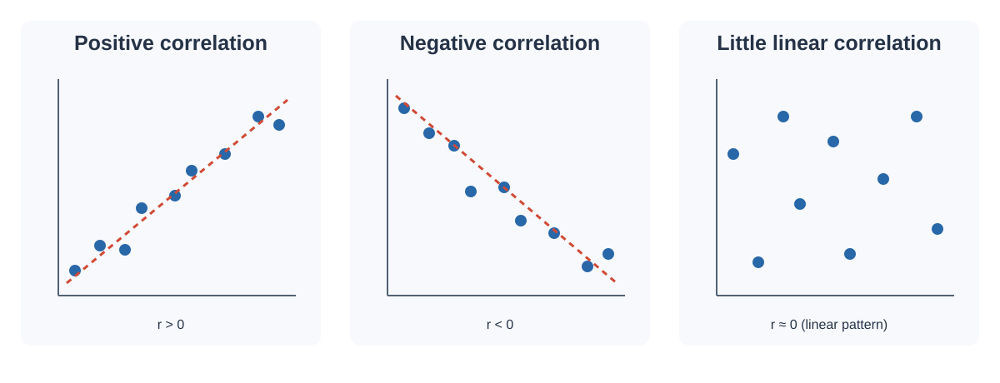

# Correlation

Correlation is a statistical method used to describe the **strength and direction of association between two variables**. It is especially useful when we want to understand whether two numerical variables tend to change together.


*Visual reference: a positive association between two variables. The fitted line is a regression illustration, not a measure of correlation by itself. Source: [Team Academy](https://www.teamacademy.net/community/public/posts/550995-10-machine-learning-algorithms-simplified-with-real-world-analogies).*

For example, we may want to study whether:

- study time and examination marks are related,
- advertising expenditure and sales are related,
- temperature and ice-cream sales are related,
- height and weight are related.

Correlation is an important descriptive and inferential tool, but it must be interpreted carefully. A correlation coefficient describes association; **it does not by itself establish causation**.

This chapter develops correlation from paired data through covariance, Pearson's correlation coefficient, Spearman's rank correlation, interpretation, assumptions, outliers, visualisation, significance testing, and practical examples.

---

## 1. Learning Objectives

After completing this chapter, you should be able to:

1. Explain what correlation means.
2. Distinguish positive, negative, and zero correlation.
3. Work with paired observations.
4. Explain covariance and its role in correlation.
5. Calculate Pearson's correlation coefficient.
6. Interpret the value of $r$.
7. Understand the geometric meaning of correlation.
8. Use a scatter plot to examine a relationship.
9. Explain the effect of outliers on correlation.
10. Calculate Spearman's rank correlation coefficient.
11. Understand when Pearson correlation and Spearman correlation are appropriate.
12. Distinguish correlation from causation.
13. Understand assumptions and limitations of correlation.
14. Test whether a population correlation is statistically significant.
15. Report and interpret a correlation correctly.

---

# 2. What Is Correlation?

Suppose we observe two variables, $X$ and $Y$, for the same set of observations.

For each observation we have a pair:

$$
(x_i,y_i)
$$

Correlation measures the extent to which changes in one variable are associated with changes in the other variable.

If larger values of $X$ tend to occur with larger values of $Y$, the relationship is **positive**.

If larger values of $X$ tend to occur with smaller values of $Y$, the relationship is **negative**.

If there is no systematic linear pattern, the correlation may be close to zero.

### Example

Suppose five students have the following study hours and marks:

| Student | Study Hours ($X$) | Marks ($Y$) |
|---|---:|---:|
| A | 1 | 42 |
| B | 2 | 48 |
| C | 3 | 55 |
| D | 4 | 63 |
| E | 5 | 70 |

As study hours increase, marks also tend to increase. Therefore, these variables have a strong positive association.

---

# 3. Paired Data

Correlation requires **paired observations**.

A paired observation means that each value of $X$ is naturally matched with a corresponding value of $Y$.

For $n$ observations:

$$
(X,Y)=\{(x_1,y_1),(x_2,y_2),\ldots,(x_n,y_n)\}
$$

For example:

| Observation | Temperature ($X$) | Cold Drink Sales ($Y$) |
|---|---:|---:|
| 1 | 25 | 80 |
| 2 | 27 | 95 |
| 3 | 30 | 120 |
| 4 | 32 | 145 |
| 5 | 35 | 170 |

The temperature and sales values from the same day form a pair.

### Why pairing matters

If the observations are incorrectly matched, the calculated correlation may be meaningless.

Therefore, before calculating correlation, always verify that each $X$ value corresponds to the correct $Y$ value.

---

# 4. Scatter Plot

A scatter plot is one of the most useful tools for examining correlation.

Each observation is represented by a point:

$$
(x_i,y_i)
$$

The horizontal axis usually represents $X$, and the vertical axis represents $Y$.

A scatter plot helps us see:

- direction,
- strength,
- linearity,
- clusters,
- unusual observations,
- possible outliers,
- nonlinear patterns.

A numerical correlation coefficient should therefore be interpreted together with an appropriate plot whenever possible.

---

# 5. Direction of Correlation

Correlation can have three broad directions.

## 5.1 Positive Correlation

In a positive relationship:

$$
X\uparrow \Rightarrow Y\uparrow
$$

As $X$ increases, $Y$ tends to increase.

Examples include study time and marks, or temperature and cold-drink sales.

The correlation coefficient is positive:

$$
r>0
$$

---

## 5.2 Negative Correlation

In a negative relationship:

$$
X\uparrow \Rightarrow Y\downarrow
$$

As $X$ increases, $Y$ tends to decrease.

Examples include price and quantity demanded, or speed and travel time for a fixed distance.

The correlation coefficient is negative:

$$
r<0
$$

---

## 5.3 Zero or Near-Zero Linear Correlation

If there is no clear linear pattern, the correlation may be close to zero:

$$
r\approx0
$$

However, this does **not** always mean that the variables are completely unrelated.

A strong nonlinear relationship can have a Pearson correlation close to zero.

For example:

$$
Y=X^2
$$

can form a clear curved relationship while its linear correlation may be near zero in a symmetric dataset.

This is why the scatter plot is important.



**How to read this graph:** An upward trend indicates positive correlation, a downward trend indicates negative correlation, and a cloud without a clear straight-line trend may have correlation near zero. Near-zero Pearson correlation does not rule out a strong nonlinear relationship.

---

# 6. Strength of Correlation

For Pearson correlation:

$$
-1\le r\le1
$$

Values near $1$ indicate a strong positive linear relationship.

Values near $-1$ indicate a strong negative linear relationship.

Values near $0$ indicate weak or no linear association.

A commonly used rough interpretation is:

| $|r|$ | Rough description |
|---:|---|
| 0.00–0.19 | Very weak |
| 0.20–0.39 | Weak |
| 0.40–0.59 | Moderate |
| 0.60–0.79 | Strong |
| 0.80–1.00 | Very strong |

These boundaries are **guidelines, not universal laws**. The practical meaning depends on the field, measurement quality, sample size, and purpose.

---

# 7. Perfect Correlation

A perfect positive correlation occurs when all points lie exactly on an increasing straight line:

$$
r=1
$$

A perfect negative correlation occurs when all points lie exactly on a decreasing straight line:

$$
r=-1
$$

A value of $r=1$ or $r=-1$ means perfect linear association in the observed data.

---

# 8. Correlation Coefficient

A **correlation coefficient** is a numerical value used to summarise the direction and strength of association.

The most commonly used coefficient for measuring linear association between two quantitative variables is **Pearson's correlation coefficient**.

It is commonly represented by:

$$
r
$$

For a sample:

$$
-1\le r\le1
$$

For a population, the corresponding parameter is often written as:

$$
\rho
$$

Thus:

- $r$ = sample correlation coefficient
- $\rho$ = population correlation coefficient

---

# 9. Covariance

Before understanding Pearson correlation, it is useful to understand **covariance**.

Covariance describes whether two variables tend to move together.

For a sample:

$$
s_{XY}
=
\frac{\sum_{i=1}^{n}(x_i-\bar{x})(y_i-\bar{y})}{n-1}
$$

where:

- $x_i$ = $i$th observation of $X$
- $y_i$ = $i$th observation of $Y$
- $\bar{x}$ = sample mean of $X$
- $\bar{y}$ = sample mean of $Y$
- $n$ = number of paired observations
- $s_{XY}$ = sample covariance

---

# 10. Understanding the Sign of Covariance

Consider:

$$
(x_i-\bar{x})(y_i-\bar{y})
$$

| $x_i-\bar{x}$ | $y_i-\bar{y}$ | Product | Meaning |
|---:|---:|---:|---|
| + | + | + | Both above their means |
| - | - | + | Both below their means |
| + | - | - | $X$ above, $Y$ below |
| - | + | - | $X$ below, $Y$ above |

When both variables tend to be above or below their means together, positive products dominate and covariance is positive.

When one tends to be above its mean while the other is below, negative products dominate and covariance is negative.

---

# 11. Worked Example: Covariance

Consider:

| $X$ | $Y$ |
|---:|---:|
| 1 | 2 |
| 2 | 4 |
| 3 | 5 |
| 4 | 8 |

### Step 1: Calculate the means

$$
\bar{x}=\frac{1+2+3+4}{4}=2.5
$$

$$
\bar{y}=\frac{2+4+5+8}{4}=4.75
$$

### Step 2: Construct deviations

| $X$ | $Y$ | $X-\bar{x}$ | $Y-\bar{y}$ | Product |
|---:|---:|---:|---:|---:|
| 1 | 2 | -1.5 | -2.75 | 4.125 |
| 2 | 4 | -0.5 | -0.75 | 0.375 |
| 3 | 5 | 0.5 | 0.25 | 0.125 |
| 4 | 8 | 1.5 | 3.25 | 4.875 |

Sum:

$$
4.125+0.375+0.125+4.875=9.5
$$

### Step 3: Divide by $n-1$

$$
s_{XY}=\frac{9.5}{4-1}
$$

$$
\boxed{s_{XY}\approx3.167}
$$

The positive covariance indicates that $X$ and $Y$ tend to increase together.

---

# 12. Why Covariance Alone Is Not Enough

Covariance has an important limitation: **its numerical magnitude depends on the units of measurement**.

If height is measured in metres instead of centimetres, the numerical covariance changes.

Correlation solves this problem by standardising covariance.

---

# 13. Pearson Correlation Coefficient

Pearson's correlation coefficient measures the strength and direction of the **linear relationship** between two quantitative variables.

The sample formula is:

$$
r=
\frac{\sum_{i=1}^{n}(x_i-\bar{x})(y_i-\bar{y})}
{\sqrt{\sum_{i=1}^{n}(x_i-\bar{x})^2}
\sqrt{\sum_{i=1}^{n}(y_i-\bar{y})^2}}
$$

An equivalent form is:

$$
r=\frac{s_{XY}}{s_Xs_Y}
$$

where $s_{XY}$ is covariance and $s_X,s_Y$ are the sample standard deviations.

Because covariance is divided by the product of the standard deviations, correlation is **unitless**.

---

# 14. Interpretation of Pearson's $r$

Suppose:

$$
r=0.85
$$

This means there is a strong positive **linear** association.

It does not mean:

- $Y$ increases by exactly 0.85 units when $X$ increases by one unit.
- 85% of observations follow a particular pattern.
- $X$ causes $Y$.
- the relationship is necessarily perfect.

Similarly:

$$
r=-0.72
$$

indicates a strong negative linear association.

---

# 15. Pearson Correlation: Step-by-Step Calculation

Consider:

| $X$ | $Y$ |
|---:|---:|
| 1 | 2 |
| 2 | 4 |
| 3 | 5 |
| 4 | 8 |

We already have:

$$
\bar{x}=2.5,\qquad\bar{y}=4.75
$$

| $X$ | $Y$ | $X-\bar{x}$ | $Y-\bar{y}$ | Product | $(X-\bar{x})^2$ | $(Y-\bar{y})^2$ |
|---:|---:|---:|---:|---:|---:|---:|
| 1 | 2 | -1.5 | -2.75 | 4.125 | 2.25 | 7.5625 |
| 2 | 4 | -0.5 | -0.75 | 0.375 | 0.25 | 0.5625 |
| 3 | 5 | 0.5 | 0.25 | 0.125 | 0.25 | 0.0625 |
| 4 | 8 | 1.5 | 3.25 | 4.875 | 2.25 | 10.5625 |

Therefore:

$$
\sum(X-\bar{x})(Y-\bar{y})=9.5
$$

$$
\sum(X-\bar{x})^2=5
$$

$$
\sum(Y-\bar{y})^2=18.75
$$

Substitute:

$$
r=
\frac{9.5}{\sqrt{5}\sqrt{18.75}}
$$

$$
r=\frac{9.5}{\sqrt{93.75}}
$$

Therefore:

$$
\boxed{r\approx0.981}
$$

The dataset shows a very strong positive linear association.

---

# 16. Shortcut Formula for Pearson Correlation

Pearson correlation can also be calculated using:

$$
r=
\frac{n\sum xy-(\sum x)(\sum y)}
{\sqrt{[n\sum x^2-(\sum x)^2][n\sum y^2-(\sum y)^2]}}
$$

This form can be useful when calculations are performed from summary totals.

The deviation-based formula is often easier to understand because it shows how correlation measures joint movement around the means.

---

# 17. Standardised Interpretation

A z-score is:

$$
z_x=\frac{x-\bar{x}}{s_x}
$$

and:

$$
z_y=\frac{y-\bar{y}}{s_y}
$$

Then sample correlation can be expressed as:

$$
r=\frac{1}{n-1}\sum_{i=1}^{n}z_{x_i}z_{y_i}
$$

This shows that correlation is closely connected to the product of standardised deviations.

---

# 18. Geometric Interpretation

Consider the centered vectors:

$$
\mathbf{x}_c=(x_1-\bar{x},\ldots,x_n-\bar{x})
$$

and:

$$
\mathbf{y}_c=(y_1-\bar{y},\ldots,y_n-\bar{y})
$$

Pearson correlation is related to the cosine of the angle $\theta$ between these centered vectors:

$$
r=\cos(\theta)
$$

Therefore:

$$
\theta=0^\circ\Rightarrow r=1
$$

$$
\theta=90^\circ\Rightarrow r=0
$$

$$
\theta=180^\circ\Rightarrow r=-1
$$

---

# 19. Properties of Pearson Correlation

### 19.1 Bounded

$$
-1\le r\le1
$$

### 19.2 Unitless

Correlation has no physical unit.

### 19.3 Symmetric

$$
r_{XY}=r_{YX}
$$

### 19.4 Measures Linear Association

Pearson correlation is designed to measure linear association.

### 19.5 Sensitive to Outliers

A few unusual observations can substantially change $r$.

---

# 20. Correlation and Scaling

Correlation is unchanged by positive changes of scale and location.

Suppose:

$$
X'=a+bX
$$

and:

$$
Y'=c+dY
$$

where $b>0$ and $d>0$.

Then:

$$
r_{X'Y'}=r_{XY}
$$

If one variable is multiplied by a negative number, the direction reverses:

$$
r_{X,-Y}=-r_{XY}
$$

---

# 21. Correlation Is Not Causation

One of the most important rules in statistics is:

> **Correlation does not imply causation.**

Suppose ice-cream sales and swimming activity are positively correlated.

This does not prove that buying ice cream causes people to swim.

A third variable such as temperature may influence both:

$$
\text{Temperature}
\rightarrow
\begin{cases}
\text{Ice-cream sales}\\
\text{Swimming activity}
\end{cases}
$$

Temperature is a possible **confounding variable**.

---

# 22. Correlation Does Not Mean Perfect Prediction

A correlation of:

$$
r=0.80
$$

indicates a strong positive linear association, but observations can still show substantial variation around the overall trend.

Correlation describes association; it is not itself a complete predictive model.

---

# 23. Coefficient of Determination

The square of Pearson correlation is:

$$
R^2=r^2
$$

For:

$$
r=0.80
$$

we obtain:

$$
R^2=(0.80)^2=0.64
$$

Therefore:

$$
\boxed{R^2=0.64}
$$

In the simple linear regression setting, this is associated with 64% of the variation being accounted for by the fitted linear relationship.

It should **not** be interpreted as “64% of $Y$ is caused by $X$.”

---

# 24. Outliers and Correlation

An **outlier** is an observation that is unusually far from the rest of the data.

Pearson correlation is based on deviations from the means, so an extreme observation can strongly influence the result.

Therefore:

1. plot the data,
2. identify unusual observations,
3. investigate why they occur,
4. do not automatically delete them,
5. compare results with and without the observation when appropriate.

An outlier may be a data-entry error, a measurement problem, a valid rare observation, or evidence of a different subgroup.

---

# 25. Nonlinear Relationships

Pearson correlation can fail to describe a strongly nonlinear relationship.

For example:

$$
Y=X^2
$$

creates a U-shaped relationship.

The scatter plot clearly shows dependence, but Pearson's $r$ can be close to zero when the data are symmetric around zero.

Therefore:

> **A correlation near zero does not prove that two variables are unrelated.**

It indicates little or no **linear** association.

---

# 26. Pearson Correlation and Scatter Plot

| Scatter-plot pattern | Typical Pearson $r$ |
|---|---:|
| Strong upward line | close to $+1$ |
| Moderate upward trend | positive |
| No clear linear trend | close to $0$ |
| Moderate downward trend | negative |
| Strong downward line | close to $-1$ |
| Strong curve | may be close to $0$ |

Always examine the actual data rather than deciding correlation only from the numerical coefficient.

---

# 27. Spearman Rank Correlation

**Spearman's rank correlation** is useful when the relationship is better understood through ranks.

It is commonly represented by:

$$
\rho_s
$$

Spearman correlation measures the strength and direction of a **monotonic relationship**.

A monotonic relationship means that, broadly, one variable tends to move in one direction as the other changes. The relationship does not have to be a straight line.

---

# 28. Pearson vs Spearman

| Feature | Pearson | Spearman |
|---|---|---|
| Main idea | Linear association | Monotonic association |
| Uses raw values | Yes | Uses ranks |
| Outlier sensitivity | Generally more sensitive | Often less sensitive |
| Data | Quantitative | Ordinal or quantitative |
| Straight line required | Yes, for the association measured | No |
| Symbol | $r$ | $\rho_s$ |

Spearman is useful when data are ordinal, rank-based, monotonic but nonlinear, or when Pearson's assumptions are questionable.

---

# 29. Spearman's Rank Correlation: No Ties

When there are no tied ranks:

$$
\rho_s=
1-\frac{6\sum d_i^2}{n(n^2-1)}
$$

where:

- $d_i$ = difference between the ranks of $X_i$ and $Y_i$
- $n$ = number of observations

---

# 30. Worked Example: Spearman Correlation

Suppose five students are ranked by two examinations.

| Student | Rank in Exam 1 | Rank in Exam 2 |
|---|---:|---:|
| A | 1 | 2 |
| B | 2 | 1 |
| C | 3 | 3 |
| D | 4 | 5 |
| E | 5 | 4 |

Calculate:

$$
d_i=R_{Xi}-R_{Yi}
$$

| Student | $R_X$ | $R_Y$ | $d$ | $d^2$ |
|---|---:|---:|---:|---:|
| A | 1 | 2 | -1 | 1 |
| B | 2 | 1 | 1 | 1 |
| C | 3 | 3 | 0 | 0 |
| D | 4 | 5 | -1 | 1 |
| E | 5 | 4 | 1 | 1 |

Therefore:

$$
\sum d_i^2=4
$$

and:

$$
n=5
$$

Substitute:

$$
\rho_s=
1-\frac{6(4)}{5(5^2-1)}
$$

$$
\rho_s=
1-\frac{24}{5(24)}
$$

$$
\rho_s=1-\frac{24}{120}
$$

$$
\boxed{\rho_s=0.80}
$$

There is a strong positive monotonic association between the rankings.

---

# 31. Spearman Correlation With Ties

The simple $d_i^2$ formula assumes no tied ranks.

When ties occur, observations receive **average ranks**.

For example, if two observations occupy positions 2 and 3 and have the same value:

$$
\frac{2+3}{2}=2.5
$$

In practice, statistical software handles tied ranks using the appropriate ranking procedure.

The general approach is:

1. rank $X$,
2. rank $Y$,
3. assign average ranks to ties,
4. calculate Pearson correlation between the rank variables.

Thus:

$$
\rho_s=\operatorname{Corr}(\operatorname{rank}(X),\operatorname{rank}(Y))
$$

---

# 32. Monotonic vs Linear Relationship

A **linear relationship** follows an approximately straight-line pattern.

A **monotonic relationship** means that the variables generally move in one direction together, although the rate of change may vary.

For example:

$$
Y=\log(X)
$$

is nonlinear but increasing.

Spearman correlation can capture the monotonic direction more naturally than Pearson correlation.

---

# 33. Pearson vs Spearman: Practical Choice

Use **Pearson correlation** when:

- variables are quantitative,
- the main relationship of interest is linear,
- a scatter plot supports an approximately linear pattern,
- extreme outliers are not dominating the result.

Use **Spearman correlation** when:

- variables are ordinal/ranked,
- the relationship is monotonic but not necessarily linear,
- ranks are more meaningful than raw values,
- Pearson's assumptions are questionable.

The choice should be based on the data and the question, not simply on which coefficient gives the larger value.

---

# 34. Covariance vs Correlation

| Feature | Covariance | Correlation |
|---|---|---|
| Direction | Yes | Yes |
| Strength on fixed scale | No | Yes |
| Unitless | No | Yes |
| Range | Unbounded | $[-1,1]$ |
| Standardised | No | Yes |

The relationship is:

$$
r=\frac{s_{XY}}{s_Xs_Y}
$$

Correlation can therefore be viewed as **standardised covariance**.

---

# 35. Correlation Matrix

When more than two variables are available, we often calculate a **correlation matrix**.

Suppose there are:

- Study Hours
- Attendance
- Marks

A correlation matrix may look like:

| | Study Hours | Attendance | Marks |
|---|---:|---:|---:|
| Study Hours | 1.00 | 0.45 | 0.78 |
| Attendance | 0.45 | 1.00 | 0.62 |
| Marks | 0.78 | 0.62 | 1.00 |

The diagonal values are always:

$$
1
$$

The matrix is symmetric:

$$
r_{XY}=r_{YX}
$$

---

# 36. Reading a Correlation Matrix

Suppose:

$$
r_{\text{Study Hours, Marks}}=0.78
$$

This indicates a strong positive linear association.

Suppose:

$$
r_{\text{Attendance, Marks}}=0.62
$$

This indicates a positive linear association.

A correlation matrix helps us quickly identify variable pairs that move together.

However, pairwise correlations do not automatically reveal causal relationships.

---

# 37. Correlation Heatmap

A correlation matrix can be visualised using a heatmap.

A heatmap makes strong positive and negative relationships easier to identify.

Conceptually:

```
          X1     X2     X3     X4
X1       1.00   0.82  -0.20   0.05
X2       0.82   1.00  -0.31   0.12
X3      -0.20  -0.31   1.00  -0.74
X4       0.05   0.12  -0.74   1.00
```

Values close to $+1$ represent strong positive association, while values close to $-1$ represent strong negative association.

---

# 38. Partial Correlation: Basic Idea

Sometimes two variables appear correlated because both are related to a third variable.

A **partial correlation** measures the association between two variables after statistically controlling for another variable.

For three variables:

$$
r_{XY\cdot Z}
=
\frac{r_{XY}-r_{XZ}r_{YZ}}
{\sqrt{(1-r_{XZ}^2)(1-r_{YZ}^2)}}
$$

This should be interpreted as an adjusted association, not proof of causation.

---

# 39. Testing the Significance of Pearson Correlation

We may test whether the population correlation differs from zero.

The usual null hypothesis is:

$$
H_0:\rho=0
$$

and the two-sided alternative is:

$$
H_1:\rho\ne0
$$

For sample size $n$:

$$
t=
\frac{r\sqrt{n-2}}
{\sqrt{1-r^2}}
$$

with:

$$
df=n-2
$$

under the standard assumptions for the Pearson correlation test.

---

# 40. Worked Example: Testing a Correlation

Suppose:

$$
r=0.70,\qquad n=20
$$

We test:

$$
H_0:\rho=0
$$

against:

$$
H_1:\rho\ne0
$$

### Step 1: Calculate the test statistic

$$
t=
\frac{0.70\sqrt{20-2}}
{\sqrt{1-0.70^2}}
$$

$$
t=
\frac{0.70\sqrt{18}}
{\sqrt{1-0.49}}
$$

$$
t=
\frac{0.70(4.243)}
{\sqrt{0.51}}
$$

$$
t\approx
\frac{2.970}{0.714}
$$

$$
\boxed{t\approx4.16}
$$

Degrees of freedom:

$$
df=20-2=18
$$

A statistical software package or $t$ distribution table can then be used to obtain the two-sided p-value.

---

# 41. Statistical Significance vs Practical Importance

A correlation can be statistically significant but practically small.

With a very large sample, even a modest correlation can produce a small p-value.

Therefore, distinguish:

- **statistical significance** — evidence that the population correlation differs from the null value,
- **strength/effect size** — how large the observed association is,
- **practical importance** — whether the relationship matters in context.

---

# 42. Confidence Interval for Correlation

A confidence interval can quantify uncertainty around a population correlation.

A common method uses **Fisher's z transformation**:

$$
z'=
\frac{1}{2}
\ln\left(\frac{1+r}{1-r}\right)
$$

Its approximate standard error is:

$$
SE_{z'}=\frac{1}{\sqrt{n-3}}
$$

An approximate confidence interval on the transformed scale is:

$$
z'\pm z_{\alpha/2}SE_{z'}
$$

The limits are then transformed back:

$$
r=
\frac{e^{2z'}-1}{e^{2z'}+1}
$$

---

# 43. Assumptions for Pearson Correlation

Important considerations include:

### 43.1 Quantitative Variables

The variables should generally be measured on a quantitative scale where numerical differences are meaningful.

### 43.2 Paired Observations

Each observation of $X$ must correspond to the correct observation of $Y$.

### 43.3 Independence

Observations should generally be independent for standard inferential procedures.

### 43.4 Approximately Linear Relationship

Pearson correlation measures linear association, so a roughly linear pattern is important.

### 43.5 Outliers

Extreme observations can strongly influence $r$.

### 43.6 Distributional Conditions

Classical significance tests and confidence procedures may require stronger assumptions, particularly for small samples.

---

# 44. Independence and Correlation

It is important to distinguish **uncorrelated** from **independent**.

If two variables are independent, then under suitable finite-moment conditions their covariance and Pearson correlation are zero.

However:

$$
r=0
$$

does not generally imply independence.

A nonlinear relationship can exist even when Pearson correlation is zero.

Thus:

$$
\text{Independence}\Rightarrow\text{zero correlation}
$$

under suitable conditions, but:

$$
\text{zero correlation}\nRightarrow\text{independence}
$$

in general.

---

# 45. Restriction of Range

Correlation can be affected when the observed data cover only a narrow range of one variable.

For example, if we study aptitude score and university performance but only include students whose aptitude scores fall within a very narrow interval, the observed correlation may be smaller than the correlation in a broader population.

This is called **restriction of range**.

---

# 46. Aggregated Data

Correlation calculated from group-level averages may differ substantially from correlation calculated from individual-level observations.

For example, a relationship between average income and average educational attainment across cities does not automatically describe the relationship between income and education for individual people.

Always consider the level at which the data were collected.

---

# 47. Common Mistakes in Correlation

### Mistake 1: Saying correlation proves causation

Incorrect:

> Study hours cause higher marks because $r=0.80$.

Better:

> Study hours and marks show a strong positive linear association.

### Mistake 2: Ignoring the sign

$$
r=-0.85
$$

is strong, but the direction is negative.

### Mistake 3: Treating $r=0$ as proof of no relationship

A nonlinear relationship may still exist.

### Mistake 4: Ignoring outliers

One unusual point can change Pearson correlation substantially.

### Mistake 5: Using correlation without a scatter plot

A numerical coefficient can hide curvature, clusters, and outliers.

### Mistake 6: Comparing correlation without context

A correlation is not automatically good or bad.

### Mistake 7: Confusing $r$ with slope

Correlation is not the same as the slope of a regression line.

### Mistake 8: Using Pearson automatically for every dataset

The appropriate coefficient depends on the variable types, pattern, and research question.

---

# 48. Correlation Does Not Give the Slope

Suppose:

$$
r=0.80
$$

This tells us the strength and direction of linear association.

It does not tell us the rate at which $Y$ changes for a one-unit change in $X$.

The slope belongs to a regression equation such as:

$$
\hat{Y}=a+bX
$$

Correlation and regression are related, but they answer different questions.

---

# 49. Worked Example: Comparing Two Relationships

Study A:

$$
r=0.90
$$

Study B:

$$
r=-0.90
$$

Both have the same strength:

$$
|r|=0.90
$$

but opposite direction.

Study A indicates a strong positive linear association.

Study B indicates a strong negative linear association.

Therefore, always report both magnitude and direction.

---

# 50. Complete Correlation Analysis

A good correlation analysis can follow these steps.

### Step 1: Identify the variables

Determine which two variables are being compared.

### Step 2: Verify pairing

Ensure each observation in $X$ corresponds to the correct observation in $Y$.

### Step 3: Visualise

Create a scatter plot.

### Step 4: Examine the pattern

Look for:

- linearity,
- direction,
- strength,
- clusters,
- outliers,
- curvature.

### Step 5: Select the coefficient

Use Pearson for an appropriate linear relationship.

Use Spearman when rank/monotonic association is more appropriate.

### Step 6: Calculate the coefficient

Compute $r$ or $\rho_s$.

### Step 7: Assess uncertainty when needed

For inferential analysis, report a p-value and/or confidence interval.

### Step 8: Interpret

State direction and strength in context.

### Step 9: Avoid causal claims

Do not convert association into causation without an appropriate causal design and analysis.

---

# 51. Complete Worked Example

Suppose the following data record weekly study hours and marks:

| Student | Study Hours ($X$) | Marks ($Y$) |
|---|---:|---:|
| 1 | 2 | 45 |
| 2 | 3 | 50 |
| 3 | 4 | 54 |
| 4 | 5 | 61 |
| 5 | 6 | 65 |
| 6 | 7 | 70 |

### Step 1: Find the means

$$
\bar{x}
=
\frac{2+3+4+5+6+7}{6}
=
4.5
$$

$$
\bar{y}
=
\frac{45+50+54+61+65+70}{6}
=
57.5
$$

### Step 2: Calculate deviations

| $X$ | $Y$ | $X-\bar{x}$ | $Y-\bar{y}$ |
|---:|---:|---:|---:|
| 2 | 45 | -2.5 | -12.5 |
| 3 | 50 | -1.5 | -7.5 |
| 4 | 54 | -0.5 | -3.5 |
| 5 | 61 | 0.5 | 3.5 |
| 6 | 65 | 1.5 | 7.5 |
| 7 | 70 | 2.5 | 12.5 |

### Step 3: Calculate cross-products

$$
\sum(X-\bar{x})(Y-\bar{y})=88.5
$$

### Step 4: Calculate squared deviations

$$
\sum(X-\bar{x})^2=17.5
$$

$$
\sum(Y-\bar{y})^2=445.5
$$

### Step 5: Calculate Pearson correlation

$$
r=
\frac{88.5}
{\sqrt{17.5}\sqrt{445.5}}
$$

$$
\boxed{r\approx0.999}
$$

### Interpretation

The observed data show an extremely strong positive linear association between study hours and marks.

This does not establish that study hours cause higher marks.

---

# 52. Using Python to Calculate Correlation

```python
import numpy as np

x = np.array([2, 3, 4, 5, 6, 7])
y = np.array([45, 50, 54, 61, 65, 70])

correlation = np.corrcoef(x, y)[0, 1]

print(correlation)
```

The result should be close to the manually calculated Pearson correlation.

---

# 53. Correlation With pandas

```python
import pandas as pd

df = pd.DataFrame({
    "study_hours": [2, 3, 4, 5, 6, 7],
    "marks": [45, 50, 54, 61, 65, 70]
})

print(df["study_hours"].corr(df["marks"]))
```

For a full correlation matrix:

```python
print(df.corr(numeric_only=True))
```

---

# 54. Spearman Correlation in Python

```python
print(
    df["study_hours"].corr(
        df["marks"],
        method="spearman"
    )
)
```

Using SciPy:

```python
from scipy.stats import spearmanr

rho, p_value = spearmanr(
    df["study_hours"],
    df["marks"]
)

print("Spearman correlation:", rho)
print("p-value:", p_value)
```

---

# 55. Pearson Correlation in SciPy

```python
from scipy.stats import pearsonr

r, p_value = pearsonr(
    df["study_hours"],
    df["marks"]
)

print("Pearson correlation:", r)
print("p-value:", p_value)
```

The coefficient describes the observed linear association, while the p-value belongs to the corresponding hypothesis test.

---

# 56. Visualising Correlation

```python
import matplotlib.pyplot as plt

plt.scatter(df["study_hours"], df["marks"])

plt.xlabel("Study Hours")
plt.ylabel("Marks")
plt.title("Study Hours vs Marks")

plt.show()
```

A scatter plot should normally be created before relying heavily on a correlation coefficient.

---

# 57. Correlation With Missing Values

Real datasets often contain missing values.

Before calculating correlation, determine how missing observations will be handled.

For example:

```python
df[["study_hours", "marks"]].corr()
```

In a larger dataset, the number of observations used can differ across variable pairs.

Therefore, check the effective sample size when interpreting a correlation matrix.

---

# 58. Correlation and Duplicate Observations

Duplicate records can affect the observed correlation.

If the same observation has accidentally been entered multiple times, it effectively receives extra weight.

Therefore, data cleaning should be performed before final correlation analysis.

---

# 59. Correlation and Measurement Error

Measurement error can weaken observed associations.

Suppose two variables are genuinely related, but both are measured with substantial noise.

The observed correlation may be smaller than the underlying relationship.

Therefore, measurement quality should be considered when interpreting correlation.

---

# 60. Correlation and Sample Size

Sample size affects the precision of a correlation estimate and the power of significance tests.

A small sample may produce an unstable estimate.

A large sample generally gives more precise estimation, but a large sample does not automatically make the relationship practically important.

Thus:

$$
\text{sample size}\ne\text{strength of correlation}
$$

and:

$$
\text{statistical significance}\ne\text{practical importance}
$$

---

# 61. Correlation vs Causation: A Detailed Example

Suppose a dataset shows:

$$
r=0.75
$$

between umbrellas sold and traffic accidents.

It would be incorrect to conclude that umbrellas cause accidents.

Rain may influence both:

$$
\text{Rain}
\rightarrow
\begin{cases}
\text{Umbrella sales}\\
\text{Traffic accidents}
\end{cases}
$$

This is an example of a **confounding variable**.

Correlation analysis can identify association, but causal conclusions require stronger study designs and assumptions.

---

# 62. Reporting Correlation

A clear report should include:

1. variables,
2. coefficient,
3. sample size,
4. direction,
5. approximate strength,
6. uncertainty or p-value when relevant,
7. cautious interpretation.

Example:

> Study hours and examination marks showed a strong positive linear correlation, $r=0.78$, indicating that students who studied more hours tended to have higher marks in the observed sample.

Avoid saying:

> Study hours caused marks to increase.

unless the study design and causal analysis justify that conclusion.

---

# 63. Correlation Analysis Checklist

Before finalising an analysis, ask:

- Are observations correctly paired?
- Are both variables measured appropriately?
- What does the scatter plot look like?
- Is the relationship linear?
- Are there outliers?
- Are there clusters?
- Is Pearson appropriate?
- Would Spearman be more appropriate?
- What is the direction?
- What is the magnitude?
- What is the sample size?
- Is statistical significance relevant?
- Is the result practically important?
- Could a third variable explain the association?
- Am I accidentally claiming causation?

---

# 64. Important Formula Summary

### Sample covariance

$$
s_{XY}
=
\frac{\sum(X-\bar{X})(Y-\bar{Y})}{n-1}
$$

### Pearson correlation

$$
r=
\frac{\sum(X-\bar{X})(Y-\bar{Y})}
{\sqrt{\sum(X-\bar{X})^2\sum(Y-\bar{Y})^2}}
$$

### Pearson correlation using covariance

$$
r=\frac{s_{XY}}{s_Xs_Y}
$$

### Shortcut Pearson formula

$$
r=
\frac{n\sum xy-(\sum x)(\sum y)}
{\sqrt{[n\sum x^2-(\sum x)^2][n\sum y^2-(\sum y)^2]}}
$$

### Range

$$
-1\le r\le1
$$

### Coefficient of determination

$$
R^2=r^2
$$

### Spearman correlation without ties

$$
\rho_s=
1-\frac{6\sum d_i^2}{n(n^2-1)}
$$

### Test statistic for Pearson correlation

$$
t=
\frac{r\sqrt{n-2}}
{\sqrt{1-r^2}}
$$

with:

$$
df=n-2
$$

### Fisher transformation

$$
z'=
\frac12\ln\left(\frac{1+r}{1-r}\right)
$$

### Standard error on Fisher's z scale

$$
SE_{z'}=\frac{1}{\sqrt{n-3}}
$$

### Partial correlation

$$
r_{XY\cdot Z}
=
\frac{r_{XY}-r_{XZ}r_{YZ}}
{\sqrt{(1-r_{XZ}^2)(1-r_{YZ}^2)}}
$$

---

# 65. Quick Concept Comparison

| Concept | Main purpose |
|---|---|
| Covariance | Direction of joint variation |
| Pearson correlation | Strength and direction of linear association |
| Spearman correlation | Strength and direction of monotonic rank association |
| Scatter plot | Visualise paired-variable relationship |
| Correlation matrix | Summarise pairwise correlations |
| Partial correlation | Association after controlling for another variable |
| $R^2$ | Squared correlation; in simple regression, proportion of variation associated with the fitted linear relationship |

---

# 66. Points to Remember

1. Correlation measures association between variables.
2. Pearson correlation measures **linear** association.
3. Pearson correlation lies between $-1$ and $1$.
4. Positive correlation means the variables tend to increase together.
5. Negative correlation means one tends to increase while the other decreases.
6. A correlation near zero does not rule out a nonlinear relationship.
7. Covariance depends on measurement units; correlation is unitless.
8. Correlation is symmetric:
   $$
   r_{XY}=r_{YX}
   $$
9. Pearson correlation is sensitive to outliers.
10. A scatter plot should normally accompany correlation analysis.
11. Spearman correlation works with ranks and monotonic relationships.
12. Correlation does not prove causation.
13. Statistical significance and practical importance are different.
14. A correlation matrix is symmetric with ones on the diagonal.
15. The sample correlation $r$ estimates the population correlation $\rho$.
16. The coefficient should be selected based on the data and research question.

---

# 67. Chapter Summary

Correlation provides a compact numerical description of how two variables move together.

The key starting point is **covariance**, which describes the direction of joint variation. Because covariance depends on measurement units, it is standardised to produce Pearson's correlation coefficient:

$$
r=
\frac{s_{XY}}{s_Xs_Y}
$$

Pearson's correlation lies between $-1$ and $1$. The sign gives direction, while the magnitude describes the strength of linear association.

A scatter plot is essential because the same numerical correlation can arise from very different data patterns. Curvature, clusters, and outliers can make a correlation coefficient misleading when viewed alone.

Spearman's rank correlation provides an alternative when ranks or monotonic relationships are more appropriate.

Correlation is related to covariance, standardisation, and statistical inference, but it is not causation. A sound analysis combines:

$$
\boxed{
\text{Correct pairing}
+
\text{Visualisation}
+
\text{Appropriate coefficient}
+
\text{Careful interpretation}
}
$$

---

# 68. References

- OpenStax, *Introductory Statistics*.
- Penn State University, STAT Online resources.
- NIST/SEMATECH, *e-Handbook of Statistical Methods*.
- SciPy Documentation, statistical functions.
- pandas Documentation, correlation and descriptive statistics.
- NumPy Documentation, numerical and statistical functions.
- GeeksforGeeks, educational articles on correlation and covariance.
