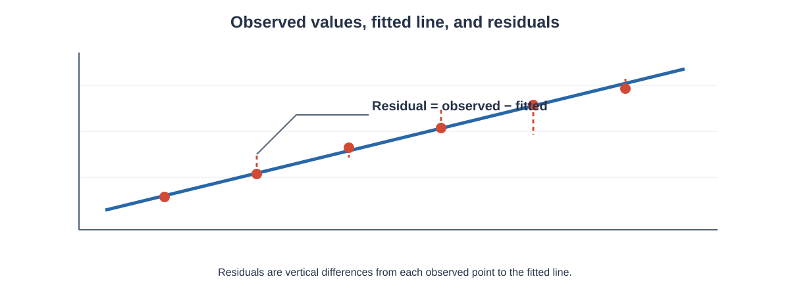

# Regression

Regression is a statistical method used to describe and model the relationship between a **response variable** and one or more **predictor variables**.


*Visual reference: observed data points, a fitted line, and residual errors. Source: [Simple Linear Regression Using Example](https://medium.com/%40sachin.hs20/simple-linear-regression-using-example-e4e2a89df54c).*

Correlation describes the strength and direction of association between two variables. Regression goes one step further by describing a mathematical relationship that can be used to estimate the expected value of a response from predictor information.

This chapter focuses on the **fundamentals of regression**:

- regression terminology,
- simple linear regression,
- the regression equation,
- slope and intercept,
- least squares estimation,
- fitted values and residuals,
- interpretation of coefficients,
- multiple linear regression,
- categorical predictors,
- interaction terms,
- polynomial terms,
- transformations,
- prediction,
- interpolation and extrapolation,
- and the basic assumptions behind regression.

Detailed model-evaluation measures such as MAE, MSE, RMSE, $R^2$, adjusted $R^2$, and cross-validation are reserved for the dedicated **Regression Model Evaluation** chapter.

---

# 1. Learning Objectives

After completing this chapter, you should be able to:

1. Explain what regression is.
2. Distinguish response and predictor variables.
3. Understand simple linear regression.
4. Write a regression equation.
5. Interpret the intercept and slope.
6. Calculate a regression line using least squares.
7. Understand fitted values and residuals.
8. Explain why least squares is used.
9. Make predictions using a regression equation.
10. Distinguish interpolation from extrapolation.
11. Understand multiple linear regression.
12. Interpret coefficients while holding other predictors constant.
13. Represent categorical variables using indicator variables.
14. Understand interaction terms.
15. Understand polynomial regression as a regression model with transformed predictors.
16. Understand transformations at a basic level.
17. Distinguish correlation from regression.
18. Understand the basic assumptions required for regression.
19. Interpret regression coefficients responsibly.
20. Implement regression using Python.

---

# 2. What Is Regression?

Regression is a statistical approach for describing how a response variable changes in relation to one or more predictor variables.

Suppose:

- $X$ = study hours
- $Y$ = examination marks

We may want to describe how marks tend to change as study hours change.

A simple linear regression model can be written as:

$Y=\beta_0+\beta_1X+\varepsilon$

where:

- $Y$ = response variable,
- $X$ = predictor variable,
- $\beta_0$ = population intercept,
- $\beta_1$ = population slope,
- $\varepsilon$ = random error.

The fitted sample regression equation is:

$\hat{Y}=b_0+b_1X$

where:

- $\hat{Y}$ = predicted or fitted value,
- $b_0$ = estimated intercept,
- $b_1$ = estimated slope.

---

# 3. Regression Terminology

Different fields use different names for the same basic roles.

| Term | Meaning |
|---|---|
| Response variable | Variable being explained or predicted |
| Outcome variable | Another name for response |
| Dependent variable | Traditional regression terminology |
| Predictor variable | Variable used to explain or predict the response |
| Explanatory variable | Another name for predictor |
| Independent variable | Traditional terminology |
| Feature | Common machine-learning terminology |

For this chapter, we will mainly use **response** and **predictor**.

---

# 4. Simple Linear Regression

When there is one predictor variable and the relationship is modelled by a straight line, we have **simple linear regression**.

The population model is:

$Y=\beta_0+\beta_1X+\varepsilon$

The fitted regression equation is:

$\hat{Y}=b_0+b_1X$

The model assumes that the systematic part of the relationship can be represented by a straight line.

---

# 5. Meaning of the Intercept

The intercept is:

$b_0$

In:

$\hat{Y}=b_0+b_1X$

the intercept is the predicted value of $Y$ when:

$X=0$

Therefore:

$\hat{Y}=b_0+b_1(0)$

$\hat{Y}=b_0$

### Important caution

The intercept may not always have a meaningful real-world interpretation.

If $X=0$ is impossible or far outside the observed range, the mathematical intercept can still be useful for defining the fitted line but may not have a practical interpretation.

---

# 6. Meaning of the Slope

The slope is:

$b_1$

It describes the expected change in the predicted response for a one-unit increase in the predictor.

If:

$b_1=4$

then a one-unit increase in $X$ is associated with an estimated increase of 4 units in predicted $Y$.

If:

$b_1=-4$

then a one-unit increase in $X$ is associated with an estimated decrease of 4 units in predicted $Y$.

---

# 7. Units of the Slope

The slope has units:

$\frac{\text{units of }Y}{\text{units of }X}$

For example, if:

- $Y$ = marks,
- $X$ = hours,

then the slope has units:

$\frac{\text{marks}}{\text{hour}}$

If:

$b_1=5$

the model predicts an increase of approximately 5 marks for each additional hour of the predictor, within the model's relevant range.

---

# 8. Worked Example: Interpreting a Regression Equation

Suppose:

$\hat{Y}=35+6X$

where:

- $X$ = study hours,
- $Y$ = marks.

### Intercept

When:

$X=0$

we obtain:

$\hat{Y}=35$

So the fitted intercept is 35 marks.

### Slope

The slope is:

$b_1=6$

Therefore, for each additional hour of study, the predicted mark increases by approximately 6 marks according to the fitted model.

---

# 9. Prediction From a Regression Equation

Suppose:

$\hat{Y}=35+6X$

A student studies:

$X=5$

Substitute:

$\hat{Y}=35+6(5)$

$\hat{Y}=35+30$

Therefore:

$\boxed{\hat{Y}=65}$

The model predicts a mark of 65 for $X=5$.

This is a **prediction from the fitted model**, not a guarantee of the student's actual mark.

---

# 10. The Regression Line

A fitted regression line represents the systematic pattern estimated from the observed data.

Conceptually:

```
Y
│                         •
│                    •
│               •
│          •
│     •
│  •
└──────────────────────────── X
```

The line summarises the average linear trend rather than passing through every observation.

Real observations usually lie above or below the fitted line.

---

# 11. Observed Values and Fitted Values

For observation $i$:

- observed response = $y_i$
- fitted response = $\hat{y}_i$

The fitted value is the value predicted by the regression equation.

$\hat{y}_i=b_0+b_1x_i$

The difference between observed and fitted values is the residual.



**How to read this graph:** The blue line represents the fitted regression model. Each red point is an observed value, and the vertical gap between the point and its fitted value is the residual $e_i=y_i-\hat{y}_i$. Positive residuals lie above the fitted line; negative residuals lie below it.

---

# 12. Residual

A residual is:

$e_i=y_i-\hat{y}_i$

where:

- $e_i$ = residual,
- $y_i$ = observed value,
- $\hat{y}_i$ = fitted value.

If:

$e_i>0$

the observed value is above the regression line.

If:

$e_i<0$

the observed value is below the regression line.

If:

$e_i=0$

the observation lies exactly on the fitted line.

---

# 13. Worked Example: Residual

Suppose:

$\hat{Y}=20+5X$

For:

$X=6$

the fitted value is:

$\hat{Y}=20+5(6)$

$\hat{Y}=50$

Suppose the observed value is:

$Y=56$

Then:

$e=Y-\hat{Y}$

$e=56-50$

$\boxed{e=6}$

The observation is 6 units above the fitted value.

---

# 14. Positive and Negative Residuals

A positive residual means:

$y_i>\hat{y}_i$

A negative residual means:

$y_i<\hat{y}_i$

Residuals are important because they show the part of the observed response not captured by the fitted regression line.

---

# 15. Why Do We Need Least Squares?

Many different lines can be drawn through a scatter plot.

We need a mathematical rule for selecting one line.

The **least squares method** chooses the line that minimises the sum of squared residuals.

The residual sum of squares is:

$SSE=\sum_{i=1}^{n}(y_i-\hat{y}_i)^2$

The fitted regression line is chosen to minimise:

$\boxed{\sum_{i=1}^{n}(y_i-\hat{y}_i)^2}$

This is the fundamental idea behind ordinary least squares regression.

---

# 16. Why Are Residuals Squared?

If we simply added residuals:

$\sum e_i$

positive and negative residuals could cancel.

For example:

$5+(-5)=0$

even though the two errors are not zero.

Squaring removes the sign:

$5^2=25$

and:

$(-5)^2=25$

Therefore:

$\sum e_i^2$

provides a measure of total squared discrepancy.

---

# 17. Deriving the Slope

For simple linear regression, the least-squares slope is:

$b_1= \frac{\sum_{i=1}^{n}(x_i-\bar{x})(y_i-\bar{y})} {\sum_{i=1}^{n}(x_i-\bar{x})^2}$

The numerator measures joint variation between $X$ and $Y$.

The denominator measures variation in $X$.

This can also be written as:

$b_1=\frac{s_{XY}}{s_X^2}$

where:

- $s_{XY}$ = sample covariance,
- $s_X^2$ = sample variance of $X$.

---

# 18. Deriving the Intercept

Once the slope is known, the intercept is:

$b_0=\bar{y}-b_1\bar{x}$

where:

- $\bar{x}$ = mean of predictor,
- $\bar{y}$ = mean of response.

Therefore, the fitted line is:

$\boxed{\hat{Y}=b_0+b_1X}$

---

# 19. Worked Example: Finding the Regression Line

Consider:

| $X$ | $Y$ |
|---:|---:|
| 1 | 2 |
| 2 | 4 |
| 3 | 5 |
| 4 | 8 |

### Step 1: Calculate means

$\bar{x}=2.5$

$\bar{y}=4.75$

### Step 2: Calculate cross-products

From the deviation table:

$\sum(X-\bar{x})(Y-\bar{y})=9.5$

### Step 3: Calculate squared deviations of $X$

$\sum(X-\bar{x})^2=5$

### Step 4: Calculate slope

$b_1= \frac{9.5}{5}$

$\boxed{b_1=1.9}$

### Step 5: Calculate intercept

$b_0=\bar{y}-b_1\bar{x}$

$b_0=4.75-(1.9)(2.5)$

$b_0=4.75-4.75$

$\boxed{b_0=0}$

Therefore:

$\boxed{\hat{Y}=1.9X}$

---

# 20. Checking the Regression Line

For:

$X=3$

the predicted value is:

$\hat{Y}=1.9(3)$

$\hat{Y}=5.7$

The observed value is:

$Y=5$

Therefore:

$e=5-5.7$

$\boxed{e=-0.7}$

The observation lies 0.7 units below the fitted line.

---

# 21. Important Property of the Least-Squares Line

When an intercept is included, the least-squares regression line passes through the point:

$(\bar{x},\bar{y})$

Therefore:

$\boxed{\hat{Y}\text{ at }X=\bar{x}\text{ equals }\bar{y}}$

This is an important property of ordinary least squares simple linear regression.

---

# 22. Sum of Residuals

For an ordinary least-squares regression with an intercept:

$\sum e_i=0$

Therefore:

$\sum(y_i-\hat{y}_i)=0$

This occurs because the fitted line balances the residuals around zero.

---

# 23. Residual Mean

Because:

$\sum e_i=0$

the average residual is:

$\bar{e}=0$

for an ordinary least-squares model containing an intercept.

This does not mean every residual is zero.

It means positive and negative residuals balance overall.

---

# 24. Regression and Correlation

For simple linear regression, the slope can be connected to Pearson correlation:

$b_1=r\frac{s_Y}{s_X}$

where:

- $r$ = Pearson correlation,
- $s_Y$ = standard deviation of $Y$,
- $s_X$ = standard deviation of $X$.

This shows why correlation and regression are mathematically related.

However, they are not the same thing.

Correlation is symmetric:

$r_{XY}=r_{YX}$

Regression assigns roles to variables.

In:

$\hat{Y}=b_0+b_1X$

$Y$ is the response and $X$ is the predictor.

---

# 25. Regression vs Correlation

| Feature | Correlation | Regression |
|---|---|---|
| Main purpose | Describe association | Model response using predictor(s) |
| Variable roles | Symmetric | Response and predictor have different roles |
| Output | Correlation coefficient | Equation with coefficients |
| Prediction | Not directly | Yes |
| Slope | No | Yes |
| Units | Correlation is unitless | Coefficients have units |
| Direction | Yes | Yes through slope |
| Causation | Not established | Not automatically established |

---

# 26. Multiple Linear Regression

Simple linear regression uses one predictor.

When two or more predictors are used, we have **multiple linear regression**.

The population model is:

$Y= \beta_0+ \beta_1X_1+ \beta_2X_2+ \cdots+ \beta_pX_p+ \varepsilon$

The fitted equation is:

$\hat{Y}= b_0+ b_1X_1+ b_2X_2+ \cdots+ b_pX_p$

where $p$ is the number of predictors.

---

# 27. Interpreting Multiple Regression Coefficients

Suppose:

$\hat{Y}=20+3X_1+5X_2$

where:

- $X_1$ = study hours,
- $X_2$ = attendance percentage,
- $Y$ = marks.

The coefficient:

$b_1=3$

means that a one-unit increase in study hours is associated with an increase of 3 units in predicted marks **holding attendance constant**.

The coefficient:

$b_2=5$

means that a one-unit increase in the attendance predictor is associated with an increase of 5 units in predicted marks **holding study hours constant**.

The phrase **holding other predictors constant** is essential in multiple regression interpretation.

---

# 28. Worked Multiple Regression Prediction

Suppose:

$\hat{Y}=20+3X_1+5X_2$

A student has:

$X_1=5$

and:

$X_2=4$

Then:

$\hat{Y}=20+3(5)+5(4)$

$\hat{Y}=20+15+20$

$\boxed{\hat{Y}=55}$

---

# 29. Multiple Regression and Confounding

Adding relevant predictors can help account for variables that are associated with both the response and another predictor.

For example:

- $X_1$ = exercise,
- $X_2$ = age,
- $Y$ = health measure.

A multiple regression model can include both exercise and age.

However, including a variable in a regression equation does not automatically establish causal control.

The validity of causal interpretation depends on the study design and assumptions.

---

# 30. Categorical Predictors

Regression can also include categorical predictors.

Suppose:

$\text{Study Mode}= \begin{cases} 0 & \text{Online}\\ 1 & \text{Offline} \end{cases}$

A model may be:

$\hat{Y}=b_0+b_1X+b_2D$

where:

- $X$ = study hours,
- $D$ = indicator for study mode.

Here, $D$ is called a **dummy variable** or **indicator variable**.

---

# 31. Interpreting a Dummy Variable

Suppose:

$\hat{Y}=40+5X+8D$

where:

$D= \begin{cases} 0 & \text{Online}\\ 1 & \text{Offline} \end{cases}$

For online students:

$D=0$

so:

$\hat{Y}=40+5X$

For offline students:

$D=1$

so:

$\hat{Y}=40+5X+8$

$\hat{Y}=48+5X$

Therefore, the offline group has a predicted response that is 8 units higher than the online group **at the same value of $X$**, under this model.

---

# 32. Reference Category

When a categorical variable has several categories, one category is normally selected as the **reference category**.

For example:

| Study Mode | Indicator |
|---|---|
| Online | Reference |
| Offline | $D_1=1$ |
| Hybrid | $D_2=1$ |

The coefficients for the other categories are interpreted relative to the reference category.

For $k$ categories, a common coding approach uses:

$k-1$

indicator variables when an intercept is included.

---

# 33. Interaction Terms

Sometimes the effect of one predictor depends on another predictor.

This can be represented using an interaction term.

For two predictors:

$\hat{Y}=b_0+b_1X_1+b_2X_2+b_3X_1X_2$

The term:

$X_1X_2$

is the interaction term.

---

# 34. Interpreting an Interaction

Suppose:

$\hat{Y}=20+4X+3D+2XD$

where:

$D= \begin{cases} 0 & \text{Group A}\\ 1 & \text{Group B} \end{cases}$

For Group A:

$D=0$

so:

$\hat{Y}=20+4X$

For Group B:

$D=1$

so:

$\hat{Y}=20+4X+3+2X$

$\hat{Y}=23+6X$

The interaction changes the slope.

Therefore, the relationship between $X$ and $Y$ differs between the two groups.

---

# 35. Polynomial Regression

A relationship does not always have to be represented by a straight line in the original predictor.

A polynomial regression model can include terms such as:

$X^2$

or:

$X^3$

For example:

$\hat{Y}=b_0+b_1X+b_2X^2$

This model is nonlinear in $X$, but it is still a regression model that is linear in its coefficients $b_0,b_1,b_2$.

---

# 36. Why Polynomial Terms Are Used

Suppose a scatter plot suggests that $Y$ increases at first but then levels off or curves.

A straight line may not describe the pattern adequately.

Adding a squared term can allow curvature:

$\hat{Y}=b_0+b_1X+b_2X^2$

The coefficient $b_2$ controls the curvature of the fitted relationship.

Polynomial regression should still be interpreted carefully, especially near the boundaries of the observed predictor range.

---

# 37. Transformations

Sometimes a transformation makes a relationship easier to model.

Common transformations include:

$\log(X)$

$\sqrt{X}$

and:

$X^2$

A model may therefore be written as:

$\hat{Y}=b_0+b_1\log(X)$

The interpretation of $b_1$ depends on which variable has been transformed.

Transformations should be selected because they help represent the data-generating relationship or meet modelling requirements, not simply because they improve a numerical result.

---

# 38. Prediction

Regression can be used to estimate the expected response for a given predictor value.

For:

$\hat{Y}=10+2X$

if:

$X=8$

then:

$\hat{Y}=10+2(8)$

$\hat{Y}=26$

Therefore:

$\boxed{\hat{Y}=26}$

The prediction is based on the fitted relationship and should be interpreted within the context and range of the data.

---

# 39. Interpolation

**Interpolation** means predicting within the range of observed predictor values.

Suppose the observed $X$ values range from:

$10\le X\le50$

Predicting at:

$X=30$

is interpolation.

Interpolation is generally safer than extrapolation because the model is being used where data were actually observed.

---

# 40. Extrapolation

**Extrapolation** means predicting outside the observed range.

If:

$10\le X\le50$

and we predict at:

$X=100$

we are extrapolating.

The relationship may change outside the observed range, so extrapolated predictions can be unreliable.

---

# 41. Regression Through the Origin

A model can be specified without an intercept:

$\hat{Y}=b_1X$

This forces the regression line through:

$(0,0)$

Such a model should only be used when there is a strong substantive or theoretical reason that the response must be zero when the predictor is zero.

Removing the intercept merely to obtain a particular numerical result is generally inappropriate.

---

# 42. Least Squares Geometry

The least-squares method can be viewed geometrically.

The observed response vector is:

$\mathbf{y}$

The fitted response vector is:

$\hat{\mathbf{y}}$

The residual vector is:

$\mathbf{e}=\mathbf{y}-\hat{\mathbf{y}}$

Ordinary least squares chooses coefficients so that the squared length of the residual vector is minimised:

$\|\mathbf{e}\|^2$

This provides a geometric interpretation of least squares as a projection of the response onto the space spanned by the model predictors.

---

# 43. Matrix Form of Linear Regression

Multiple linear regression can be written compactly as:

$\mathbf{y}=\mathbf{X}\boldsymbol{\beta}+\boldsymbol{\varepsilon}$

where:

- $\mathbf{y}$ = response vector,
- $\mathbf{X}$ = design matrix,
- $\boldsymbol{\beta}$ = coefficient vector,
- $\boldsymbol{\varepsilon}$ = error vector.

The fitted model is:

$\hat{\mathbf{y}}=\mathbf{X}\mathbf{b}$

Under the standard ordinary least-squares conditions and when the required inverse exists:

$\mathbf{b} = (\mathbf{X}^{T}\mathbf{X})^{-1} \mathbf{X}^{T}\mathbf{y}$

This matrix form provides the mathematical foundation for multiple linear regression.

---

# 44. Design Matrix Example

For the model:

$Y=\beta_0+\beta_1X_1+\beta_2X_2+\varepsilon$

the design matrix has the form:

$\mathbf{X} = \begin{bmatrix} 1 & x_{11} & x_{12}\\ 1 & x_{21} & x_{22}\\ \vdots & \vdots & \vdots\\ 1 & x_{n1} & x_{n2} \end{bmatrix}$

The first column of ones represents the intercept.

The coefficient vector is:

$\boldsymbol{\beta} = \begin{bmatrix} \beta_0\\ \beta_1\\ \beta_2 \end{bmatrix}$

This notation becomes especially useful when working with multiple predictors.

---

# 45. Basic Regression Assumptions

Regression assumptions depend on the exact inferential goal, but common ordinary least-squares considerations include:

### 45.1 Linearity

The systematic relationship should be appropriately represented by the model.

### 45.2 Independent Errors

The error terms should generally be independent for standard inference.

### 45.3 Constant Variance

The variability of errors should be reasonably stable across relevant predictor values when standard inference is used.

This is often called **homoscedasticity**.

### 45.4 Normality of Errors

For small-sample classical inference, normally distributed errors may be important.

Normality is generally more relevant to inference than to the computation of least-squares coefficients itself.

### 45.5 Appropriate Data Structure

The observations and variables should be collected in a way that supports the intended regression analysis.

---

# 46. Linearity

A linear regression model assumes the systematic part of the relationship has the form represented by the model.

For simple linear regression:

$E(Y|X)=\beta_0+\beta_1X$

If the true pattern is strongly curved, a straight-line model may be inadequate.

A scatter plot and residual plot can help reveal such problems.

---

# 47. Homoscedasticity

Homoscedasticity means that the conditional variance of the errors is approximately constant.

Conceptually:

$Var(\varepsilon|X)=\sigma^2$

for relevant values of $X$.

If the spread of residuals grows or shrinks systematically as $X$ changes, the data may exhibit **heteroscedasticity**.

The regression coefficients can still be calculated, but standard errors and classical inference may be affected.

Detailed evaluation of residual patterns belongs to the Regression Model Evaluation chapter.

---

# 48. Independence of Errors

Suppose observations are collected over time.

Errors from neighbouring observations may be related.

For example:

$\varepsilon_t$

may be correlated with:

$\varepsilon_{t-1}$

This violates the usual independence assumption used by standard regression inference.

Therefore, time ordering and repeated measurements should be considered before applying ordinary regression methods.

---

# 49. Normality of Errors

For ordinary least squares, the coefficients can be estimated without requiring normally distributed errors.

However, normality can be important for exact small-sample inference such as classical confidence intervals and hypothesis tests.

The relevant assumption concerns the **errors**, not necessarily the raw response variable itself.

---

# 50. Multicollinearity

In multiple regression, predictors may be strongly related to one another.

For example:

- height in centimetres,
- height in metres,

would be almost perfectly redundant if both were included as separate predictors.

More generally, strong relationships among predictors are called **multicollinearity**.

Multicollinearity can make individual coefficient estimates unstable and difficult to interpret.

---

# 51. Regression Coefficients and Units

Suppose:

$\hat{Y}=10+2X$

If $X$ is measured in hours and $Y$ in marks, then the slope has units:

$\frac{\text{marks}}{\text{hour}}$

If the predictor is changed from hours to minutes, the numerical coefficient changes because the units have changed.

Unlike correlation, regression coefficients are not unitless.

---

# 52. Regression and Standardisation

If both $X$ and $Y$ are standardised, the simple linear regression slope becomes closely related to Pearson correlation.

For standardised variables:

$Z_X=\frac{X-\bar{X}}{s_X}$

and:

$Z_Y=\frac{Y-\bar{Y}}{s_Y}$

the fitted simple regression can be written as:

$\widehat{Z_Y}=rZ_X$

This provides a useful connection between standardisation, correlation, and regression.

---

# 53. Regression and Multiple Predictors

Suppose we predict salary using:

- years of experience,
- education level,
- job role.

A multiple regression model may be:

$\hat{Y} = b_0+ b_1X_1+ b_2X_2+ b_3X_3$

Each coefficient describes the association between its predictor and the predicted response while holding the other included predictors constant.

The interpretation therefore depends on the full model, not only on one coefficient viewed independently.

---

# 54. Regression With Categorical Outcomes

Ordinary linear regression is designed for a quantitative response.

If the response is binary, such as:

$Y\in\{0,1\}$

other regression methods, such as logistic regression, are usually more appropriate.

Logistic regression is outside the scope of this chapter because this folder focuses on linear regression fundamentals.

---

# 55. Regression With Missing Data

Regression requires appropriate handling of missing observations.

Possible approaches depend on:

- why data are missing,
- how much data are missing,
- which variables are missing,
- the analysis goal.

Simply deleting rows without understanding the missing-data mechanism can introduce bias.

The regression model should therefore be fitted to a clearly defined analytical dataset.

---

# 56. Correlation and Regression: A Worked Comparison

Suppose:

$r=0.80$

and:

$s_X=2,\qquad s_Y=10$

The simple regression slope is:

$b_1=r\frac{s_Y}{s_X}$

Substitute:

$b_1=0.80\frac{10}{2}$

$b_1=0.80(5)$

$\boxed{b_1=4}$

Thus, although correlation is unitless, the regression slope depends on the scales of $X$ and $Y$.

---

# 57. A Complete Simple Regression Example

Suppose:

| Study Hours ($X$) | Marks ($Y$) |
|---:|---:|
| 1 | 42 |
| 2 | 48 |
| 3 | 55 |
| 4 | 63 |
| 5 | 70 |

The goal is to describe marks as a function of study hours.

### Step 1: Calculate means

$\bar{x}=\frac{1+2+3+4+5}{5}=3$

$\bar{y}=\frac{42+48+55+63+70}{5}=55.6$

### Step 2: Calculate cross-products

The deviation table gives:

$\sum(X-\bar{x})(Y-\bar{y})=70$

### Step 3: Calculate squared deviations

$\sum(X-\bar{x})^2=10$

### Step 4: Calculate slope

$b_1=\frac{70}{10}$

$\boxed{b_1=7}$

### Step 5: Calculate intercept

$b_0=\bar{y}-b_1\bar{x}$

$b_0=55.6-(7)(3)$

$b_0=34.6$

Therefore:

$\boxed{\hat{Y}=34.6+7X}$

### Step 6: Predict for $X=4$

$\hat{Y}=34.6+7(4)$

$\hat{Y}=34.6+28$

$\boxed{\hat{Y}=62.6}$

The fitted model predicts approximately 62.6 marks for four hours of study.

---

# 58. Residuals in the Complete Example

For the student with:

$X=4$

the predicted value is:

$\hat{Y}=62.6$

The observed mark is:

$Y=63$

Therefore:

$e=63-62.6$

$\boxed{e=0.4}$

The model slightly underpredicts this observation.

---

# 59. Regression With Python

A simple regression model can be fitted using scikit-learn.

```python
import numpy as np
from sklearn.linear_model import LinearRegression

X = np.array([[1], [2], [3], [4], [5]])
y = np.array([42, 48, 55, 63, 70])

model = LinearRegression()
model.fit(X, y)

print("Intercept:", model.intercept_)
print("Slope:", model.coef_[0])
```

The fitted model can be used for prediction:

```python
prediction = model.predict([[4]])

print("Predicted marks:", prediction[0])
```

---

# 60. Regression With pandas Data

```python
import pandas as pd

df = pd.DataFrame({
    "study_hours": [1, 2, 3, 4, 5],
    "marks": [42, 48, 55, 63, 70]
})

X = df[["study_hours"]]
y = df["marks"]
```

The double brackets keep the predictor as a two-dimensional feature table, which is the expected format for scikit-learn.

---

# 61. Multiple Regression in Python

```python
from sklearn.linear_model import LinearRegression

X = df[["study_hours", "attendance"]]
y = df["marks"]

model = LinearRegression()
model.fit(X, y)

print("Intercept:", model.intercept_)
print("Coefficients:", model.coef_)
```

Each coefficient corresponds to the predictor in the same column order.

---

# 62. Categorical Predictors in Python

Categorical predictors can be converted to indicator variables using pandas:

```python
df_encoded = pd.get_dummies(
    df,
    columns=["study_mode"],
    drop_first=True
)
```

The `drop_first=True` option can create a reference category when an intercept is included.

---

# 63. Interaction Terms in Python

Interaction terms can be created explicitly.

```python
df["interaction"] = (
    df["study_hours"] *
    df["offline"]
)
```

The model can then include:

```python
X = df[
    ["study_hours", "offline", "interaction"]
]
```

The coefficient of the interaction term describes how the effect of study hours differs between the groups under the specified model.

---

# 64. Polynomial Regression in Python

Polynomial terms can be created with scikit-learn:

```python
from sklearn.preprocessing import PolynomialFeatures
from sklearn.linear_model import LinearRegression

poly = PolynomialFeatures(degree=2)

X_poly = poly.fit_transform(X)

model = LinearRegression()
model.fit(X_poly, y)
```

A quadratic model includes:

$1,\quad X,\quad X^2$

in the design matrix.

---

# 65. Regression Prediction Workflow

A basic workflow is:

1. identify the response,
2. identify predictors,
3. inspect the data,
4. visualise relationships,
5. select an appropriate regression form,
6. fit the model,
7. inspect coefficients,
8. calculate predictions,
9. examine residual behaviour,
10. report the model responsibly.

Detailed numerical model evaluation is handled separately in Folder 11.

---

# 66. Common Regression Mistakes

### Mistake 1: Confusing slope and correlation

The slope has units; correlation does not.

### Mistake 2: Interpreting the intercept without checking $X=0$

The intercept may be outside the meaningful data range.

### Mistake 3: Treating prediction as certainty

A fitted value is an estimate, not a guaranteed outcome.

### Mistake 4: Extrapolating too far

Predictions outside the observed range can be unreliable.

### Mistake 5: Saying regression proves causation

A regression relationship is not automatically causal.

### Mistake 6: Ignoring predictor roles

In regression, response and predictors have different roles.

### Mistake 7: Ignoring multicollinearity

Strongly related predictors can make individual coefficients difficult to interpret.

### Mistake 8: Assuming normal predictors are required

For classical linear regression inference, assumptions concern the error structure rather than requiring every predictor itself to be normally distributed.

### Mistake 9: Removing the intercept without justification

A no-intercept model forces the fitted line through the origin and should have a substantive reason.

---

# 67. Points to Remember

1. Regression models a response using one or more predictors.
2. Simple linear regression uses one predictor.
3. The population model is:
   $$
   Y=\beta_0+\beta_1X+\varepsilon
   $$
4. The fitted model is:
   $$
   \hat{Y}=b_0+b_1X
   $$
5. The slope describes the change in predicted response per unit change in the predictor.
6. The intercept is the predicted response when the predictor equals zero.
7. The least-squares line minimises:
   $$
   \sum e_i^2
   $$
8. A residual is:
   $$
   e_i=y_i-\hat{y}_i
   $$
9. With an intercept, the least-squares line passes through $(\bar{x},\bar{y})$.
10. With an intercept:
    $$
    \sum e_i=0
    $$
11. Multiple regression uses two or more predictors.
12. Multiple-regression coefficients are interpreted while holding other included predictors constant.
13. Categorical predictors can be represented with indicator variables.
14. Interaction terms allow the effect of one predictor to depend on another.
15. Polynomial regression allows curved relationships.
16. Interpolation occurs within the observed predictor range.
17. Extrapolation occurs outside the observed range and can be risky.
18. Regression does not automatically establish causation.
19. Regression coefficients have units; correlation does not.
20. Detailed model-evaluation measures belong to the dedicated Regression Model Evaluation chapter.

---

# 68. Important Formula Summary

### Simple linear regression model

$Y=\beta_0+\beta_1X+\varepsilon$

### Fitted regression equation

$\hat{Y}=b_0+b_1X$

### Residual

$e_i=y_i-\hat{y}_i$

### Residual sum of squares

$SSE=\sum_{i=1}^{n}(y_i-\hat{y}_i)^2$

### Least-squares slope

$b_1= \frac{\sum(x_i-\bar{x})(y_i-\bar{y})} {\sum(x_i-\bar{x})^2}$

### Least-squares intercept

$b_0=\bar{y}-b_1\bar{x}$

### Slope using covariance and variance

$b_1=\frac{s_{XY}}{s_X^2}$

### Slope using correlation

$b_1=r\frac{s_Y}{s_X}$

### Multiple regression

$\hat{Y} = b_0+b_1X_1+\cdots+b_pX_p$

### Interaction model

$\hat{Y}=b_0+b_1X_1+b_2X_2+b_3X_1X_2$

### Quadratic regression

$\hat{Y}=b_0+b_1X+b_2X^2$

### Matrix form

$\mathbf{y}=\mathbf{X}\boldsymbol{\beta}+\boldsymbol{\varepsilon}$

### Ordinary least-squares estimator

$\mathbf{b} = (\mathbf{X}^{T}\mathbf{X})^{-1} \mathbf{X}^{T}\mathbf{y}$

when the required inverse exists.

---

# 69. Quick Concept Comparison

| Concept | Main purpose |
|---|---|
| Correlation | Describe strength and direction of association |
| Regression | Model a response using predictor variables |
| Intercept | Predicted response at predictor value zero |
| Slope | Change in predicted response per predictor unit |
| Residual | Observed minus fitted value |
| Least squares | Choose coefficients by minimising squared residuals |
| Simple regression | One predictor |
| Multiple regression | Two or more predictors |
| Dummy variable | Represent a categorical predictor numerically |
| Interaction | Allow one predictor's effect to depend on another |
| Polynomial regression | Represent curvature using powers of predictors |
| Interpolation | Prediction within observed range |
| Extrapolation | Prediction outside observed range |

---

# 70. Chapter Summary

Regression provides a mathematical framework for describing how a response changes with one or more predictors.

The basic simple linear regression model is:

$Y=\beta_0+\beta_1X+\varepsilon$

and the fitted equation is:

$\hat{Y}=b_0+b_1X$

The slope describes the expected change in predicted response for a one-unit increase in the predictor. The intercept gives the predicted response at $X=0$, although its practical interpretation depends on whether zero is meaningful.

Ordinary least squares chooses coefficients that minimise:

$\sum(y_i-\hat{y}_i)^2$

The resulting residuals help describe the differences between observed and fitted values.

Regression can be extended to multiple predictors, categorical variables, interaction terms, and polynomial terms. Predictions should be made carefully, especially when extrapolating beyond the observed data.

The central idea is:

$\boxed{ \text{Regression} = \text{Model the response} \text{ using predictor information} }$

Regression and correlation are closely related, but regression assigns roles to variables and provides an explicit equation for estimation and prediction.

---

# 71. References

- OpenStax, *Introductory Statistics*.
- Penn State University, STAT Online resources.
- NIST/SEMATECH, *e-Handbook of Statistical Methods*.
- scikit-learn Documentation, Linear Models.
- pandas Documentation.
- NumPy Documentation.
- GeeksforGeeks, educational resources on linear regression.
