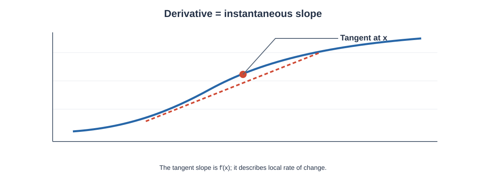

# Calculus

Calculus is the branch of mathematics concerned with **change, rates of change, accumulation, and continuous variation**.



**How to read this graph:** The curve shows a function and the dashed line is a tangent at a chosen point. Its slope is the derivative $f'(x)$, describing the function's local rate of change.

The two central ideas of calculus are:

- **Differentiation**, which studies instantaneous rates of change.
- **Integration**, which studies accumulation and areas.

Limits provide the mathematical foundation for both ideas.

This chapter develops the calculus concepts needed for quantitative and computational work. It begins with functions and limits, then develops continuity, derivatives, differentiation rules, higher-order derivatives, partial derivatives, optimisation, and finally definite and indefinite integration.

The aim is to understand the mathematics carefully rather than memorise isolated formulas.

---

# 1. Learning Objectives

After completing this chapter, you should be able to:

1. Explain functions and their notation.
2. Understand the idea of a limit.
3. Evaluate basic limits algebraically.
4. Explain one-sided limits.
5. Understand continuity.
6. Define the derivative.
7. Interpret a derivative as an instantaneous rate of change.
8. Calculate derivatives using basic rules.
9. Apply the product, quotient, and chain rules.
10. Differentiate common polynomial, exponential, logarithmic, and trigonometric functions.
11. Calculate higher-order derivatives.
12. Understand implicit differentiation.
13. Understand partial derivatives of multivariable functions.
14. Calculate gradients.
15. Understand directional derivatives.
16. Find critical points.
17. Use derivatives for optimisation.
18. Explain increasing and decreasing functions.
19. Understand convexity and concavity.
20. Explain the relationship between derivatives and tangent lines.
21. Define indefinite integrals.
22. Calculate basic antiderivatives.
23. Apply substitution.
24. Understand definite integrals.
25. Interpret the Fundamental Theorem of Calculus.
26. Calculate simple areas using integration.
27. Understand numerical integration at a basic level.
28. Perform calculus calculations using Python and SymPy.

---

# 2. Functions

A function describes a relationship between an input and an output.

We commonly write:

$y=f(x)$

Here:

- $x$ is the input variable,
- $y$ is the output,
- $f$ represents the rule connecting them.

For example:

$f(x)=x^2$

If:

$x=3$

then:

$f(3)=3^2=9$

Therefore:

$\boxed{f(3)=9}$

---

# 3. Domain and Range

The **domain** is the set of allowed input values.

The **range** is the set of output values produced by the function.

Consider:

$f(x)=\sqrt{x}$

For real-valued outputs, we require:

$x\ge0$

Therefore, the domain is:

$[0,\infty)$

Since the square root is never negative, the range is also:

$[0,\infty)$

---

# 4. Common Types of Functions

Some common functions are:

### Linear

$f(x)=mx+c$

### Quadratic

$f(x)=ax^2+bx+c$

### Polynomial

$f(x)=a_nx^n+\cdots+a_1x+a_0$

### Exponential

$f(x)=a^x$

### Logarithmic

$f(x)=\ln x$

### Trigonometric

$f(x)=\sin x,\quad \cos x,\quad \tan x$

Different functions have different rates of change, which is why their derivatives are important.

---

# 5. Limits

A limit describes the value that a function approaches as its input approaches a particular value.

We write:

$\lim_{x\to a}f(x)=L$

This means that as $x$ gets closer to $a$, the value of $f(x)$ gets closer to $L$.

The function does not necessarily need to be defined at $x=a$ for the limit to exist.

---

# 6. Basic Limit Example

Consider:

$f(x)=x+2$

Find:

$\lim_{x\to3}(x+2)$

Since this is a continuous polynomial, direct substitution is valid:

$=3+2$

$=5$

Therefore:

$\boxed{ \lim_{x\to3}(x+2)=5 }$

---

# 7. Limit Laws

If:

$\lim_{x\to a}f(x)=L$

and:

$\lim_{x\to a}g(x)=M$

then:

### Sum

$\lim_{x\to a}[f(x)+g(x)] = L+M$

### Difference

$\lim_{x\to a}[f(x)-g(x)] = L-M$

### Constant multiplication

$\lim_{x\to a}cf(x) = cL$

### Product

$\lim_{x\to a}f(x)g(x) = LM$

### Quotient

Provided $M\ne0$:

$\lim_{x\to a}\frac{f(x)}{g(x)} = \frac{L}{M}$

---

# 8. Limit by Factorisation

Consider:

$\lim_{x\to2} \frac{x^2-4}{x-2}$

Direct substitution gives:

$\frac{2^2-4}{2-2} = \frac{0}{0}$

This is an indeterminate form.

Factor the numerator:

$x^2-4=(x-2)(x+2)$

Therefore:

$\frac{x^2-4}{x-2} = x+2$

for $x\ne2$.

Now take the limit:

$\lim_{x\to2}(x+2) = 4$

Hence:

$\boxed{ \lim_{x\to2} \frac{x^2-4}{x-2} =4 }$

---

# 9. One-Sided Limits

A right-hand limit is written:

$\lim_{x\to a^+}f(x)$

and describes what happens as $x$ approaches $a$ from values greater than $a$.

A left-hand limit is:

$\lim_{x\to a^-}f(x)$

and describes what happens from values smaller than $a$.

A two-sided limit exists only when the two one-sided limits agree:

$\boxed{ \lim_{x\to a^-}f(x) = \lim_{x\to a^+}f(x) }$

---

# 10. Infinite Limits

Sometimes a function grows without bound as $x$ approaches a value.

For example:

$f(x)=\frac{1}{x^2}$

As $x\to0$:

$\frac{1}{x^2}\to\infty$

We write:

$\boxed{ \lim_{x\to0}\frac{1}{x^2}=\infty }$

This describes unbounded behaviour rather than a finite limit.

---

# 11. Limits at Infinity

A limit can also describe what happens as $x$ becomes very large.

Consider:

$f(x)=\frac{1}{x}$

As:

$x\to\infty$

we have:

$\frac{1}{x}\to0$

Therefore:

$\boxed{ \lim_{x\to\infty}\frac{1}{x}=0 }$

---

# 12. Continuity

A function is continuous at $x=a$ when:

1. $f(a)$ exists,
2. $\lim_{x\to a}f(x)$ exists,
3. the limit equals the function value.

Therefore:

$\boxed{ \lim_{x\to a}f(x)=f(a) }$

A continuous function has no break, jump, or hole at the point being considered.

---

# 13. Example of Continuity

Consider:

$f(x)=x^2+1$

At:

$x=2$

we have:

$f(2)=2^2+1=5$

and:

$\lim_{x\to2}(x^2+1)=5$

Therefore:

$\lim_{x\to2}f(x)=f(2)$

Hence the function is continuous at $x=2$.

---

# 14. Derivative

The derivative measures the instantaneous rate of change of a function.

The derivative of $f(x)$ at $x$ is defined by:

$f'(x) = \lim_{h\to0} \frac{f(x+h)-f(x)}{h}$

This is called the **limit definition of the derivative**.

The derivative can also be written as:

$\frac{df}{dx}$

or:

$\frac{dy}{dx}$

when:

$y=f(x)$

---

# 15. Derivative as a Rate of Change

Suppose:

$s(t)$

represents position as a function of time.

Then:

$s'(t)$

represents instantaneous velocity.

If:

$v(t)=s'(t)$

then velocity tells us how quickly position is changing at a particular instant.

The same mathematical idea applies to any differentiable quantity that changes with respect to another variable.

---

# 16. Derivative from First Principles

Consider:

$f(x)=x^2$

Using:

$f'(x) = \lim_{h\to0} \frac{f(x+h)-f(x)}{h}$

we first calculate:

$f(x+h)=(x+h)^2$

Therefore:

$f'(x) = \lim_{h\to0} \frac{(x+h)^2-x^2}{h}$

Expand:

$(x+h)^2=x^2+2xh+h^2$

So:

$f'(x) = \lim_{h\to0} \frac{2xh+h^2}{h}$

For $h\ne0$:

$= \lim_{h\to0}(2x+h)$

Therefore:

$\boxed{f'(x)=2x}$

---

# 17. Geometric Meaning of a Derivative

The derivative gives the slope of the tangent line to a curve.

For:

$y=f(x)$

the slope at $x=a$ is:

$f'(a)$

If:

$f'(a)>0$

the function is increasing locally.

If:

$f'(a)<0$

the function is decreasing locally.

If:

$f'(a)=0$

the tangent is horizontal.

---

# 18. Tangent Line

The tangent line to:

$y=f(x)$

at:

$x=a$

is:

$y-f(a)=f'(a)(x-a)$

For:

$f(x)=x^2$

at:

$x=2$

we have:

$f(2)=4$

and:

$f'(x)=2x$

so:

$f'(2)=4$

Therefore:

$y-4=4(x-2)$

Simplifying:

$y=4x-4$

Hence:

$\boxed{y=4x-4}$

is the tangent line.

---

# 19. Basic Differentiation Rules

## Constant Rule

If:

$f(x)=c$

then:

$\boxed{f'(x)=0}$

Example:

$f(x)=7$

Therefore:

$f'(x)=0$

---

# 20. Power Rule

If:

$f(x)=x^n$

then:

$\boxed{ \frac{d}{dx}x^n=nx^{n-1} }$

Example:

$f(x)=x^5$

Then:

$f'(x)=5x^4$

Therefore:

$\boxed{f'(x)=5x^4}$

---

# 21. Constant Multiple Rule

If:

$f(x)=cf(x)$

more precisely, if the function is $c\,g(x)$, then:

$\boxed{ \frac{d}{dx}[cg(x)] = cg'(x) }$

Example:

$f(x)=4x^3$

Then:

$f'(x)=4(3x^2)$

$\boxed{f'(x)=12x^2}$

---

# 22. Sum and Difference Rule

For:

$f(x)=g(x)+h(x)$

the derivative is:

$\boxed{ f'(x)=g'(x)+h'(x) }$

Similarly:

$\frac{d}{dx}[g(x)-h(x)] = g'(x)-h'(x)$

Example:

$f(x)=x^3+2x^2-5x+4$

Differentiate each term:

$f'(x)=3x^2+4x-5$

Therefore:

$\boxed{f'(x)=3x^2+4x-5}$

---

# 23. Product Rule

If:

$f(x)=u(x)v(x)$

then:

$\boxed{ f'(x)=u'v+uv' }$

Consider:

$f(x)=x^2\sin x$

Let:

$u=x^2$

and:

$v=\sin x$

Then:

$u'=2x$

and:

$v'=\cos x$

Therefore:

$f'(x) = (2x)\sin x+x^2\cos x$

Hence:

$\boxed{ f'(x)=2x\sin x+x^2\cos x }$

---

# 24. Quotient Rule

If:

$f(x)=\frac{u(x)}{v(x)}$

then:

$\boxed{ f'(x) = \frac{vu'-uv'}{v^2} }$

For example:

$f(x)=\frac{x^2}{x+1}$

Let:

$u=x^2,\quad v=x+1$

Then:

$u'=2x,\quad v'=1$

Therefore:

$f'(x) = \frac{(x+1)(2x)-x^2(1)} {(x+1)^2}$

Expand:

$= \frac{2x^2+2x-x^2} {(x+1)^2}$

Thus:

$\boxed{ f'(x)= \frac{x^2+2x}{(x+1)^2} }$

---

# 25. Chain Rule

The chain rule is used when one function is inside another.

If:

$y=f(g(x))$

then:

$\boxed{ \frac{dy}{dx} = f'(g(x))g'(x) }$

Consider:

$y=(3x+1)^4$

Let:

$u=3x+1$

Then:

$y=u^4$

Differentiate:

$\frac{dy}{du}=4u^3$

and:

$\frac{du}{dx}=3$

Therefore:

$\frac{dy}{dx} = 4u^3(3)$

Substitute:

$\boxed{ \frac{dy}{dx} = 12(3x+1)^3 }$

---

# 26. Derivatives of Common Functions

### Exponential

$\boxed{ \frac{d}{dx}e^x=e^x }$

### General exponential

$\boxed{ \frac{d}{dx}a^x=a^x\ln a }$

### Natural logarithm

$\boxed{ \frac{d}{dx}\ln x=\frac{1}{x} }$

### Sine

$\boxed{ \frac{d}{dx}\sin x=\cos x }$

### Cosine

$\boxed{ \frac{d}{dx}\cos x=-\sin x }$

### Tangent

$\boxed{ \frac{d}{dx}\tan x=\sec^2x }$

---

# 27. Derivative of an Exponential Function

Consider:

$f(x)=e^{2x}$

Use the chain rule.

The derivative of the outer function is:

$e^{2x}$

and the derivative of the inner function is:

$2$

Therefore:

$\boxed{ f'(x)=2e^{2x} }$

---

# 28. Derivative of a Logarithmic Function

Consider:

$f(x)=\ln(3x+1)$

Using the chain rule:

$f'(x) = \frac{1}{3x+1}(3)$

Therefore:

$\boxed{ f'(x)=\frac{3}{3x+1} }$

---

# 29. Derivatives of Trigonometric Functions

Important results include:

$\frac{d}{dx}\sin x=\cos x$

$\frac{d}{dx}\cos x=-\sin x$

$\frac{d}{dx}\tan x=\sec^2x$

$\frac{d}{dx}\cot x=-\csc^2x$

$\frac{d}{dx}\sec x=\sec x\tan x$

$\frac{d}{dx}\csc x=-\csc x\cot x$

These rules are frequently combined with the chain rule.

---

# 30. Higher-Order Derivatives

The derivative can itself be differentiated.

The first derivative is:

$f'(x)$

The second derivative is:

$f''(x)$

The third derivative is:

$f'''(x)$

and so on.

Consider:

$f(x)=x^4$

First derivative:

$f'(x)=4x^3$

Second derivative:

$f''(x)=12x^2$

Third derivative:

$f'''(x)=24x$

Fourth derivative:

$f^{(4)}(x)=24$

Therefore:

$\boxed{f^{(4)}(x)=24}$

---

# 31. Meaning of the Second Derivative

The second derivative describes how the first derivative changes.

For:

$f(x)$

the second derivative is:

$f''(x)$

If:

$f''(x)>0$

the function is locally **convex** or **concave upward**.

If:

$f''(x)<0$

the function is locally **concave downward**.

---

# 32. Critical Points

A critical point can occur where:

$f'(x)=0$

or where the derivative does not exist, provided the point belongs to the domain.

Consider:

$f(x)=x^2-4x+3$

Differentiate:

$f'(x)=2x-4$

Set the derivative equal to zero:

$2x-4=0$

$2x=4$

$x=2$

Therefore:

$\boxed{x=2}$

is a critical point.

---

# 33. First Derivative Test

The first derivative can help classify a critical point.

If the derivative changes:

$+\to-$

the function changes from increasing to decreasing, giving a local maximum.

If the derivative changes:

$-\to+$

the function changes from decreasing to increasing, giving a local minimum.

---

# 34. Second Derivative Test

At a critical point $x=c$ where:

$f'(c)=0$

we can use the second derivative.

If:

$f''(c)>0$

then $c$ is a local minimum.

If:

$f''(c)<0$

then $c$ is a local maximum.

If:

$f''(c)=0$

the test is inconclusive.

---

# 35. Worked Optimisation Example

Consider:

$f(x)=x^2-6x+5$

We want to find its minimum.

First derivative:

$f'(x)=2x-6$

Set equal to zero:

$2x-6=0$

$x=3$

Second derivative:

$f''(x)=2$

Since:

$f''(3)=2>0$

the point is a local minimum.

Calculate the function value:

$f(3)=3^2-6(3)+5$

$=9-18+5$

$=-4$

Therefore:

$\boxed{\text{Minimum value}=-4\text{ at }x=3}$

---

# 36. Increasing and Decreasing Functions

A function is increasing over an interval when:

$f'(x)>0$

throughout that interval.

It is decreasing when:

$f'(x)<0$

throughout the interval.

For:

$f(x)=x^2$

we have:

$f'(x)=2x$

For $x>0$:

$2x>0$

so the function increases.

For $x<0$:

$2x<0$

so the function decreases.

---

# 37. Convexity and Concavity

A twice-differentiable function is locally convex when:

$f''(x)>0$

and concave when:

$f''(x)<0$

For:

$f(x)=x^2$

we have:

$f''(x)=2$

Since:

$2>0$

the function is convex everywhere.

---

# 38. Inflection Point

An inflection point is a point where the concavity changes.

A common candidate is where:

$f''(x)=0$

or where $f''$ does not exist.

However, simply obtaining $f''(x)=0$ is not sufficient. The concavity must actually change.

Consider:

$f(x)=x^3$

Then:

$f'(x)=3x^2$

and:

$f''(x)=6x$

At:

$x=0$

the second derivative is zero.

For $x<0$:

$f''(x)<0$

For $x>0$:

$f''(x)>0$

Therefore concavity changes at zero.

Hence:

$\boxed{x=0}$

is an inflection point.

---

# 39. Implicit Differentiation

Sometimes $y$ is not explicitly written as a function of $x$.

Consider:

$x^2+y^2=25$

Differentiate both sides with respect to $x$:

$2x+2y\frac{dy}{dx}=0$

Therefore:

$2y\frac{dy}{dx}=-2x$

and:

$\boxed{ \frac{dy}{dx}=-\frac{x}{y} }$

---

# 40. Partial Derivatives

A function may depend on more than one variable.

For example:

$f(x,y)=x^2+3xy+y^2$

A partial derivative with respect to $x$ treats $y$ as constant.

Therefore:

$\frac{\partial f}{\partial x} = 2x+3y$

Similarly:

$\frac{\partial f}{\partial y} = 3x+2y$

Thus:

$\boxed{ \frac{\partial f}{\partial x}=2x+3y }$

and:

$\boxed{ \frac{\partial f}{\partial y}=3x+2y }$

---

# 41. Worked Partial Derivative Example

Let:

$f(x,y)=x^2y+4xy^2$

### Partial derivative with respect to $x$

Treat $y$ as constant:

$\frac{\partial f}{\partial x} = 2xy+4y^2$

### Partial derivative with respect to $y$

Treat $x$ as constant:

$\frac{\partial f}{\partial y} = x^2+8xy$

Therefore:

$\boxed{ f_x=2xy+4y^2 }$

and:

$\boxed{ f_y=x^2+8xy }$

---

# 42. Gradient

For a scalar-valued function:

$f(x_1,x_2,\ldots,x_n)$

the gradient is:

$\boxed{ \nabla f = \begin{bmatrix} \frac{\partial f}{\partial x_1}\\ \frac{\partial f}{\partial x_2}\\ \vdots\\ \frac{\partial f}{\partial x_n} \end{bmatrix} }$

For:

$f(x,y)=x^2+y^2$

we obtain:

$\frac{\partial f}{\partial x}=2x$

and:

$\frac{\partial f}{\partial y}=2y$

Therefore:

$\boxed{ \nabla f= \begin{bmatrix} 2x\\ 2y \end{bmatrix}}$

---

# 43. Interpretation of the Gradient

The gradient points in the direction of the greatest local increase of a differentiable scalar-valued function.

Its magnitude:

$\|\nabla f\|$

represents the maximum directional rate of change at that point.

The gradient is perpendicular to a level curve or level surface under appropriate differentiability conditions.

---

# 44. Directional Derivative

Let $\mathbf{u}$ be a unit vector.

The directional derivative of $f$ in direction $\mathbf{u}$ is:

$\boxed{ D_{\mathbf{u}}f = \nabla f\cdot\mathbf{u} }$

Suppose:

$f(x,y)=x^2+y^2$

At $(1,2)$:

$\nabla f= \begin{bmatrix} 2\\ 4 \end{bmatrix}$

Suppose the unit direction is:

$\mathbf{u} = \begin{bmatrix} \frac{3}{5}\\ \frac{4}{5} \end{bmatrix}$

Then:

$D_{\mathbf{u}}f = \begin{bmatrix} 2\\ 4 \end{bmatrix} \cdot \begin{bmatrix} 3/5\\ 4/5 \end{bmatrix}$

$= \frac{6}{5}+\frac{16}{5}$

$= \frac{22}{5}$

Therefore:

$\boxed{ D_{\mathbf{u}}f=\frac{22}{5}=4.4 }$

---

# 45. Hessian Matrix

For a twice-differentiable function of several variables, the Hessian contains second-order partial derivatives.

For:

$f(x,y)$

the Hessian is:

$\boxed{ H= \begin{bmatrix} \frac{\partial^2f}{\partial x^2} & \frac{\partial^2f}{\partial x\partial y} \\ \frac{\partial^2f}{\partial y\partial x} & \frac{\partial^2f}{\partial y^2} \end{bmatrix} }$

For:

$f(x,y)=x^2+3xy+y^2$

we have:

$f_{xx}=2$

$f_{xy}=3$

$f_{yx}=3$

$f_{yy}=2$

Therefore:

$\boxed{ H= \begin{bmatrix} 2&3\\ 3&2 \end{bmatrix}}$

---

# 46. Indefinite Integral

An indefinite integral represents a family of antiderivatives.

If:

$F'(x)=f(x)$

then:

$\boxed{ \int f(x)\,dx=F(x)+C }$

where $C$ is the constant of integration.

For example:

$\int x^2\,dx$

Using the power rule in reverse:

$\int x^2\,dx = \frac{x^3}{3}+C$

Therefore:

$\boxed{ \int x^2\,dx = \frac{x^3}{3}+C }$

---

# 47. Basic Integration Rules

### Constant

$\int c\,dx=cx+C$

### Power rule

For:

$n\ne-1$

$\boxed{ \int x^n\,dx = \frac{x^{n+1}}{n+1}+C }$

### Exponential

$\boxed{ \int e^x\,dx=e^x+C }$

### Reciprocal

$\boxed{ \int\frac{1}{x}\,dx = \ln|x|+C }$

### Sine

$\boxed{ \int\sin x\,dx=-\cos x+C }$

### Cosine

$\boxed{ \int\cos x\,dx=\sin x+C }$

---

# 48. Integration by Substitution

Substitution is useful when an integral contains a function and its derivative.

Consider:

$\int 2x(x^2+1)^3\,dx$

Let:

$u=x^2+1$

Then:

$du=2x\,dx$

Therefore:

$\int 2x(x^2+1)^3\,dx = \int u^3\,du$

Integrate:

$= \frac{u^4}{4}+C$

Substitute back:

$\boxed{ \int 2x(x^2+1)^3\,dx = \frac{(x^2+1)^4}{4}+C }$

---

# 49. Definite Integral

A definite integral has limits:

$\int_a^b f(x)\,dx$

It produces a number rather than a family of functions.

For:

$f(x)=x^2$

consider:

$\int_0^2 x^2\,dx$

An antiderivative is:

$F(x)=\frac{x^3}{3}$

Therefore:

$\int_0^2 x^2\,dx = \left[\frac{x^3}{3}\right]_0^2$

$= \frac{2^3}{3}-\frac{0^3}{3}$

$= \frac{8}{3}$

Thus:

$\boxed{ \int_0^2 x^2\,dx = \frac{8}{3} }$

---

# 50. Area Under a Curve

When $f(x)\ge0$ on $[a,b]$, the definite integral:

$\int_a^b f(x)\,dx$

represents the area under the curve and above the $x$-axis.

For:

$f(x)=x$

from $0$ to $2$:

$\int_0^2 x\,dx = \left[\frac{x^2}{2}\right]_0^2$

$= \frac{4}{2}$

$=2$

Therefore:

$\boxed{\text{Area}=2}$

---

# 51. Signed Area

If a function is below the $x$-axis, its definite integral contributes a negative value.

Therefore, a definite integral represents **signed area**.

For example:

$\int_{-1}^{1}x\,dx=0$

because the negative area on the left cancels the positive area on the right.

This does not mean there is no geometric area; it means the signed areas cancel.

---

# 52. Fundamental Theorem of Calculus

The Fundamental Theorem of Calculus connects differentiation and integration.

If:

$F(x)=\int_a^x f(t)\,dt$

and $f$ is continuous, then:

$\boxed{F'(x)=f(x)}$

This says that accumulation followed by differentiation returns the original rate.

The second part states:

$\boxed{ \int_a^b f(x)\,dx = F(b)-F(a) }$

when $F'(x)=f(x)$.

---

# 53. Worked Fundamental Theorem Example

Let:

$F(x)=\int_0^x t^2\,dt$

By the Fundamental Theorem of Calculus:

$F'(x)=x^2$

We can verify this by evaluating the integral:

$F(x) = \left[\frac{t^3}{3}\right]_0^x$

$= \frac{x^3}{3}$

Differentiate:

$F'(x)=x^2$

Therefore:

$\boxed{F'(x)=x^2}$

---

# 54. Integration by Parts

Integration by parts follows from the product rule.

The formula is:

$\boxed{ \int u\,dv = uv-\int v\,du }$

Consider:

$\int x e^x\,dx$

Choose:

$u=x$

and:

$dv=e^x\,dx$

Then:

$du=dx$

and:

$v=e^x$

Therefore:

$\int xe^x\,dx = xe^x-\int e^x\,dx$

$= xe^x-e^x+C$

Hence:

$\boxed{ \int xe^x\,dx = e^x(x-1)+C }$

---

# 55. Average Value of a Function

The average value of a continuous function on $[a,b]$ is:

$\boxed{ f_{\text{avg}} = \frac{1}{b-a} \int_a^b f(x)\,dx }$

Consider:

$f(x)=x^2$

on $[0,2]$.

We know:

$\int_0^2 x^2\,dx=\frac{8}{3}$

Therefore:

$f_{\text{avg}} = \frac{1}{2-0} \left(\frac{8}{3}\right)$

$= \frac{4}{3}$

Thus:

$\boxed{ f_{\text{avg}}=\frac{4}{3} }$

---

# 56. Numerical Integration

When an antiderivative is difficult or unavailable, numerical methods can approximate a definite integral.

Common methods include:

- Trapezoidal rule
- Simpson's rule
- numerical quadrature

The trapezoidal rule approximates:

$\int_a^b f(x)\,dx$

by replacing sections of the curve with trapezoids.

For $n$ equally spaced intervals:

$\boxed{ T_n = \frac{h}{2} \left[ f(x_0) + 2\sum_{i=1}^{n-1}f(x_i) + f(x_n) \right] }$

where:

$h=\frac{b-a}{n}$

---

# 57. Trapezoidal Rule Example

Approximate:

$\int_0^2 x^2\,dx$

using two intervals.

We have:

$n=2$

and:

$h=\frac{2-0}{2}=1$

The points are:

$x_0=0,\quad x_1=1,\quad x_2=2$

Function values:

$f(0)=0$

$f(1)=1$

$f(2)=4$

Therefore:

$T_2 = \frac{1}{2} [0+2(1)+4]$

$= \frac{6}{2}$

$=3$

The exact integral is:

$\frac{8}{3}\approx2.667$

So the two-interval trapezoidal approximation is:

$\boxed{3}$

---

# 58. Derivative and Integral Relationship

Differentiation and integration are closely connected.

Differentiation asks:

> How quickly is a quantity changing?

Integration asks:

> How much has accumulated?

The Fundamental Theorem of Calculus connects the two operations.

Conceptually:

$\boxed{ \text{Derivative} \longleftrightarrow \text{Integral} }$

They are not simply opposite operations in every practical situation, but under the appropriate conditions they are inverse processes.

---

# 59. Common Differentiation Mistakes

### Mistake 1: Forgetting the exponent reduction

For:

$x^5$

the derivative is:

$5x^4$

not:

$x^4$

### Mistake 2: Forgetting the chain rule

For:

$(3x+1)^4$

the derivative is:

$12(3x+1)^3$

not simply:

$4(3x+1)^3$

### Mistake 3: Using the product rule incorrectly

For:

$uv$

the derivative is:

$u'v+uv'$

not:

$u'v'$

### Mistake 4: Forgetting the integration constant

An indefinite integral must contain:

$+C$

### Mistake 5: Confusing derivative and partial derivative

For multivariable functions, the variable being differentiated with respect to must be clear.

---

# 60. Common Integration Mistakes

### Mistake 1: Incorrect power rule

The correct formula is:

$\int x^n\,dx = \frac{x^{n+1}}{n+1}+C$

for:

$n\ne-1$

### Mistake 2: Forgetting absolute value

The integral of $1/x$ is:

$\ln|x|+C$

### Mistake 3: Confusing definite and indefinite integrals

An indefinite integral produces a function plus $C$.

A definite integral produces a numerical value.

### Mistake 4: Treating signed area as total geometric area

Negative regions contribute negative values to a definite integral.

---

# 61. SymPy: Symbolic Differentiation

Python's SymPy library can perform symbolic calculus.

```python
import sympy as sp

x = sp.symbols('x')

f = x**3 + 2*x**2 - 5*x + 4

derivative = sp.diff(f, x)

print(derivative)
```

The result is:

$\boxed{3x^2+4x-5}$

---

# 62. SymPy: Symbolic Integration

```python
f = x**2

integral = sp.integrate(f, x)

print(integral)
```

The result is:

$\boxed{\frac{x^3}{3}}$

SymPy may omit the arbitrary constant in its symbolic output because symbolic antiderivatives represent a family of functions.

---

# 63. SymPy: Definite Integral

```python
f = x**2

area = sp.integrate(f, (x, 0, 2))

print(area)
```

The result is:

$\boxed{\frac{8}{3}}$

---

# 64. SymPy: Limits

```python
f = (x**2 - 4) / (x - 2)

limit_value = sp.limit(f, x, 2)

print(limit_value)
```

The result is:

$\boxed{4}$

---

# 65. SymPy: Partial Derivatives

```python
x, y = sp.symbols('x y')

f = x**2 + 3*x*y + y**2

fx = sp.diff(f, x)
fy = sp.diff(f, y)

print("df/dx =", fx)
print("df/dy =", fy)
```

The results are:

$\boxed{ \frac{\partial f}{\partial x}=2x+3y }$

and:

$\boxed{ \frac{\partial f}{\partial y}=3x+2y }$

---

# 66. Numerical Derivative

A derivative can also be approximated numerically using a small step.

The central difference approximation is:

$\boxed{ f'(x) \approx \frac{f(x+h)-f(x-h)} {2h} }$

For sufficiently small $h$, this can provide a good approximation for a smooth function.

Example:

```python
def f(x):
    return x**2

x0 = 3
h = 1e-5

approx_derivative = (f(x0 + h) - f(x0 - h)) / (2 * h)

print(approx_derivative)
```

The exact derivative is:

$f'(x)=2x$

so:

$f'(3)=6$

The numerical result should be very close to:

$\boxed{6}$

---

# 67. Numerical Integration with NumPy

The trapezoidal rule can be implemented using NumPy.

```python
import numpy as np

x_values = np.linspace(0, 2, 1000)
y_values = x_values**2

area = np.trapezoid(y_values, x_values)

print(area)
```

The result approaches:

$\frac{8}{3}$

as the number of points increases.

---

# 68. Complete Calculus Example

Consider:

$f(x)=x^3-3x^2+2$

We will study its derivative and critical points.

### Step 1: Differentiate

$f'(x)=3x^2-6x$

Factor:

$f'(x)=3x(x-2)$

### Step 2: Find critical points

Set:

$f'(x)=0$

Therefore:

$3x(x-2)=0$

So:

$x=0$

or:

$x=2$

### Step 3: Second derivative

$f''(x)=6x-6$

At $x=0$:

$f''(0)=-6<0$

Therefore $x=0$ is a local maximum.

At $x=2$:

$f''(2)=12-6=6>0$

Therefore $x=2$ is a local minimum.

### Step 4: Function values

At $x=0$:

$f(0)=2$

At $x=2$:

$f(2)=8-12+2=-2$

Therefore:

$\boxed{ \text{Local maximum: }(0,2) }$

and:

$\boxed{ \text{Local minimum: }(2,-2) }$

---

# 69. Formula Summary

## Limits

$\lim_{x\to a}f(x)=L$

## Derivative definition

$f'(x) = \lim_{h\to0} \frac{f(x+h)-f(x)}{h}$

## Power rule

$\frac{d}{dx}x^n=nx^{n-1}$

## Product rule

$(uv)'=u'v+uv'$

## Quotient rule

$\left(\frac{u}{v}\right)' = \frac{vu'-uv'}{v^2}$

## Chain rule

$\frac{d}{dx}f(g(x)) = f'(g(x))g'(x)$

## Exponential derivative

$\frac{d}{dx}e^x=e^x$

## Logarithmic derivative

$\frac{d}{dx}\ln x=\frac{1}{x}$

## Sine derivative

$\frac{d}{dx}\sin x=\cos x$

## Cosine derivative

$\frac{d}{dx}\cos x=-\sin x$

## Gradient

$\nabla f = \begin{bmatrix} \partial f/\partial x_1\\ \vdots\\ \partial f/\partial x_n \end{bmatrix}$

## Directional derivative

$D_{\mathbf{u}}f = \nabla f\cdot\mathbf{u}$

## Indefinite integral

$\int f(x)\,dx=F(x)+C$

## Power integration rule

$\int x^n\,dx = \frac{x^{n+1}}{n+1}+C$

for:

$n\ne-1$

## Reciprocal integral

$\int\frac{1}{x}\,dx = \ln|x|+C$

## Integration by parts

$\int u\,dv = uv-\int v\,du$

## Definite integral

$\int_a^b f(x)\,dx$

## Fundamental Theorem of Calculus

$\int_a^b f(x)\,dx = F(b)-F(a)$

when:

$F'(x)=f(x)$

## Average value

$f_{\mathrm{avg}} = \frac{1}{b-a} \int_a^b f(x)\,dx$

## Trapezoidal rule

$T_n = \frac{h}{2} \left[ f(x_0) + 2\sum_{i=1}^{n-1}f(x_i) + f(x_n) \right]$

---

# 70. Quick Concept Comparison

| Concept | Main idea |
|---|---|
| Function | Maps inputs to outputs |
| Limit | Value approached by a function |
| Continuity | No break at a point under the continuity conditions |
| Derivative | Instantaneous rate of change |
| First derivative | Slope/rate of change |
| Second derivative | Change in the rate of change |
| Critical point | Point where derivative is zero or undefined within the domain |
| Gradient | Vector of partial derivatives |
| Directional derivative | Rate of change in a specified direction |
| Indefinite integral | Family of antiderivatives |
| Definite integral | Accumulated signed quantity over an interval |
| Fundamental Theorem | Connects differentiation and integration |
| Numerical integration | Approximation of an integral |
| Convexity | Positive second derivative locally |
| Concavity | Negative second derivative locally |

---

# 71. Points to Remember

1. A function maps inputs to outputs.
2. A limit describes what a function approaches.
3. Continuity requires the function value and limit to agree at the point.
4. The derivative measures instantaneous rate of change.
5. The derivative also represents the tangent slope.
6. The power rule is:
   $$
   \frac{d}{dx}x^n=nx^{n-1}
   $$
7. The product rule is required when differentiating a product of functions.
8. The quotient rule is required for a quotient of functions.
9. The chain rule is required for compositions of functions.
10. The second derivative helps describe curvature and can classify some critical points.
11. Partial derivatives differentiate with respect to one variable while holding other variables constant.
12. The gradient contains all first-order partial derivatives.
13. A directional derivative gives the rate of change in a chosen direction.
14. An indefinite integral includes an arbitrary constant.
15. A definite integral produces a numerical value.
16. A definite integral represents signed accumulation.
17. The Fundamental Theorem of Calculus connects derivatives and integrals.
18. Numerical integration approximates an integral when an exact antiderivative is inconvenient.
19. SymPy can perform symbolic differentiation, integration, and limits.
20. Numerical approximations should be checked against analytical results whenever possible.

---

# 72. Chapter Summary

Calculus provides a mathematical framework for studying continuous change and accumulation.

Limits establish the foundation of calculus by describing the value approached by a function. Derivatives are built from limits and measure instantaneous rates of change. They also provide the slope of tangent lines and help analyse increasing and decreasing behaviour, critical points, curvature, and optimisation.

For functions of several variables, partial derivatives describe changes with respect to individual variables. The gradient collects these partial derivatives into a vector, while the directional derivative measures change along a particular direction. Second-order partial derivatives form the Hessian matrix.

Integration studies accumulation. Indefinite integration finds antiderivatives, while definite integration evaluates accumulated signed quantities over intervals. The Fundamental Theorem of Calculus establishes the central connection between differentiation and integration.

Numerical methods provide approximations when exact symbolic calculations are difficult.

The central structure of calculus can be summarised as:

$\boxed{ \text{Limits} \rightarrow \text{Derivatives} \rightarrow \text{Rates and Optimisation} }$

and:

$\boxed{ \text{Antiderivatives} \rightarrow \text{Definite Integrals} \rightarrow \text{Accumulation} }$

Together, these ideas form the core calculus foundation for quantitative mathematics.

---

# 73. References

- James Stewart, *Calculus: Early Transcendentals*.
- George B. Thomas, Maurice D. Weir, Joel Hass, *Thomas' Calculus*.
- MIT OpenCourseWare, Single Variable Calculus.
- OpenStax, *Calculus*.
- SymPy Documentation, Calculus.
- NumPy Documentation, Numerical Computing.
- GeeksforGeeks, educational resources on calculus.
