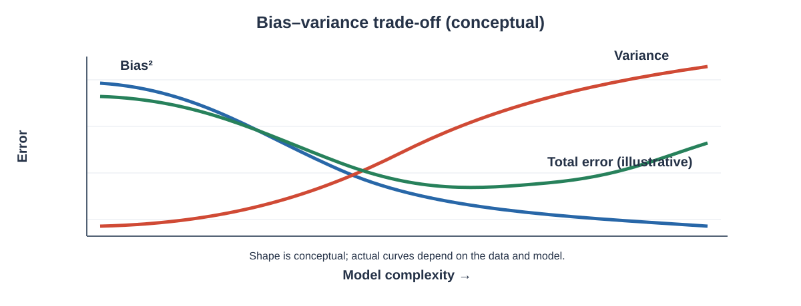

# Bias and Variance

Bias and variance are two fundamental ideas for understanding the behaviour of statistical estimators and the reliability of predictions.

An estimator is calculated from a sample, so its value can change when a different sample is observed. Two different questions therefore become important:

- **Bias:** Is the estimator systematically away from the quantity it is trying to estimate?
- **Variance:** How much does the estimator change from sample to sample?

These ideas are related but different. An estimator can have low bias and high variance, high bias and low variance, or both high bias and high variance.

The chapter first develops bias and variance in the context of statistical estimation. It then develops the bias–variance decomposition for squared prediction error and explains the trade-off between systematic error, sampling variability, and irreducible noise.



**How to read this graph:** As model complexity grows, squared bias often decreases while variance often increases. Their combined prediction error may be lowest at an intermediate complexity. The exact curves depend on the dataset and model; the illustration is conceptual rather than measured data.

The goal is to understand the mathematical structure behind these concepts rather than reduce them to the simple statement that "high bias means underfitting" and "high variance means overfitting."

---

# 1. Learning Objectives

After completing this chapter, you should be able to:

1. Explain what an estimator is.
2. Distinguish a parameter from an estimator.
3. Define bias mathematically.
4. Calculate the bias of an estimator.
5. Distinguish unbiased and biased estimators.
6. Explain sampling variability.
7. Define variance of an estimator.
8. Calculate estimator variance for simple cases.
9. Explain standard error as the standard deviation of an estimator.
10. Distinguish bias from variance.
11. Explain consistency.
12. Explain efficiency at a basic level.
13. Understand the bias–variance trade-off.
14. Derive the squared-error bias–variance decomposition.
15. Distinguish reducible and irreducible error.
16. Understand how model flexibility can affect bias and variance.
17. Explain underfitting and overfitting carefully.
18. Understand training and test error conceptually.
19. Interpret learning-curve behaviour.
20. Understand why cross-validation is useful when comparing model complexity.
21. Calculate bias and variance using simulation.
22. Perform practical bias–variance experiments with Python.

---

# 2. Parameter and Estimator

A **parameter** is a fixed but usually unknown numerical property of a population.

Examples include:

- population mean $\mu$,
- population variance $\sigma^2$,
- population proportion $p$.

An **estimator** is a rule that uses sample data to estimate a population parameter.

For example, the sample mean:

$$
\bar{X}
=
\frac{1}{n}
\sum_{i=1}^{n}X_i
$$

is an estimator of the population mean $\mu$.

The important distinction is:

$$
\boxed{
\text{Parameter}=\text{population quantity}
}
$$

while:

$$
\boxed{
\text{Estimator}=\text{sample-based rule used to estimate it}
}
$$

---

# 3. Why Estimators Vary

Suppose a population has a true mean:

$$
\mu=50
$$

We repeatedly take samples of size $n$.

The sample means might be:

$$
48.7,\quad50.9,\quad49.6,\quad51.2,\quad50.1
$$

The population mean has not changed.

The estimator has changed because the sample has changed.

Therefore, an estimator is a random quantity before the sample is observed.

This sampling variability is the foundation for understanding estimator variance.

---

# 4. Expected Value of an Estimator

Let:

$$
\hat{\theta}
$$

be an estimator of a parameter:

$$
\theta
$$

The expected value of the estimator is:

$$
E[\hat{\theta}]
$$

This represents the average value the estimator would produce over repeated random samples from the same population.

If:

$$
E[\hat{\theta}]=\theta
$$

the estimator is unbiased.

---

# 5. Bias

The bias of an estimator $\hat{\theta}$ for parameter $\theta$ is:

$$
\boxed{
\operatorname{Bias}(\hat{\theta})
=
E[\hat{\theta}]-\theta
}
$$

The bias measures systematic deviation from the true parameter.

If:

$$
\operatorname{Bias}(\hat{\theta})=0
$$

the estimator is unbiased.

If:

$$
\operatorname{Bias}(\hat{\theta})>0
$$

the estimator tends to overestimate $\theta$.

If:

$$
\operatorname{Bias}(\hat{\theta})<0
$$

the estimator tends to underestimate $\theta$.

---

# 6. Worked Example: Calculating Bias

Suppose an estimator has:

$$
E[\hat{\theta}]=12.5
$$

and the true parameter is:

$$
\theta=10
$$

Then:

$$
\operatorname{Bias}(\hat{\theta})
=
12.5-10
$$

Therefore:

$$
\boxed{
\operatorname{Bias}(\hat{\theta})=2.5
}
$$

The estimator has positive bias and tends to overestimate the parameter.

---

# 7. Unbiased Estimator

An estimator is unbiased if:

$$
E[\hat{\theta}]=\theta
$$

Equivalently:

$$
\operatorname{Bias}(\hat{\theta})=0
$$

For example, under the usual random-sampling assumptions, the sample mean is an unbiased estimator of the population mean:

$$
E[\bar{X}]=\mu
$$

Therefore:

$$
\boxed{
\operatorname{Bias}(\bar{X})=0
}
$$

Unbiasedness does not mean that every individual sample estimate equals the true parameter. It means that the estimator is correct on average over repeated sampling.

---

# 8. Bias Does Not Mean Every Estimate Is Wrong

Suppose:

$$
\theta=100
$$

and an estimator has zero bias.

A particular sample might produce:

$$
\hat{\theta}=94
$$

Another might produce:

$$
\hat{\theta}=106
$$

Another might produce:

$$
\hat{\theta}=101
$$

The individual estimates are not necessarily equal to 100.

Unbiasedness means:

$$
E[\hat{\theta}]=100
$$

over repeated sampling.

Therefore:

$$
\boxed{
\text{Unbiased does not mean exact for every sample.}
}
$$

---

# 9. Variance of an Estimator

The variance of an estimator measures its sampling variability.

For estimator $\hat{\theta}$:

$$
\boxed{
\operatorname{Var}(\hat{\theta})
=
E[
(\hat{\theta}-E[\hat{\theta}])^2
]
}
$$

A low estimator variance means that repeated samples tend to produce estimates close to each other.

A high estimator variance means that repeated samples can produce substantially different estimates.

---

# 10. Standard Error

The standard error of an estimator is its standard deviation:

$$
\boxed{
SE(\hat{\theta})
=
\sqrt{\operatorname{Var}(\hat{\theta})}
}
$$

Variance is measured in squared units.

Standard error is measured in the same units as the estimator.

For example, if an estimator measures income in rupees, its variance has units of rupees squared, while its standard error is measured in rupees.

---

# 11. Variance of the Sample Mean

Suppose independent observations have:

$$
E[X_i]=\mu
$$

and:

$$
\operatorname{Var}(X_i)=\sigma^2
$$

The sample mean is:

$$
\bar{X}
=
\frac{1}{n}
\sum_{i=1}^{n}X_i
$$

Its variance is:

$$
\boxed{
\operatorname{Var}(\bar{X})
=
\frac{\sigma^2}{n}
}
$$

Therefore:

$$
SE(\bar{X})
=
\sqrt{\frac{\sigma^2}{n}}
$$

so:

$$
\boxed{
SE(\bar{X})
=
\frac{\sigma}{\sqrt{n}}
}
$$

Increasing sample size reduces the sampling variability of the sample mean.

---

# 12. Worked Example: Standard Error of the Mean

Suppose:

$$
\sigma=12
$$

and:

$$
n=36
$$

Then:

$$
SE(\bar{X})
=
\frac{12}{\sqrt{36}}
$$

$$
=
\frac{12}{6}
$$

Therefore:

$$
\boxed{
SE(\bar{X})=2
}
$$

The sample mean has a standard error of 2 units under these assumptions.

---

# 13. Effect of Sample Size on Variance

For the sample mean:

$$
\operatorname{Var}(\bar{X})
=
\frac{\sigma^2}{n}
$$

If the sample size is multiplied by 4:

$$
n_{\text{new}}=4n
$$

then:

$$
\operatorname{Var}(\bar{X}_{\text{new}})
=
\frac{\sigma^2}{4n}
$$

Therefore:

$$
\boxed{
\operatorname{Var}(\bar{X}_{\text{new}})
=
\frac14
\operatorname{Var}(\bar{X})
}
$$

The standard error becomes:

$$
\frac{\sigma}{\sqrt{4n}}
=
\frac12\frac{\sigma}{\sqrt n}
$$

So quadrupling the sample size halves the standard error of the sample mean.

---

# 14. Bias and Variance Are Different

Consider two estimators.

Estimator A:

- bias = 0,
- high variance.

Estimator B:

- bias = 2,
- low variance.

Estimator A is centered correctly on average but may fluctuate considerably.

Estimator B is consistently shifted away from the true parameter but produces stable estimates.

Therefore:

$$
\boxed{
\text{Bias measures systematic error.}
}
$$

and:

$$
\boxed{
\text{Variance measures sampling variability.}
}
$$

---

# 15. Visualising Bias and Variance Conceptually

Imagine repeatedly estimating a target value.

### High bias, low variance

The estimates are tightly grouped but away from the target.

### Low bias, high variance

The estimates are widely spread but centred around the target.

### Low bias, low variance

The estimates are tightly grouped around the target.

### High bias, high variance

The estimates are spread out and systematically displaced.

The important point is that accuracy and stability are separate properties.

---

# 16. Mean Squared Error of an Estimator

The mean squared error of an estimator is:

$$
\boxed{
MSE(\hat{\theta})
=
E[
(\hat{\theta}-\theta)^2
]
}
$$

MSE combines both systematic bias and variability.

The key decomposition is:

$$
\boxed{
MSE(\hat{\theta})
=
\operatorname{Var}(\hat{\theta})
+
\operatorname{Bias}(\hat{\theta})^2
}
$$

This relationship assumes the estimator is considered with respect to a fixed parameter $\theta$.

---

# 17. Derivation of the Bias–Variance Decomposition

Start with:

$$
MSE(\hat{\theta})
=
E[(\hat{\theta}-\theta)^2]
$$

Add and subtract:

$$
E[\hat{\theta}]
$$

inside the difference:

$$
\hat{\theta}-\theta
=
[\hat{\theta}-E(\hat{\theta})]
+
[E(\hat{\theta})-\theta]
$$

Therefore:

$$
MSE(\hat{\theta})
=
E
\left[
\left(
\hat{\theta}-E[\hat{\theta}]
+
E[\hat{\theta}]-\theta
\right)^2
\right]
$$

Expand:

$$
=
E[(\hat{\theta}-E[\hat{\theta}])^2]
+
2E[
(\hat{\theta}-E[\hat{\theta}])
(E[\hat{\theta}]-\theta)
]
+
(E[\hat{\theta}]-\theta)^2
$$

The second term is zero because:

$$
E[\hat{\theta}-E(\hat{\theta})]=0
$$

Therefore:

$$
MSE(\hat{\theta})
=
\operatorname{Var}(\hat{\theta})
+
(E[\hat{\theta}]-\theta)^2
$$

Since:

$$
\operatorname{Bias}(\hat{\theta})
=
E[\hat{\theta}]-\theta
$$

we obtain:

$$
\boxed{
MSE(\hat{\theta})
=
\operatorname{Var}(\hat{\theta})
+
\operatorname{Bias}(\hat{\theta})^2
}
$$

This is one of the most important results in this chapter.

---

# 18. Worked MSE Example

Suppose an estimator has:

$$
\operatorname{Bias}(\hat{\theta})=2
$$

and:

$$
\operatorname{Var}(\hat{\theta})=9
$$

Then:

$$
MSE
=
9+2^2
$$

$$
=9+4
$$

Therefore:

$$
\boxed{
MSE=13
}
$$

The MSE contains:

- variance contribution = 9,
- squared-bias contribution = 4.

---

# 19. Root Mean Squared Error

The root mean squared error is:

$$
\boxed{
RMSE
=
\sqrt{MSE}
}
$$

For the previous example:

$$
RMSE
=
\sqrt{13}
$$

Therefore:

$$
\boxed{
RMSE\approx3.606
}
$$

RMSE is expressed in the same units as the quantity being estimated.

---

# 20. Mean Squared Error Versus Variance

If an estimator is unbiased:

$$
\operatorname{Bias}(\hat{\theta})=0
$$

then:

$$
MSE(\hat{\theta})
=
\operatorname{Var}(\hat{\theta})
$$

Therefore:

$$
\boxed{
\text{For an unbiased estimator, MSE equals variance.}
}
$$

For a biased estimator:

$$
MSE
=
Variance+Bias^2
$$

so MSE is greater than or equal to variance.

---

# 21. Consistency

An estimator is consistent if it approaches the true parameter as the sample size increases.

Informally:

$$
\hat{\theta}_n
\rightarrow
\theta
$$

as:

$$
n\rightarrow\infty
$$

More formally, consistency is generally expressed as convergence in probability:

$$
\boxed{
\hat{\theta}_n
\xrightarrow{p}
\theta
}
$$

An estimator can be biased for finite samples and still be consistent if its bias and variability decrease appropriately as sample size grows.

---

# 22. Bias and Consistency

Bias and consistency are not the same property.

An estimator may have:

$$
\operatorname{Bias}(\hat{\theta}_n)\ne0
$$

for finite $n$ but still satisfy:

$$
\operatorname{Bias}(\hat{\theta}_n)\to0
$$

as:

$$
n\to\infty
$$

Such an estimator can still be consistent, provided its sampling variability also shrinks appropriately.

Therefore:

$$
\boxed{
\text{Biased for finite samples does not automatically mean inconsistent.}
}
$$

---

# 23. Efficiency

When comparing unbiased estimators of the same parameter, an estimator with smaller variance is generally preferred because it is more precise.

Suppose two unbiased estimators satisfy:

$$
\operatorname{Var}(\hat{\theta}_1)
<
\operatorname{Var}(\hat{\theta}_2)
$$

Then estimator 1 has greater precision under this criterion.

Thus:

$$
\boxed{
\text{Lower variance among comparable unbiased estimators means greater efficiency.}
}
$$

Efficiency must always be interpreted relative to the estimators being compared and the assumptions under which the comparison is made.

---

# 24. Bias–Variance Trade-Off

The **bias–variance trade-off** describes the tension that can occur when choosing between simpler and more flexible estimation procedures.

A very simple procedure may make strong assumptions and therefore have:

- higher bias,
- lower variance.

A highly flexible procedure may adapt closely to observed data and therefore have:

- lower bias,
- higher variance.

The goal is not necessarily to minimise bias or variance separately.

The goal under squared-error loss is to obtain a good balance that produces low expected prediction error.

---

# 25. Prediction Setting

Suppose the target variable is:

$$
Y
$$

and the input is:

$$
X=x
$$

A prediction rule produces:

$$
\hat{f}(x)
$$

Suppose the data-generating relationship is:

$$
Y=f(x)+\varepsilon
$$

where:

$$
E[\varepsilon\mid X=x]=0
$$

and:

$$
\operatorname{Var}(\varepsilon\mid X=x)=\sigma^2_\varepsilon
$$

The observed target therefore contains both systematic structure and random noise.

---

# 26. Expected Squared Prediction Error

At a fixed input $x$, consider:

$$
E[(Y-\hat{f}(x))^2\mid X=x]
$$

This is the expected squared prediction error at that point.

The prediction error can be decomposed into:

1. squared bias,
2. variance,
3. irreducible noise.

The result is:

$$
\boxed{
E[(Y-\hat{f}(x))^2\mid X=x]
=
Bias(\hat{f}(x))^2
+
Var(\hat{f}(x))
+
\sigma_\varepsilon^2
}
$$

This is the classical prediction bias–variance decomposition.

---

# 27. Deriving the Prediction Decomposition

Let:

$$
Y=f(x)+\varepsilon
$$

and define:

$$
m(x)=E[\hat{f}(x)]
$$

Then:

$$
Y-\hat{f}(x)
=
f(x)+\varepsilon-\hat{f}(x)
$$

Add and subtract $m(x)$:

$$
=
[f(x)-m(x)]
+
[m(x)-\hat{f}(x)]
+
\varepsilon
$$

The first term represents systematic prediction bias.

The second represents estimation variability.

The third represents random noise.

Under the usual assumptions, the cross terms vanish in expectation, giving:

$$
\boxed{
E[(Y-\hat{f}(x))^2\mid X=x]
=
[f(x)-E(\hat{f}(x))]^2
+
Var(\hat{f}(x))
+
Var(\varepsilon\mid X=x)
}
$$

Therefore:

$$
\boxed{
\text{Expected prediction error}
=
\text{Bias}^2
+
\text{Variance}
+
\text{Irreducible noise}
}
$$

---

# 28. Bias in Prediction

At a fixed $x$, prediction bias is:

$$
\boxed{
Bias(\hat{f}(x))
=
E[\hat{f}(x)]-f(x)
}
$$

It measures how far the average prediction across repeated training samples is from the true conditional mean.

A model with high bias systematically misses part of the underlying relationship.

---

# 29. Variance in Prediction

At a fixed input $x$:

$$
\boxed{
Var(\hat{f}(x))
=
E[
(\hat{f}(x)-E[\hat{f}(x)])^2
]
}
$$

This measures how much the prediction changes when the model is trained on different samples.

A high-variance procedure can produce substantially different predictions from different training samples.

---

# 30. Irreducible Error

Suppose:

$$
Y=f(X)+\varepsilon
$$

Even if $f$ were known exactly, the random noise $\varepsilon$ could still cause prediction errors.

If:

$$
Var(\varepsilon\mid X=x)=\sigma_\varepsilon^2
$$

then this component contributes:

$$
\boxed{\sigma_\varepsilon^2}
$$

to the expected squared prediction error.

This is called **irreducible error** because it is caused by randomness in the data-generating process under the assumed model.

---

# 31. Reducible and Irreducible Error

Expected prediction error can be conceptually divided into:

### Reducible components

These include:

$$
Bias^2+Variance
$$

They can potentially be changed by choosing a different estimation procedure, model complexity, training strategy, or amount of data.

### Irreducible component

This is:

$$
\sigma_\varepsilon^2
$$

It represents random variation that remains even when the systematic relationship is known.

Therefore:

$$
\boxed{
Total\ Error
=
Reducible\ Error
+
Irreducible\ Error
}
$$

under the stated squared-error framework.

---

# 32. Model Complexity

Model complexity refers broadly to how flexible an estimation procedure is.

A simple model imposes stronger restrictions on the relationship it can represent.

A more flexible model can represent a wider range of relationships.

As flexibility increases, it is common to observe:

- decreasing bias,
- increasing variance.

However, this is a general pattern rather than a universal law for every model and dataset.

---

# 33. Underfitting

Underfitting occurs when a model is too restrictive to capture important structure in the data.

It can be associated with:

$$
\boxed{\text{High bias}}
$$

and often:

$$
\boxed{\text{Low variance}}
$$

A highly constrained model may make similar predictions across different training samples while consistently missing systematic patterns.

---

# 34. Overfitting

Overfitting occurs when a model adapts too closely to the particular training sample, including random fluctuations that do not generalise.

It can be associated with:

$$
\boxed{\text{Low bias}}
$$

and often:

$$
\boxed{\text{High variance}}
$$

Such a model may perform very well on training observations but substantially worse on new observations.

---

# 35. Training Error and Test Error

Training error is measured on the observations used to fit the model.

Test error is measured on observations not used to fit the model.

A flexible model can reduce training error substantially.

However, lower training error does not guarantee lower test error.

A model that memorises training-specific noise may have:

$$
\text{low training error}
$$

but:

$$
\text{high test error}
$$

The practical goal is good performance on unseen data.

---

# 36. Conceptual Error Pattern

As model flexibility increases, a common conceptual pattern is:

- training error tends to decrease,
- bias tends to decrease,
- variance tends to increase,
- test error may first decrease and later increase.

The best region is often near the point where expected test error is smallest.

This is why selecting the most flexible possible model is not automatically the correct strategy.

---

# 37. A Simple Numerical Trade-Off Example

Suppose three procedures have the following hypothetical values:

| Model | Bias | Variance |
|---|---:|---:|
| A | 4 | 2 |
| B | 2 | 5 |
| C | 1 | 12 |

Calculate:

$$
Bias^2+Variance
$$

For Model A:

$$
4^2+2=18
$$

For Model B:

$$
2^2+5=9
$$

For Model C:

$$
1^2+12=13
$$

Therefore:

$$
\boxed{
\text{Model B has the smallest }Bias^2+Variance
}
$$

if the same irreducible noise applies to all three.

Notice that Model C has the smallest bias but does not have the smallest total reducible squared error.

---

# 38. Bias–Variance Trade-Off Does Not Mean "Always Choose the Middle"

The phrase trade-off does not imply that a medium-complexity model is always optimal.

The best procedure depends on:

- the data-generating process,
- sample size,
- noise level,
- model family,
- loss function,
- assumptions,
- regularisation,
- validation procedure.

The correct principle is:

$$
\boxed{
\text{Choose the procedure that performs best on the relevant generalisation objective.}
}
$$

---

# 39. Effect of Sample Size on Variance

Increasing the amount of training data often reduces estimator variance.

A flexible model can therefore behave differently when trained on:

- a small dataset,
- a medium dataset,
- a large dataset.

With more observations, the estimation procedure has more information about the underlying relationship.

This can reduce the sensitivity of predictions to the particular training sample.

However, increasing sample size does not automatically remove systematic bias caused by a fundamentally restrictive model.

---

# 40. Bias Can Persist with More Data

Suppose the true relationship is nonlinear but the chosen model is strictly linear.

Increasing the sample size can make the linear relationship estimated more precisely.

However, if the linear form cannot represent the true nonlinear relationship, systematic approximation error may remain.

Thus:

$$
\boxed{
\text{More data can reduce variance without eliminating model bias.}
}
$$

This distinction is important when interpreting the effect of additional observations.

---

# 41. Regularisation and the Trade-Off

Regularisation introduces constraints or penalties that discourage overly complex solutions.

Conceptually, stronger regularisation often:

- increases bias,
- decreases variance.

We can therefore view regularisation as another mechanism through which the bias–variance trade-off is controlled.

The exact effect depends on the model, penalty, data, and tuning parameter.

---

# 42. Bootstrap View of Bias and Variance

A practical way to study estimator variability is to repeatedly resample from observed data.

Suppose we create many bootstrap samples and calculate an estimator for each sample:

$$
\hat{\theta}^{(1)},
\hat{\theta}^{(2)},
\ldots,
\hat{\theta}^{(B)}
$$

The bootstrap estimates can be used to examine the empirical sampling distribution of the estimator.

Their average is:

$$
\overline{\hat{\theta}}
=
\frac{1}{B}
\sum_{b=1}^{B}
\hat{\theta}^{(b)}
$$

The empirical variance is:

$$
s^2_{\text{boot}}
=
\frac{1}{B-1}
\sum_{b=1}^{B}
\left(
\hat{\theta}^{(b)}
-
\overline{\hat{\theta}}
\right)^2
$$

This gives a practical way to study sampling variability.

---

# 43. Simulation of an Unbiased Estimator

Suppose:

$$
X_1,\ldots,X_n
$$

are generated from a population with mean:

$$
\mu=10
$$

The sample mean is an unbiased estimator.

If we repeat the experiment many times, the average of the simulated sample means should be close to:

$$
10
$$

while individual sample means vary around that value.

This demonstrates the distinction between:

- expected value,
- individual estimate,
- sampling variance.

---

# 44. Simulation of a Biased Estimator

Suppose we intentionally define:

$$
\hat{\mu}_{biased}
=
\bar{X}+2
$$

Then:

$$
E[\hat{\mu}_{biased}]
=
E[\bar{X}]+2
$$

Since:

$$
E[\bar{X}]=\mu
$$

we obtain:

$$
E[\hat{\mu}_{biased}]
=
\mu+2
$$

Therefore:

$$
\operatorname{Bias}
=
(\mu+2)-\mu
$$

$$
\boxed{\operatorname{Bias}=2}
$$

The added constant creates systematic positive bias.

---

# 45. Variance of a Shifted Estimator

Consider:

$$
\hat{\theta}_{biased}
=
\hat{\theta}+c
$$

Adding a constant does not change variance:

$$
\operatorname{Var}(\hat{\theta}+c)
=
\operatorname{Var}(\hat{\theta})
$$

Therefore:

$$
\boxed{
\operatorname{Var}(\hat{\theta}+c)
=
\operatorname{Var}(\hat{\theta})
}
$$

But its bias changes:

$$
\operatorname{Bias}(\hat{\theta}+c)
=
\operatorname{Bias}(\hat{\theta})+c
$$

This is a useful example showing that bias and variance are mathematically separate properties.

---

# 46. Comparing Two Estimators

Suppose:

$$
\hat{\theta}_1
$$

has:

$$
Bias_1=1
$$

and:

$$
Variance_1=4
$$

while:

$$
\hat{\theta}_2
$$

has:

$$
Bias_2=0
$$

and:

$$
Variance_2=8
$$

Then:

$$
MSE_1
=
1^2+4
=
5
$$

and:

$$
MSE_2
=
0^2+8
=
8
$$

Therefore:

$$
\boxed{
MSE_1<MSE_2
}
$$

under squared-error loss.

Although estimator 2 is unbiased, estimator 1 has lower MSE because its variance is sufficiently smaller.

---

# 47. Why Bias Alone Is Not Enough

Suppose an estimator has:

$$
Bias=0
$$

but:

$$
Variance=100
$$

Then:

$$
MSE=100
$$

Now suppose another estimator has:

$$
Bias=1
$$

and:

$$
Variance=1
$$

Then:

$$
MSE=1+1=2
$$

Therefore, the unbiased estimator is not automatically preferable under squared-error loss.

This illustrates why estimator quality must be assessed using an appropriate criterion rather than bias alone.

---

# 48. Bias, Variance, and Standard Error

These quantities should not be confused.

### Bias

$$
Bias(\hat{\theta})
=
E[\hat{\theta}]-\theta
$$

Measures systematic displacement.

### Variance

$$
Var(\hat{\theta})
=
E[
(\hat{\theta}-E[\hat{\theta}])^2
]
$$

Measures sampling variability.

### Standard error

$$
SE(\hat{\theta})
=
\sqrt{Var(\hat{\theta})}
$$

Measures typical sampling variability in the same units as the estimator.

### MSE

$$
MSE(\hat{\theta})
=
Bias^2+Variance
$$

Combines systematic and random estimation error under squared loss.

---

# 49. Bias and Variance in Repeated Sampling

Imagine a target parameter at the centre of a diagram.

Each repeated sample produces one estimate.

If the estimates form a tight cluster far from the target:

$$
\text{low variance, high bias}
$$

If they form a wide cloud centred around the target:

$$
\text{high variance, low bias}
$$

If they form a tight cluster around the target:

$$
\text{low variance, low bias}
$$

This repeated-sampling perspective is often the clearest way to understand the concepts.

---

# 50. Expected Error Versus Observed Error

Bias and variance are theoretical quantities defined using repeated sampling or expectation.

In practice, we usually observe only one dataset.

Therefore, practical evaluation uses quantities such as:

- training error,
- validation error,
- test error,
- cross-validation estimates.

These observed quantities are related to the theoretical bias–variance framework but are not themselves identical to bias or variance.

---

# 51. Cross-Validation and Model Complexity

When several model complexities are possible, cross-validation can estimate how well different choices generalise.

For example, consider polynomial models of degrees:

$$
1,2,3,\ldots,10
$$

A very low degree may underfit.

A very high degree may overfit.

Cross-validation can estimate prediction performance for each candidate complexity.

The chosen complexity should be based on the validation objective rather than on training error alone.

---

# 52. Learning Curves

A learning curve studies model performance as the amount of training data changes.

Typical quantities include:

- training error,
- validation or test error.

Learning curves can help diagnose whether adding more data may be useful.

For example, if training and validation errors are both high and close together, the model may have high bias.

If training error is much lower than validation error, high variance may be a concern.

These are diagnostic patterns rather than absolute rules.

---

# 53. A Simple Diagnostic Table

| Pattern | Possible interpretation |
|---|---|
| High training error + high validation error | High bias may be present |
| Low training error + much higher validation error | High variance may be present |
| Both errors decrease with more data | More data may help |
| Training error remains low but validation error remains high | Model may still be overfitting |
| Both errors are low | Model may be performing well |

These interpretations should always be considered together with the data, model, loss function, and experimental design.

---

# 54. Bias–Variance and Polynomial Approximation

Consider fitting polynomial models to noisy observations.

A degree-1 polynomial is relatively restrictive.

A high-degree polynomial is more flexible.

As degree increases, the model can represent increasingly complex shapes.

A conceptual sequence is:

$$
\text{Low degree}
\rightarrow
\text{higher bias}
$$

and:

$$
\text{High degree}
\rightarrow
\text{potentially higher variance}
$$

The best degree is not necessarily the highest or lowest one. It is the degree that gives appropriate generalisation performance.

---

# 55. A Mathematical Comparison

Suppose the following three procedures have:

| Procedure | Bias | Variance |
|---|---:|---:|
| A | 3 | 2 |
| B | 1 | 5 |
| C | 0.5 | 12 |

Calculate:

$$
Bias^2+Variance
$$

For A:

$$
3^2+2=11
$$

For B:

$$
1^2+5=6
$$

For C:

$$
0.5^2+12
=
0.25+12
=
12.25
$$

Therefore:

$$
\boxed{
\text{Procedure B has the smallest reducible squared error}
}
$$

This example shows why minimising bias alone can lead to the wrong conclusion.

---

# 56. Bias–Variance Trade-Off and Loss Functions

The classical decomposition:

$$
MSE=Bias^2+Variance
$$

is specifically associated with **squared-error loss**.

Other loss functions can lead to different decompositions or evaluation principles.

Therefore, when discussing the bias–variance trade-off, always identify the loss function being considered.

---

# 57. Parameter Estimation Versus Prediction

Bias and variance appear in both parameter estimation and prediction, but the mathematical objects are different.

For parameter estimation:

$$
MSE(\hat{\theta})
=
Bias(\hat{\theta})^2
+
Var(\hat{\theta})
$$

For prediction at a fixed input:

$$
E[(Y-\hat{f}(x))^2\mid X=x]
=
Bias(\hat{f}(x))^2
+
Var(\hat{f}(x))
+
\sigma_\varepsilon^2
$$

The prediction setting contains the additional irreducible-noise term.

---

# 58. Important Distinctions

### Bias versus variance

Bias measures systematic displacement.

Variance measures spread across repeated estimates.

### Variance versus standard error

Variance is in squared units.

Standard error is its square root and has the same units as the estimator.

### Bias versus MSE

Bias can be zero while MSE is large because variance may be large.

### Training error versus bias

Training error is an observed performance measure and is not itself the theoretical bias.

### Test error versus variance

Test error reflects generalisation performance and is influenced by several components, including bias and variance.

---

# 59. Common Mistakes

### Mistake 1: Saying unbiased means every estimate is correct

Unbiasedness refers to the expected value across repeated samples.

### Mistake 2: Treating bias as the same as variance

Bias is systematic displacement; variance is sampling variability.

### Mistake 3: Forgetting to square bias in MSE

The formula is:

$$
MSE=Bias^2+Variance
$$

not:

$$
Bias+Variance
$$

### Mistake 4: Saying high bias always means underfitting

High bias can arise from restrictive assumptions in estimation or prediction. Underfitting is one possible model-complexity interpretation.

### Mistake 5: Saying high variance always means overfitting

High estimator variance is a general statistical concept. Overfitting is a particular predictive modelling behaviour often associated with high variance.

### Mistake 6: Assuming more data removes bias

More data often reduces variance, but structural model bias may remain.

### Mistake 7: Treating training error as a direct measure of bias

Training error and theoretical bias are different concepts.

### Mistake 8: Ignoring the loss function

The classical squared bias–variance decomposition is based on squared-error loss.

---

# 60. Practical Python Setup

```python
import numpy as np
import matplotlib.pyplot as plt
```

The following sections use simulation to study the ideas experimentally.

---

# 61. Simulating Sample Means

Suppose the population distribution is normal with:

$$
\mu=50
$$

and:

$$
\sigma=10
$$

Generate repeated samples and calculate their means.

```python
rng = np.random.default_rng(42)

mu = 50
sigma = 10
n = 30
repetitions = 5000

sample_means = np.array([
    rng.normal(mu, sigma, n).mean()
    for _ in range(repetitions)
])

print("Mean of sample means:", sample_means.mean())
print("Variance of sample means:", sample_means.var())
```

The average of the simulated sample means should be close to:

$$
50
$$

The theoretical variance is:

$$
\frac{\sigma^2}{n}
=
\frac{100}{30}
\approx3.333
$$

Therefore the simulation should produce a value reasonably close to this theoretical result.

---

# 62. Comparing Theoretical and Empirical Variance

The theoretical variance of the sample mean is:

$$
Var(\bar{X})
=
\frac{\sigma^2}{n}
$$

In Python:

```python
theoretical_variance = sigma**2 / n
empirical_variance = sample_means.var()

print("Theoretical variance:", theoretical_variance)
print("Empirical variance:", empirical_variance)
```

The empirical value will not be exactly equal because it is based on a finite simulation.

As the number of repetitions increases, the empirical estimate should generally become more stable.

---

# 63. Simulating a Biased Estimator

Define:

$$
\hat{\mu}_{biased}
=
\bar{X}+2
$$

```python
biased_estimates = sample_means + 2

print("Mean of biased estimates:", biased_estimates.mean())
print("Estimated bias:", biased_estimates.mean() - mu)
```

The estimated bias should be close to:

$$
\boxed{2}
$$

Notice that the variance is essentially unchanged.

```python
print("Original variance:", sample_means.var())
print("Biased-estimator variance:", biased_estimates.var())
```

This demonstrates:

$$
Var(\bar{X}+2)=Var(\bar{X})
$$

---

# 64. Estimating MSE from Simulation

For an estimator $\hat{\theta}$ of $\theta$:

```python
theta = mu

estimated_bias = biased_estimates.mean() - theta
estimated_variance = biased_estimates.var()
estimated_mse = np.mean((biased_estimates - theta)**2)

print("Bias:", estimated_bias)
print("Variance:", estimated_variance)
print("MSE:", estimated_mse)
print("Bias^2 + Variance:", estimated_bias**2 + estimated_variance)
```

The two MSE calculations should be close:

$$
MSE
\approx
Bias^2+Variance
$$

The small difference in simulation is due to finite-sample Monte Carlo variation.

---

# 65. Bias–Variance Experiment with Polynomial Models

We can simulate data from a nonlinear relationship:

$$
y=x^2+\varepsilon
$$

and fit polynomial models of different degrees.

The purpose is not to identify a universally best polynomial degree, but to observe how model flexibility can change training and validation behaviour.

```python
rng = np.random.default_rng(42)

x_train = rng.uniform(-3, 3, 30)
y_train = x_train**2 + rng.normal(0, 2, 30)

x_test = rng.uniform(-3, 3, 200)
y_test = x_test**2 + rng.normal(0, 2, 200)
```

---

# 66. Polynomial Model Experiment

```python
degrees = [1, 2, 5, 10]

for degree in degrees:
    coefficients = np.polyfit(x_train, y_train, degree)

    train_prediction = np.polyval(coefficients, x_train)
    test_prediction = np.polyval(coefficients, x_test)

    train_mse = np.mean((y_train - train_prediction)**2)
    test_mse = np.mean((y_test - test_prediction)**2)

    print(
        degree,
        "Train MSE:", train_mse,
        "Test MSE:", test_mse
    )
```

A high-degree model may produce a very low training error but can have worse test performance.

The exact numerical results change because the data are randomly generated.

---

# 67. Repeated-Training Simulation

A more direct way to study prediction variance is to train the same procedure on many different samples.

For a fixed test point $x_0$, collect the prediction from every fitted model:

$$
\hat{f}^{(1)}(x_0),
\hat{f}^{(2)}(x_0),
\ldots
$$

Then calculate:

$$
\text{Empirical prediction mean}
=
\frac{1}{B}
\sum_{b=1}^{B}\hat{f}^{(b)}(x_0)
$$

and:

$$
\text{Empirical prediction variance}
=
\frac{1}{B}
\sum_{b=1}^{B}
\left(
\hat{f}^{(b)}(x_0)
-
\overline{\hat{f}(x_0)}
\right)^2
$$

This directly illustrates the theoretical definitions.

---

# 68. Practical Interpretation of Bias–Variance

When comparing procedures, ask:

1. How accurate is the average prediction?
2. How much do predictions change across samples?
3. How much random noise exists in the target?
4. What loss function is being used?
5. Does the procedure generalise to unseen observations?
6. Would additional data reduce the observed variability?
7. Is the model too restrictive?
8. Is the model unnecessarily flexible?

These questions are more useful than simply labelling a model "high bias" or "high variance."

---

# 69. Formula Summary

### Bias

$$
\boxed{
Bias(\hat{\theta})
=
E[\hat{\theta}]-\theta
}
$$

### Variance

$$
\boxed{
Var(\hat{\theta})
=
E[
(\hat{\theta}-E[\hat{\theta}])^2
]
}
$$

### Standard error

$$
\boxed{
SE(\hat{\theta})
=
\sqrt{Var(\hat{\theta})}
}
$$

### MSE

$$
\boxed{
MSE(\hat{\theta})
=
E[(\hat{\theta}-\theta)^2]
}
$$

### Bias–variance decomposition

$$
\boxed{
MSE(\hat{\theta})
=
Bias(\hat{\theta})^2
+
Var(\hat{\theta})
}
$$

### Sample mean variance

$$
\boxed{
Var(\bar{X})
=
\frac{\sigma^2}{n}
}
$$

### Sample mean standard error

$$
\boxed{
SE(\bar{X})
=
\frac{\sigma}{\sqrt n}
}
$$

### Prediction bias

$$
\boxed{
Bias(\hat{f}(x))
=
E[\hat{f}(x)]-f(x)
}
$$

### Prediction variance

$$
\boxed{
Var(\hat{f}(x))
=
E[
(\hat{f}(x)-E[\hat{f}(x)])^2
]
}
$$

### Prediction bias–variance decomposition

$$
\boxed{
E[(Y-\hat{f}(x))^2\mid X=x]
=
Bias(\hat{f}(x))^2
+
Var(\hat{f}(x))
+
\sigma_\varepsilon^2
}
$$

### RMSE

$$
\boxed{
RMSE=\sqrt{MSE}
}
$$

---

# 70. Quick Concept Comparison

| Concept | Meaning |
|---|---|
| Parameter | Fixed population quantity |
| Estimator | Rule used to estimate a parameter |
| Bias | Systematic difference between estimator expectation and target |
| Variance | Sampling variability of an estimator |
| Standard error | Standard deviation of an estimator |
| MSE | Expected squared estimation error |
| Consistency | Estimator approaches the true parameter as sample size increases |
| Efficiency | Relative precision among comparable estimators |
| Prediction bias | Difference between average prediction and target function |
| Prediction variance | Variation in predictions across training samples |
| Irreducible error | Random noise that remains under the assumed data-generating process |
| Underfitting | Model too restrictive to capture important structure |
| Overfitting | Model adapts too closely to sample-specific variation |
| Bias–variance trade-off | Balance between systematic error and variability under a chosen loss |

---

# 71. Points to Remember

1. Bias and variance describe different aspects of estimator behaviour.
2. Bias is:
   $$
   E[\hat{\theta}]-\theta
   $$
3. Variance measures how much an estimator changes across repeated samples.
4. Standard error is the square root of estimator variance.
5. An unbiased estimator can still have high variance.
6. A biased estimator can have lower MSE than an unbiased estimator.
7. For squared-error loss:
   $$
   MSE=Bias^2+Variance
   $$
8. The sample mean is unbiased for the population mean under the usual random-sampling assumptions.
9. The variance of the sample mean is:
   $$
   \frac{\sigma^2}{n}
   $$
10. Increasing sample size often reduces estimator variance.
11. More data does not automatically eliminate structural model bias.
12. Consistency and unbiasedness are different properties.
13. In prediction, expected squared error contains:
   $$
   Bias^2+Variance+Irreducible\ Noise
   $$
14. High bias and high variance are not simply synonyms for underfitting and overfitting; those are model-complexity interpretations.
15. Training error is not the same thing as theoretical bias.
16. Test performance is important because the practical goal is generalisation.
17. The bias–variance trade-off depends on the loss function and modelling procedure.
18. Cross-validation can help compare model complexity using an estimate of generalisation performance.
19. Regularisation can change the balance between bias and variance.
20. Simulation is a useful way to make these abstract definitions concrete.

---

# 72. Chapter Summary

Bias and variance are central concepts in statistical estimation.

Bias measures systematic displacement:

$$
Bias(\hat{\theta})
=
E[\hat{\theta}]-\theta
$$

Variance measures sampling variability:

$$
Var(\hat{\theta})
=
E[
(\hat{\theta}-E[\hat{\theta}])^2
]
$$

Under squared-error loss, these combine to produce:

$$
MSE
=
Bias^2+Variance
$$

This decomposition explains why an estimator with zero bias is not automatically the best estimator. A small amount of bias can sometimes be accepted if it produces a sufficiently large reduction in variance.

In prediction problems, random noise adds a third component:

$$
Expected\ Prediction\ Error
=
Bias^2+Variance+Irreducible\ Noise
$$

Model flexibility can affect bias and variance in opposite directions. A restrictive model may have higher bias and lower variance, while a highly flexible model may have lower bias and higher variance.

However, these are general patterns rather than universal rules. Model selection should ultimately be based on the relevant generalisation objective, data, assumptions, and loss function.

The central idea can be summarised as:

$$
\boxed{
\text{Good estimation balances accuracy and stability}
}
$$

and, under squared-error prediction:

$$
\boxed{
\text{Expected error}
=
\text{Bias}^2
+
\text{Variance}
+
\text{Irreducible noise}
}
$$

---

# 73. References

- Trevor Hastie, Robert Tibshirani, Jerome Friedman, *The Elements of Statistical Learning*.
- Gareth James, Daniela Witten, Trevor Hastie, Robert Tibshirani, *An Introduction to Statistical Learning*.
- Casella and Berger, *Statistical Inference*.
- Larry Wasserman, *All of Statistics*.
- MIT OpenCourseWare, Probability and Statistics resources.
- Stanford Statistics learning resources.
- NumPy Documentation.
- Matplotlib Documentation.
