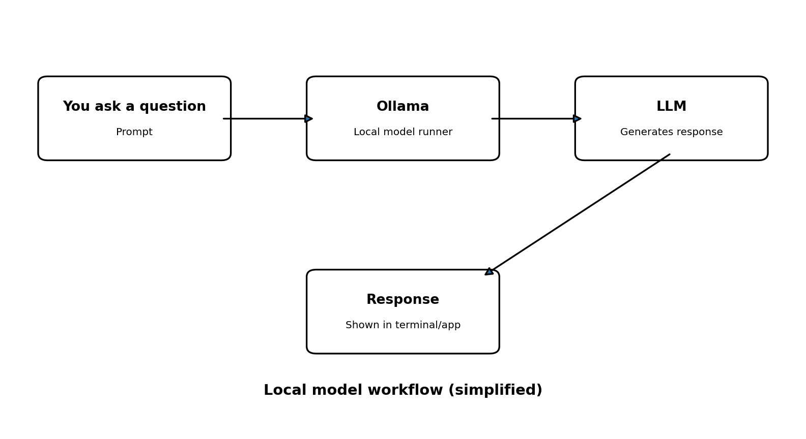
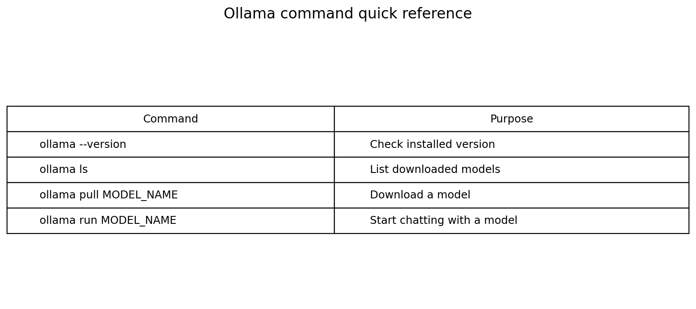

# Ollama — Running Large Language Models Locally

Ollama is a tool for downloading, running, and interacting with supported large language models (LLMs). It provides a command-line interface and a local API that applications—including Python programs—can use to communicate with a model.

This folder contains **concept notes, installation instructions, command examples, and guided Python practice**. The commands and outputs below are examples; your installed version, selected model, computer hardware, and responses may differ.

## Learning objectives

By the end of this topic, you should be able to:

- Explain what Ollama does and how it relates to an LLM.
- Install Ollama on Windows or macOS.
- Check whether Ollama is installed and list downloaded models.
- Download a model and start an interactive chat.
- Understand model names, model storage, and basic hardware considerations.
- Call a locally available model from Python using the official `ollama` package.
- Recognize common setup issues and know what to check first.

## Folder contents

```text
01_Ollama/
├── README.md
├── ollama.ipynb
├── requirements.txt
└── images/
    ├── ollama_commands.png
    └── ollama_workflow.png
```

| File or folder | Purpose |
|---|---|
| `README.md` | Detailed notes, installation guide, commands, and troubleshooting. |
| `ollama.ipynb` | Step-by-step notebook with explanations and optional Python integration. |
| `requirements.txt` | Python dependency needed for the notebook's API examples. |
| `images/` | Quick-reference diagrams for the workflow and CLI commands. |

The separate `ollama.py` script is intentionally not included: the Python example is kept in the notebook so that the notes and runnable practice stay together.

## 1. What is Ollama?

An **LLM (Large Language Model)** is a model trained to process and generate language. Depending on the model, it may answer questions, summarize text, explain code, or perform other language tasks.

**Ollama is not itself the LLM.** It is a tool that helps you download and run supported models and interact with them. You choose a model, make it available, and then ask it questions.



A typical local workflow is:

1. Install Ollama on your computer.
2. Download a supported model.
3. Start a chat with that model from the terminal.
4. Optionally connect to Ollama from a Python application.

Model responses can be inaccurate, incomplete, outdated, or confidently wrong. Verify important facts and do not treat a model response as automatically correct.

## 2. Installation: Windows and macOS

Use the installation method that matches your operating system. The official download page is [ollama.com/download](https://ollama.com/download).

| Step | Windows | macOS |
|---|---|---|
| **1. Open the official page** | [Ollama for Windows](https://ollama.com/download/windows) | [Ollama for macOS](https://ollama.com/download/mac) |
| **2. Install** | Download and run the Windows installer, then follow the prompts. The official Windows installer supports Windows 10 and later. | Download the macOS app, open it, and follow the setup instructions. Check the download page for the current macOS requirement. |
| **3. Open a terminal** | Open **Command Prompt** or **PowerShell**. | Open **Terminal**. |
| **4. Verify installation** | Run `ollama --version`. | Run `ollama --version`. |
| **5. Check local models** | Run `ollama ls`. | Run `ollama ls`. |

### Optional installation using a terminal

If you prefer installing from PowerShell on Windows, the official download page currently documents this command:

```powershell
irm https://ollama.com/install.ps1 | iex
```

On macOS, the official app download is the straightforward option for most beginners. If you prefer a Homebrew-based setup, check the current Ollama documentation and Homebrew instructions for the supported installation and service commands for your environment.

> **Safety note:** Run installation commands only when you understand and trust their source. Use the official Ollama website for installation instructions.

## 3. Verify the installation

Open a new terminal window and run:

```bash
ollama --version
```

This checks whether the `ollama` command is available and prints the installed version. The exact output depends on your installation.

If the terminal says that the command is not recognized or cannot be found:

- Confirm that installation finished successfully.
- Close and reopen the terminal.
- On Windows, check whether Ollama is running and available in your PATH.
- If the problem continues, consult the official installation instructions for your operating system.

## 4. Important Ollama commands



| Command | What it does | When to use it |
|---|---|---|
| `ollama --version` | Prints the installed Ollama version. | To verify installation. |
| `ollama ls` | Lists models downloaded on your machine. | To check which models are available locally. |
| `ollama list` | Alternative list command supported by Ollama CLI versions. | Use `ollama ls` in line with the class example. |
| `ollama pull MODEL_NAME` | Downloads a model. | Before running a model that is not yet available locally. |
| `ollama run MODEL_NAME` | Starts an interactive chat with a model. | To ask questions in the terminal. |
| `ollama help` | Shows CLI help. | To discover available commands. |

Replace `MODEL_NAME` with the exact model name and tag you intend to use. Model names and tags must match entries available in the [Ollama model library](https://ollama.com/library).

## 5. List downloaded models

Run:

```bash
ollama ls
```

This lists the models that have been downloaded to your computer. The output typically includes a model name, an identifier, size, and modified information. The exact columns can vary by version.

Example format (illustrative only):

```text
NAME             ID              SIZE      MODIFIED
example-model    <model-id>      ...       ...
```

This is only an example of the format—not a claim about the models installed on your computer. Always use the names shown by your own command.

## 6. Download a model

The class example uses `gemma3:270m`. If that tag is available in the current model library and is suitable for your computer, download it with:

```bash
ollama pull gemma3:270m
```

Ollama downloads the model files required for that model tag. The download requires an internet connection and disk space. The first download may take time depending on your connection and model size.

You can choose a different model from the [Ollama model library](https://ollama.com/library). Before downloading, review the model's size, purpose, supported features, and hardware requirements. A smaller model is usually easier to try on a computer with limited resources, although speed and quality vary.

## 7. Run a model and chat

After the model has been downloaded, run:

```bash
ollama run gemma3:270m
```

Ollama starts an interactive session. Type a question and press Enter to see the response. Follow the terminal instructions to leave the chat; commonly, you can use `Ctrl+D` or `/bye`, depending on the interface and version.

For example, you might ask:

```text
Explain machine learning in simple words.
```

The answer will vary between runs and models. To run another model, replace the example name with the exact model name from your own `ollama ls` output or the model library.

## 8. Local models, cloud models, and privacy

**Local model:** The model runs on your computer. Model files occupy local disk space, and generation uses your available memory and processing resources. Once downloaded, local inference can often work without sending the prompt to a hosted model service.

**Cloud model:** The model runs on remote infrastructure. This can make larger models available without requiring the same local hardware, but it depends on the service, model, network connection, and account requirements.

Do not assume every Ollama model or workflow is local. Check the model name, current Ollama documentation, and service configuration before sending private or sensitive information.

## 9. RAM, storage, and performance

Your trainer noted that a computer with **4 GB RAM may run out of memory**. This is a useful warning, not a universal minimum or guarantee: requirements depend on the model, quantization, context length, operating system, GPU/accelerator support, and other applications running at the same time.

Keep these points in mind:

- Larger models generally need more memory and storage.
- Larger models may respond slowly on hardware with limited processing power.
- Downloading several models uses additional disk space.
- Downloaded models do not necessarily all remain loaded into memory simultaneously.
- Close unnecessary applications if you are testing a model on a resource-limited computer.
- Check the model's current details before downloading it.

## 10. Optional: use Ollama from Python

The terminal commands are enough for the basic class activity. Python integration is a useful next step when you want to use a model inside a script, notebook, or application.

### Step 1 — Confirm the prerequisites

1. Install Ollama and make sure it is running.
2. Download a model using `ollama pull MODEL_NAME`.
3. Confirm the exact model name using `ollama ls`.
4. Use a Python environment for this topic.

### Step 2 — Install the Python dependency

From this folder, run:

```bash
python -m pip install -r requirements.txt
```

The `requirements.txt` file contains the official `ollama` Python client package. Installing this package does **not** install the Ollama desktop application or download an LLM; those are separate steps.

### Step 3 — Call the model from the notebook

The notebook contains a Python example using `ollama.chat()`. Change the `model_name` value to a model that is already available on your computer. The code sends a user message to Ollama and prints the generated response.

Conceptually, the call contains:

- **Model name:** which model to use.
- **Messages:** the conversation history, including the user's prompt.
- **Response:** an object containing the model's reply.

The Python package communicates with the Ollama service. If the service is not running, the model name is incorrect, or the model has not been downloaded, the request may fail.

## 11. Troubleshooting checklist

| Problem | What to check |
|---|---|
| `ollama` command not found | Confirm installation; reopen the terminal; check PATH and the official installation instructions. |
| No models listed | Run `ollama pull MODEL_NAME` for a model you want to use, then run `ollama ls` again. |
| Model name not found | Copy the exact name and tag from `ollama ls` or the model library. |
| Model is slow | Try a smaller model, close unnecessary apps, and check memory and hardware requirements. |
| Out-of-memory error | Stop other resource-heavy applications and use a model that fits your computer. |
| Python reports `ModuleNotFoundError: No module named 'ollama'` | Install the requirements into the same Python environment used by the notebook. |
| Python cannot connect to Ollama | Confirm Ollama is installed and running, and that the selected model is available. |
| Download fails | Check the internet connection, available disk space, model tag, and any network restrictions. |

## Quick recap

- **Ollama** helps you download and run supported models and interact with them.
- `ollama --version` checks the installation.
- `ollama ls` lists downloaded models.
- `ollama pull MODEL_NAME` downloads a model.
- `ollama run MODEL_NAME` starts a terminal chat.
- The `ollama` Python package lets Python applications communicate with the Ollama service.
- Model requirements and responses vary, so check your hardware and verify important answers.

## Official resources

- [Ollama download and installation](https://ollama.com/download)
- [Ollama model library](https://ollama.com/library)
- [Ollama documentation](https://docs.ollama.com/)
- [Official Ollama Python client](https://github.com/ollama/ollama-python)
